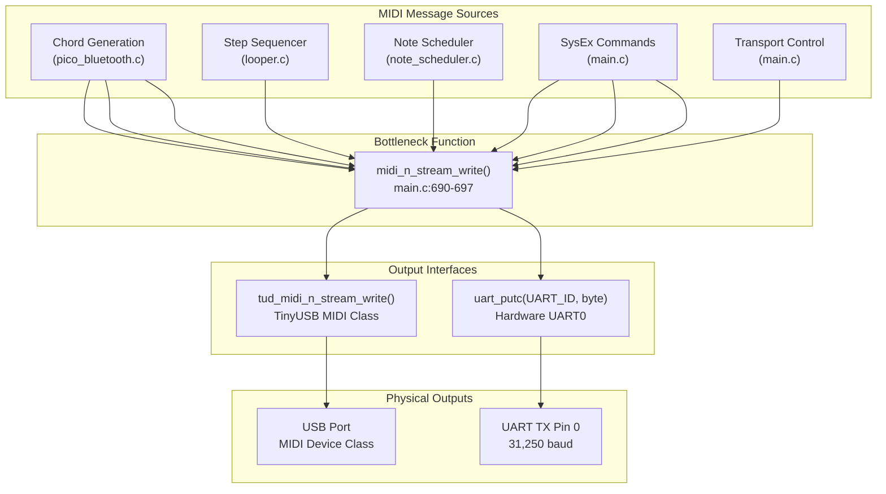
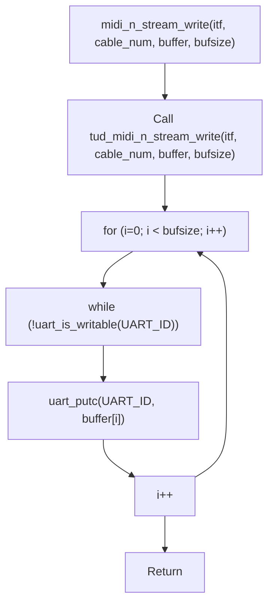
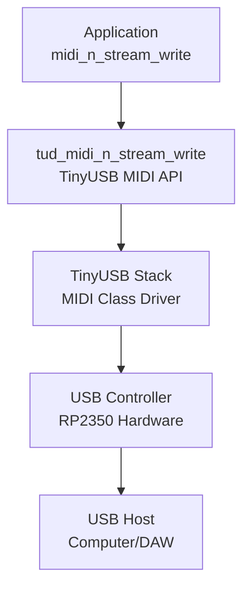
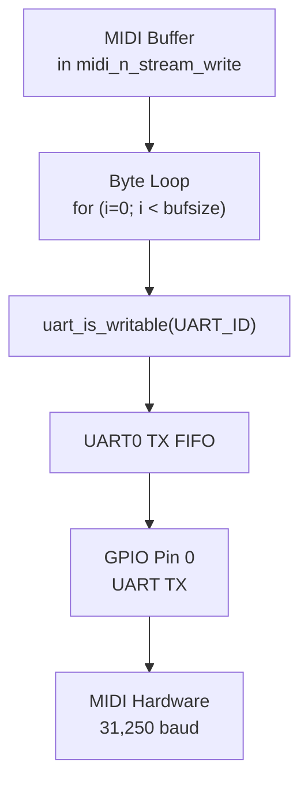
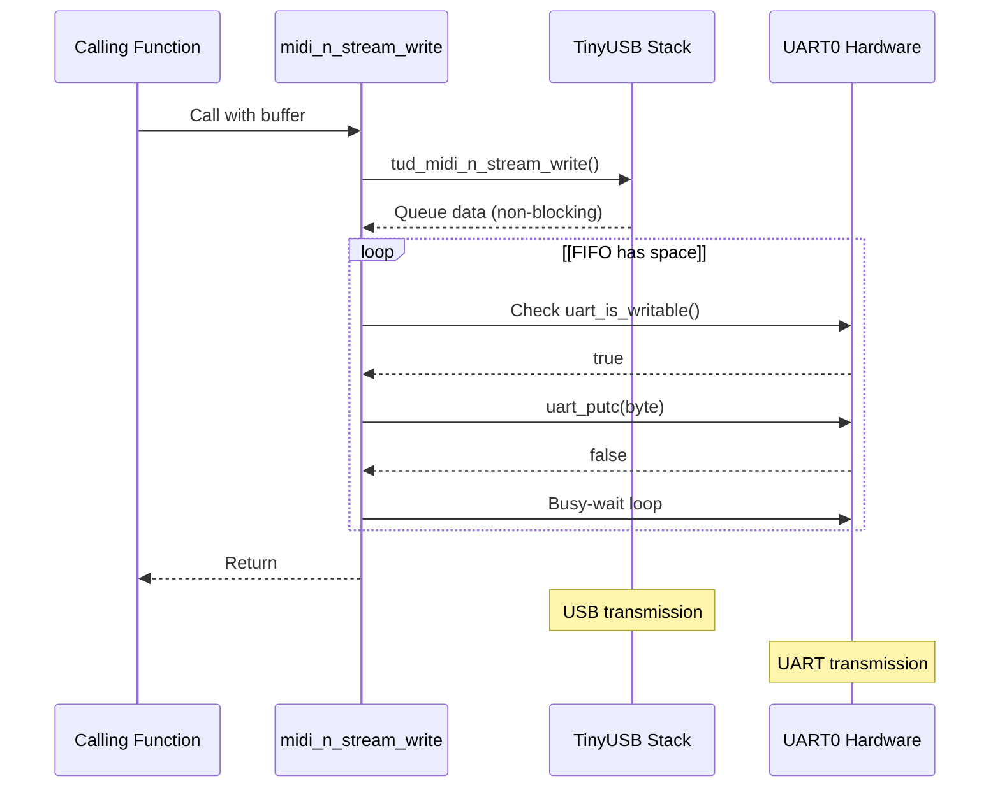

# Dual Output Architecture

> **Relevant source files**
> * [.gitignore](https://github.com/Jus-Be/orinayo-pico/blob/122fa496/.gitignore)
> * [main.c](https://github.com/Jus-Be/orinayo-pico/blob/122fa496/main.c)
> * [usb_descriptors.c](https://github.com/Jus-Be/orinayo-pico/blob/122fa496/usb_descriptors.c)

## Purpose and Scope

This page documents how the Orinayo system simultaneously transmits MIDI data through both USB and UART interfaces. All MIDI messages generated by the system—whether from chord generation, the step sequencer, or SysEx commands—are sent through a single bottleneck function that ensures synchronized dual output.

For details about USB-specific descriptor configuration, see [USB MIDI Configuration](./6.2-usb-midi-configuration.md). For information about synthesizer-specific SysEx commands that use this output system, see [Synthesizer Control](./6.3-synthesizer-control.md). For the musical processing systems that generate MIDI data, see [Musical Processing](./5-musical-processing.md).

---

## System Overview

The Orinayo system implements a **dual-output MIDI architecture** where every MIDI message is simultaneously transmitted via:

* **USB MIDI**: Using TinyUSB device stack for connection to DAWs and software
* **UART MIDI**: Using hardware UART at standard 31,250 baud for hardware synthesizers

This architecture ensures that external MIDI hardware and computer software can both receive the same MIDI stream in real-time without requiring any switching or routing.

### Dual Output Data Flow



**Sources:** [main.c L690-L697](https://github.com/Jus-Be/orinayo-pico/blob/122fa496/main.c#L690-L697)

---

## The midi_n_stream_write Bottleneck

The core of the dual output architecture is the `midi_n_stream_write` function, which serves as the single point through which all MIDI data flows.

### Function Implementation



The function at [main.c L690-L697](https://github.com/Jus-Be/orinayo-pico/blob/122fa496/main.c#L690-L697)

 implements a two-stage process:

1. **USB Transmission**: Calls `tud_midi_n_stream_write()` to queue the entire buffer for USB transmission via TinyUSB
2. **UART Transmission**: Iterates through the buffer byte-by-byte, waiting for UART FIFO availability before writing each byte

**Key implementation details:**

* The function accepts standard TinyUSB MIDI parameters: interface number (`itf`), cable number (`cable_num`), data buffer, and size
* USB transmission is non-blocking and handled by TinyUSB's internal buffering
* UART transmission uses busy-wait polling via `uart_is_writable()` to ensure each byte is transmitted
* The function does not return a value (though the signature suggests `uint32_t`)

**Sources:** [main.c L690-L697](https://github.com/Jus-Be/orinayo-pico/blob/122fa496/main.c#L690-L697)

---

## USB MIDI Output Path

### TinyUSB Integration

USB MIDI output is handled through the TinyUSB device stack, configured as a MIDI class device.



The USB MIDI implementation relies on:

* **TinyUSB Device Stack**: Initialized in `main()` via `tusb_init()` at [main.c L130](https://github.com/Jus-Be/orinayo-pico/blob/122fa496/main.c#L130-L130)
* **MIDI Device Class**: Configured with a single streaming interface
* **Task Processing**: `tud_task()` must be called regularly in the main loop at [main.c L153](https://github.com/Jus-Be/orinayo-pico/blob/122fa496/main.c#L153-L153)  to process USB events and transmit queued data

### USB Configuration Details

| Parameter | Value | Location |
| --- | --- | --- |
| Interface Count | 2 (Control + Streaming) | [usb_descriptors.c L76-L79](https://github.com/Jus-Be/orinayo-pico/blob/122fa496/usb_descriptors.c#L76-L79) |
| Endpoint Number | 0x01 (bidirectional) | [usb_descriptors.c L88-L89](https://github.com/Jus-Be/orinayo-pico/blob/122fa496/usb_descriptors.c#L88-L89) |
| Packet Size (FS) | 64 bytes | [usb_descriptors.c L97](https://github.com/Jus-Be/orinayo-pico/blob/122fa496/usb_descriptors.c#L97-L97) |
| Packet Size (HS) | 512 bytes | [usb_descriptors.c L107](https://github.com/Jus-Be/orinayo-pico/blob/122fa496/usb_descriptors.c#L107-L107) |
| Vendor ID | 0xCafe | [usb_descriptors.c L51](https://github.com/Jus-Be/orinayo-pico/blob/122fa496/usb_descriptors.c#L51-L51) |
| Product Name | "Orinayo Device" | [usb_descriptors.c L135](https://github.com/Jus-Be/orinayo-pico/blob/122fa496/usb_descriptors.c#L135-L135) |

The USB descriptor configuration at [usb_descriptors.c L91-L98](https://github.com/Jus-Be/orinayo-pico/blob/122fa496/usb_descriptors.c#L91-L98)

 uses the `TUD_MIDI_DESCRIPTOR` macro to create a standard-compliant USB MIDI device with control and streaming interfaces.

**Sources:** [main.c L129-L130](https://github.com/Jus-Be/orinayo-pico/blob/122fa496/main.c#L129-L130)

 [main.c L153](https://github.com/Jus-Be/orinayo-pico/blob/122fa496/main.c#L153-L153)

 [usb_descriptors.c L41-L60](https://github.com/Jus-Be/orinayo-pico/blob/122fa496/usb_descriptors.c#L41-L60)

 [usb_descriptors.c L74-L98](https://github.com/Jus-Be/orinayo-pico/blob/122fa496/usb_descriptors.c#L74-L98)

---

## UART MIDI Output Path

### Hardware Configuration

The UART MIDI output uses the RP2350's UART0 peripheral configured for standard MIDI electrical specifications.



### UART Initialization

The UART peripheral is initialized in `main()` with the following configuration:

| Setting | Value | Purpose |
| --- | --- | --- |
| UART ID | `uart0` | Hardware peripheral instance |
| Baud Rate | 31,250 | Standard MIDI baud rate |
| TX Pin | GPIO 0 | Transmit data pin |
| RX Pin | GPIO 1 | Receive data pin (unused) |
| FIFO | Enabled | Hardware buffering |
| CRLF Translation | Disabled | Raw binary transmission |

The initialization sequence at [main.c L145-L150](https://github.com/Jus-Be/orinayo-pico/blob/122fa496/main.c#L145-L150)

:

1. `uart_init(UART_ID, BAUD_RATE)` - Configure baud rate and enable peripheral
2. `gpio_set_function(UART_TX_PIN, GPIO_FUNC_UART)` - Set GPIO 0 to UART mode
3. `gpio_set_function(UART_RX_PIN, GPIO_FUNC_UART)` - Set GPIO 1 to UART mode
4. `uart_set_fifo_enabled(UART_ID, true)` - Enable hardware FIFO buffering
5. `uart_set_translate_crlf(UART_ID, false)` - Disable line-ending translation

**Sources:** [main.c L58-L62](https://github.com/Jus-Be/orinayo-pico/blob/122fa496/main.c#L58-L62)

 [main.c L145-L150](https://github.com/Jus-Be/orinayo-pico/blob/122fa496/main.c#L145-L150)

 [main.c L693-L696](https://github.com/Jus-Be/orinayo-pico/blob/122fa496/main.c#L693-L696)

---

## Synchronization and Timing Characteristics

### Sequential Transmission Model

The dual output architecture uses a **sequential transmission model** where USB is sent first, followed by UART:



### Timing Considerations

**USB Timing:**

* Non-blocking queuing means `tud_midi_n_stream_write()` returns immediately
* Actual USB transmission occurs during subsequent calls to `tud_task()` in the main loop
* USB packet size and scheduling are handled by TinyUSB and the host controller

**UART Timing:**

* Blocking byte-by-byte transmission ensures each byte is written to FIFO
* At 31,250 baud, each byte takes ~320 microseconds to transmit
* A 3-byte MIDI message takes ~960 microseconds
* The busy-wait at [main.c L694](https://github.com/Jus-Be/orinayo-pico/blob/122fa496/main.c#L694-L694)  ensures no data loss if FIFO fills

**Synchronization:**
Both outputs receive identical data in the same order. However:

* USB transmission may have higher latency due to packet batching
* UART transmission begins immediately from the hardware FIFO
* Total latency difference is typically under 1ms for typical message sizes

**Sources:** [main.c L690-L697](https://github.com/Jus-Be/orinayo-pico/blob/122fa496/main.c#L690-L697)

---

## Usage in the Codebase

### MIDI Message Wrapper Functions

All MIDI output in the system uses wrapper functions that call `midi_n_stream_write`:

| Function | Purpose | Location |
| --- | --- | --- |
| `midi_send_note()` | Note On/Off messages | [main.c L480-L491](https://github.com/Jus-Be/orinayo-pico/blob/122fa496/main.c#L480-L491) |
| `midi_send_control_change()` | CC messages | [main.c L493-L502](https://github.com/Jus-Be/orinayo-pico/blob/122fa496/main.c#L493-L502) |
| `midi_send_program_change()` | Program Change | [main.c L504-L512](https://github.com/Jus-Be/orinayo-pico/blob/122fa496/main.c#L504-L512) |
| `midi_start_stop()` | Transport control | [main.c L514-L522](https://github.com/Jus-Be/orinayo-pico/blob/122fa496/main.c#L514-L522) |
| `midi_send_chord_note()` | Multi-channel chord notes | [main.c L584-L607](https://github.com/Jus-Be/orinayo-pico/blob/122fa496/main.c#L584-L607) |
| `midi_play_chord()` | 3-note chord playback | [main.c L609-L646](https://github.com/Jus-Be/orinayo-pico/blob/122fa496/main.c#L609-L646) |
| `midi_play_slash_chord()` | 4-note slash chord playback | [main.c L648-L688](https://github.com/Jus-Be/orinayo-pico/blob/122fa496/main.c#L648-L688) |

### SysEx Command Examples

The dual output architecture handles both standard MIDI messages and manufacturer-specific SysEx commands:

**Yamaha SeqTrak SysEx** ([main.c L373-L391](https://github.com/Jus-Be/orinayo-pico/blob/122fa496/main.c#L373-L391)

):

* Pattern selection, mute control, tempo changes
* All sent through `midi_n_stream_write` at bytes 11-12

**Yamaha MODX SysEx** ([main.c L333-L352](https://github.com/Jus-Be/orinayo-pico/blob/122fa496/main.c#L333-L352)

):

* Arpeggiator control, key/tempo changes
* Uses 12-13 byte SysEx messages

**Ketron Arranger SysEx** ([main.c L552-L582](https://github.com/Jus-Be/orinayo-pico/blob/122fa496/main.c#L552-L582)

):

* Arranger section and footswitch control
* 7-8 byte SysEx messages

All SysEx functions construct their messages in local buffers and pass them to `midi_n_stream_write`, ensuring synchronized transmission to both USB and UART.

**Sources:** [main.c L480-L688](https://github.com/Jus-Be/orinayo-pico/blob/122fa496/main.c#L480-L688)

---

## Configuration Constants

The following constants control the dual output system:

```javascript
// From main.c:58-62
#define UART_ID uart0           // Hardware UART peripheral
#define BAUD_RATE 31250         // Standard MIDI baud rate
#define UART_TX_PIN 0           // GPIO pin for UART TX
#define UART_RX_PIN 1           // GPIO pin for UART RX
#define GPIO_FUNC_UART 2        // GPIO function selector
```

The USB configuration is managed through TinyUSB macros in the USB descriptors, with the Product ID dynamically calculated based on enabled interfaces at [usb_descriptors.c L34-L36](https://github.com/Jus-Be/orinayo-pico/blob/122fa496/usb_descriptors.c#L34-L36)

**Sources:** [main.c L58-L62](https://github.com/Jus-Be/orinayo-pico/blob/122fa496/main.c#L58-L62)

 [usb_descriptors.c L34-L36](https://github.com/Jus-Be/orinayo-pico/blob/122fa496/usb_descriptors.c#L34-L36)

---

## Implementation Notes

### No Return Value Usage

Despite `midi_n_stream_write` having a `uint32_t` return type signature at [main.c L109](https://github.com/Jus-Be/orinayo-pico/blob/122fa496/main.c#L109-L109)

 the actual implementation at [main.c L690-L697](https://github.com/Jus-Be/orinayo-pico/blob/122fa496/main.c#L690-L697)

 does not return a value. This is likely vestigial from the TinyUSB API which returns the number of bytes written. In practice, callers do not check return values, assuming successful transmission.

### Busy-Wait Implications

The busy-wait loop at [main.c L694](https://github.com/Jus-Be/orinayo-pico/blob/122fa496/main.c#L694-L694)

 can block the main thread if the UART FIFO is full. This is acceptable because:

1. The UART FIFO depth (typically 32 bytes) provides adequate buffering
2. MIDI bandwidth is relatively low (31,250 bits/second)
3. The RP2350 runs at 150 MHz, making microsecond delays negligible
4. This approach is simpler than interrupt-driven or DMA-based UART

### Thread Safety

The `midi_n_stream_write` function is not inherently thread-safe. However, the Orinayo architecture calls it exclusively from the main thread context:

* Direct calls from the main loop
* Calls from `note_scheduler_dispatch_pending()` which runs in main loop
* All callback-based sources (Bluetooth, looper) ultimately dispatch to main thread

This single-threaded design eliminates the need for mutexes around MIDI output.

**Sources:** [main.c L690-L697](https://github.com/Jus-Be/orinayo-pico/blob/122fa496/main.c#L690-L697)

 [main.c L169](https://github.com/Jus-Be/orinayo-pico/blob/122fa496/main.c#L169-L169)