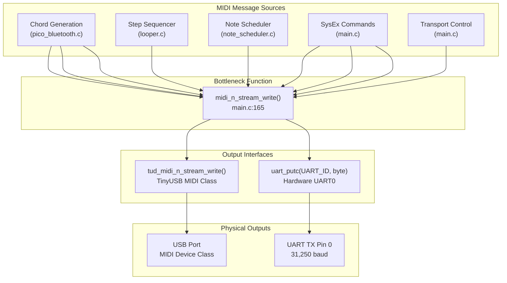
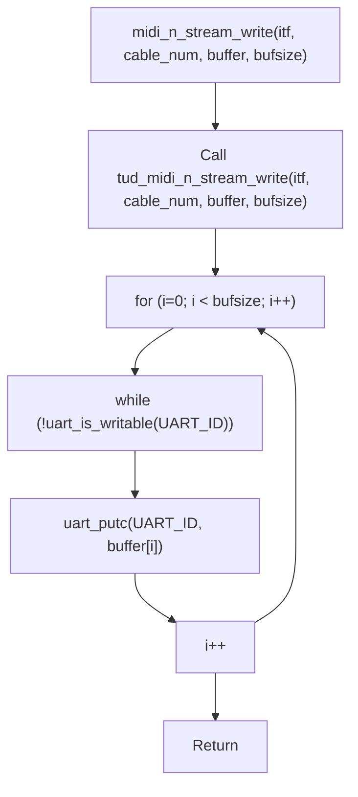
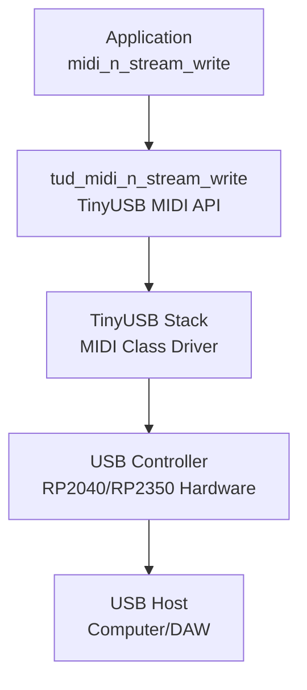
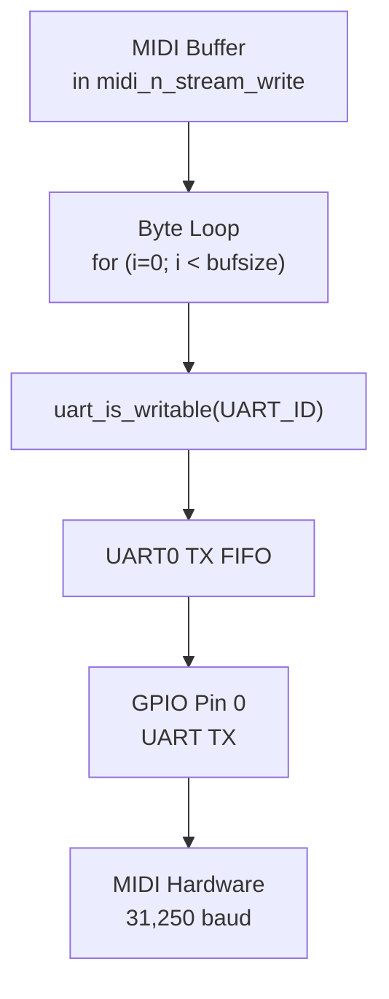
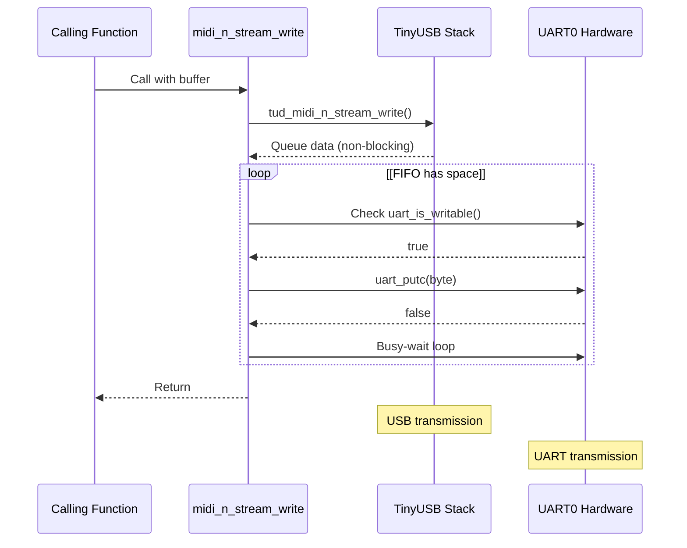

# Dual Output Architecture

> **Relevant source files**
> * [main.c](https://github.com/Jus-Be/orinayo-pico/blob/6dde5a75/main.c)
> * [ring_buffer_lib/CMakeLists.txt](https://github.com/Jus-Be/orinayo-pico/blob/6dde5a75/ring_buffer_lib/CMakeLists.txt)
> * [ring_buffer_lib/ring_buffer_lib.c](https://github.com/Jus-Be/orinayo-pico/blob/6dde5a75/ring_buffer_lib/ring_buffer_lib.c)
> * [ring_buffer_lib/ring_buffer_lib.h](https://github.com/Jus-Be/orinayo-pico/blob/6dde5a75/ring_buffer_lib/ring_buffer_lib.h)

## Purpose and Scope

This page documents how the Orinayo system simultaneously transmits MIDI data through both USB and UART interfaces. All MIDI messages generated by the system—whether from chord generation, the step sequencer, or SysEx commands—are sent through a single bottleneck function that ensures synchronized dual output.

For details about USB-specific descriptor configuration, see [USB MIDI Configuration](https://github.com/Jus-Be/orinayo-pico/blob/6dde5a75/USB MIDI Configuration)

 For information about synthesizer-specific SysEx commands that use this output system, see [Synthesizer Control](https://github.com/Jus-Be/orinayo-pico/blob/6dde5a75/Synthesizer Control)

 For the musical processing systems that generate MIDI data, see [Musical Processing](https://github.com/Jus-Be/orinayo-pico/blob/6dde5a75/Musical Processing)

---

## System Overview

The Orinayo system implements a **dual-output MIDI architecture** where every MIDI message is simultaneously transmitted via:

* **USB MIDI**: Using TinyUSB device stack for connection to DAWs and software.
* **UART MIDI**: Using hardware UART at standard 31,250 baud for hardware synthesizers.

This architecture ensures that external MIDI hardware and computer software can both receive the same MIDI stream in real-time without requiring any switching or routing.

### Dual Output Data Flow


```mermaid
flowchart TD

ChordGen["Chord Generation<br>(pico_bluetooth.c)"]
Looper["Step Sequencer<br>(looper.c)"]
NoteScheduler["Note Scheduler<br>(note_scheduler.c)"]
SysEx["SysEx Commands<br>(main.c)"]
Transport["Transport Control<br>(main.c)"]
StreamWrite["midi_n_stream_write()<br>main.c:165"]
USB["tud_midi_n_stream_write()<br>TinyUSB MIDI Class"]
UART["uart_putc(UART_ID, byte)<br>Hardware UART0"]
USBPort["USB Port<br>MIDI Device Class"]
UARTPort["UART TX Pin 0<br>31,250 baud"]

ChordGen --> StreamWrite
ChordGen --> StreamWrite
ChordGen --> StreamWrite
Looper --> StreamWrite
NoteScheduler --> StreamWrite
SysEx --> StreamWrite
SysEx --> StreamWrite
SysEx --> StreamWrite
Transport --> StreamWrite
StreamWrite --> USB
StreamWrite --> UART
USB --> USBPort
UART --> UARTPort

subgraph subGraph3 ["Physical Outputs"]
    USBPort
    UARTPort
end

subgraph subGraph2 ["Output Interfaces"]
    USB
    UART
end

subgraph subGraph1 ["Bottleneck Function"]
    StreamWrite
end

subgraph subGraph0 ["MIDI Message Sources"]
    ChordGen
    Looper
    NoteScheduler
    SysEx
    Transport
end
```

Sources: [main.c L165](https://github.com/Jus-Be/orinayo-pico/blob/6dde5a75/main.c#L165-L165)

 [main.c L130-L161](https://github.com/Jus-Be/orinayo-pico/blob/6dde5a75/main.c#L130-L161)

---

## The midi_n_stream_write Bottleneck

The core of the dual output architecture is the `midi_n_stream_write` function, which serves as the single point through which all MIDI data flows.

### Function Implementation


```mermaid
flowchart TD

Entry["midi_n_stream_write(itf, cable_num, buffer, bufsize)"]
USB["Call tud_midi_n_stream_write(itf, cable_num, buffer, bufsize)"]
Loop["for (i=0; i < bufsize; i++)"]
Wait["while (!uart_is_writable(UART_ID))"]
Send["uart_putc(UART_ID, buffer[i])"]
Next["i++"]
Done["Return"]

Entry --> USB
USB --> Loop
Loop --> Wait
Wait --> Send
Send --> Next
Next --> Loop
Next --> Done
```

The function implementation performs a two-stage process:

1. **USB Transmission**: Calls `tud_midi_n_stream_write()` to queue the entire buffer for USB transmission via TinyUSB.
2. **UART Transmission**: Iterates through the buffer byte-by-byte, waiting for UART FIFO availability before writing each byte.

**Key implementation details:**

* The function accepts standard TinyUSB MIDI parameters: interface number (`itf`), cable number (`cable_num`), data buffer, and size.
* USB transmission is non-blocking and handled by TinyUSB's internal buffering.
* UART transmission uses busy-wait polling via `uart_is_writable()` to ensure each byte is transmitted.
* The function signature is defined at [main.c L165](https://github.com/Jus-Be/orinayo-pico/blob/6dde5a75/main.c#L165-L165)

Sources: [main.c L165](https://github.com/Jus-Be/orinayo-pico/blob/6dde5a75/main.c#L165-L165)

 [main.c L61-L65](https://github.com/Jus-Be/orinayo-pico/blob/6dde5a75/main.c#L61-L65)

---

## USB MIDI Output Path

### TinyUSB Integration

USB MIDI output is handled through the TinyUSB device stack, configured as a MIDI class device.


```mermaid
flowchart TD

App["Application<br>midi_n_stream_write"]
TinyUSB["tud_midi_n_stream_write<br>TinyUSB MIDI API"]
Stack["TinyUSB Stack<br>MIDI Class Driver"]
USB["USB Controller<br>RP2040/RP2350 Hardware"]
Host["USB Host<br>Computer/DAW"]

App --> TinyUSB
TinyUSB --> Stack
Stack --> USB
USB --> Host
```

The USB MIDI implementation relies on:

* **TinyUSB Device Stack**: Initialized in `main()` via `tud_init()` at [main.c L209](https://github.com/Jus-Be/orinayo-pico/blob/6dde5a75/main.c#L209-L209)
* **MIDI Device Class**: Configured with a single streaming interface.
* **Task Processing**: `tud_task()` is called regularly in the main loop at [main.c L228](https://github.com/Jus-Be/orinayo-pico/blob/6dde5a75/main.c#L228-L228)  to process USB events and transmit queued data.

### USB Configuration Details

| Parameter | Value | Location |
| --- | --- | --- |
| Interface Count | 2 (Control + Streaming) | [usb_descriptors.c L76-L79](https://github.com/Jus-Be/orinayo-pico/blob/6dde5a75/usb_descriptors.c#L76-L79) |
| Endpoint Number | 0x01 (bidirectional) | [usb_descriptors.c L88-L89](https://github.com/Jus-Be/orinayo-pico/blob/6dde5a75/usb_descriptors.c#L88-L89) |
| Packet Size (FS) | 64 bytes | [usb_descriptors.c L97](https://github.com/Jus-Be/orinayo-pico/blob/6dde5a75/usb_descriptors.c#L97-L97) |
| Packet Size (HS) | 512 bytes | [usb_descriptors.c L107](https://github.com/Jus-Be/orinayo-pico/blob/6dde5a75/usb_descriptors.c#L107-L107) |
| Vendor ID | 0xCafe | [usb_descriptors.c L51](https://github.com/Jus-Be/orinayo-pico/blob/6dde5a75/usb_descriptors.c#L51-L51) |
| Product Name | "Orinayo Device" | [usb_descriptors.c L135](https://github.com/Jus-Be/orinayo-pico/blob/6dde5a75/usb_descriptors.c#L135-L135) |

The USB descriptor configuration at [usb_descriptors.c L91-L98](https://github.com/Jus-Be/orinayo-pico/blob/6dde5a75/usb_descriptors.c#L91-L98)

 uses the `TUD_MIDI_DESCRIPTOR` macro to create a standard-compliant USB MIDI device with control and streaming interfaces.

Sources: [main.c L209](https://github.com/Jus-Be/orinayo-pico/blob/6dde5a75/main.c#L209-L209)

 [main.c L228](https://github.com/Jus-Be/orinayo-pico/blob/6dde5a75/main.c#L228-L228)

 [usb_descriptors.c L51](https://github.com/Jus-Be/orinayo-pico/blob/6dde5a75/usb_descriptors.c#L51-L51)

 [usb_descriptors.c L76-L107](https://github.com/Jus-Be/orinayo-pico/blob/6dde5a75/usb_descriptors.c#L76-L107)

---

## UART MIDI Output Path

### Hardware Configuration

The UART MIDI output uses the RP2350's UART0 peripheral configured for standard MIDI electrical specifications.


```mermaid
flowchart TD

Buffer["MIDI Buffer<br>in midi_n_stream_write"]
Loop["Byte Loop<br>for (i=0; i < bufsize)"]
Check["uart_is_writable(UART_ID)"]
FIFO["UART0 TX FIFO"]
Pin["GPIO Pin 0<br>UART TX"]
Hardware["MIDI Hardware<br>31,250 baud"]

Buffer --> Loop
Loop --> Check
Check --> FIFO
FIFO --> Pin
Pin --> Hardware
```

### UART Initialization

The UART peripheral is initialized in `main()` with the following configuration:

| Setting | Value | Purpose |
| --- | --- | --- |
| UART ID | `uart0` | Hardware peripheral instance [main.c L66](https://github.com/Jus-Be/orinayo-pico/blob/6dde5a75/main.c#L66-L66) |
| Baud Rate | 31,250 | Standard MIDI baud rate [main.c L67](https://github.com/Jus-Be/orinayo-pico/blob/6dde5a75/main.c#L67-L67) |
| TX Pin | GPIO 0 | Transmit data pin [main.c L68](https://github.com/Jus-Be/orinayo-pico/blob/6dde5a75/main.c#L68-L68) |
| RX Pin | GPIO 1 | Receive data pin [main.c L69](https://github.com/Jus-Be/orinayo-pico/blob/6dde5a75/main.c#L69-L69) |
| FIFO | Enabled | Hardware buffering [main.c L223](https://github.com/Jus-Be/orinayo-pico/blob/6dde5a75/main.c#L223-L223) |
| CRLF Translation | Disabled | Raw binary transmission [main.c L224](https://github.com/Jus-Be/orinayo-pico/blob/6dde5a75/main.c#L224-L224) |

The initialization sequence at [main.c L221-L224](https://github.com/Jus-Be/orinayo-pico/blob/6dde5a75/main.c#L221-L224)

:

1. `uart_init(UART_ID, BAUD_RATE)` - Configure baud rate and enable peripheral.
2. `gpio_set_function(UART_TX_PIN, GPIO_FUNC_UART)` - Set GPIO 0 to UART mode.
3. `gpio_set_function(UART_RX_PIN, GPIO_FUNC_UART)` - Set GPIO 1 to UART mode.
4. `uart_set_fifo_enabled(UART_ID, true)` - Enable hardware FIFO buffering.
5. `uart_set_translate_crlf(UART_ID, false)` - Disable line-ending translation.

Sources: [main.c L66-L70](https://github.com/Jus-Be/orinayo-pico/blob/6dde5a75/main.c#L66-L70)

 [main.c L221-L224](https://github.com/Jus-Be/orinayo-pico/blob/6dde5a75/main.c#L221-L224)

---

## Synchronization and Timing Characteristics

### Sequential Transmission Model

The dual output architecture uses a **sequential transmission model** where USB is sent first, followed by UART:


```mermaid
sequenceDiagram
  participant Calling Function
  participant midi_n_stream_write
  participant TinyUSB Stack
  participant UART0 Hardware

  Calling Function->>midi_n_stream_write: Call with buffer
  midi_n_stream_write->>TinyUSB Stack: tud_midi_n_stream_write()
  TinyUSB Stack-->>midi_n_stream_write: Queue data (non-blocking)
  loop [FIFO has space]
    midi_n_stream_write->>UART0 Hardware: Check uart_is_writable()
    UART0 Hardware-->>midi_n_stream_write: true
    midi_n_stream_write->>UART0 Hardware: uart_putc(byte)
    UART0 Hardware-->>midi_n_stream_write: false
    midi_n_stream_write->>UART0 Hardware: Busy-wait loop
  end
  midi_n_stream_write-->>Calling Function: Return
  note over TinyUSB Stack: USB transmission
  note over UART0 Hardware: UART transmission
```

### Timing Considerations

**USB Timing:**

* Non-blocking queuing means `tud_midi_n_stream_write()` returns immediately.
* Actual USB transmission occurs during subsequent calls to `tud_task()` in the main loop at [main.c L228](https://github.com/Jus-Be/orinayo-pico/blob/6dde5a75/main.c#L228-L228)
* USB packet size and scheduling are handled by TinyUSB and the host controller.

**UART Timing:**

* Blocking byte-by-byte transmission ensures each byte is written to FIFO.
* At 31,250 baud, each byte takes ~320 microseconds to transmit.
* A 3-byte MIDI message takes ~960 microseconds.
* The busy-wait polling ensures no data loss if the hardware FIFO fills.

**Synchronization:**
Both outputs receive identical data in the same order. However:

* USB transmission may have higher latency due to packet batching and host polling.
* UART transmission begins immediately from the hardware FIFO.
* Total latency difference is typically under 1ms for typical message sizes.

Sources: [main.c L165](https://github.com/Jus-Be/orinayo-pico/blob/6dde5a75/main.c#L165-L165)

 [main.c L228](https://github.com/Jus-Be/orinayo-pico/blob/6dde5a75/main.c#L228-L228)

---

## Usage in the Codebase

### MIDI Message Wrapper Functions

All MIDI output in the system uses wrapper functions that ultimately call the stream write mechanism:

| Function | Purpose | Location |
| --- | --- | --- |
| `midi_send_note()` | Note On/Off messages | [main.c L133](https://github.com/Jus-Be/orinayo-pico/blob/6dde5a75/main.c#L133-L133) |
| `midi_send_control_change()` | CC messages | [main.c L136](https://github.com/Jus-Be/orinayo-pico/blob/6dde5a75/main.c#L136-L136) |
| `midi_send_program_change()` | Program Change | [main.c L135](https://github.com/Jus-Be/orinayo-pico/blob/6dde5a75/main.c#L135-L135) |
| `midi_start_stop()` | Transport control | [main.c L132](https://github.com/Jus-Be/orinayo-pico/blob/6dde5a75/main.c#L132-L132) |
| `midi_send_chord_note()` | Multi-channel chord notes | [main.c L134](https://github.com/Jus-Be/orinayo-pico/blob/6dde5a75/main.c#L134-L134) |
| `midi_play_chord()` | 3-note chord playback | [main.c L137](https://github.com/Jus-Be/orinayo-pico/blob/6dde5a75/main.c#L137-L137) |
| `midi_play_slash_chord()` | 4-note slash chord playback | [main.c L138](https://github.com/Jus-Be/orinayo-pico/blob/6dde5a75/main.c#L138-L138) |

### SysEx Command Examples

The dual output architecture handles both standard MIDI messages and manufacturer-specific SysEx commands:

**Yamaha SeqTrak SysEx** ([main.c L141-L146](https://github.com/Jus-Be/orinayo-pico/blob/6dde5a75/main.c#L141-L146)

):

* Pattern selection, mute control, tempo changes, and arpeggiator settings.

**Yamaha MODX SysEx** ([main.c L147-L152](https://github.com/Jus-Be/orinayo-pico/blob/6dde5a75/main.c#L147-L152)

):

* Arpeggiator control, key/tempo changes, and octave shifts.

**Ketron Arranger SysEx** ([main.c L139-L140](https://github.com/Jus-Be/orinayo-pico/blob/6dde5a75/main.c#L139-L140)

):

* Arranger section and footswitch control.

All SysEx functions construct their messages and pass them to the dual output stream, ensuring synchronized transmission to both USB and UART.

Sources: [main.c L132-L161](https://github.com/Jus-Be/orinayo-pico/blob/6dde5a75/main.c#L132-L161)

---

## Configuration Constants

The following constants control the dual output system:

```javascript
// From main.c:66-70#define UART_ID uart0           // Hardware UART peripheral#define BAUD_RATE 31250         // Standard MIDI baud rate#define UART_TX_PIN 0           // GPIO pin for UART TX#define UART_RX_PIN 1           // GPIO pin for UART RX#define GPIO_FUNC_UART 2        // GPIO function selector
```

The USB configuration is managed through TinyUSB macros in the USB descriptors, with the Product ID dynamically calculated based on enabled interfaces at [usb_descriptors.c L34-L36](https://github.com/Jus-Be/orinayo-pico/blob/6dde5a75/usb_descriptors.c#L34-L36)

Sources: [main.c L66-L70](https://github.com/Jus-Be/orinayo-pico/blob/6dde5a75/main.c#L66-L70)

 [usb_descriptors.c L34-L36](https://github.com/Jus-Be/orinayo-pico/blob/6dde5a75/usb_descriptors.c#L34-L36)

---

## Implementation Notes

### Thread Safety

The MIDI output mechanism is primarily called from the main thread context:

* Direct calls from the `while (true)` main loop at [main.c L227-L241](https://github.com/Jus-Be/orinayo-pico/blob/6dde5a75/main.c#L227-L241)
* Calls from `note_scheduler_dispatch_pending()` at [main.c L217](https://github.com/Jus-Be/orinayo-pico/blob/6dde5a75/main.c#L217-L217)  which runs in the main loop.
* All callback-based sources (Bluetooth, looper) ultimately dispatch or are coordinated via the main thread.

This single-threaded design for the final output stage eliminates the need for complex mutexes around MIDI output.

Sources: [main.c L227-L241](https://github.com/Jus-Be/orinayo-pico/blob/6dde5a75/main.c#L227-L241)

 [main.c L217](https://github.com/Jus-Be/orinayo-pico/blob/6dde5a75/main.c#L217-L217)