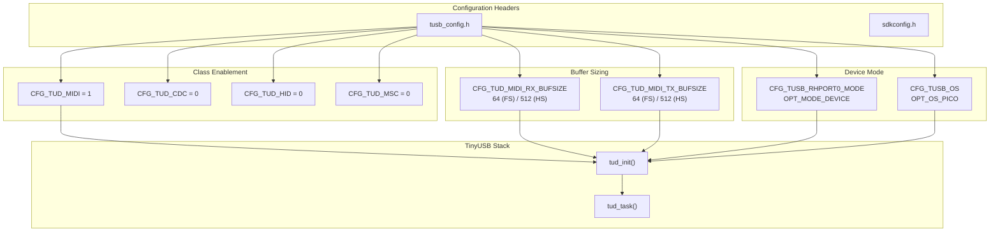
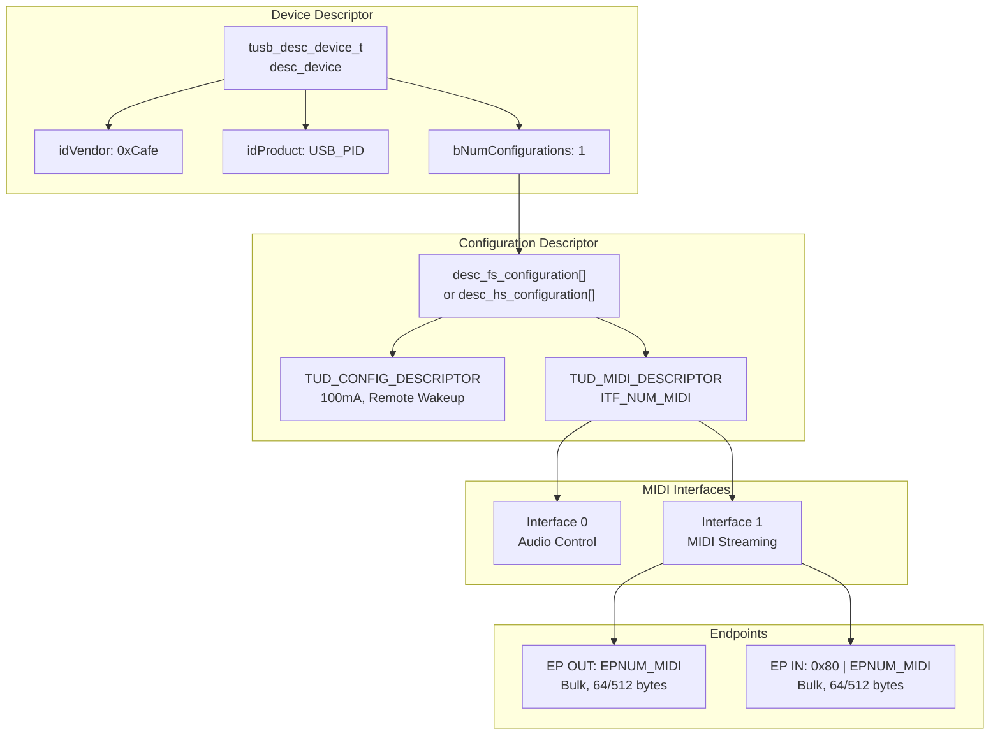
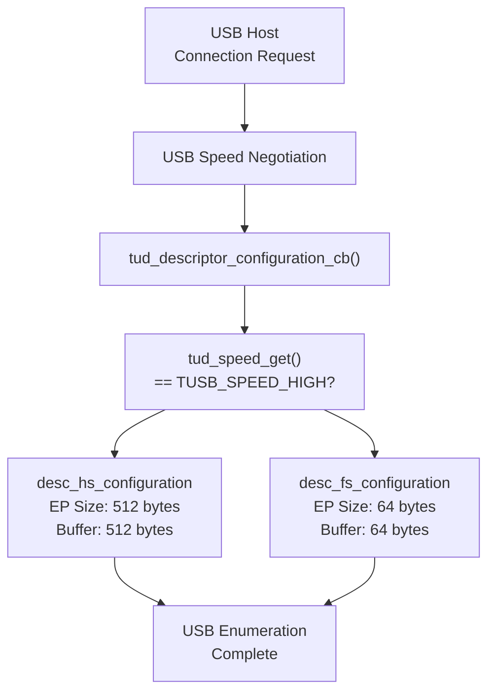
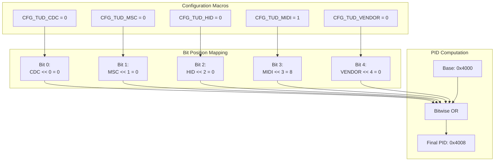

# USB MIDI Configuration

> **Relevant source files**
> * [.github/workflows/build.yml](https://github.com/Jus-Be/orinayo-pico/blob/122fa496/.github/workflows/build.yml)
> * [.gitignore](https://github.com/Jus-Be/orinayo-pico/blob/122fa496/.gitignore)
> * [tusb_config.h](https://github.com/Jus-Be/orinayo-pico/blob/122fa496/tusb_config.h)
> * [usb_descriptors.c](https://github.com/Jus-Be/orinayo-pico/blob/122fa496/usb_descriptors.c)

## Purpose and Scope

This page documents the USB MIDI device configuration for the Orinayo system, including USB descriptors, TinyUSB library settings, and device enumeration. This covers how the Raspberry Pi Pico 2 W presents itself as a USB MIDI device to host computers.

For information about how MIDI data is transmitted over USB, see [Dual Output Architecture](./6.1-dual-output-architecture.md). For MIDI message content and synthesizer-specific commands, see [Synthesizer Control](./6.3-synthesizer-control.md).

## USB Device Identification

The Orinayo device uses a fixed Vendor ID (VID) with a dynamically generated Product ID (PID) based on enabled USB classes.

### Vendor and Product IDs

```yaml
VID: 0xCafe
PID: Dynamic (base 0x4000)
```

The Product ID is computed using a bitmap that encodes which USB device classes are enabled:

```
[MSB]  MIDI | HID | MSC | CDC  [LSB]
```

The PID calculation is defined in [usb_descriptors.c L34-L36](https://github.com/Jus-Be/orinayo-pico/blob/122fa496/usb_descriptors.c#L34-L36)

:

```
#define _PID_MAP(itf, n)  ( (CFG_TUD_##itf) << (n) )
#define USB_PID           (0x4000 | _PID_MAP(CDC, 0) | _PID_MAP(MSC, 1) | _PID_MAP(HID, 2) | \
                           _PID_MAP(MIDI, 3) | _PID_MAP(VENDOR, 4) )
```

In the current configuration with only MIDI enabled (`CFG_TUD_MIDI = 1`), the computed PID is `0x4008` (0x4000 | (1 << 3)).

### Device Descriptor

The device descriptor is defined in [usb_descriptors.c L41-L60](https://github.com/Jus-Be/orinayo-pico/blob/122fa496/usb_descriptors.c#L41-L60)

 and contains:

| Field | Value | Description |
| --- | --- | --- |
| `bcdUSB` | 0x0200 | USB 2.0 specification |
| `bDeviceClass` | 0x00 | Defined at interface level |
| `bDeviceSubClass` | 0x00 | Defined at interface level |
| `bDeviceProtocol` | 0x00 | Defined at interface level |
| `bMaxPacketSize0` | 64 | Control endpoint size |
| `idVendor` | 0xCafe | Fixed vendor ID |
| `idProduct` | Dynamic | Computed from enabled classes |
| `bcdDevice` | 0x0100 | Device version 1.0 |
| `iManufacturer` | 1 | String descriptor index |
| `iProduct` | 2 | String descriptor index |
| `iSerialNumber` | 3 | String descriptor index |
| `bNumConfigurations` | 1 | Single configuration |

The device descriptor is returned via the `tud_descriptor_device_cb()` callback function at [usb_descriptors.c L64-L67](https://github.com/Jus-Be/orinayo-pico/blob/122fa496/usb_descriptors.c#L64-L67)

**Sources:** [usb_descriptors.c L28-L67](https://github.com/Jus-Be/orinayo-pico/blob/122fa496/usb_descriptors.c#L28-L67)

## TinyUSB Configuration

The TinyUSB stack is configured through [tusb_config.h](https://github.com/Jus-Be/orinayo-pico/blob/122fa496/tusb_config.h)

 which defines device class enablement and buffer sizes.

### Device Class Configuration

Only the MIDI device class is enabled in [tusb_config.h L80-L84](https://github.com/Jus-Be/orinayo-pico/blob/122fa496/tusb_config.h#L80-L84)

:

```
CFG_TUD_CDC    = 0  (disabled)
CFG_TUD_MSC    = 0  (disabled)
CFG_TUD_HID    = 0  (disabled)
CFG_TUD_MIDI   = 1  (enabled)
CFG_TUD_VENDOR = 0  (disabled)
```

### Buffer Configuration

MIDI transmit and receive buffer sizes are configured to automatically scale based on USB speed at [tusb_config.h L87-L88](https://github.com/Jus-Be/orinayo-pico/blob/122fa496/tusb_config.h#L87-L88)

:

```
CFG_TUD_MIDI_RX_BUFSIZE = 512 (high-speed) or 64 (full-speed)
CFG_TUD_MIDI_TX_BUFSIZE = 512 (high-speed) or 64 (full-speed)
```

### Operating System Configuration

The stack is configured to use the Pico SDK's operating system abstraction at [tusb_config.h L50](https://github.com/Jus-Be/orinayo-pico/blob/122fa496/tusb_config.h#L50-L50)

:

```
CFG_TUSB_OS = OPT_OS_PICO
```

### Root Hub Port Mode

The device operates in device mode on root hub port 0, configured at [tusb_config.h L46](https://github.com/Jus-Be/orinayo-pico/blob/122fa496/tusb_config.h#L46-L46)

:

```
CFG_TUSB_RHPORT0_MODE = OPT_MODE_DEVICE
```

**Diagram: TinyUSB Configuration Flow**



**Sources:** [tusb_config.h L1-L94](https://github.com/Jus-Be/orinayo-pico/blob/122fa496/tusb_config.h#L1-L94)

## MIDI Interface Configuration

The USB configuration includes two interfaces for MIDI: a standard Audio Control interface and a MIDI Streaming interface.

### Interface Enumeration

Defined in [usb_descriptors.c L74-L79](https://github.com/Jus-Be/orinayo-pico/blob/122fa496/usb_descriptors.c#L74-L79)

:

```
ITF_NUM_MIDI           = 0  (Audio Control Interface)
ITF_NUM_MIDI_STREAMING = 1  (MIDI Streaming Interface)
ITF_NUM_TOTAL          = 2
```

### Endpoint Assignment

The MIDI endpoint number is platform-dependent, defined at [usb_descriptors.c L83-L89](https://github.com/Jus-Be/orinayo-pico/blob/122fa496/usb_descriptors.c#L83-L89)

:

* LPC 17xx/40xx: `EPNUM_MIDI = 0x02` (fixed by hardware)
* Other platforms (including RP2350): `EPNUM_MIDI = 0x01`

The configuration uses bidirectional endpoints:

* OUT endpoint: `EPNUM_MIDI` (host to device)
* IN endpoint: `0x80 | EPNUM_MIDI` (device to host)

### Configuration Descriptor Structure

The total configuration length is computed at [usb_descriptors.c L81](https://github.com/Jus-Be/orinayo-pico/blob/122fa496/usb_descriptors.c#L81-L81)

:

```
CONFIG_TOTAL_LEN = TUD_CONFIG_DESC_LEN + TUD_MIDI_DESC_LEN
```

**Diagram: USB MIDI Descriptor Hierarchy**



**Sources:** [usb_descriptors.c L74-L98](https://github.com/Jus-Be/orinayo-pico/blob/122fa496/usb_descriptors.c#L74-L98)

## USB Speed Support

The device supports both full-speed (FS) and high-speed (HS) USB operation with different endpoint sizes.

### Full-Speed Configuration

Defined at [usb_descriptors.c L91-L98](https://github.com/Jus-Be/orinayo-pico/blob/122fa496/usb_descriptors.c#L91-L98)

:

```yaml
Endpoint Size: 64 bytes
Configuration: TUD_MIDI_DESCRIPTOR(ITF_NUM_MIDI, 0, EPNUM_MIDI, 0x80 | EPNUM_MIDI, 64)
```

### High-Speed Configuration

Conditionally compiled when `TUD_OPT_HIGH_SPEED` is defined at [usb_descriptors.c L100-L109](https://github.com/Jus-Be/orinayo-pico/blob/122fa496/usb_descriptors.c#L100-L109)

:

```yaml
Endpoint Size: 512 bytes
Configuration: TUD_MIDI_DESCRIPTOR(ITF_NUM_MIDI, 0, EPNUM_MIDI, 0x80 | EPNUM_MIDI, 512)
```

### Speed Detection

The `tud_descriptor_configuration_cb()` callback at [usb_descriptors.c L114-L124](https://github.com/Jus-Be/orinayo-pico/blob/122fa496/usb_descriptors.c#L114-L124)

 selects the appropriate descriptor based on the negotiated speed:

```
return (tud_speed_get() == TUSB_SPEED_HIGH) ? desc_hs_configuration : desc_fs_configuration;
```

**Diagram: USB Speed Configuration Selection**



**Sources:** [usb_descriptors.c L100-L124](https://github.com/Jus-Be/orinayo-pico/blob/122fa496/usb_descriptors.c#L100-L124)

 [tusb_config.h L87-L88](https://github.com/Jus-Be/orinayo-pico/blob/122fa496/tusb_config.h#L87-L88)

## String Descriptors

The device provides string descriptors for identification, defined in the `string_desc_arr` array at [usb_descriptors.c L131-L139](https://github.com/Jus-Be/orinayo-pico/blob/122fa496/usb_descriptors.c#L131-L139)

### String Descriptor Table

| Index | Purpose | Value |
| --- | --- | --- |
| 0 | Language ID | 0x0409 (English - US) |
| 1 | Manufacturer | "Inspired Futures Ltd" |
| 2 | Product | "Orinayo Device" |
| 3 | Serial Number | "123456" |
| 4 | CDC Interface | "Orinayo CDC" (unused) |
| 5 | MIDI Interface | "Orinayo MIDI" |

### String Descriptor Callback

The `tud_descriptor_string_cb()` function at [usb_descriptors.c L145-L179](https://github.com/Jus-Be/orinayo-pico/blob/122fa496/usb_descriptors.c#L145-L179)

 handles string descriptor requests:

1. Validates the requested string index
2. Converts ASCII strings to UTF-16 encoding
3. Limits string length to 31 characters maximum
4. Formats the descriptor with proper length and type fields

The function uses a static buffer `_desc_str[32]` declared at [usb_descriptors.c L141](https://github.com/Jus-Be/orinayo-pico/blob/122fa496/usb_descriptors.c#L141-L141)

 to store the formatted descriptor.

**Diagram: Dynamic Product ID Generation**



**Sources:** [usb_descriptors.c L131-L179](https://github.com/Jus-Be/orinayo-pico/blob/122fa496/usb_descriptors.c#L131-L179)

## Device Enumeration Process

When the Orinayo device is connected to a USB host, the following enumeration sequence occurs:

1. **Device Detection**: Host detects device connection and issues a USB reset
2. **Device Descriptor Request**: Host requests device descriptor via `tud_descriptor_device_cb()`
3. **Address Assignment**: Host assigns a unique USB address to the device
4. **Configuration Descriptor Request**: Host requests configuration descriptor via `tud_descriptor_configuration_cb()`, which returns either full-speed or high-speed descriptor based on negotiated speed
5. **String Descriptor Requests**: Host may request manufacturer, product, and serial number strings via `tud_descriptor_string_cb()`
6. **Configuration Selection**: Host selects configuration 1 (the only configuration)
7. **MIDI Interface Setup**: Host initializes the MIDI Audio Control and MIDI Streaming interfaces
8. **Endpoint Initialization**: Host configures bulk IN and OUT endpoints for MIDI data transfer
9. **Device Ready**: Device is enumerated and ready to transmit/receive MIDI messages

### Enumeration Callbacks

All descriptor callbacks are invoked by the TinyUSB stack during enumeration:

* `tud_descriptor_device_cb()` at [usb_descriptors.c L64-L67](https://github.com/Jus-Be/orinayo-pico/blob/122fa496/usb_descriptors.c#L64-L67)
* `tud_descriptor_configuration_cb()` at [usb_descriptors.c L114-L124](https://github.com/Jus-Be/orinayo-pico/blob/122fa496/usb_descriptors.c#L114-L124)
* `tud_descriptor_string_cb()` at [usb_descriptors.c L145-L179](https://github.com/Jus-Be/orinayo-pico/blob/122fa496/usb_descriptors.c#L145-L179)

**Sources:** [usb_descriptors.c L64-L179](https://github.com/Jus-Be/orinayo-pico/blob/122fa496/usb_descriptors.c#L64-L179)

## Configuration Summary

The table below summarizes the key USB MIDI configuration parameters:

| Parameter | Value | Location |
| --- | --- | --- |
| Vendor ID | 0xCafe | [usb_descriptors.c L51](https://github.com/Jus-Be/orinayo-pico/blob/122fa496/usb_descriptors.c#L51-L51) |
| Product ID | Dynamic (0x4008 with MIDI only) | [usb_descriptors.c L34-L36](https://github.com/Jus-Be/orinayo-pico/blob/122fa496/usb_descriptors.c#L34-L36) |
| USB Version | 2.0 | [usb_descriptors.c L45](https://github.com/Jus-Be/orinayo-pico/blob/122fa496/usb_descriptors.c#L45-L45) |
| Device Class | 0x00 (defined at interface) | [usb_descriptors.c L46](https://github.com/Jus-Be/orinayo-pico/blob/122fa496/usb_descriptors.c#L46-L46) |
| Configurations | 1 | [usb_descriptors.c L59](https://github.com/Jus-Be/orinayo-pico/blob/122fa496/usb_descriptors.c#L59-L59) |
| MIDI Interfaces | 2 (Control + Streaming) | [usb_descriptors.c L74-L79](https://github.com/Jus-Be/orinayo-pico/blob/122fa496/usb_descriptors.c#L74-L79) |
| Endpoint Number | 0x01 (RP2350) | [usb_descriptors.c L88](https://github.com/Jus-Be/orinayo-pico/blob/122fa496/usb_descriptors.c#L88-L88) |
| FS Endpoint Size | 64 bytes | [usb_descriptors.c L97](https://github.com/Jus-Be/orinayo-pico/blob/122fa496/usb_descriptors.c#L97-L97) |
| HS Endpoint Size | 512 bytes | [usb_descriptors.c L107](https://github.com/Jus-Be/orinayo-pico/blob/122fa496/usb_descriptors.c#L107-L107) |
| FS Buffer Size | 64 bytes | [tusb_config.h L87-L88](https://github.com/Jus-Be/orinayo-pico/blob/122fa496/tusb_config.h#L87-L88) |
| HS Buffer Size | 512 bytes | [tusb_config.h L87-L88](https://github.com/Jus-Be/orinayo-pico/blob/122fa496/tusb_config.h#L87-L88) |
| Power Consumption | 100 mA | [usb_descriptors.c L94](https://github.com/Jus-Be/orinayo-pico/blob/122fa496/usb_descriptors.c#L94-L94) |
| Remote Wakeup | Enabled | [usb_descriptors.c L94](https://github.com/Jus-Be/orinayo-pico/blob/122fa496/usb_descriptors.c#L94-L94) |

**Sources:** [usb_descriptors.c L1-L180](https://github.com/Jus-Be/orinayo-pico/blob/122fa496/usb_descriptors.c#L1-L180)

 [tusb_config.h L1-L94](https://github.com/Jus-Be/orinayo-pico/blob/122fa496/tusb_config.h#L1-L94)