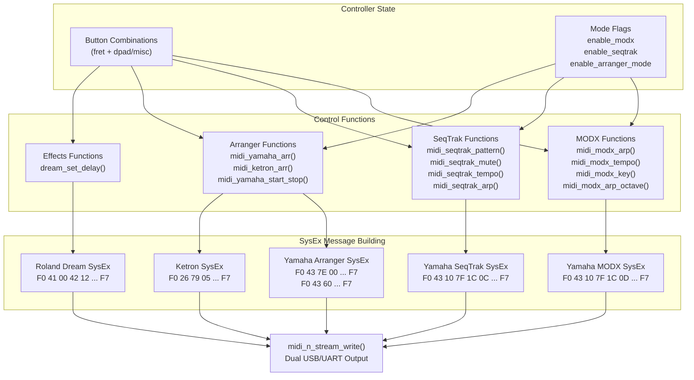
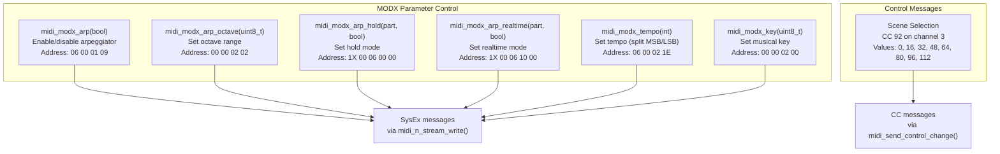
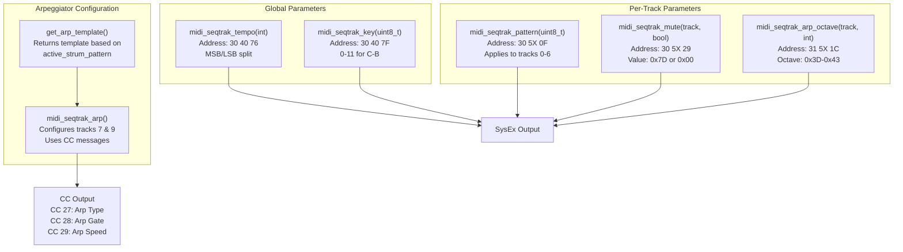
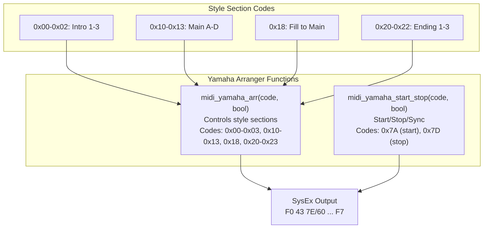
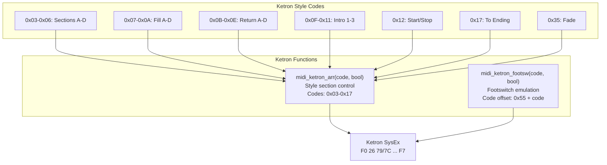
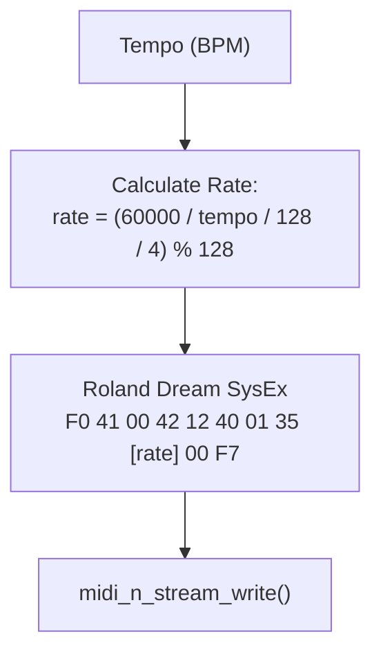
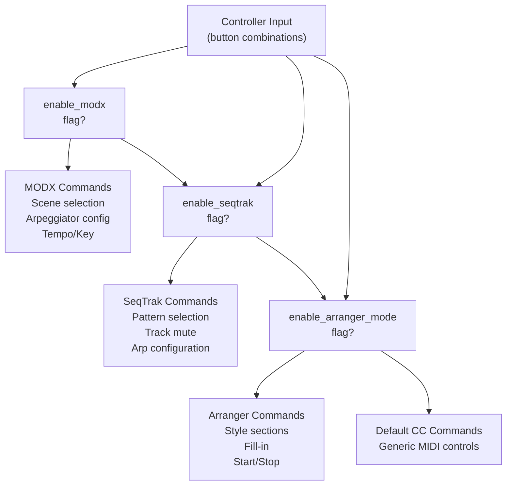

# Synthesizer Control

> **Relevant source files**
> * [main.c](https://github.com/Jus-Be/orinayo-pico/blob/122fa496/main.c)
> * [pico_bluetooth.c](https://github.com/Jus-Be/orinayo-pico/blob/122fa496/pico_bluetooth.c)

This page documents the synthesizer-specific control systems that send SysEx (System Exclusive) and other MIDI messages to configure and control various hardware synthesizers and arrangers. The system supports Yamaha MODX, Yamaha SeqTrak, Ketron arrangers, Yamaha PSR arrangers, and Roland Dream effects processors.

For general MIDI output architecture, see [Dual Output Architecture](./6.1-dual-output-architecture.md). For USB and UART configuration, see [USB MIDI Configuration](./6.2-usb-midi-configuration.md).

## Overview

The Orinayo system implements device-specific control protocols for multiple synthesizer families. These controls are triggered by button combinations on the guitar controller and are mode-dependent (controlled by `enable_modx`, `enable_seqtrak`, and `enable_arranger_mode` flags).

All synthesizer control commands are sent through `midi_n_stream_write()`, which simultaneously transmits to USB and UART MIDI outputs.



**Sources:** [main.c L210-L697](https://github.com/Jus-Be/orinayo-pico/blob/122fa496/main.c#L210-L697)

 [pico_bluetooth.c L109-L136](https://github.com/Jus-Be/orinayo-pico/blob/122fa496/pico_bluetooth.c#L109-L136)

## Yamaha MODX Control

The MODX synthesizer is controlled via Yamaha's XG/MODX-specific SysEx protocol. The system can configure arpeggiator parameters, tempo, key, and scene selection.

### MODX SysEx Message Structure

All MODX SysEx messages follow this format:

```
F0 43 10 7F 1C 0D [address bytes] [data bytes] F7
```

| Byte Position | Value | Description |
| --- | --- | --- |
| 0 | `0xF0` | SysEx start |
| 1 | `0x43` | Yamaha manufacturer ID |
| 2 | `0x10` | Device number |
| 3 | `0x7F` | Model ID |
| 4 | `0x1C` | Parameter change |
| 5 | `0x0D` | Address high |
| 6-9 | Variable | Address and data bytes |
| Last | `0xF7` | SysEx end |

### MODX Control Functions



**Sources:** [main.c L231-L352](https://github.com/Jus-Be/orinayo-pico/blob/122fa496/main.c#L231-L352)

### MODX Arpeggiator Control

The `midi_modx_arp()` function enables or disables the MODX arpeggiator:

[main.c L271-L289](https://github.com/Jus-Be/orinayo-pico/blob/122fa496/main.c#L271-L289)

The octave range is controlled by `midi_modx_arp_octave()`:

[main.c L251-L269](https://github.com/Jus-Be/orinayo-pico/blob/122fa496/main.c#L251-L269)

The octave value is offset by `0x40` in the SysEx message, allowing values from -3 to +3 octaves. The system uses `active_neck_pos - 2` to map guitar neck positions to octave ranges.

### MODX Tempo Control

Tempo is set using a two-byte value (MSB/LSB split):

[main.c L333-L352](https://github.com/Jus-Be/orinayo-pico/blob/122fa496/main.c#L333-L352)

The tempo value is split into MSB (tempo / 128) and LSB (tempo % 128).

### MODX Scene Selection

Instead of SysEx, scenes are selected using Control Change 92 on channel 3. The system maps 8 scenes to button combinations:

[main.c L672-L677](https://github.com/Jus-Be/orinayo-pico/blob/122fa496/main.c#L672-L677)

 [main.c L817-L821](https://github.com/Jus-Be/orinayo-pico/blob/122fa496/main.c#L817-L821)

**Sources:** [main.c L231-L352](https://github.com/Jus-Be/orinayo-pico/blob/122fa496/main.c#L231-L352)

 [pico_bluetooth.c L671-L679](https://github.com/Jus-Be/orinayo-pico/blob/122fa496/pico_bluetooth.c#L671-L679)

 [pico_bluetooth.c L815-L821](https://github.com/Jus-Be/orinayo-pico/blob/122fa496/pico_bluetooth.c#L815-L821)

## Yamaha SeqTrak Control

The SeqTrak is a compact groovebox with 7 tracks that can be controlled via SysEx messages. The system configures per-track parameters, patterns, and global settings.

### SeqTrak SysEx Structure

SeqTrak messages use a similar structure but with different address bytes:

```
F0 43 10 7F 1C 0C [address bytes] [data bytes] F7
```

The `0C` byte (position 5) identifies SeqTrak-specific parameters.

### SeqTrak Control Functions



**Sources:** [main.c L354-L477](https://github.com/Jus-Be/orinayo-pico/blob/122fa496/main.c#L354-L477)

### Pattern Selection

The `midi_seqtrak_pattern()` function applies a pattern to all 7 tracks simultaneously:

[main.c L431-L451](https://github.com/Jus-Be/orinayo-pico/blob/122fa496/main.c#L431-L451)

This loops through tracks 0-6 and sends the same pattern number to each track's address `30 5X 0F` where X is the track number.

### Track Mute Control

Individual tracks can be muted or unmuted:

[main.c L412-L429](https://github.com/Jus-Be/orinayo-pico/blob/122fa496/main.c#L412-L429)

The mute value is `0x7D` for muted, `0x00` for unmuted.

### Arpeggiator Configuration

The `midi_seqtrak_arp()` function configures arpeggiators on tracks 8 (bass) and 10 (keys):

[main.c L453-L467](https://github.com/Jus-Be/orinayo-pico/blob/122fa496/main.c#L453-L467)

The arpeggiator template is selected by `get_arp_template()` based on the current strum pattern:

[main.c L469-L477](https://github.com/Jus-Be/orinayo-pico/blob/122fa496/main.c#L469-L477)

| Strum Pattern | Template | Description |
| --- | --- | --- |
| -1 | 15 | Use pattern data |
| 0 | 13/14 | Chord mode (alternates by section) |
| 1 | 6/7 | Random (alternates by section) |
| 2 | 2/3 | Up arpeggio |
| 3 | 4/5 | Down arpeggio |
| 4 | 8/9/10/11 | Up/down (varies by neck position) |

**Sources:** [main.c L354-L477](https://github.com/Jus-Be/orinayo-pico/blob/122fa496/main.c#L354-L477)

 [pico_bluetooth.c L453-L467](https://github.com/Jus-Be/orinayo-pico/blob/122fa496/pico_bluetooth.c#L453-L467)

## Arranger Keyboard Control

The system supports two families of arranger keyboards: Yamaha PSR/Tyros series and Ketron series. These devices use different SysEx formats but provide similar functionality.

### Yamaha Arranger Control

Yamaha arrangers use two different SysEx formats depending on the function:

**Style Control Messages:**

```
F0 43 7E 00 [code] [value] F7
```

**Transport Control Messages:**

```
F0 43 60 [code] [value] F7
```



**Implementation:**

[main.c L537-L550](https://github.com/Jus-Be/orinayo-pico/blob/122fa496/main.c#L537-L550)

[main.c L524-L535](https://github.com/Jus-Be/orinayo-pico/blob/122fa496/main.c#L524-L535)

**Sources:** [main.c L524-L550](https://github.com/Jus-Be/orinayo-pico/blob/122fa496/main.c#L524-L550)

### Ketron Arranger Control

Ketron arrangers use a different manufacturer ID and structure:

**Style Control:**

```
F0 26 79 05 00 [code] [value] F7
```

**Footswitch Control:**

```
F0 26 7C 05 01 [code] [value] F7
```



**Implementation:**

[main.c L552-L566](https://github.com/Jus-Be/orinayo-pico/blob/122fa496/main.c#L552-L566)

[main.c L568-L582](https://github.com/Jus-Be/orinayo-pico/blob/122fa496/main.c#L568-L582)

**Sources:** [main.c L552-L582](https://github.com/Jus-Be/orinayo-pico/blob/122fa496/main.c#L552-L582)

### Arranger Integration with Controller

Button combinations on the guitar controller trigger different arranger functions based on the fret buttons held:

| Button Combo | Ketron Code | Yamaha Code | Function |
| --- | --- | --- | --- |
| Logo | 0x12 | 127 | Start/Stop |
| Yellow + Logo | 0x0F | 0x00 | Intro/End 1 |
| Red + Logo | 0x10 | 0x01 | Intro/End 2 |
| Green + Logo | 0x11 | 0x02 | Intro/End 3 |
| Blue + Logo | 0x17 | 0x01 | To Ending |
| Orange + Logo | 0x35 | 0x02 | Fade |

[pico_bluetooth.c L625-L659](https://github.com/Jus-Be/orinayo-pico/blob/122fa496/pico_bluetooth.c#L625-L659)

**Sources:** [pico_bluetooth.c L625-L735](https://github.com/Jus-Be/orinayo-pico/blob/122fa496/pico_bluetooth.c#L625-L735)

## Roland Dream Delay Control

The Roland Dream effect processor's delay time is synchronized to the current tempo using Roland's GS SysEx format:

```
F0 41 00 42 12 40 01 35 [rate] 00 F7
```



The `dream_set_delay()` function is called whenever tempo changes:

[main.c L210-L229](https://github.com/Jus-Be/orinayo-pico/blob/122fa496/main.c#L210-L229)

The rate calculation converts BPM to a delay time value that fits within the MIDI 7-bit range (0-127).

**Sources:** [main.c L210-L229](https://github.com/Jus-Be/orinayo-pico/blob/122fa496/main.c#L210-L229)

 [pico_bluetooth.c L1006-L1011](https://github.com/Jus-Be/orinayo-pico/blob/122fa496/pico_bluetooth.c#L1006-L1011)

## Mode-Based Control Routing

The synthesizer control functions check mode flags before executing. This allows the controller to work with different devices without sending conflicting commands.



The mode selection is controlled via the config button (mbut3) with fret combinations:

| Fret Combo | Mode Toggled | Flag |
| --- | --- | --- |
| Green | Arranger Mode | `enable_arranger_mode` |
| Red | Ample Guitar | `enable_ample_guitar` |
| Yellow | MIDI Drums Looper | `enable_midi_drums` |
| Blue | SeqTrak | `enable_seqtrak` |
| Orange | MODX | `enable_modx` |

[pico_bluetooth.c L977-L998](https://github.com/Jus-Be/orinayo-pico/blob/122fa496/pico_bluetooth.c#L977-L998)

**Sources:** [pico_bluetooth.c L977-L998](https://github.com/Jus-Be/orinayo-pico/blob/122fa496/pico_bluetooth.c#L977-L998)

 [pico_bluetooth.c L1309-L1399](https://github.com/Jus-Be/orinayo-pico/blob/122fa496/pico_bluetooth.c#L1309-L1399)

## Control Change Messages

In addition to SysEx, the system sends Control Change messages for functions that don't require device-specific protocols:

| CC Number | Parameter | Channel | Usage |
| --- | --- | --- | --- |
| 0 | Bank Select MSB | 0 | Bank selection for program changes |
| 3 | General Purpose 4 | 3 | Generic arranger control |
| 7 | Volume | Various | Track volume control |
| 9 | General Purpose 10 | 3 | Voice selection |
| 14 | General Purpose 15 | 3 | Style selection/navigation |
| 15 | General Purpose 16 | 3 | Style group selection |
| 27 | Arp Type | 7, 9 | SeqTrak arp type |
| 28 | Arp Gate | 7, 9 | SeqTrak arp gate time |
| 29 | Arp Speed | 7, 9 | SeqTrak arp rate |
| 32 | Bank Select LSB | 0 | Bank selection LSB |
| 64 | Sustain | 0 | Sustain pedal |
| 80 | Reverb Type | 0 | Reverb selection |
| 81 | Chorus Type | 0 | Chorus selection |
| 91 | Reverb Send | 0 | Reverb amount |
| 92 | Scene | 3 | MODX scene selection |
| 93 | Chorus Send | 0 | Chorus amount |

[main.c L493-L502](https://github.com/Jus-Be/orinayo-pico/blob/122fa496/main.c#L493-L502)

**Sources:** [main.c L493-L512](https://github.com/Jus-Be/orinayo-pico/blob/122fa496/main.c#L493-L512)

 [pico_bluetooth.c L531-L538](https://github.com/Jus-Be/orinayo-pico/blob/122fa496/pico_bluetooth.c#L531-L538)

## Summary

The synthesizer control system provides:

1. **Device-Specific SysEx protocols** for MODX, SeqTrak, Yamaha arrangers, Ketron arrangers, and Roland effects
2. **Mode-based routing** that prevents conflicting commands when multiple devices are connected
3. **Template-based configuration** for arpeggiators that adapts to the current playing style
4. **Tempo synchronization** across all devices via tempo-specific SysEx messages
5. **Dual output** of all control messages via USB and UART MIDI

All commands flow through `midi_n_stream_write()` [main.c L690-L697](https://github.com/Jus-Be/orinayo-pico/blob/122fa496/main.c#L690-L697)

 ensuring synchronized transmission to all connected devices.

**Sources:** [main.c L210-L697](https://github.com/Jus-Be/orinayo-pico/blob/122fa496/main.c#L210-L697)

 [pico_bluetooth.c L109-L1399](https://github.com/Jus-Be/orinayo-pico/blob/122fa496/pico_bluetooth.c#L109-L1399)