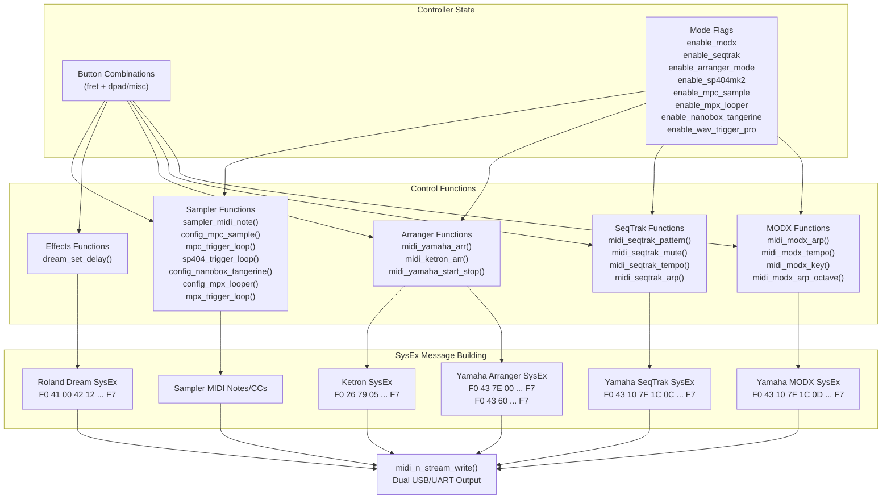
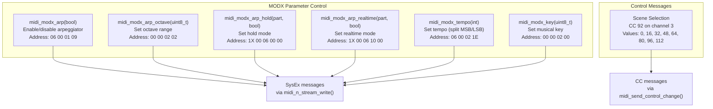
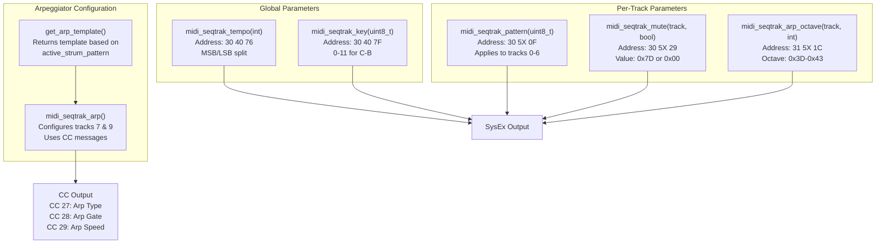
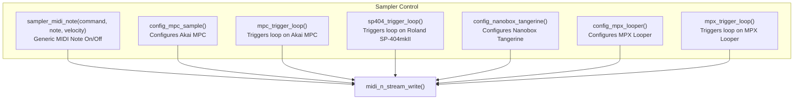

# Synthesizer Control

> **Relevant source files**
> * [main.c](https://github.com/Jus-Be/orinayo-pico/blob/6dde5a75/main.c)
> * [tools/RC600-1.txt](https://github.com/Jus-Be/orinayo-pico/blob/6dde5a75/tools/RC600-1.txt)
> * [tools/RC600-2.txt](https://github.com/Jus-Be/orinayo-pico/blob/6dde5a75/tools/RC600-2.txt)
> * [tools/ketron2rc600-1.cmd](https://github.com/Jus-Be/orinayo-pico/blob/6dde5a75/tools/ketron2rc600-1.cmd)
> * [tools/ketron2rc600-2.cmd](https://github.com/Jus-Be/orinayo-pico/blob/6dde5a75/tools/ketron2rc600-2.cmd)
> * [tools/ketron2sp404-1.cmd](https://github.com/Jus-Be/orinayo-pico/blob/6dde5a75/tools/ketron2sp404-1.cmd)
> * [tools/ketron2sp404-2.cmd](https://github.com/Jus-Be/orinayo-pico/blob/6dde5a75/tools/ketron2sp404-2.cmd)
> * [tools/ketron2sp404-3.cmd](https://github.com/Jus-Be/orinayo-pico/blob/6dde5a75/tools/ketron2sp404-3.cmd)

This page documents the synthesizer-specific control systems that send SysEx (System Exclusive) and other MIDI messages to configure and control various hardware synthesizers and arrangers. The system supports Yamaha MODX, Yamaha SeqTrak, Ketron arrangers, Yamaha PSR arrangers, and Roland Dream effects processors.

For general MIDI output architecture, see [Dual Output Architecture](./6.1-dual-output-architecture.md). For USB and UART configuration, see [USB MIDI Configuration](./6.2-usb-midi-configuration.md).

## Overview

The Orinayo system implements device-specific control protocols for multiple synthesizer families. These controls are triggered by button combinations on the guitar controller and are mode-dependent (controlled by `enable_modx`, `enable_seqtrak`, and `enable_arranger_mode` flags).

All synthesizer control commands are sent through `midi_n_stream_write()`, which simultaneously transmits to USB and UART MIDI outputs.

### Data Flow: Controller to Synthesizer

```mermaid
flowchart TD

ButtonCombo["Button Combinations<br>(fret + dpad/misc)"]
ModeFlags["Mode Flags<br>enable_modx<br>enable_seqtrak<br>enable_arranger_mode<br>enable_sp404mk2<br>enable_mpc_sample<br>enable_mpx_looper<br>enable_nanobox_tangerine<br>enable_wav_trigger_pro"]
ModxFuncs["MODX Functions<br>midi_modx_arp()<br>midi_modx_tempo()<br>midi_modx_key()<br>midi_modx_arp_octave()"]
SeqtrakFuncs["SeqTrak Functions<br>midi_seqtrak_pattern()<br>midi_seqtrak_mute()<br>midi_seqtrak_tempo()<br>midi_seqtrak_arp()"]
ArrangerFuncs["Arranger Functions<br>midi_yamaha_arr()<br>midi_ketron_arr()<br>midi_yamaha_start_stop()"]
DreamFuncs["Effects Functions<br>dream_set_delay()"]
SamplerFuncs["Sampler Functions<br>sampler_midi_note()<br>config_mpc_sample()<br>mpc_trigger_loop()<br>sp404_trigger_loop()<br>config_nanobox_tangerine()<br>config_mpx_looper()<br>mpx_trigger_loop()"]
ModxSysEx["Yamaha MODX SysEx<br>F0 43 10 7F 1C 0D ... F7"]
SeqtrakSysEx["Yamaha SeqTrak SysEx<br>F0 43 10 7F 1C 0C ... F7"]
YamahaSysEx["Yamaha Arranger SysEx<br>F0 43 7E 00 ... F7<br>F0 43 60 ... F7"]
KetronSysEx["Ketron SysEx<br>F0 26 79 05 ... F7"]
DreamSysEx["Roland Dream SysEx<br>F0 41 00 42 12 ... F7"]
SamplerMIDI["Sampler MIDI Notes/CCs"]
Output["midi_n_stream_write()<br>Dual USB/UART Output"]

ButtonCombo --> ModxFuncs
ButtonCombo --> SeqtrakFuncs
ButtonCombo --> ArrangerFuncs
ButtonCombo --> DreamFuncs
ButtonCombo --> SamplerFuncs
ModeFlags --> ModxFuncs
ModeFlags --> SeqtrakFuncs
ModeFlags --> ArrangerFuncs
ModeFlags --> SamplerFuncs
ModxFuncs --> ModxSysEx
SeqtrakFuncs --> SeqtrakSysEx
ArrangerFuncs --> YamahaSysEx
ArrangerFuncs --> KetronSysEx
DreamFuncs --> DreamSysEx
SamplerFuncs --> SamplerMIDI
ModxSysEx --> Output
SeqtrakSysEx --> Output
YamahaSysEx --> Output
KetronSysEx --> Output
DreamSysEx --> Output
SamplerMIDI --> Output

subgraph subGraph2 ["SysEx Message Building"]
    ModxSysEx
    SeqtrakSysEx
    YamahaSysEx
    KetronSysEx
    DreamSysEx
    SamplerMIDI
end

subgraph subGraph1 ["Control Functions"]
    ModxFuncs
    SeqtrakFuncs
    ArrangerFuncs
    DreamFuncs
    SamplerFuncs
end

subgraph subGraph0 ["Controller State"]
    ButtonCombo
    ModeFlags
end
```

Sources: [main.c L73-L81](https://github.com/Jus-Be/orinayo-pico/blob/6dde5a75/main.c#L73-L81)

 [main.c L93-L98](https://github.com/Jus-Be/orinayo-pico/blob/6dde5a75/main.c#L93-L98)

 [main.c L102-L108](https://github.com/Jus-Be/orinayo-pico/blob/6dde5a75/main.c#L102-L108)

## Yamaha MODX Control

The MODX synthesizer is controlled via Yamaha's XG/MODX-specific SysEx protocol. The system can configure arpeggiator parameters, tempo, key, and scene selection.

### MODX SysEx Message Structure

All MODX SysEx messages follow this format:
`F0 43 10 7F 1C 0D [address bytes] [data bytes] F7`

| Byte Position | Value | Description |
| --- | --- | --- |
| 0 | `0xF0` | SysEx start |
| 1 | `0x43` | Yamaha manufacturer ID |
| 2 | `0x10` | Device number |
| 3 | `0x7F` | Model ID |
| 4 | `0x1C` | Parameter change |
| 5 | `0x0D` | Address high |
| 6-9 | Variable | Address and data bytes |
| Last | `0xF7` | SysEx end |

### MODX Control Functions

```mermaid
flowchart TD

ArpEnable["midi_modx_arp(bool)<br>Enable/disable arpeggiator<br>Address: 06 00 01 09"]
ArpOctave["midi_modx_arp_octave(uint8_t)<br>Set octave range<br>Address: 00 00 02 02"]
ArpHold["midi_modx_arp_hold(part, bool)<br>Set hold mode<br>Address: 1X 00 06 00 00"]
ArpRealtime["midi_modx_arp_realtime(part, bool)<br>Set realtime mode<br>Address: 1X 00 06 10 00"]
Tempo["midi_modx_tempo(int)<br>Set tempo (split MSB/LSB)<br>Address: 06 00 02 1E"]
Key["midi_modx_key(uint8_t)<br>Set musical key<br>Address: 00 00 02 00"]
SceneCC["Scene Selection<br>CC 92 on channel 3<br>Values: 0, 16, 32, 48, 64, 80, 96, 112"]
SysExOut["SysEx messages<br>via midi_n_stream_write()"]
CCOut["CC messages<br>via midi_send_control_change()"]

ArpEnable --> SysExOut
ArpOctave --> SysExOut
ArpHold --> SysExOut
ArpRealtime --> SysExOut
Tempo --> SysExOut
Key --> SysExOut
SceneCC --> CCOut

subgraph subGraph1 ["Control Messages"]
    SceneCC
end

subgraph subGraph0 ["MODX Parameter Control"]
    ArpEnable
    ArpOctave
    ArpHold
    ArpRealtime
    Tempo
    Key
end
```

Sources: [main.c L106-L112](https://github.com/Jus-Be/orinayo-pico/blob/6dde5a75/main.c#L106-L112)

 [main.c L251-L352](https://github.com/Jus-Be/orinayo-pico/blob/6dde5a75/main.c#L251-L352)

### MODX Arpeggiator and Tempo Control

The `midi_modx_arp()` function [main.c L271-L289](https://github.com/Jus-Be/orinayo-pico/blob/6dde5a75/main.c#L271-L289)

 enables or disables the MODX arpeggiator. The octave range is controlled by `midi_modx_arp_octave()` [main.c L251-L269](https://github.com/Jus-Be/orinayo-pico/blob/6dde5a75/main.c#L251-L269)

 where the value is offset by `0x40` in the SysEx message.

Tempo is set using a two-byte value (MSB/LSB split) in `midi_modx_tempo()` [main.c L333-L352](https://github.com/Jus-Be/orinayo-pico/blob/6dde5a75/main.c#L333-L352)

 The tempo value is split into MSB (`tempo / 128`) and LSB (`tempo % 128`).

Sources: [main.c L251-L352](https://github.com/Jus-Be/orinayo-pico/blob/6dde5a75/main.c#L251-L352)

## Yamaha SeqTrak Control

The SeqTrak is a groovebox with 7 tracks controlled via SysEx. Messages use the address header `F0 43 10 7F 1C 0C`.

### SeqTrak Control Functions

```mermaid
flowchart TD

Tempo["midi_seqtrak_tempo(int)<br>Address: 30 40 76<br>MSB/LSB split"]
Key["midi_seqtrak_key(uint8_t)<br>Address: 30 40 7F<br>0-11 for C-B"]
Pattern["midi_seqtrak_pattern(uint8_t)<br>Address: 30 5X 0F<br>Applies to tracks 0-6"]
Mute["midi_seqtrak_mute(track, bool)<br>Address: 30 5X 29<br>Value: 0x7D or 0x00"]
ArpOctave["midi_seqtrak_arp_octave(track, int)<br>Address: 31 5X 1C<br>Octave: 0x3D-0x43"]
ArpSetup["midi_seqtrak_arp()<br>Configures tracks 7 & 9<br>Uses CC messages"]
ArpTemplate["get_arp_template()<br>Returns template based on<br>active_strum_pattern"]
SysExOut["SysEx Output"]
CCOut["CC Output<br>CC 27: Arp Type<br>CC 28: Arp Gate<br>CC 29: Arp Speed"]

Tempo --> SysExOut
Key --> SysExOut
Pattern --> SysExOut
Mute --> SysExOut
ArpOctave --> SysExOut
ArpSetup --> CCOut

subgraph subGraph2 ["Arpeggiator Configuration"]
    ArpSetup
    ArpTemplate
    ArpTemplate --> ArpSetup
end

subgraph subGraph1 ["Per-Track Parameters"]
    Pattern
    Mute
    ArpOctave
end

subgraph subGraph0 ["Global Parameters"]
    Tempo
    Key
end
```

Sources: [main.c L354-L477](https://github.com/Jus-Be/orinayo-pico/blob/6dde5a75/main.c#L354-L477)

### Pattern and Arpeggiator Configuration

`midi_seqtrak_pattern()` [main.c L431-L451](https://github.com/Jus-Be/orinayo-pico/blob/6dde5a75/main.c#L431-L451)

 applies a pattern to tracks 0-6. The arpeggiator template is selected by `get_arp_template()` [main.c L469-L477](https://github.com/Jus-Be/orinayo-pico/blob/6dde5a75/main.c#L469-L477)

 based on `active_strum_pattern`.

| Strum Pattern | Template | Description |
| --- | --- | --- |
| -1 | 15 | Use pattern data |
| 0 | 13/14 | Chord mode |
| 1 | 6/7 | Random |
| 2 | 2/3 | Up arpeggio |

Sources: [main.c L431-L477](https://github.com/Jus-Be/orinayo-pico/blob/6dde5a75/main.c#L431-L477)

## Arranger Keyboard Control

The system supports Yamaha PSR/Tyros and Ketron series arrangers.

### Yamaha Arranger Control

Yamaha arrangers use `midi_yamaha_arr()` [main.c L537-L550](https://github.com/Jus-Be/orinayo-pico/blob/6dde5a75/main.c#L537-L550)

 for style sections (Intro, Main, Fill, End) and `midi_yamaha_start_stop()` [main.c L524-L535](https://github.com/Jus-Be/orinayo-pico/blob/6dde5a75/main.c#L524-L535)

 for transport.

### Ketron Arranger Control

Ketron arrangers use `midi_ketron_arr()` [main.c L552-L566](https://github.com/Jus-Be/orinayo-pico/blob/6dde5a75/main.c#L552-L566)

 for style control and `midi_ketron_footsw()` [main.c L568-L582](https://github.com/Jus-Be/orinayo-pico/blob/6dde5a75/main.c#L568-L582)

 to emulate footswitch presses.

Sources: [main.c L524-L582](https://github.com/Jus-Be/orinayo-pico/blob/6dde5a75/main.c#L524-L582)

## Sampler Control

The system provides specific functions for controlling various samplers, including the Roland SP-404mkII, Akai MPC, MPX Looper, Nanobox Tangerine, and Wav Trigger Pro. These functions typically send MIDI Note On/Off messages or Program Change messages to trigger samples or configure the devices.

### Sampler Control Functions

```mermaid
flowchart TD

SamplerNote["sampler_midi_note(command, note, velocity)<br>Generic MIDI Note On/Off"]
ConfigMPC["config_mpc_sample()<br>Configures Akai MPC"]
TriggerMPC["mpc_trigger_loop()<br>Triggers loop on Akai MPC"]
TriggerSP404["sp404_trigger_loop()<br>Triggers loop on Roland SP-404mkII"]
ConfigNanobox["config_nanobox_tangerine()<br>Configures Nanobox Tangerine"]
ConfigMPX["config_mpx_looper()<br>Configures MPX Looper"]
TriggerMPX["mpx_trigger_loop()<br>Triggers loop on MPX Looper"]
MIDIOutput["midi_n_stream_write()"]

SamplerNote --> MIDIOutput
ConfigMPC --> MIDIOutput
TriggerMPC --> MIDIOutput
TriggerSP404 --> MIDIOutput
ConfigNanobox --> MIDIOutput
ConfigMPX --> MIDIOutput
TriggerMPX --> MIDIOutput

subgraph subGraph0 ["Sampler Control"]
    SamplerNote
    ConfigMPC
    TriggerMPC
    TriggerSP404
    ConfigNanobox
    ConfigMPX
    TriggerMPX
end
```

Sources: [main.c L153-L160](https://github.com/Jus-Be/orinayo-pico/blob/6dde5a75/main.c#L153-L160)

### SP-404mkII Sample Management

The `tools/ketron2sp404-1.cmd`, `tools/ketron2sp404-2.cmd`, and `tools/ketron2sp404-3.cmd` scripts demonstrate how WAV files are organized and copied for use with the SP-404mkII. These scripts map specific WAV files (e.g., `ARRA.wav`, `MAJ_C.wav`) to numbered sample slots (e.g., `1-01-120.wav`, `2-01-120.wav`) on different banks. This suggests that the `sp404_trigger_loop()` function would send MIDI Note On messages corresponding to these sample slots.

For example, `tools/ketron2sp404-1.cmd` copies `ARRA.wav` to `.\01\SAMPLE\1-01-085.wav`, indicating a sample at bank 1, pad 1.

Sources: [tools/ketron2sp404-1.cmd L3-L138](https://github.com/Jus-Be/orinayo-pico/blob/6dde5a75/tools/ketron2sp404-1.cmd#L3-L138)

 [tools/ketron2sp404-2.cmd L3-L138](https://github.com/Jus-Be/orinayo-pico/blob/6dde5a75/tools/ketron2sp404-2.cmd#L3-L138)

 [tools/ketron2sp404-3.cmd L3-L138](https://github.com/Jus-Be/orinayo-pico/blob/6dde5a75/tools/ketron2sp404-3.cmd#L3-L138)

### Roland RC-600 Sample Management

The `tools/ketron2rc600-1.cmd` and `tools/ketron2rc600-2.cmd` scripts use `ffmpeg` to concatenate WAV files for the Roland RC-600. This process combines two input WAV files (e.g., `IN/1A/MAJ_C.wav` and `IN/1B/MAJ_C.wav`) into a single output WAV file (e.g., `WAVE/001_1/MAJ_C.wav`). The `tools/RC600-1.txt` and `tools/RC600-2.txt` files then reference these generated WAV files for import/export, indicating how the RC-600 manages its samples.

Sources: [tools/ketron2rc600-1.cmd L1-L65](https://github.com/Jus-Be/orinayo-pico/blob/6dde5a75/tools/ketron2rc600-1.cmd#L1-L65)

 [tools/ketron2rc600-2.cmd L1-L65](https://github.com/Jus-Be/orinayo-pico/blob/6dde5a75/tools/ketron2rc600-2.cmd#L1-L65)

 [tools/RC600-1.txt L1-L79](https://github.com/Jus-Be/orinayo-pico/blob/6dde5a75/tools/RC600-1.txt#L1-L79)

 [tools/RC600-2.txt L1-L79](https://github.com/Jus-Be/orinayo-pico/blob/6dde5a75/tools/RC600-2.txt#L1-L79)

## Roland Dream Delay Control

The Roland Dream effect processor's delay time is synchronized via `dream_set_delay()` [main.c L210-L229](https://github.com/Jus-Be/orinayo-pico/blob/6dde5a75/main.c#L210-L229)

 It calculates a rate based on tempo: `rate = (60000 / tempo / 128 / 4) % 128`.

Sources: [main.c L210-L229](https://github.com/Jus-Be/orinayo-pico/blob/6dde5a75/main.c#L210-L229)

## Mode-Based Control Routing

The synthesizer control functions check mode flags before executing. Mode selection is handled in the Bluetooth HID processing layer.

| Fret Combo | Mode Toggled | Flag |
| --- | --- | --- |
| Green | Arranger Mode | `enable_arranger_mode` |
| Blue | SeqTrak | `enable_seqtrak` |
| Orange | MODX | `enable_modx` |
| Yellow | SP-404mkII | `enable_sp404mk2` |
| Red | MPC Sample | `enable_mpc_sample` |
| Starpower | MPX Looper | `enable_mpx_looper` |
| Logo | Nanobox Tangerine | `enable_nanobox_tangerine` |
| D-Pad Down | Wav Trigger Pro | `enable_wav_trigger_pro` |

Sources: [main.c L73-L81](https://github.com/Jus-Be/orinayo-pico/blob/6dde5a75/main.c#L73-L81)

 [main.c L93-L98](https://github.com/Jus-Be/orinayo-pico/blob/6dde5a75/main.c#L93-L98)

 [pico_bluetooth.c L1309-L1399](https://github.com/Jus-Be/orinayo-pico/blob/6dde5a75/pico_bluetooth.c#L1309-L1399)

## Control Change Messages

The system sends CC messages for generic parameters [main.c L493-L512](https://github.com/Jus-Be/orinayo-pico/blob/6dde5a75/main.c#L493-L512)

| CC Number | Parameter | Usage |
| --- | --- | --- |
| 7 | Volume | Track volume control |
| 64 | Sustain | Sustain pedal |
| 92 | Scene | MODX scene selection |

Sources: [main.c L493-L512](https://github.com/Jus-Be/orinayo-pico/blob/6dde5a75/main.c#L493-L512)