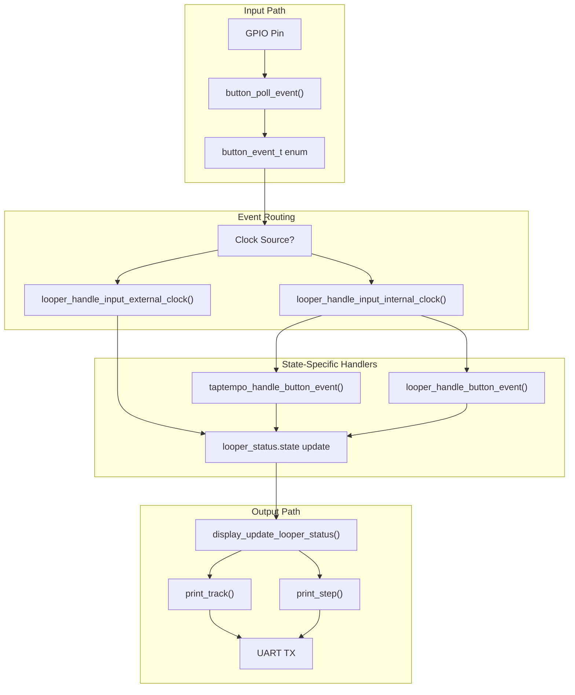
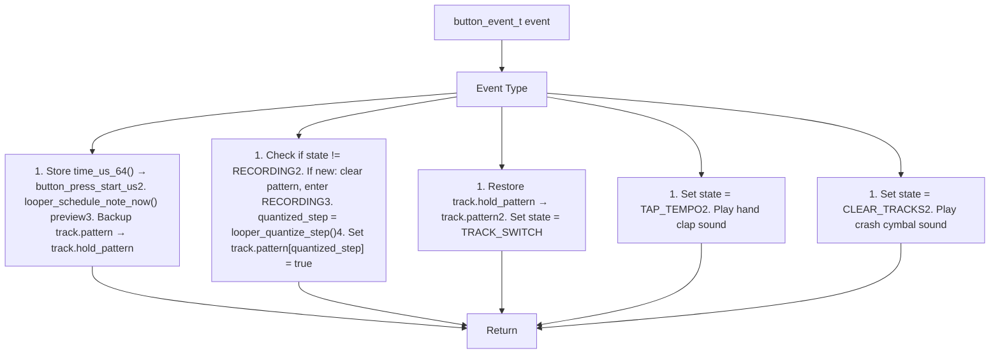
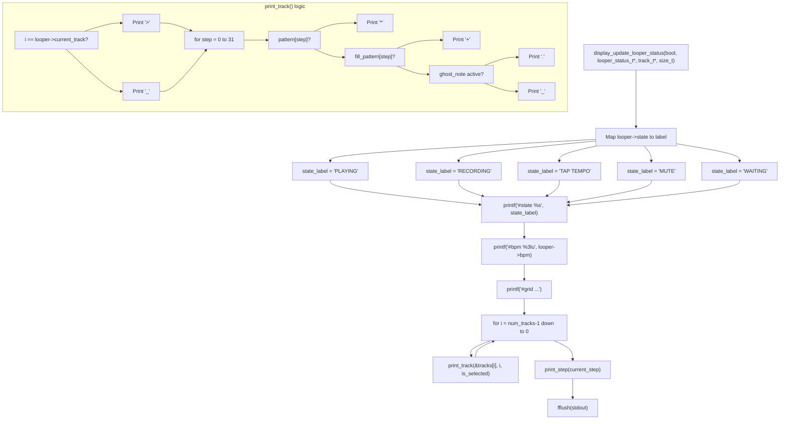
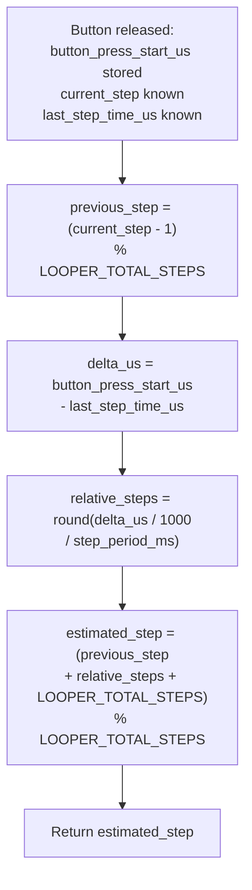

# User Interface

> **Relevant source files**
> * [button.h](https://github.com/Jus-Be/orinayo-pico/blob/122fa496/button.h)
> * [display.c](https://github.com/Jus-Be/orinayo-pico/blob/122fa496/display.c)
> * [display.h](https://github.com/Jus-Be/orinayo-pico/blob/122fa496/display.h)
> * [looper.c](https://github.com/Jus-Be/orinayo-pico/blob/122fa496/looper.c)

## Purpose and Scope

This document describes the user interface systems in the Orinayo firmware. The interface consists of two primary components: a physical button input system for controlling the looper, and a UART-based text display for visualizing looper status. For detailed information about button event detection and debouncing, see [Button Input](./7.1-button-input.md). For display rendering implementation, see [Status Display](./7.2-status-display.md).

The interface is intentionally minimal, designed for real-time musical performance with a single physical button and serial console feedback. All button interactions are interpreted contextually based on the current looper state.

Sources: [looper.c L1-L527](https://github.com/Jus-Be/orinayo-pico/blob/122fa496/looper.c#L1-L527)

 [button.h L1-L23](https://github.com/Jus-Be/orinayo-pico/blob/122fa496/button.h#L1-L23)

 [display.c L1-L111](https://github.com/Jus-Be/orinayo-pico/blob/122fa496/display.c#L1-L111)

## System Architecture

The user interface operates as a bidirectional feedback system: button events flow into the application to modify state, while the display system continuously renders that state to the UART console.



**Figure 1: User Interface Data Flow**

The input path begins with GPIO hardware and produces typed button events. These events are routed through different handlers depending on whether the system is using internal or external MIDI clock. The output path renders the current looper state, including all track patterns and the current step position, to the UART console at 115200 baud.

Sources: [looper.c L376-L514](https://github.com/Jus-Be/orinayo-pico/blob/122fa496/looper.c#L376-L514)

 [display.c L76-L110](https://github.com/Jus-Be/orinayo-pico/blob/122fa496/display.c#L76-L110)

## Button Event Types

The system recognizes eight distinct button event types, classified by press duration and release timing:

| Event Type | Trigger Condition | Typical Usage |
| --- | --- | --- |
| `BUTTON_EVENT_CLICK_BEGIN` | Button press detected | Start timing, trigger preview note |
| `BUTTON_EVENT_CLICK_RELEASE` | Release before hold threshold | Record step at quantized position |
| `BUTTON_EVENT_HOLD_BEGIN` | Held ≥ 500ms | Begin hold sequence |
| `BUTTON_EVENT_HOLD_RELEASE` | Released after hold | Undo and switch track |
| `BUTTON_EVENT_LONG_HOLD_BEGIN` | Held ≥ 2 seconds | Long hold detected |
| `BUTTON_EVENT_LONG_HOLD_RELEASE` | Released after long hold | Enter tap tempo mode |
| `BUTTON_EVENT_VERY_LONG_HOLD_BEGIN` | Held ≥ 5 seconds | Very long hold detected |
| `BUTTON_EVENT_VERY_LONG_HOLD_RELEASE` | Released after very long hold | Clear all tracks |

**Table 1: Button Event Types and Meanings**

These event types are defined in [button.h L10-L20](https://github.com/Jus-Be/orinayo-pico/blob/122fa496/button.h#L10-L20)

 The actual detection and state machine logic that generates these events is documented in [Button Input](./7.1-button-input.md).

Sources: [button.h L10-L20](https://github.com/Jus-Be/orinayo-pico/blob/122fa496/button.h#L10-L20)

 [looper.c L376-L420](https://github.com/Jus-Be/orinayo-pico/blob/122fa496/looper.c#L376-L420)

## Event Routing by Clock Mode

Button events are routed to different handlers depending on the current clock source. This bifurcation allows the system to provide appropriate behavior when synchronized to external MIDI clock versus operating autonomously.

```css
#mermaid-s8eivfx8oyi{font-family:ui-sans-serif,-apple-system,system-ui,Segoe UI,Helvetica;font-size:16px;fill:#333;}@keyframes edge-animation-frame{from{stroke-dashoffset:0;}}@keyframes dash{to{stroke-dashoffset:0;}}#mermaid-s8eivfx8oyi .edge-animation-slow{stroke-dasharray:9,5!important;stroke-dashoffset:900;animation:dash 50s linear infinite;stroke-linecap:round;}#mermaid-s8eivfx8oyi .edge-animation-fast{stroke-dasharray:9,5!important;stroke-dashoffset:900;animation:dash 20s linear infinite;stroke-linecap:round;}#mermaid-s8eivfx8oyi .error-icon{fill:#dddddd;}#mermaid-s8eivfx8oyi .error-text{fill:#222222;stroke:#222222;}#mermaid-s8eivfx8oyi .edge-thickness-normal{stroke-width:1px;}#mermaid-s8eivfx8oyi .edge-thickness-thick{stroke-width:3.5px;}#mermaid-s8eivfx8oyi .edge-pattern-solid{stroke-dasharray:0;}#mermaid-s8eivfx8oyi .edge-thickness-invisible{stroke-width:0;fill:none;}#mermaid-s8eivfx8oyi .edge-pattern-dashed{stroke-dasharray:3;}#mermaid-s8eivfx8oyi .edge-pattern-dotted{stroke-dasharray:2;}#mermaid-s8eivfx8oyi .marker{fill:#999;stroke:#999;}#mermaid-s8eivfx8oyi .marker.cross{stroke:#999;}#mermaid-s8eivfx8oyi svg{font-family:ui-sans-serif,-apple-system,system-ui,Segoe UI,Helvetica;font-size:16px;}#mermaid-s8eivfx8oyi p{margin:0;}#mermaid-s8eivfx8oyi defs #statediagram-barbEnd{fill:#999;stroke:#999;}#mermaid-s8eivfx8oyi g.stateGroup text{fill:#dddddd;stroke:none;font-size:10px;}#mermaid-s8eivfx8oyi g.stateGroup text{fill:#333;stroke:none;font-size:10px;}#mermaid-s8eivfx8oyi g.stateGroup .state-title{font-weight:bolder;fill:#333;}#mermaid-s8eivfx8oyi g.stateGroup rect{fill:#ffffff;stroke:#dddddd;}#mermaid-s8eivfx8oyi g.stateGroup line{stroke:#999;stroke-width:1;}#mermaid-s8eivfx8oyi .transition{stroke:#999;stroke-width:1;fill:none;}#mermaid-s8eivfx8oyi .stateGroup .composit{fill:#f4f4f4;border-bottom:1px;}#mermaid-s8eivfx8oyi .stateGroup .alt-composit{fill:#e0e0e0;border-bottom:1px;}#mermaid-s8eivfx8oyi .state-note{stroke:#e6d280;fill:#fff5ad;}#mermaid-s8eivfx8oyi .state-note text{fill:#333;stroke:none;font-size:10px;}#mermaid-s8eivfx8oyi .stateLabel .box{stroke:none;stroke-width:0;fill:#ffffff;opacity:0.5;}#mermaid-s8eivfx8oyi .edgeLabel .label rect{fill:#ffffff;opacity:0.5;}#mermaid-s8eivfx8oyi .edgeLabel{background-color:#ffffff;text-align:center;}#mermaid-s8eivfx8oyi .edgeLabel p{background-color:#ffffff;}#mermaid-s8eivfx8oyi .edgeLabel rect{opacity:0.5;background-color:#ffffff;fill:#ffffff;}#mermaid-s8eivfx8oyi .edgeLabel .label text{fill:#333;}#mermaid-s8eivfx8oyi .label div .edgeLabel{color:#333;}#mermaid-s8eivfx8oyi .stateLabel text{fill:#333;font-size:10px;font-weight:bold;}#mermaid-s8eivfx8oyi .node circle.state-start{fill:#999;stroke:#999;}#mermaid-s8eivfx8oyi .node .fork-join{fill:#999;stroke:#999;}#mermaid-s8eivfx8oyi .node circle.state-end{fill:#dddddd;stroke:#f4f4f4;stroke-width:1.5;}#mermaid-s8eivfx8oyi .end-state-inner{fill:#f4f4f4;stroke-width:1.5;}#mermaid-s8eivfx8oyi .node rect{fill:#ffffff;stroke:#dddddd;stroke-width:1px;}#mermaid-s8eivfx8oyi .node polygon{fill:#ffffff;stroke:#dddddd;stroke-width:1px;}#mermaid-s8eivfx8oyi #statediagram-barbEnd{fill:#999;}#mermaid-s8eivfx8oyi .statediagram-cluster rect{fill:#ffffff;stroke:#dddddd;stroke-width:1px;}#mermaid-s8eivfx8oyi .cluster-label,#mermaid-s8eivfx8oyi .nodeLabel{color:#333;}#mermaid-s8eivfx8oyi .statediagram-cluster rect.outer{rx:5px;ry:5px;}#mermaid-s8eivfx8oyi .statediagram-state .divider{stroke:#dddddd;}#mermaid-s8eivfx8oyi .statediagram-state .title-state{rx:5px;ry:5px;}#mermaid-s8eivfx8oyi .statediagram-cluster.statediagram-cluster .inner{fill:#f4f4f4;}#mermaid-s8eivfx8oyi .statediagram-cluster.statediagram-cluster-alt .inner{fill:#f8f8f8;}#mermaid-s8eivfx8oyi .statediagram-cluster .inner{rx:0;ry:0;}#mermaid-s8eivfx8oyi .statediagram-state rect.basic{rx:5px;ry:5px;}#mermaid-s8eivfx8oyi .statediagram-state rect.divider{stroke-dasharray:10,10;fill:#f8f8f8;}#mermaid-s8eivfx8oyi .note-edge{stroke-dasharray:5;}#mermaid-s8eivfx8oyi .statediagram-note rect{fill:#fff5ad;stroke:#e6d280;stroke-width:1px;rx:0;ry:0;}#mermaid-s8eivfx8oyi .statediagram-note rect{fill:#fff5ad;stroke:#e6d280;stroke-width:1px;rx:0;ry:0;}#mermaid-s8eivfx8oyi .statediagram-note text{fill:#333;}#mermaid-s8eivfx8oyi .statediagram-note .nodeLabel{color:#333;}#mermaid-s8eivfx8oyi .statediagram .edgeLabel{color:red;}#mermaid-s8eivfx8oyi #dependencyStart,#mermaid-s8eivfx8oyi #dependencyEnd{fill:#999;stroke:#999;stroke-width:1;}#mermaid-s8eivfx8oyi .statediagramTitleText{text-anchor:middle;font-size:18px;fill:#333;}#mermaid-s8eivfx8oyi :root{--mermaid-font-family:"trebuchet ms",verdana,arial,sans-serif;}looper_status.clock_source== LOOPER_CLOCK_INTERNALlooper_status.clock_source== LOOPER_CLOCK_EXTERNALCheckClockSourceInternalClockstate == LOOPER_STATE_TAP_TEMPOstate != LOOPER_STATE_TAP_TEMPOTAP_EXITcontinueCheckTapTempoTapTempoModeNormalModetaptempo_handle_button_eventExitChecklooper_handle_button_eventExternalClockHOLD_RELEASE orLONG_HOLD_RELEASE orVERY_LONG_HOLD_RELEASECLICK_RELEASEToggle SYNC_PLAYING↔ SYNC_MUTECheckHoldReleaseToggleMuteRequestFillSwitchStateghost_note_set_pending_fill_request
```

**Figure 2: Clock-Dependent Event Routing State Machine**

When using internal clock [looper.c L495-L502](https://github.com/Jus-Be/orinayo-pico/blob/122fa496/looper.c#L495-L502)

 button events can trigger recording, track switching, tap tempo, and clearing operations. Under external clock [looper.c L504-L514](https://github.com/Jus-Be/orinayo-pico/blob/122fa496/looper.c#L504-L514)

 the interface is simplified to toggling mute state and requesting fill-in patterns, since timing is controlled externally.

Sources: [looper.c L495-L514](https://github.com/Jus-Be/orinayo-pico/blob/122fa496/looper.c#L495-L514)

## Internal Clock Button Handling

When operating with internal clock, the `looper_handle_button_event()` function [looper.c L377-L420](https://github.com/Jus-Be/orinayo-pico/blob/122fa496/looper.c#L377-L420)

 interprets button events to control recording and navigation:



**Figure 3: Internal Clock Button Event Processing**

The most complex logic occurs during `BUTTON_EVENT_CLICK_RELEASE` [looper.c L388-L401](https://github.com/Jus-Be/orinayo-pico/blob/122fa496/looper.c#L388-L401)

 which uses `looper_quantize_step()` [looper.c L231-L243](https://github.com/Jus-Be/orinayo-pico/blob/122fa496/looper.c#L231-L243)

 to map the button press timestamp to the nearest 16th-note step. This function calculates the step offset from the last tick using microsecond-precision timestamps and rounds to the nearest step.

Sources: [looper.c L377-L420](https://github.com/Jus-Be/orinayo-pico/blob/122fa496/looper.c#L377-L420)

 [looper.c L231-L243](https://github.com/Jus-Be/orinayo-pico/blob/122fa496/looper.c#L231-L243)

## Display System Overview

The display system renders looper status to a UART serial console at 115200 baud. Output is generated by `display_update_looper_status()` [display.c L76-L110](https://github.com/Jus-Be/orinayo-pico/blob/122fa496/display.c#L76-L110)

 which is called once per step from `looper_process_state()` [looper.c L288-L344](https://github.com/Jus-Be/orinayo-pico/blob/122fa496/looper.c#L288-L344)

### Display Format

```go
#state PLAYING
#bpm 120
#grid                  1   2   3   4   5   6   7   8
#track 14 _ Low Conga      *___*___*___*___*___*___*___*___
#track 13 _ Mute Conga     ____*_______*_______*_______*___
#track 12 _ Low Bongo      __*___*___*___*___*___*___*___*_
#track 11 _ Hi Bongo       ___*_______*_______*_______*____
#track 10 _ Vibraslap      ________________________________
#track 9  _ Ride Cymbal    ________________________________
#track 8  _ Crash Cymbal   *_______________________*_______
#track 7  _ Hi Mid Tom     ________________________________
#track 6  _ Open Hi-hat    ______________*_________________
#track 5  _ Low Tom        ________________________________
#track 4  _ Low Floor Tom  ________________________________
#track 3  > Closed Hi-hat  *_*_*_*_*_*_*_*_*_*_*_*_*_*_*_*_
#track 2  _ Snare          ________*___________*___________
#track 1  _ Bass           *_______*_______*_______*_______
#step                      ^_______________________________
```

**Figure 4: Example Display Output**

The display uses ASCII characters to represent note states:

* `*` = User-programmed note
* `.` = Ghost note (algorithmic)
* `+` = Fill-in note
* `_` = Empty step
* `^` = Current step position
* `>` = Currently selected track (for recording)

Sources: [display.c L39-L73](https://github.com/Jus-Be/orinayo-pico/blob/122fa496/display.c#L39-L73)

 [display.c L76-L110](https://github.com/Jus-Be/orinayo-pico/blob/122fa496/display.c#L76-L110)

## Display Rendering Implementation



**Figure 5: Display Rendering Logic Flow**

The rendering logic in [display.c L39-L62](https://github.com/Jus-Be/orinayo-pico/blob/122fa496/display.c#L39-L62)

 iterates through each track and examines four boolean arrays:

* `track->pattern[]` - User-programmed notes
* `track->fill_pattern[]` - Fill-in patterns
* `track->ghost_notes[]` - Algorithmic ghost notes (with probability calculation)

Ghost note visibility is determined by comparing `ghost_notes[i].probability * ghost_intensity` against `ghost_notes[i].rand_sample` [display.c L48-L50](https://github.com/Jus-Be/orinayo-pico/blob/122fa496/display.c#L48-L50)

 This matches the same probability calculation used during playback in [looper.c L182-L186](https://github.com/Jus-Be/orinayo-pico/blob/122fa496/looper.c#L182-L186)

Sources: [display.c L39-L73](https://github.com/Jus-Be/orinayo-pico/blob/122fa496/display.c#L39-L73)

 [display.c L76-L110](https://github.com/Jus-Be/orinayo-pico/blob/122fa496/display.c#L76-L110)

## Context-Sensitive Input Mapping

The system interprets button events differently based on the current operational context:

| Context | Click Release | Hold Release | Long Hold Release | Very Long Hold Release |
| --- | --- | --- | --- | --- |
| **Internal Clock + Recording** | Record step at current position | Undo → switch track | Enter tap tempo mode | Clear all tracks |
| **Internal Clock + Playing** | Enter recording mode | Switch track | Enter tap tempo mode | Clear all tracks |
| **Internal Clock + Tap Tempo** | Record tap | Exit tap tempo | Exit tap tempo | Exit tap tempo |
| **External Clock + Sync Playing** | Request fill-in pattern | Mute looper | Mute looper | Mute looper |
| **External Clock + Sync Mute** | Request fill-in pattern | Unmute looper | Unmute looper | Unmute looper |

**Table 2: Context-Sensitive Button Behavior**

This context-sensitivity is implemented through the routing logic in [looper.c L495-L514](https://github.com/Jus-Be/orinayo-pico/blob/122fa496/looper.c#L495-L514)

 and the tap tempo mode check in [looper.c L496-L498](https://github.com/Jus-Be/orinayo-pico/blob/122fa496/looper.c#L496-L498)

 The external clock mode uses a simplified model that only toggles between `LOOPER_STATE_SYNC_PLAYING` and `LOOPER_STATE_SYNC_MUTE` [looper.c L507-L510](https://github.com/Jus-Be/orinayo-pico/blob/122fa496/looper.c#L507-L510)

Sources: [looper.c L495-L514](https://github.com/Jus-Be/orinayo-pico/blob/122fa496/looper.c#L495-L514)

## Step Quantization Algorithm

When recording a note, the system quantizes the button press timestamp to the nearest step boundary using `looper_quantize_step()` [looper.c L231-L243](https://github.com/Jus-Be/orinayo-pico/blob/122fa496/looper.c#L231-L243)

:



**Figure 6: Step Quantization Algorithm**

This algorithm converts the button press microsecond timestamp into a discrete step index (0-31) by:

1. Computing time elapsed since the last step tick
2. Dividing by step period (derived from BPM) to get fractional steps
3. Rounding to nearest integer step offset
4. Adding to previous step with wraparound

The `step_period_ms` is calculated as `60000 / (bpm * LOOPER_STEPS_PER_BEAT)` where `LOOPER_STEPS_PER_BEAT = 8` [looper.c L281-L284](https://github.com/Jus-Be/orinayo-pico/blob/122fa496/looper.c#L281-L284)

Sources: [looper.c L231-L243](https://github.com/Jus-Be/orinayo-pico/blob/122fa496/looper.c#L231-L243)

 [looper.c L281-L284](https://github.com/Jus-Be/orinayo-pico/blob/122fa496/looper.c#L281-L284)

## Display Update Frequency

The display is updated once per sequencer step in `looper_process_state()` [looper.c L290](https://github.com/Jus-Be/orinayo-pico/blob/122fa496/looper.c#L290-L290)

 At 120 BPM with 8 steps per beat, this results in 16 updates per second. The display function [display.c L76-L110](https://github.com/Jus-Be/orinayo-pico/blob/122fa496/display.c#L76-L110)

 uses unbuffered `printf()` calls followed by `fflush(stdout)` [display.c L109](https://github.com/Jus-Be/orinayo-pico/blob/122fa496/display.c#L109-L109)

 to ensure immediate visibility.

The system does not use ANSI cursor control to update the display in-place, despite defining ANSI escape codes [display.c L18-L36](https://github.com/Jus-Be/orinayo-pico/blob/122fa496/display.c#L18-L36)

 in the file. Each update prints a full set of status lines, which can be parsed by external display systems or terminal emulators.

Sources: [display.c L76-L110](https://github.com/Jus-Be/orinayo-pico/blob/122fa496/display.c#L76-L110)

 [looper.c L290](https://github.com/Jus-Be/orinayo-pico/blob/122fa496/looper.c#L290-L290)

## Integration with Main Event Loop

Both button polling and display updates occur within the main sequencer timing loop:

```mermaid
sequenceDiagram
  participant async_at_time_worker_t
  participant looper_handle_tick()
  participant midi_process_state()
  participant looper_process_state()
  participant display_update_looper_status()
  participant button_poll_event()

  async_at_time_worker_t->>looper_handle_tick(): Fire at step_period_ms interval
  looper_handle_tick()->>midi_process_state(): Process any MIDI state
  looper_handle_tick()->>looper_process_state(): Process looper state machine
  looper_process_state()->>display_update_looper_status(): Render current state to UART
  looper_process_state()->>button_poll_event(): Check for button events
  note over looper_process_state(): Update current_step
  looper_handle_tick()->>async_at_time_worker_t: Reschedule next tick
```

**Figure 7: Event Loop Integration Sequence**

The button polling does not occur in `looper_handle_tick()` directly, but rather button events are processed by the state machine when they're routed through `looper_handle_input_internal_clock()` or `looper_handle_input_external_clock()` [looper.c L495-L514](https://github.com/Jus-Be/orinayo-pico/blob/122fa496/looper.c#L495-L514)

 which are called from the main application loop in `main.c` (not shown in provided files).

Sources: [looper.c L423-L435](https://github.com/Jus-Be/orinayo-pico/blob/122fa496/looper.c#L423-L435)

 [looper.c L288-L344](https://github.com/Jus-Be/orinayo-pico/blob/122fa496/looper.c#L288-L344)