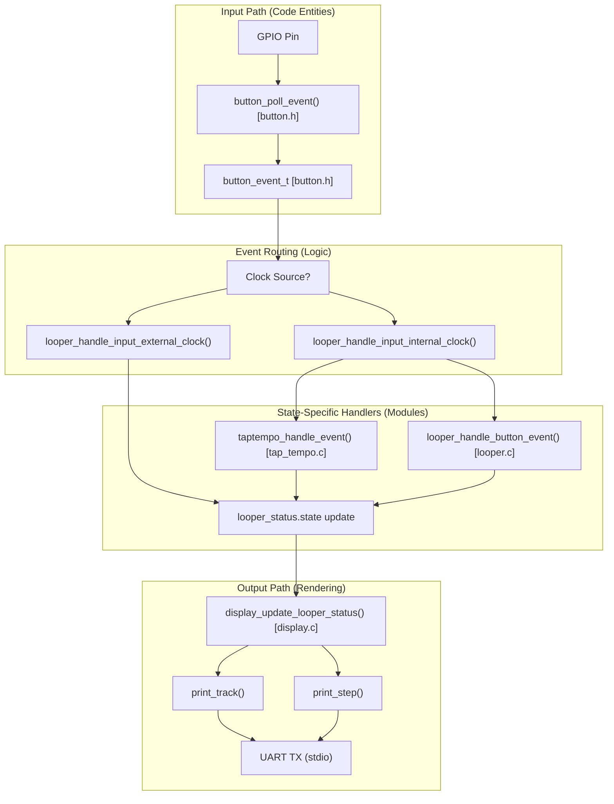
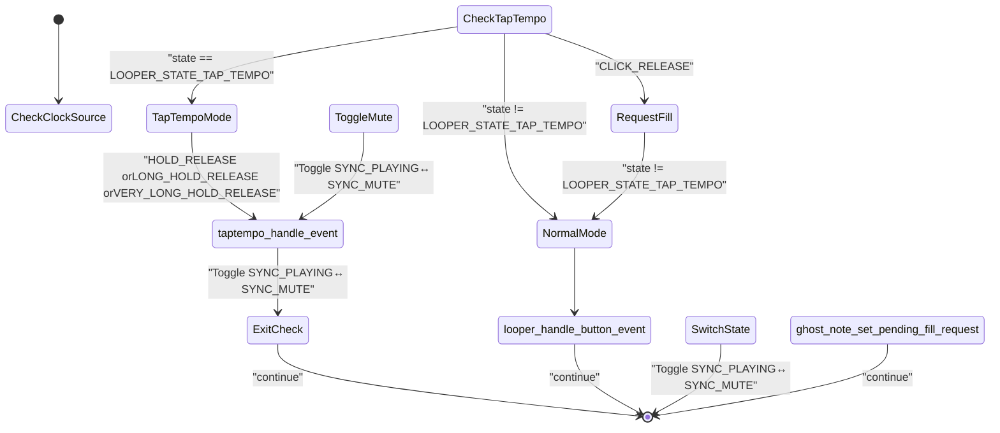
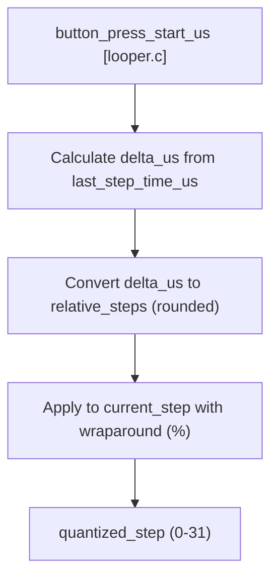

# User Interface

> **Relevant source files**
> * [button.h](https://github.com/Jus-Be/orinayo-pico/blob/6dde5a75/button.h)
> * [display.c](https://github.com/Jus-Be/orinayo-pico/blob/6dde5a75/display.c)
> * [display.h](https://github.com/Jus-Be/orinayo-pico/blob/6dde5a75/display.h)
> * [tap_tempo.c](https://github.com/Jus-Be/orinayo-pico/blob/6dde5a75/tap_tempo.c)
> * [tap_tempo.h](https://github.com/Jus-Be/orinayo-pico/blob/6dde5a75/tap_tempo.h)

## Purpose and Scope

This document describes the user interface systems in the Orinayo firmware. The interface consists of two primary components: a physical button input system for controlling the looper, and a UART-based text display for visualizing looper status. For detailed information about button event detection and state machine logic, see [Button Input](./7.1-button-input.md). For display rendering implementation and ANSI formatting, see [Status Display](./7.2-status-display.md).

The interface is intentionally minimal, designed for real-time musical performance with a single physical button and serial console feedback. All button interactions are interpreted contextually based on the current looper state and clock source.

Sources: [display.c L1-L111](https://github.com/Jus-Be/orinayo-pico/blob/6dde5a75/display.c#L1-L111)

 [button.h L1-L23](https://github.com/Jus-Be/orinayo-pico/blob/6dde5a75/button.h#L1-L23)

 [tap_tempo.c L1-L113](https://github.com/Jus-Be/orinayo-pico/blob/6dde5a75/tap_tempo.c#L1-L113)

## System Architecture

The user interface operates as a bidirectional feedback system: button events flow into the application to modify state, while the display system continuously renders that state to the UART console.

```mermaid
flowchart TD

GPIO["GPIO Pin"]
ButtonPoll["button_poll_event() [button.h]"]
EventType["button_event_t [button.h]"]
ClockCheck["Clock Source?"]
InternalHandler["looper_handle_input_internal_clock()"]
ExternalHandler["looper_handle_input_external_clock()"]
TapTempo["taptempo_handle_event() [tap_tempo.c]"]
LooperHandler["looper_handle_button_event() [looper.c]"]
StateUpdate["looper_status.state update"]
DisplayUpdate["display_update_looper_status() [display.c]"]
TrackRender["print_track()"]
StepRender["print_step()"]
UART["UART TX (stdio)"]

EventType --> ClockCheck
InternalHandler --> TapTempo
InternalHandler --> LooperHandler
ExternalHandler --> StateUpdate
StateUpdate --> DisplayUpdate

subgraph subGraph3 ["Output Path (Rendering)"]
    DisplayUpdate
    TrackRender
    StepRender
    UART
    DisplayUpdate --> TrackRender
    DisplayUpdate --> StepRender
    TrackRender --> UART
    StepRender --> UART
end

subgraph subGraph2 ["State-Specific Handlers (Modules)"]
    TapTempo
    LooperHandler
    StateUpdate
    TapTempo --> StateUpdate
    LooperHandler --> StateUpdate
end

subgraph subGraph1 ["Event Routing (Logic)"]
    ClockCheck
    InternalHandler
    ExternalHandler
    ClockCheck --> InternalHandler
    ClockCheck --> ExternalHandler
end

subgraph subGraph0 ["Input Path (Code Entities)"]
    GPIO
    ButtonPoll
    EventType
    GPIO --> ButtonPoll
    ButtonPoll --> EventType
end
```

**Figure 1: User Interface Data Flow and Code Entities**

The input path begins with GPIO hardware and produces typed button events via `button_poll_event()` [button.h L22](https://github.com/Jus-Be/orinayo-pico/blob/6dde5a75/button.h#L22-L22)

 These events are routed through different handlers depending on whether the system is using internal or external MIDI clock. The output path renders the current looper state, including all track patterns and the current step position, to the UART console at 115200 baud using `display_update_looper_status()` [display.c L76-L110](https://github.com/Jus-Be/orinayo-pico/blob/6dde5a75/display.c#L76-L110)

Sources: [display.c L76-L110](https://github.com/Jus-Be/orinayo-pico/blob/6dde5a75/display.c#L76-L110)

 [button.h L22](https://github.com/Jus-Be/orinayo-pico/blob/6dde5a75/button.h#L22-L22)

## Button Event Types

The system recognizes several distinct button event types, classified by press duration and release timing in the `button_event_t` enum [button.h L10-L20](https://github.com/Jus-Be/orinayo-pico/blob/6dde5a75/button.h#L10-L20)

:

| Event Type | Trigger Condition | Typical Usage |
| --- | --- | --- |
| `BUTTON_EVENT_CLICK_BEGIN` | Button press detected | Start timing, trigger preview note |
| `BUTTON_EVENT_CLICK_RELEASE` | Release before hold threshold | Record step at quantized position |
| `BUTTON_EVENT_HOLD_BEGIN` | Held ≥ 500ms | Begin hold sequence |
| `BUTTON_EVENT_HOLD_RELEASE` | Released after hold | Undo and switch track |
| `BUTTON_EVENT_LONG_HOLD_BEGIN` | Held ≥ 2 seconds | Long hold detected |
| `BUTTON_EVENT_LONG_HOLD_RELEASE` | Released after long hold | Enter tap tempo mode |
| `BUTTON_EVENT_VERY_LONG_HOLD_BEGIN` | Held ≥ 5 seconds | Very long hold detected |
| `BUTTON_EVENT_VERY_LONG_HOLD_RELEASE` | Released after very long hold | Clear all tracks |

**Table 1: Button Event Types and Meanings**

For details on how these durations are timed and debounced, see [Button Input](./7.1-button-input.md).

Sources: [button.h L10-L20](https://github.com/Jus-Be/orinayo-pico/blob/6dde5a75/button.h#L10-L20)

## Event Routing by Clock Mode

Button events are routed to different handlers depending on the current clock source. This bifurcation allows the system to provide appropriate behavior when synchronized to external MIDI clock versus operating autonomously.

```mermaid
stateDiagram-v2
    [*] --> CheckClockSource
    CheckTapTempo --> TapTempoMode : "state == LOOPER_STATE_TAP_TEMPO"
    CheckTapTempo --> NormalMode : "state != LOOPER_STATE_TAP_TEMPO"
    TapTempoMode --> taptempo_handle_event : "HOLD_RELEASE orLONG_HOLD_RELEASE orVERY_LONG_HOLD_RELEASE"
    taptempo_handle_event --> ExitCheck : "Toggle SYNC_PLAYING↔ SYNC_MUTE"
    ExitCheck --> [*] : "continue"
    NormalMode --> looper_handle_button_event
    looper_handle_button_event --> [*] : "continue"
    CheckTapTempo --> RequestFill : "CLICK_RELEASE"
    ToggleMute --> taptempo_handle_event : "Toggle SYNC_PLAYING↔ SYNC_MUTE"
    SwitchState --> [*] : "Toggle SYNC_PLAYING↔ SYNC_MUTE"
    RequestFill --> NormalMode : "state != LOOPER_STATE_TAP_TEMPO"
    ghost_note_set_pending_fill_request --> [*] : "continue"
```

**Figure 2: Clock-Dependent Event Routing State Machine**

When using internal clock, button events can trigger recording, track switching, tap tempo, and clearing operations. Under external clock, the interface is simplified to toggling mute state and requesting fill-in patterns via `ghost_note_set_pending_fill_request()`, since timing is controlled externally.

Sources: [tap_tempo.c L62-L109](https://github.com/Jus-Be/orinayo-pico/blob/6dde5a75/tap_tempo.c#L62-L109)

## Tap Tempo System

The tap tempo system allows users to set the BPM by clicking the button in rhythm. It is activated by a `BUTTON_EVENT_LONG_HOLD_RELEASE` [tap_tempo.c L6-L7](https://github.com/Jus-Be/orinayo-pico/blob/6dde5a75/tap_tempo.c#L6-L7)

* **BPM Calculation**: Uses `calc_bpm()` [tap_tempo.c L43-L59](https://github.com/Jus-Be/orinayo-pico/blob/6dde5a75/tap_tempo.c#L43-L59)  to convert microsecond intervals between taps into a BPM value between 40 and 240.
* **Averaging**: The system collects up to 4 taps (`TAP_MAX_TAPS`) [tap_tempo.c L25](https://github.com/Jus-Be/orinayo-pico/blob/6dde5a75/tap_tempo.c#L25-L25)  It provides a preliminary BPM after 2 taps and a final averaged BPM after 3 or 4 taps [tap_tempo.c L90-L101](https://github.com/Jus-Be/orinayo-pico/blob/6dde5a75/tap_tempo.c#L90-L101)
* **Timeout**: Resets to idle after 1 second of inactivity (`TIMEOUT_US`) [tap_tempo.c L26](https://github.com/Jus-Be/orinayo-pico/blob/6dde5a75/tap_tempo.c#L26-L26)

For details on the tap tempo state machine, see [Button Input](./7.1-button-input.md).

Sources: [tap_tempo.c L22-L59](https://github.com/Jus-Be/orinayo-pico/blob/6dde5a75/tap_tempo.c#L22-L59)

 [tap_tempo.c L62-L109](https://github.com/Jus-Be/orinayo-pico/blob/6dde5a75/tap_tempo.c#L62-L109)

## Display System Overview

The display system renders looper status to a UART serial console at 115200 baud. Output is generated by `display_update_looper_status()` [display.c L76-L110](https://github.com/Jus-Be/orinayo-pico/blob/6dde5a75/display.c#L76-L110)

 which is called once per step from the looper processing logic.

### Display Format and Symbols

The display uses ASCII characters and ANSI escape codes [display.c L18-L36](https://github.com/Jus-Be/orinayo-pico/blob/6dde5a75/display.c#L18-L36)

 to represent the sequencer grid and track states.

| Symbol | Meaning | Code Reference |
| --- | --- | --- |
| `*` | User-programmed note | [display.c L53](https://github.com/Jus-Be/orinayo-pico/blob/6dde5a75/display.c#L53-L53) |
| `+` | Fill-in pattern note | [display.c L55](https://github.com/Jus-Be/orinayo-pico/blob/6dde5a75/display.c#L55-L55) |
| `.` | Ghost note (algorithmic) | [display.c L57](https://github.com/Jus-Be/orinayo-pico/blob/6dde5a75/display.c#L57-L57) |
| `_` | Empty step | [display.c L59](https://github.com/Jus-Be/orinayo-pico/blob/6dde5a75/display.c#L59-L59) |
| `^` | Current playback position | [display.c L68](https://github.com/Jus-Be/orinayo-pico/blob/6dde5a75/display.c#L68-L68) |
| `>` | Currently selected track | [display.c L41](https://github.com/Jus-Be/orinayo-pico/blob/6dde5a75/display.c#L41-L41) |

**Table 2: UI Symbols and Indicators**

The display logic in `print_track()` [display.c L39-L62](https://github.com/Jus-Be/orinayo-pico/blob/6dde5a75/display.c#L39-L62)

 determines if a ghost note should be visible by calculating its probability against a random sample, multiplied by the global `ghost_intensity` parameter [display.c L48-L50](https://github.com/Jus-Be/orinayo-pico/blob/6dde5a75/display.c#L48-L50)

For details on ANSI rendering and track ordering, see [Status Display](./7.2-status-display.md).

Sources: [display.c L39-L73](https://github.com/Jus-Be/orinayo-pico/blob/6dde5a75/display.c#L39-L73)

 [display.c L76-L110](https://github.com/Jus-Be/orinayo-pico/blob/6dde5a75/display.c#L76-L110)

## Step Quantization Algorithm

When recording a note via a button click, the system maps the physical press time to the nearest sequencer step using `looper_quantize_step()` [looper.c L231-L243](https://github.com/Jus-Be/orinayo-pico/blob/6dde5a75/looper.c#L231-L243)

```mermaid
flowchart TD

Input["button_press_start_us [looper.c]"]
Delta["Calculate delta_us from last_step_time_us"]
Offset["Convert delta_us to relative_steps (rounded)"]
Final["Apply to current_step with wraparound (%)"]
Result["quantized_step (0-31)"]

Input --> Delta
Delta --> Offset
Offset --> Final
Final --> Result
```

**Figure 3: Quantization Data Flow**

This algorithm ensures that even if a user clicks slightly early or late, the note is recorded precisely on the 16th-note grid.

Sources: [looper.c L231-L243](https://github.com/Jus-Be/orinayo-pico/blob/6dde5a75/looper.c#L231-L243)