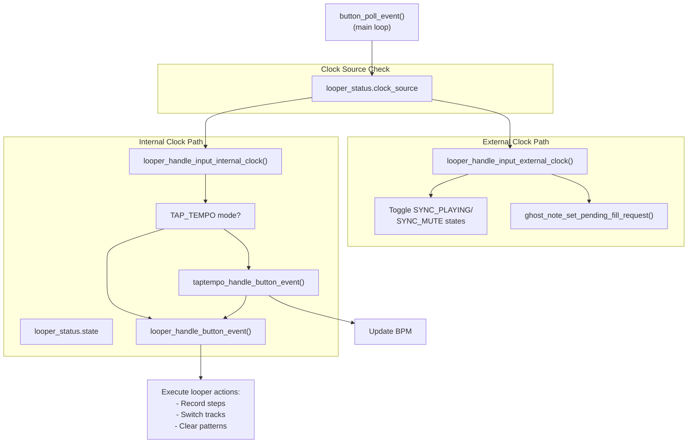
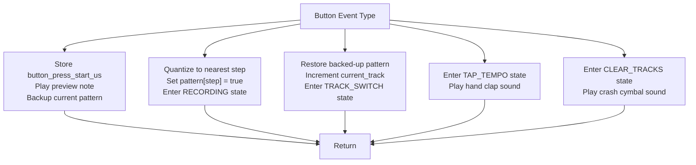
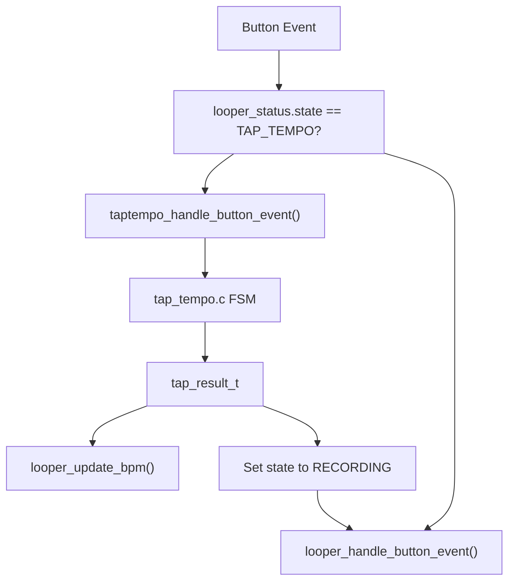
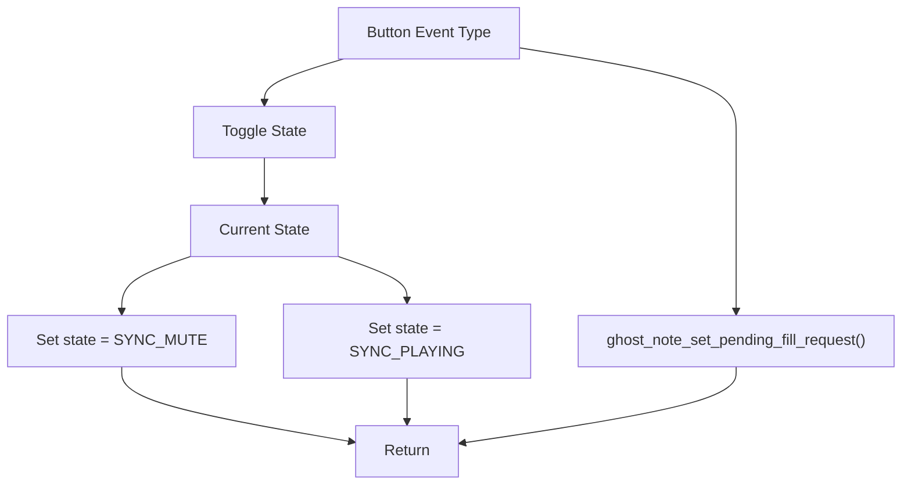
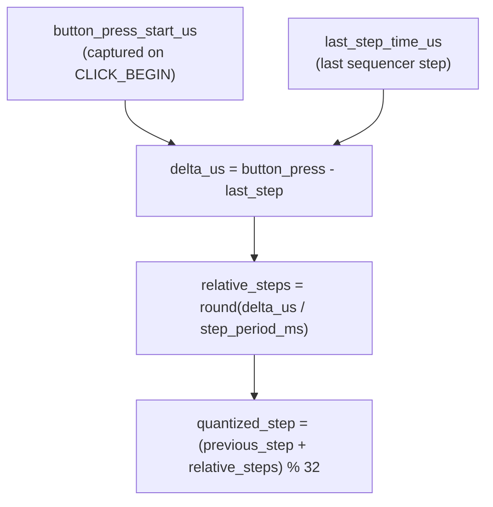

# Button Input

> **Relevant source files**
> * [button.h](https://github.com/Jus-Be/orinayo-pico/blob/122fa496/button.h)
> * [looper.c](https://github.com/Jus-Be/orinayo-pico/blob/122fa496/looper.c)
> * [tap_tempo.c](https://github.com/Jus-Be/orinayo-pico/blob/122fa496/tap_tempo.c)
> * [tap_tempo.h](https://github.com/Jus-Be/orinayo-pico/blob/122fa496/tap_tempo.h)

## Purpose and Scope

This document describes the physical button input system, including the button event type definitions, event state machine, and how different subsystems route and handle button events based on operational context. The button input system is the primary user interface for controlling the step sequencer.

For information about the step sequencer's internal state machine, see [Step Sequencer](./5.2-step-sequencer.md). For tap tempo detection algorithms, see [Tap Tempo](./5.6-tap-tempo.md).

---

## Button Event Types

The system defines nine distinct button event types based on press duration and release timing. These events are declared in [button.h L10-L20](https://github.com/Jus-Be/orinayo-pico/blob/122fa496/button.h#L10-L20)

 as the `button_event_t` enumeration.

| Event Type | Description | Typical Use |
| --- | --- | --- |
| `BUTTON_EVENT_NONE` | No button activity detected | Default/idle state |
| `BUTTON_EVENT_CLICK_BEGIN` | Button initially pressed | Start recording note timing |
| `BUTTON_EVENT_CLICK_RELEASE` | Button released quickly (< 500ms) | Record quantized note step |
| `BUTTON_EVENT_HOLD_BEGIN` | Button held ≥ 500ms | Visual feedback for long press |
| `BUTTON_EVENT_HOLD_RELEASE` | Button released after hold | Switch to next track (undo current) |
| `BUTTON_EVENT_LONG_HOLD_BEGIN` | Button held ≥ 2000ms | Visual feedback for very long press |
| `BUTTON_EVENT_LONG_HOLD_RELEASE` | Button released after 2s hold | Enter tap tempo mode |
| `BUTTON_EVENT_VERY_LONG_HOLD_BEGIN` | Button held ≥ 5000ms | Visual feedback for clear operation |
| `BUTTON_EVENT_VERY_LONG_HOLD_RELEASE` | Button released after 5s hold | Clear all track patterns |

The event detection logic is implemented in `button_poll_event()` declared in [button.h L22](https://github.com/Jus-Be/orinayo-pico/blob/122fa496/button.h#L22-L22)

 which is called periodically from the main loop to convert GPIO pin states into semantic button events.

**Sources:** [button.h L10-L22](https://github.com/Jus-Be/orinayo-pico/blob/122fa496/button.h#L10-L22)

---

## Button Event State Machine

The button event generation follows a hierarchical state machine where longer press durations transition through multiple states. Each duration threshold triggers both a BEGIN event (for immediate feedback) and a RELEASE event (for action execution).

```css
#mermaid-lnbev3bmx3j{font-family:ui-sans-serif,-apple-system,system-ui,Segoe UI,Helvetica;font-size:16px;fill:#333;}@keyframes edge-animation-frame{from{stroke-dashoffset:0;}}@keyframes dash{to{stroke-dashoffset:0;}}#mermaid-lnbev3bmx3j .edge-animation-slow{stroke-dasharray:9,5!important;stroke-dashoffset:900;animation:dash 50s linear infinite;stroke-linecap:round;}#mermaid-lnbev3bmx3j .edge-animation-fast{stroke-dasharray:9,5!important;stroke-dashoffset:900;animation:dash 20s linear infinite;stroke-linecap:round;}#mermaid-lnbev3bmx3j .error-icon{fill:#dddddd;}#mermaid-lnbev3bmx3j .error-text{fill:#222222;stroke:#222222;}#mermaid-lnbev3bmx3j .edge-thickness-normal{stroke-width:1px;}#mermaid-lnbev3bmx3j .edge-thickness-thick{stroke-width:3.5px;}#mermaid-lnbev3bmx3j .edge-pattern-solid{stroke-dasharray:0;}#mermaid-lnbev3bmx3j .edge-thickness-invisible{stroke-width:0;fill:none;}#mermaid-lnbev3bmx3j .edge-pattern-dashed{stroke-dasharray:3;}#mermaid-lnbev3bmx3j .edge-pattern-dotted{stroke-dasharray:2;}#mermaid-lnbev3bmx3j .marker{fill:#999;stroke:#999;}#mermaid-lnbev3bmx3j .marker.cross{stroke:#999;}#mermaid-lnbev3bmx3j svg{font-family:ui-sans-serif,-apple-system,system-ui,Segoe UI,Helvetica;font-size:16px;}#mermaid-lnbev3bmx3j p{margin:0;}#mermaid-lnbev3bmx3j defs #statediagram-barbEnd{fill:#999;stroke:#999;}#mermaid-lnbev3bmx3j g.stateGroup text{fill:#dddddd;stroke:none;font-size:10px;}#mermaid-lnbev3bmx3j g.stateGroup text{fill:#333;stroke:none;font-size:10px;}#mermaid-lnbev3bmx3j g.stateGroup .state-title{font-weight:bolder;fill:#333;}#mermaid-lnbev3bmx3j g.stateGroup rect{fill:#ffffff;stroke:#dddddd;}#mermaid-lnbev3bmx3j g.stateGroup line{stroke:#999;stroke-width:1;}#mermaid-lnbev3bmx3j .transition{stroke:#999;stroke-width:1;fill:none;}#mermaid-lnbev3bmx3j .stateGroup .composit{fill:#f4f4f4;border-bottom:1px;}#mermaid-lnbev3bmx3j .stateGroup .alt-composit{fill:#e0e0e0;border-bottom:1px;}#mermaid-lnbev3bmx3j .state-note{stroke:#e6d280;fill:#fff5ad;}#mermaid-lnbev3bmx3j .state-note text{fill:#333;stroke:none;font-size:10px;}#mermaid-lnbev3bmx3j .stateLabel .box{stroke:none;stroke-width:0;fill:#ffffff;opacity:0.5;}#mermaid-lnbev3bmx3j .edgeLabel .label rect{fill:#ffffff;opacity:0.5;}#mermaid-lnbev3bmx3j .edgeLabel{background-color:#ffffff;text-align:center;}#mermaid-lnbev3bmx3j .edgeLabel p{background-color:#ffffff;}#mermaid-lnbev3bmx3j .edgeLabel rect{opacity:0.5;background-color:#ffffff;fill:#ffffff;}#mermaid-lnbev3bmx3j .edgeLabel .label text{fill:#333;}#mermaid-lnbev3bmx3j .label div .edgeLabel{color:#333;}#mermaid-lnbev3bmx3j .stateLabel text{fill:#333;font-size:10px;font-weight:bold;}#mermaid-lnbev3bmx3j .node circle.state-start{fill:#999;stroke:#999;}#mermaid-lnbev3bmx3j .node .fork-join{fill:#999;stroke:#999;}#mermaid-lnbev3bmx3j .node circle.state-end{fill:#dddddd;stroke:#f4f4f4;stroke-width:1.5;}#mermaid-lnbev3bmx3j .end-state-inner{fill:#f4f4f4;stroke-width:1.5;}#mermaid-lnbev3bmx3j .node rect{fill:#ffffff;stroke:#dddddd;stroke-width:1px;}#mermaid-lnbev3bmx3j .node polygon{fill:#ffffff;stroke:#dddddd;stroke-width:1px;}#mermaid-lnbev3bmx3j #statediagram-barbEnd{fill:#999;}#mermaid-lnbev3bmx3j .statediagram-cluster rect{fill:#ffffff;stroke:#dddddd;stroke-width:1px;}#mermaid-lnbev3bmx3j .cluster-label,#mermaid-lnbev3bmx3j .nodeLabel{color:#333;}#mermaid-lnbev3bmx3j .statediagram-cluster rect.outer{rx:5px;ry:5px;}#mermaid-lnbev3bmx3j .statediagram-state .divider{stroke:#dddddd;}#mermaid-lnbev3bmx3j .statediagram-state .title-state{rx:5px;ry:5px;}#mermaid-lnbev3bmx3j .statediagram-cluster.statediagram-cluster .inner{fill:#f4f4f4;}#mermaid-lnbev3bmx3j .statediagram-cluster.statediagram-cluster-alt .inner{fill:#f8f8f8;}#mermaid-lnbev3bmx3j .statediagram-cluster .inner{rx:0;ry:0;}#mermaid-lnbev3bmx3j .statediagram-state rect.basic{rx:5px;ry:5px;}#mermaid-lnbev3bmx3j .statediagram-state rect.divider{stroke-dasharray:10,10;fill:#f8f8f8;}#mermaid-lnbev3bmx3j .note-edge{stroke-dasharray:5;}#mermaid-lnbev3bmx3j .statediagram-note rect{fill:#fff5ad;stroke:#e6d280;stroke-width:1px;rx:0;ry:0;}#mermaid-lnbev3bmx3j .statediagram-note rect{fill:#fff5ad;stroke:#e6d280;stroke-width:1px;rx:0;ry:0;}#mermaid-lnbev3bmx3j .statediagram-note text{fill:#333;}#mermaid-lnbev3bmx3j .statediagram-note .nodeLabel{color:#333;}#mermaid-lnbev3bmx3j .statediagram .edgeLabel{color:red;}#mermaid-lnbev3bmx3j #dependencyStart,#mermaid-lnbev3bmx3j #dependencyEnd{fill:#999;stroke:#999;stroke-width:1;}#mermaid-lnbev3bmx3j .statediagramTitleText{text-anchor:middle;font-size:18px;fill:#333;}#mermaid-lnbev3bmx3j :root{--mermaid-font-family:"trebuchet ms",verdana,arial,sans-serif;}"No press""Press detected""Release < 500ms""Hold ≥ 500ms""Release < 2000ms""Hold ≥ 2000ms""Release < 5000ms""Hold ≥ 5000ms""Release ≥ 5000ms"IdleClickBeginClickReleaseHoldBeginHoldReleaseLongHoldBeginLongHoldReleaseVeryLongHoldBeginVeryLongHoldRelease
```

**Duration Thresholds:**

* **Short Press:** < 500ms → `BUTTON_EVENT_CLICK_RELEASE`
* **Hold:** 500ms - 2000ms → `BUTTON_EVENT_HOLD_RELEASE`
* **Long Hold:** 2000ms - 5000ms → `BUTTON_EVENT_LONG_HOLD_RELEASE`
* **Very Long Hold:** ≥ 5000ms → `BUTTON_EVENT_VERY_LONG_HOLD_RELEASE`

**Sources:** [button.h L10-L20](https://github.com/Jus-Be/orinayo-pico/blob/122fa496/button.h#L10-L20)

---

## Event Routing Architecture

Button events are routed to different handler functions based on the current clock source (internal vs. external) and the active operational mode. The routing logic ensures context-appropriate responses to user input.



**Key Routing Functions:**

* **[looper.c L495-L502](https://github.com/Jus-Be/orinayo-pico/blob/122fa496/looper.c#L495-L502)**: `looper_handle_input_internal_clock()` - Routes events when using internal clock, delegates to tap tempo when active
* **[looper.c L504-L514](https://github.com/Jus-Be/orinayo-pico/blob/122fa496/looper.c#L504-L514)**: `looper_handle_input_external_clock()` - Simplified handling for external MIDI clock sync
* **[looper.c L377-L420](https://github.com/Jus-Be/orinayo-pico/blob/122fa496/looper.c#L377-L420)**: `looper_handle_button_event()` - Core event handler for recording and track management
* **[looper.c L256-L270](https://github.com/Jus-Be/orinayo-pico/blob/122fa496/looper.c#L256-L270)**: `taptempo_handle_button_event()` - Wrapper that updates BPM from tap tempo results

**Sources:** [looper.c L377-L420](https://github.com/Jus-Be/orinayo-pico/blob/122fa496/looper.c#L377-L420)

 [looper.c L495-L514](https://github.com/Jus-Be/orinayo-pico/blob/122fa496/looper.c#L495-L514)

 [looper.c L256-L270](https://github.com/Jus-Be/orinayo-pico/blob/122fa496/looper.c#L256-L270)

---

## Internal Clock Mode Handling

When operating under internal clock (`LOOPER_CLOCK_INTERNAL`), button events support full pattern recording, track switching, and tap tempo functionality. The handling is implemented in [looper.c L495-L502](https://github.com/Jus-Be/orinayo-pico/blob/122fa496/looper.c#L495-L502)

### Recording and Playback Actions

The `looper_handle_button_event()` function at [looper.c L377-L420](https://github.com/Jus-Be/orinayo-pico/blob/122fa496/looper.c#L377-L420)

 implements the primary button logic:



**Implementation Details:**

1. **CLICK_BEGIN** [looper.c L381-L387](https://github.com/Jus-Be/orinayo-pico/blob/122fa496/looper.c#L381-L387) : * Captures microsecond timestamp in `looper_status.timing.button_press_start_us` * Immediately plays preview note via `looper_schedule_note_now()` * Backs up current pattern to `track->hold_pattern` for potential undo
2. **CLICK_RELEASE** [looper.c L388-L401](https://github.com/Jus-Be/orinayo-pico/blob/122fa496/looper.c#L388-L401) : * Calls `looper_quantize_step()` [looper.c L231-L243](https://github.com/Jus-Be/orinayo-pico/blob/122fa496/looper.c#L231-L243)  to convert button press timestamp to nearest 16th-note step * Sets `track->pattern[quantized_step] = true` * Enters `LOOPER_STATE_RECORDING` mode, clearing pattern on first note
3. **HOLD_RELEASE** [looper.c L402-L406](https://github.com/Jus-Be/orinayo-pico/blob/122fa496/looper.c#L402-L406) : * Restores `track->pattern` from `track->hold_pattern` (undo) * Advances to next track via modulo arithmetic * Transitions to `LOOPER_STATE_TRACK_SWITCH`
4. **LONG_HOLD_RELEASE** [looper.c L407-L411](https://github.com/Jus-Be/orinayo-pico/blob/122fa496/looper.c#L407-L411) : * Transitions to `LOOPER_STATE_TAP_TEMPO` * Plays hand clap (note 39) as audible confirmation
5. **VERY_LONG_HOLD_RELEASE** [looper.c L412-L416](https://github.com/Jus-Be/orinayo-pico/blob/122fa496/looper.c#L412-L416) : * Transitions to `LOOPER_STATE_CLEAR_TRACKS` * Plays crash cymbal (note 49) as audible confirmation

**Sources:** [looper.c L377-L420](https://github.com/Jus-Be/orinayo-pico/blob/122fa496/looper.c#L377-L420)

 [looper.c L231-L243](https://github.com/Jus-Be/orinayo-pico/blob/122fa496/looper.c#L231-L243)

### Tap Tempo Integration

When the looper state is `LOOPER_STATE_TAP_TEMPO`, button events are routed to the tap tempo subsystem via [looper.c L495-L502](https://github.com/Jus-Be/orinayo-pico/blob/122fa496/looper.c#L495-L502)

:



The `taptempo_handle_button_event()` function [looper.c L256-L270](https://github.com/Jus-Be/orinayo-pico/blob/122fa496/looper.c#L256-L270)

 wraps `taptempo_handle_event()` from [tap_tempo.c L62-L109](https://github.com/Jus-Be/orinayo-pico/blob/122fa496/tap_tempo.c#L62-L109)

 and interprets the tap results:

* **TAP_PRELIM** (2 taps): Provisional BPM estimate, updates immediately
* **TAP_FINAL** (3-4 taps): Refined BPM average, updates immediately
* **TAP_EXIT** (hold release): Exits tap tempo mode, returns to `LOOPER_STATE_RECORDING`

**Sources:** [looper.c L256-L270](https://github.com/Jus-Be/orinayo-pico/blob/122fa496/looper.c#L256-L270)

 [looper.c L495-L502](https://github.com/Jus-Be/orinayo-pico/blob/122fa496/looper.c#L495-L502)

 [tap_tempo.c L62-L109](https://github.com/Jus-Be/orinayo-pico/blob/122fa496/tap_tempo.c#L62-L109)

---

## External Clock Mode Handling

When synchronized to external MIDI clock (`LOOPER_CLOCK_EXTERNAL`), button handling is simplified to avoid conflicts with the external timing source. The implementation is in [looper.c L504-L514](https://github.com/Jus-Be/orinayo-pico/blob/122fa496/looper.c#L504-L514)

### Simplified Event Handling



**Key Differences from Internal Clock Mode:**

1. **No Pattern Recording**: Individual note steps cannot be recorded because timing is controlled externally
2. **Simplified State Toggle**: Hold releases (any duration) toggle between `LOOPER_STATE_SYNC_PLAYING` and `LOOPER_STATE_SYNC_MUTE`
3. **Fill Trigger**: Short clicks trigger `ghost_note_set_pending_fill_request()` to schedule algorithmic fill patterns
4. **No Tap Tempo**: Tempo is controlled by external MIDI clock messages

**Sources:** [looper.c L504-L514](https://github.com/Jus-Be/orinayo-pico/blob/122fa496/looper.c#L504-L514)

---

## Step Quantization

When a button is released during recording, the system quantizes the press timing to the nearest 16th-note step using the `looper_quantize_step()` function at [looper.c L231-L243](https://github.com/Jus-Be/orinayo-pico/blob/122fa496/looper.c#L231-L243)

### Quantization Algorithm



**Calculation Details:**

1. Compute time delta from last sequencer step [looper.c L234-L235](https://github.com/Jus-Be/orinayo-pico/blob/122fa496/looper.c#L234-L235) : ``` delta_us = button_press_start_us - last_step_time_us ```
2. Convert to step offset with rounding [looper.c L238-L239](https://github.com/Jus-Be/orinayo-pico/blob/122fa496/looper.c#L238-L239) : ``` relative_steps = round(delta_us / 1000 / step_period_ms) ```
3. Apply to previous step index with modulo wrap [looper.c L240-L241](https://github.com/Jus-Be/orinayo-pico/blob/122fa496/looper.c#L240-L241) : ``` quantized_step = (previous_step + relative_steps) % 32 ```

This ensures notes are always aligned to the 32-step grid (2 bars of 16th notes), providing tight rhythmic quantization.

**Sources:** [looper.c L231-L243](https://github.com/Jus-Be/orinayo-pico/blob/122fa496/looper.c#L231-L243)

---

## State-Dependent Behavior Summary

The following table summarizes how button events are interpreted based on the looper's current state:

| Looper State | Click Release | Hold Release | Long Hold Release | Very Long Hold Release |
| --- | --- | --- | --- | --- |
| **WAITING** | Start recording | Ignored | Enter tap tempo | Clear all patterns |
| **PLAYING** | Start recording | Switch track | Enter tap tempo | Clear all patterns |
| **RECORDING** | Add note step | Switch track (undo) | Enter tap tempo | Clear all patterns |
| **TAP_TEMPO** | Register tap | Exit mode → RECORDING | Exit mode → RECORDING | Exit mode → RECORDING |
| **SYNC_PLAYING** | Trigger fill | Toggle to SYNC_MUTE | Toggle to SYNC_MUTE | Toggle to SYNC_MUTE |
| **SYNC_MUTE** | Trigger fill | Toggle to SYNC_PLAYING | Toggle to SYNC_PLAYING | Toggle to SYNC_PLAYING |

**Key Insights:**

* Short clicks (< 500ms) are the primary recording mechanism in internal clock mode
* Hold gestures (≥ 500ms) perform non-destructive operations (track switching preserves data)
* Very long holds (≥ 5s) perform destructive operations (clearing patterns)
* External clock mode disables recording but enables mute/unmute toggling
* Tap tempo mode overrides normal button handling until explicitly exited

**Sources:** [looper.c L377-L420](https://github.com/Jus-Be/orinayo-pico/blob/122fa496/looper.c#L377-L420)

 [looper.c L495-L514](https://github.com/Jus-Be/orinayo-pico/blob/122fa496/looper.c#L495-L514)

 [tap_tempo.c L62-L109](https://github.com/Jus-Be/orinayo-pico/blob/122fa496/tap_tempo.c#L62-L109)

---

## Integration with Main Loop

Button events are generated by polling GPIO state in the main application loop. While the actual GPIO polling implementation is not shown in the provided files, the integration point is the `button_poll_event()` function declared in [button.h L22](https://github.com/Jus-Be/orinayo-pico/blob/122fa496/button.h#L22-L22)

The typical call pattern in the main loop would be:

1. Call `button_poll_event()` to detect current button state
2. Route event through clock-source-specific handler
3. Update looper state and perform requested actions
4. Continue to next iteration

This polling-based approach ensures button events are processed synchronously with other main loop activities, avoiding concurrency issues with the USB stack and MIDI output.

**Sources:** [button.h L22](https://github.com/Jus-Be/orinayo-pico/blob/122fa496/button.h#L22-L22)

 [looper.c L495-L514](https://github.com/Jus-Be/orinayo-pico/blob/122fa496/looper.c#L495-L514)