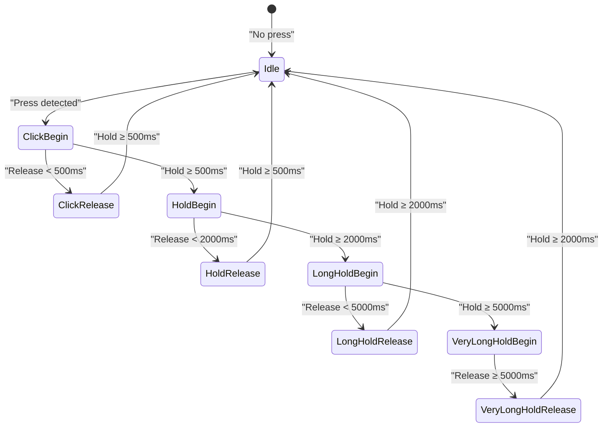
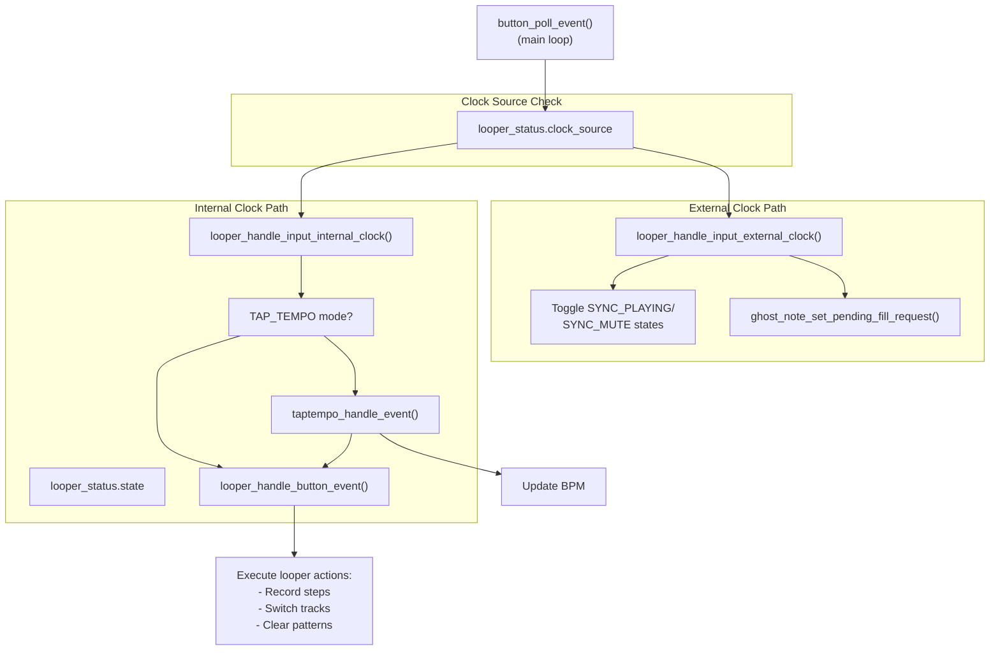
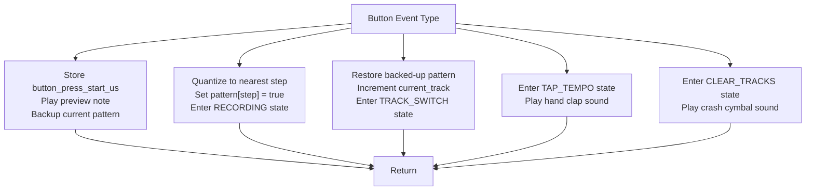
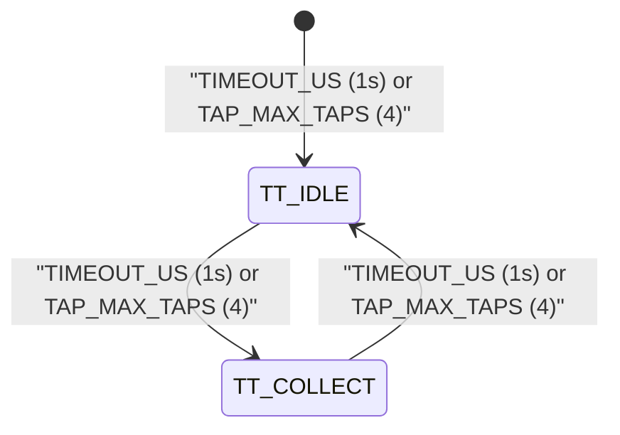
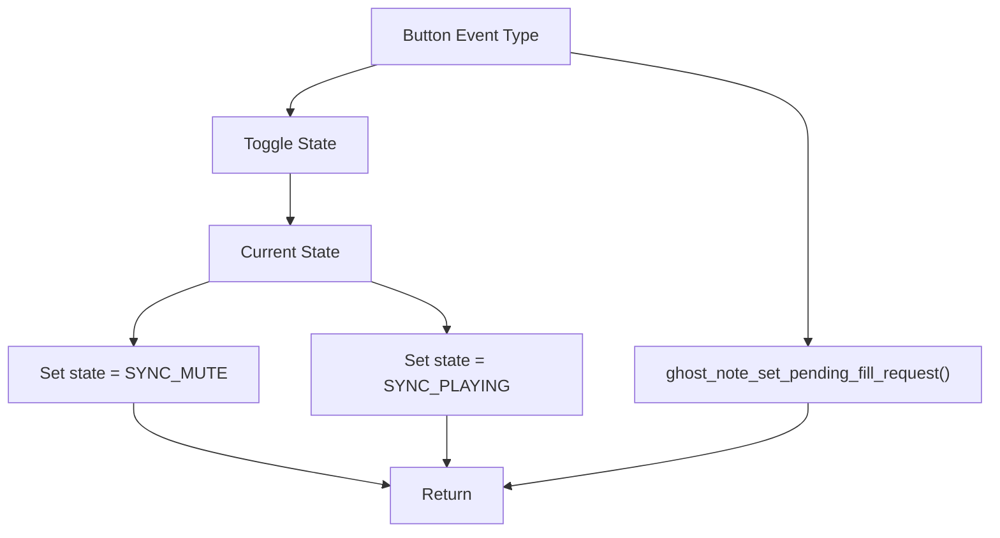
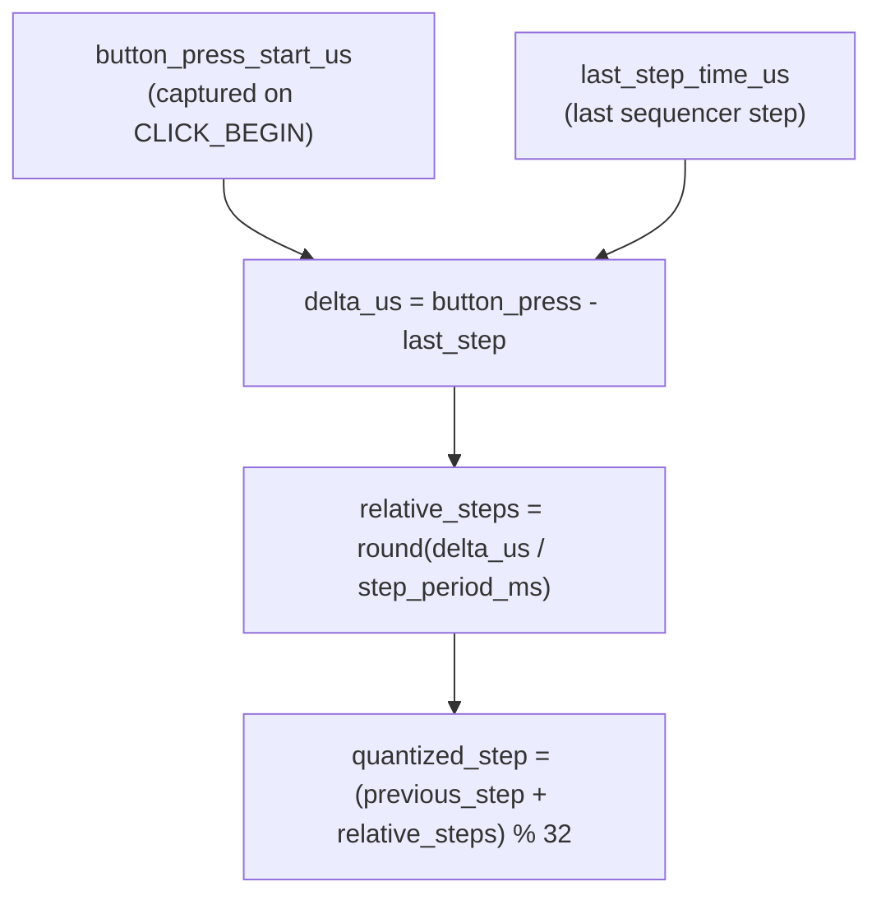

# Button Input

> **Relevant source files**
> * [button.h](https://github.com/Jus-Be/orinayo-pico/blob/6dde5a75/button.h)
> * [looper.c](https://github.com/Jus-Be/orinayo-pico/blob/6dde5a75/looper.c)
> * [tap_tempo.c](https://github.com/Jus-Be/orinayo-pico/blob/6dde5a75/tap_tempo.c)
> * [tap_tempo.h](https://github.com/Jus-Be/orinayo-pico/blob/6dde5a75/tap_tempo.h)

## Purpose and Scope

This document describes the physical button input system, including the button event type definitions, event state machine, and how different subsystems route and handle button events based on operational context. The button input system is the primary user interface for controlling the step sequencer and managing tempo.

For information about the step sequencer's internal state machine, see [Step Sequencer](./5.2-step-sequencer.md). For tap tempo detection algorithms, see [Tap Tempo](./5.6-tap-tempo.md).

---

## Button Event Types

The system defines nine distinct button event types based on press duration and release timing. These events are declared in [button.h L10-L20](https://github.com/Jus-Be/orinayo-pico/blob/6dde5a75/button.h#L10-L20)

 as the `button_event_t` enumeration.

| Event Type | Description | Typical Use |
| --- | --- | --- |
| `BUTTON_EVENT_NONE` | No button activity detected | Default/idle state |
| `BUTTON_EVENT_CLICK_BEGIN` | Button initially pressed | Start recording note timing |
| `BUTTON_EVENT_CLICK_RELEASE` | Button released quickly (< 500ms) | Record quantized note step |
| `BUTTON_EVENT_HOLD_BEGIN` | Button held ≥ 500ms | Visual feedback for long press |
| `BUTTON_EVENT_HOLD_RELEASE` | Button released after hold | Switch to next track (undo current) |
| `BUTTON_EVENT_LONG_HOLD_BEGIN` | Button held ≥ 2000ms | Visual feedback for very long press |
| `BUTTON_EVENT_LONG_HOLD_RELEASE` | Button released after 2s hold | Enter tap tempo mode |
| `BUTTON_EVENT_VERY_LONG_HOLD_BEGIN` | Button held ≥ 5000ms | Visual feedback for clear operation |
| `BUTTON_EVENT_VERY_LONG_HOLD_RELEASE` | Button released after 5s hold | Clear all track patterns |

The event detection logic is implemented in `button_poll_event()` declared in [button.h L22](https://github.com/Jus-Be/orinayo-pico/blob/6dde5a75/button.h#L22-L22)

 which is called periodically from the main loop to convert GPIO pin states into semantic button events.

**Sources:** [button.h L10-L22](https://github.com/Jus-Be/orinayo-pico/blob/6dde5a75/button.h#L10-L22)

---

## Button Event State Machine

The button event generation follows a hierarchical state machine where longer press durations transition through multiple states. Each duration threshold triggers both a BEGIN event (for immediate feedback) and a RELEASE event (for action execution).


```mermaid
stateDiagram-v2
    [*] --> Idle : "No press"
    Idle --> ClickBegin : "Press detected"
    ClickBegin --> ClickRelease : "Release < 500ms"
    ClickBegin --> HoldBegin : "Hold ≥ 500ms"
    HoldBegin --> HoldRelease : "Release < 2000ms"
    HoldBegin --> LongHoldBegin : "Hold ≥ 2000ms"
    LongHoldBegin --> LongHoldRelease : "Release < 5000ms"
    LongHoldBegin --> VeryLongHoldBegin : "Hold ≥ 5000ms"
    VeryLongHoldBegin --> VeryLongHoldRelease : "Release ≥ 5000ms"
    ClickRelease --> Idle : "Hold ≥ 500ms"
    HoldRelease --> Idle : "Hold ≥ 500ms"
    LongHoldRelease --> Idle : "Hold ≥ 2000ms"
    VeryLongHoldRelease --> Idle : "Hold ≥ 2000ms"
```

**Duration Thresholds:**

* **Short Press:** < 500ms → `BUTTON_EVENT_CLICK_RELEASE`
* **Hold:** 500ms - 2000ms → `BUTTON_EVENT_HOLD_RELEASE`
* **Long Hold:** 2000ms - 5000ms → `BUTTON_EVENT_LONG_HOLD_RELEASE`
* **Very Long Hold:** ≥ 5000ms → `BUTTON_EVENT_VERY_LONG_HOLD_RELEASE`

**Sources:** [button.h L10-L20](https://github.com/Jus-Be/orinayo-pico/blob/6dde5a75/button.h#L10-L20)

---

## Event Routing Architecture

Button events are routed to different handler functions based on the current clock source (internal vs. external) and the active operational mode. The routing logic ensures context-appropriate responses to user input.


```mermaid
flowchart TD

Poll["button_poll_event()<br>(main loop)"]
ClockSrc["looper_status.clock_source"]
IntHandler["looper_handle_input_internal_clock()"]
StateCheck["looper_status.state"]
TapMode["TAP_TEMPO mode?"]
TapHandler["taptempo_handle_event()"]
LooperHandler["looper_handle_button_event()"]
ExtHandler["looper_handle_input_external_clock()"]
ExtLogic["Toggle SYNC_PLAYING/<br>SYNC_MUTE states"]
FillLogic["ghost_note_set_pending_fill_request()"]
Update["Update BPM"]
Actions["Execute looper actions:<br>- Record steps<br>- Switch tracks<br>- Clear patterns"]

Poll --> ClockSrc
ClockSrc --> IntHandler
ClockSrc --> ExtHandler
TapHandler --> Update
LooperHandler --> Actions

subgraph subGraph2 ["External Clock Path"]
    ExtHandler
    ExtLogic
    FillLogic
    ExtHandler --> ExtLogic
    ExtHandler --> FillLogic
end

subgraph subGraph1 ["Internal Clock Path"]
    IntHandler
    StateCheck
    TapMode
    TapHandler
    LooperHandler
    IntHandler --> TapMode
    TapMode --> TapHandler
    TapMode --> LooperHandler
    TapHandler --> LooperHandler
end

subgraph subGraph0 ["Clock Source Check"]
    ClockSrc
end
```

**Key Routing Functions:**

* **[looper.c L495-L502](https://github.com/Jus-Be/orinayo-pico/blob/6dde5a75/looper.c#L495-L502)**: `looper_handle_input_internal_clock()` - Routes events when using internal clock, delegates to tap tempo when active.
* **[looper.c L504-L514](https://github.com/Jus-Be/orinayo-pico/blob/6dde5a75/looper.c#L504-L514)**: `looper_handle_input_external_clock()` - Simplified handling for external MIDI clock sync.
* **[looper.c L377-L420](https://github.com/Jus-Be/orinayo-pico/blob/6dde5a75/looper.c#L377-L420)**: `looper_handle_button_event()` - Core event handler for recording and track management.
* **[tap_tempo.c L62-L109](https://github.com/Jus-Be/orinayo-pico/blob/6dde5a75/tap_tempo.c#L62-L109)**: `taptempo_handle_event()` - Processes button events for tap tempo calculation.

**Sources:** [looper.c L377-L420](https://github.com/Jus-Be/orinayo-pico/blob/6dde5a75/looper.c#L377-L420)

 [looper.c L495-L514](https://github.com/Jus-Be/orinayo-pico/blob/6dde5a75/looper.c#L495-L514)

 [tap_tempo.c L62-L109](https://github.com/Jus-Be/orinayo-pico/blob/6dde5a75/tap_tempo.c#L62-L109)

---

## Internal Clock Mode Handling

When operating under internal clock (`LOOPER_CLOCK_INTERNAL`), button events support full pattern recording, track switching, and tap tempo functionality. The handling is implemented in [looper.c L495-L502](https://github.com/Jus-Be/orinayo-pico/blob/6dde5a75/looper.c#L495-L502)

### Recording and Playback Actions

The `looper_handle_button_event()` function at [looper.c L377-L420](https://github.com/Jus-Be/orinayo-pico/blob/6dde5a75/looper.c#L377-L420)

 implements the primary button logic:


```mermaid
flowchart TD

Event["Button Event Type"]
Begin["Store button_press_start_us<br>Play preview note<br>Backup current pattern"]
Record["Quantize to nearest step<br>Set pattern[step] = true<br>Enter RECORDING state"]
Undo["Restore backed-up pattern<br>Increment current_track<br>Enter TRACK_SWITCH state"]
Tap["Enter TAP_TEMPO state<br>Play hand clap sound"]
Clear["Enter CLEAR_TRACKS state<br>Play crash cymbal sound"]
Done["Return"]

Event --> Begin
Event --> Record
Event --> Undo
Event --> Tap
Event --> Clear
Begin --> Done
Record --> Done
Undo --> Done
Tap --> Done
Clear --> Done
```

**Implementation Details:**

1. **CLICK_BEGIN** [looper.c L381-L387](https://github.com/Jus-Be/orinayo-pico/blob/6dde5a75/looper.c#L381-L387) : * Captures microsecond timestamp in `looper_status.timing.button_press_start_us`. * Immediately plays preview note via `looper_schedule_note_now()`. * Backs up current pattern to `track->hold_pattern` for potential undo.
2. **CLICK_RELEASE** [looper.c L388-L401](https://github.com/Jus-Be/orinayo-pico/blob/6dde5a75/looper.c#L388-L401) : * Calls `looper_quantize_step()` [looper.c L231-L243](https://github.com/Jus-Be/orinayo-pico/blob/6dde5a75/looper.c#L231-L243)  to convert button press timestamp to nearest 16th-note step. * Sets `track->pattern[quantized_step] = true`. * Enters `LOOPER_STATE_RECORDING` mode, clearing pattern on first note.
3. **HOLD_RELEASE** [looper.c L402-L406](https://github.com/Jus-Be/orinayo-pico/blob/6dde5a75/looper.c#L402-L406) : * Restores `track->pattern` from `track->hold_pattern` (undo). * Advances to next track via modulo arithmetic. * Transitions to `LOOPER_STATE_TRACK_SWITCH`.
4. **LONG_HOLD_RELEASE** [looper.c L407-L411](https://github.com/Jus-Be/orinayo-pico/blob/6dde5a75/looper.c#L407-L411) : * Transitions to `LOOPER_STATE_TAP_TEMPO`. * Plays hand clap (note 39) as audible confirmation.
5. **VERY_LONG_HOLD_RELEASE** [looper.c L412-L416](https://github.com/Jus-Be/orinayo-pico/blob/6dde5a75/looper.c#L412-L416) : * Transitions to `LOOPER_STATE_CLEAR_TRACKS`. * Plays crash cymbal (note 49) as audible confirmation.

**Sources:** [looper.c L377-L420](https://github.com/Jus-Be/orinayo-pico/blob/6dde5a75/looper.c#L377-L420)

 [looper.c L231-L243](https://github.com/Jus-Be/orinayo-pico/blob/6dde5a75/looper.c#L231-L243)

---

## Tap Tempo Subsystem

The Tap Tempo system provides a dedicated FSM to calculate BPM based on button release timing. It is triggered by a `BUTTON_EVENT_LONG_HOLD_RELEASE` (≥ 2s) [tap_tempo.c L6-L7](https://github.com/Jus-Be/orinayo-pico/blob/6dde5a75/tap_tempo.c#L6-L7)

### Tap Tempo FSM

The FSM transitions between `TT_IDLE` and `TT_COLLECT` states [tap_tempo.c L29-L37](https://github.com/Jus-Be/orinayo-pico/blob/6dde5a75/tap_tempo.c#L29-L37)


```mermaid
stateDiagram-v2
    [*] --> TT_IDLE : "TIMEOUT_US (1s) or TAP_MAX_TAPS (4)"
    TT_IDLE --> TT_COLLECT : "TIMEOUT_US (1s) or TAP_MAX_TAPS (4)"
    TT_COLLECT --> TT_IDLE : "TIMEOUT_US (1s) or TAP_MAX_TAPS (4)"
```

### Integration Details

The `taptempo_handle_event()` function [tap_tempo.c L62-L109](https://github.com/Jus-Be/orinayo-pico/blob/6dde5a75/tap_tempo.c#L62-L109)

 processes events and returns a `tap_result_t` [tap_tempo.h L12-L17](https://github.com/Jus-Be/orinayo-pico/blob/6dde5a75/tap_tempo.h#L12-L17)

:

* **TAP_NONE**: Still collecting taps.
* **TAP_PRELIM**: 2 taps collected; provides provisional BPM [tap_tempo.c L94-L95](https://github.com/Jus-Be/orinayo-pico/blob/6dde5a75/tap_tempo.c#L94-L95)
* **TAP_FINAL**: 3 or 4 taps collected; provides averaged BPM and resets count [tap_tempo.c L96-L101](https://github.com/Jus-Be/orinayo-pico/blob/6dde5a75/tap_tempo.c#L96-L101)
* **TAP_EXIT**: User performed a hold-release to leave the mode [tap_tempo.c L69-L80](https://github.com/Jus-Be/orinayo-pico/blob/6dde5a75/tap_tempo.c#L69-L80)

The BPM calculation [tap_tempo.c L43-L59](https://github.com/Jus-Be/orinayo-pico/blob/6dde5a75/tap_tempo.c#L43-L59)

 uses integer math to convert microsecond intervals between `ctx.stamp[0]` and `ctx.stamp[count-1]` into a value between 40 and 240 BPM.

**Sources:** [tap_tempo.c L22-L109](https://github.com/Jus-Be/orinayo-pico/blob/6dde5a75/tap_tempo.c#L22-L109)

 [tap_tempo.h L12-L17](https://github.com/Jus-Be/orinayo-pico/blob/6dde5a75/tap_tempo.h#L12-L17)

---

## External Clock Mode Handling

When synchronized to external MIDI clock (`LOOPER_CLOCK_EXTERNAL`), button handling is simplified to avoid conflicts with the external timing source. The implementation is in [looper.c L504-L514](https://github.com/Jus-Be/orinayo-pico/blob/6dde5a75/looper.c#L504-L514)

### Simplified Event Handling


```mermaid
flowchart TD

Event["Button Event Type"]
Toggle["Toggle State"]
Fill["ghost_note_set_pending_fill_request()"]
StateCheck["Current State"]
Mute["Set state = SYNC_MUTE"]
Play["Set state = SYNC_PLAYING"]
Done["Return"]

Event --> Toggle
Event --> Fill
Toggle --> StateCheck
StateCheck --> Mute
StateCheck --> Play
Mute --> Done
Play --> Done
Fill --> Done
```

**Key Differences from Internal Clock Mode:**

1. **No Pattern Recording**: Individual note steps cannot be recorded because timing is controlled externally.
2. **Simplified State Toggle**: Hold releases (any duration) toggle between `LOOPER_STATE_SYNC_PLAYING` and `LOOPER_STATE_SYNC_MUTE`.
3. **Fill Trigger**: Short clicks trigger `ghost_note_set_pending_fill_request()` to schedule algorithmic fill patterns.
4. **No Tap Tempo**: Tempo is controlled by external MIDI clock messages.

**Sources:** [looper.c L504-L514](https://github.com/Jus-Be/orinayo-pico/blob/6dde5a75/looper.c#L504-L514)

---

## Step Quantization

When a button is released during recording, the system quantizes the press timing to the nearest 16th-note step using the `looper_quantize_step()` function at [looper.c L231-L243](https://github.com/Jus-Be/orinayo-pico/blob/6dde5a75/looper.c#L231-L243)

### Quantization Algorithm


```mermaid
flowchart TD

Input["button_press_start_us<br>(captured on CLICK_BEGIN)"]
Last["last_step_time_us<br>(last sequencer step)"]
Delta["delta_us = button_press - last_step"]
Convert["relative_steps = round(delta_us / step_period_ms)"]
Quantize["quantized_step = (previous_step + relative_steps) % 32"]

Input --> Delta
Last --> Delta
Delta --> Convert
Convert --> Quantize
```

**Calculation Details:**

1. Compute time delta from last sequencer step [looper.c L234-L235](https://github.com/Jus-Be/orinayo-pico/blob/6dde5a75/looper.c#L234-L235) : ``` delta_us = button_press_start_us - last_step_time_us ```
2. Convert to step offset with rounding [looper.c L238-L239](https://github.com/Jus-Be/orinayo-pico/blob/6dde5a75/looper.c#L238-L239) : ``` relative_steps = round(delta_us / 1000 / step_period_ms) ```
3. Apply to previous step index with modulo wrap [looper.c L240-L241](https://github.com/Jus-Be/orinayo-pico/blob/6dde5a75/looper.c#L240-L241) : ``` quantized_step = (previous_step + relative_steps) % 32 ```

This ensures notes are always aligned to the 32-step grid (2 bars of 16th notes), providing tight rhythmic quantization.

**Sources:** [looper.c L231-L243](https://github.com/Jus-Be/orinayo-pico/blob/6dde5a75/looper.c#L231-L243)

---

## State-Dependent Behavior Summary

The following table summarizes how button events are interpreted based on the looper's current state:

| Looper State | Click Release | Hold Release | Long Hold Release | Very Long Hold Release |
| --- | --- | --- | --- | --- |
| **WAITING** | Start recording | Ignored | Enter tap tempo | Clear all patterns |
| **PLAYING** | Start recording | Switch track | Enter tap tempo | Clear all patterns |
| **RECORDING** | Add note step | Switch track (undo) | Enter tap tempo | Clear all patterns |
| **TAP_TEMPO** | Register tap | Exit mode → RECORDING | Exit mode → RECORDING | Exit mode → RECORDING |
| **SYNC_PLAYING** | Trigger fill | Toggle to SYNC_MUTE | Toggle to SYNC_MUTE | Toggle to SYNC_MUTE |
| **SYNC_MUTE** | Trigger fill | Toggle to SYNC_PLAYING | Toggle to SYNC_PLAYING | Toggle to SYNC_PLAYING |

**Key Insights:**

* Short clicks (< 500ms) are the primary recording mechanism in internal clock mode.
* Hold gestures (≥ 500ms) perform non-destructive operations (track switching preserves data).
* Very long holds (≥ 5s) perform destructive operations (clearing patterns).
* External clock mode disables recording but enables mute/unmute toggling.
* Tap tempo mode overrides normal button handling until explicitly exited.

**Sources:** [looper.c L377-L420](https://github.com/Jus-Be/orinayo-pico/blob/6dde5a75/looper.c#L377-L420)

 [looper.c L495-L514](https://github.com/Jus-Be/orinayo-pico/blob/6dde5a75/looper.c#L495-L514)

 [tap_tempo.c L62-L109](https://github.com/Jus-Be/orinayo-pico/blob/6dde5a75/tap_tempo.c#L62-L109)

---

## Integration with Main Loop

Button events are generated by polling GPIO state in the main application loop. The integration point is the `button_poll_event()` function declared in [button.h L22](https://github.com/Jus-Be/orinayo-pico/blob/6dde5a75/button.h#L22-L22)

The typical call pattern in the main loop would be:

1. Call `button_poll_event()` to detect current button state.
2. Route event through clock-source-specific handler (e.g., `looper_handle_input_internal_clock`).
3. Update looper state and perform requested actions.
4. Continue to next iteration.

This polling-based approach ensures button events are processed synchronously with other main loop activities, avoiding concurrency issues with the USB stack and MIDI output.

**Sources:** [button.h L22](https://github.com/Jus-Be/orinayo-pico/blob/6dde5a75/button.h#L22-L22)

 [looper.c L495-L514](https://github.com/Jus-Be/orinayo-pico/blob/6dde5a75/looper.c#L495-L514)