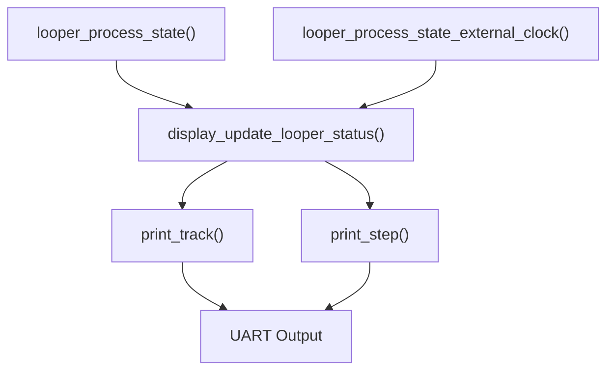
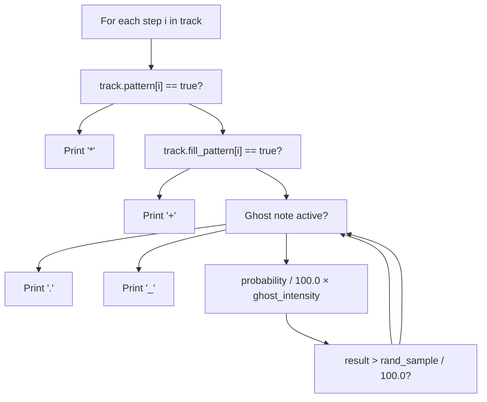
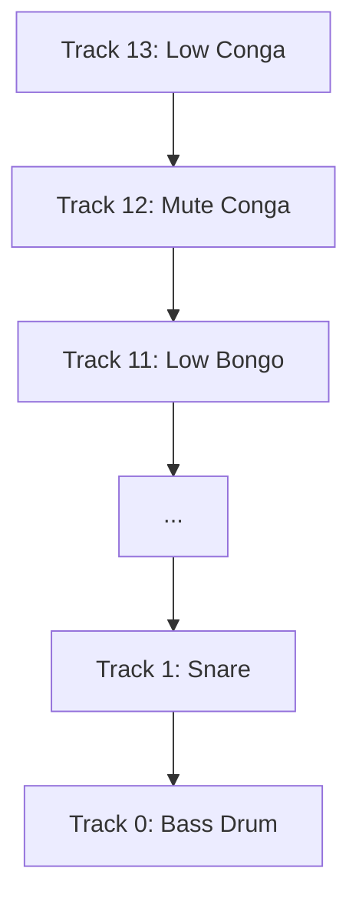

# Status Display

> **Relevant source files**
> * [display.c](https://github.com/Jus-Be/orinayo-pico/blob/122fa496/display.c)
> * [display.h](https://github.com/Jus-Be/orinayo-pico/blob/122fa496/display.h)
> * [ghost_note.c](https://github.com/Jus-Be/orinayo-pico/blob/122fa496/ghost_note.c)
> * [ghost_note.h](https://github.com/Jus-Be/orinayo-pico/blob/122fa496/ghost_note.h)
> * [looper.c](https://github.com/Jus-Be/orinayo-pico/blob/122fa496/looper.c)
> * [note_scheduler.c](https://github.com/Jus-Be/orinayo-pico/blob/122fa496/note_scheduler.c)
> * [note_scheduler.h](https://github.com/Jus-Be/orinayo-pico/blob/122fa496/note_scheduler.h)

The Status Display system provides a real-time text-based user interface over UART that visualizes the looper's state, track patterns, and playback position. This console output enables users to monitor the step sequencer without external hardware displays.

For information about button input that controls these patterns, see [Button Input](./7.1-button-input.md). For the underlying looper state machine and pattern management, see [Step Sequencer](./5.2-step-sequencer.md).

---

## Purpose and Architecture

The status display system renders the looper's current state to a UART serial console at 115200 baud, refreshing on every step tick. The implementation resides in [display.c L1-L111](https://github.com/Jus-Be/orinayo-pico/blob/122fa496/display.c#L1-L111)

 and is invoked by the looper's main state machine.

### System Entry Point

The looper calls `display_update_looper_status()` on every step to refresh the display:

**Sources:** [looper.c L290](https://github.com/Jus-Be/orinayo-pico/blob/122fa496/looper.c#L290-L290)

 [looper.c L348](https://github.com/Jus-Be/orinayo-pico/blob/122fa496/looper.c#L348-L348)



**Sources:** [display.c L10-L11](https://github.com/Jus-Be/orinayo-pico/blob/122fa496/display.c#L10-L11)

 [display.c L76-L110](https://github.com/Jus-Be/orinayo-pico/blob/122fa496/display.c#L76-L110)

 [looper.c L288-L344](https://github.com/Jus-Be/orinayo-pico/blob/122fa496/looper.c#L288-L344)

---

## Display Format

The display renders a grid showing 14 drum tracks across 32 sixteenth-note steps (2 bars). Each refresh cycle outputs the complete status in a standardized format.

### Status Header

```
#state PLAYING
#bpm 120
#grid                  1   2   3   4   5   6   7   8
```

The header shows:

* **State**: Current looper state (WAITING, PLAYING, RECORDING, TAP TEMPO, MUTE)
* **BPM**: Current tempo
* **Grid**: Bar numbers (8 bars = 32 steps)

**Sources:** [display.c L78-L103](https://github.com/Jus-Be/orinayo-pico/blob/122fa496/display.c#L78-L103)

### Track Representation

Each track is rendered as a row with the following format:

```
#track N > Track_Name  ________________________________
#track N _ Track_Name  *___.*__.+_______________________
```

| Element | Symbol | Meaning |
| --- | --- | --- |
| Track selector | `>` | Currently selected track for recording |
| Track selector | `_` | Not selected |
| User note | `*` | Pattern step set by user input |
| Ghost note | `.` | Algorithmically generated ghost note |
| Fill note | `+` | Fill-in pattern note |
| Empty step | `_` | No note scheduled |

**Sources:** [display.c L39-L62](https://github.com/Jus-Be/orinayo-pico/blob/122fa496/display.c#L39-L62)

### Step Position Indicator

```
#step                  ^_______________________________
```

The `^` character marks the current playback position (0-31 steps).

**Sources:** [display.c L64-L73](https://github.com/Jus-Be/orinayo-pico/blob/122fa496/display.c#L64-L73)

---

## Pattern Symbol Logic

The display distinguishes between three types of notes using conditional logic that evaluates pattern data and ghost note parameters.



**Sources:** [display.c L46-L59](https://github.com/Jus-Be/orinayo-pico/blob/122fa496/display.c#L46-L59)

 [ghost_note.c L21-L27](https://github.com/Jus-Be/orinayo-pico/blob/122fa496/ghost_note.c#L21-L27)

### Ghost Note Calculation

Ghost notes are displayed when the following condition is met:

```
bool ghost_on = 
    ((float)track->ghost_notes[i].probability / 100.0f) * params->ghost_intensity >
    (float)track->ghost_notes[i].rand_sample / 100.0f;
```

This compares the ghost note's probability (scaled by `ghost_intensity`) against a stored random sample to determine if the ghost note is active for the current step.

**Sources:** [display.c L48-L50](https://github.com/Jus-Be/orinayo-pico/blob/122fa496/display.c#L48-L50)

---

## State Display Mapping

The `display_update_looper_status()` function maps looper state machine values to human-readable labels:

| Looper State | Display Label | Meaning |
| --- | --- | --- |
| `LOOPER_STATE_WAITING` | WAITING | Waiting for MIDI output to become ready |
| `LOOPER_STATE_PLAYING` | PLAYING | Active playback |
| `LOOPER_STATE_RECORDING` | RECORDING | Recording user input |
| `LOOPER_STATE_TAP_TEMPO` | TAP TEMPO | Tap tempo detection mode |
| `LOOPER_STATE_SYNC_PLAYING` | PLAYING | External MIDI clock playback |
| `LOOPER_STATE_SYNC_MUTE` | MUTE | External clock active but muted |
| `LOOPER_STATE_TRACK_SWITCH` | PLAYING | Track switching (transient) |
| `LOOPER_STATE_CLEAR_TRACKS` | PLAYING | Clearing tracks (transient) |

**Sources:** [display.c L78-L98](https://github.com/Jus-Be/orinayo-pico/blob/122fa496/display.c#L78-L98)

---

## Track Display Order

Tracks are rendered in reverse order (highest index first) to match the visual layout of typical drum machines, with cymbals at the top and kick/snare at the bottom:



**Sources:** [display.c L106-L107](https://github.com/Jus-Be/orinayo-pico/blob/122fa496/display.c#L106-L107)

The loop structure:

```
for (int8_t i = num_tracks - 1; i >= 0; i--)
    print_track(&tracks[i], i, i == looper->current_track);
```

**Sources:** [display.c L106-L107](https://github.com/Jus-Be/orinayo-pico/blob/122fa496/display.c#L106-L107)

---

## ANSI Escape Codes

The display module defines ANSI escape sequences for terminal control, though most are currently unused in the active code paths:

| Macro | Escape Sequence | Purpose |
| --- | --- | --- |
| `ANSI_CLEAR_SCREEN` | `\x1b<FileRef file-url="https://github.com/Jus-Be/orinayo-pico/blob/122fa496/2J` | Clear entire screen |

---

## Data Flow

The display system operates in a read-only, polling-based model where it queries the looper state on every refresh:

```mermaid
sequenceDiagram
  participant Step Timer
  participant looper_process_state()
  participant display_update_looper_status()
  participant ghost_note_parameters()
  participant UART/stdio

  Step Timer->>looper_process_state(): "Tick event"
  looper_process_state()->>display_update_looper_status(): "display_update_looper_status(ready, status, tracks, 14)"
  display_update_looper_status()->>display_update_looper_status(): "Determine state label"
  display_update_looper_status()->>UART/stdio: "Print state, BPM, grid header"
  loop ["For each track (13 down to 0)"]
    display_update_looper_status()->>ghost_note_parameters(): "ghost_note_parameters()"
    ghost_note_parameters()-->>display_update_looper_status(): "params struct"
    display_update_looper_status()->>display_update_looper_status(): "Evaluate note symbols"
    display_update_looper_status()->>UART/stdio: "Print track row"
  end
  display_update_looper_status()->>UART/stdio: "Print step indicator"
  display_update_looper_status()->>UART/stdio: "fflush(stdout)"
```

**Sources:** [display.c L76-L110](https://github.com/Jus-Be/orinayo-pico/blob/122fa496/display.c#L76-L110)

 [looper.c L288-L344](https://github.com/Jus-Be/orinayo-pico/blob/122fa496/looper.c#L288-L344)

---

## Integration Points

### Looper Integration

The display is called from two looper state processing functions:

1. **Internal Clock Mode**: [looper.c L288](https://github.com/Jus-Be/orinayo-pico/blob/122fa496/looper.c#L288-L288)  in `looper_process_state()`
2. **External Clock Mode**: [looper.c L346](https://github.com/Jus-Be/orinayo-pico/blob/122fa496/looper.c#L346-L346)  in `looper_process_state_external_clock()`

Both pass identical parameters:

* `bool ready`: MIDI output connection status
* `looper_status_t *looper`: Current looper state
* `track_t *tracks`: Array of 14 track structures
* `size_t num_tracks`: Track count (always 14)

**Sources:** [looper.c L290](https://github.com/Jus-Be/orinayo-pico/blob/122fa496/looper.c#L290-L290)

 [looper.c L348](https://github.com/Jus-Be/orinayo-pico/blob/122fa496/looper.c#L348-L348)

### Ghost Note Integration

The display queries ghost note parameters to determine which notes should be visualized:

```
ghost_parameters_t *params = ghost_note_parameters();
bool ghost_on = 
    ((float)track->ghost_notes[i].probability / 100.0f) * params->ghost_intensity >
    (float)track->ghost_notes[i].rand_sample / 100.0f;
```

The `ghost_intensity` parameter acts as a global multiplier for all ghost note probabilities.

**Sources:** [display.c L45-L50](https://github.com/Jus-Be/orinayo-pico/blob/122fa496/display.c#L45-L50)

 [ghost_note.c L21-L29](https://github.com/Jus-Be/orinayo-pico/blob/122fa496/ghost_note.c#L21-L29)

---

## Output Mechanism

### UART Configuration

The display uses standard `printf()` calls that output to UART. The UART configuration is handled by the Pico SDK initialization, typically configured for 115200 baud.

**Sources:** [display.c L99-L110](https://github.com/Jus-Be/orinayo-pico/blob/122fa496/display.c#L99-L110)

### Flush Behavior

After printing all track data, the display explicitly flushes stdout to ensure immediate transmission:

```
fflush(stdout);
```

This guarantees that the complete display update is transmitted before the next step tick occurs.

**Sources:** [display.c L109](https://github.com/Jus-Be/orinayo-pico/blob/122fa496/display.c#L109-L109)

---

## Performance Considerations

### Update Frequency

The display refreshes on every sequencer step. At the default 120 BPM:

* Step period: 125ms (for 16th notes)
* Update rate: 8 Hz
* Characters per update: ~1000 (14 tracks × ~60 chars + headers)
* Bandwidth: ~8 KB/s

**Sources:** [looper.c L283](https://github.com/Jus-Be/orinayo-pico/blob/122fa496/looper.c#L283-L283)

### Processing Time

The display update is synchronous and blocks in the step processing function. At 115200 baud, transmitting ~1000 characters takes approximately 87ms, which is within the 125ms step period at 120 BPM but becomes tight at higher tempos.

---

## Data Structures

### Function Signature

```javascript
void display_update_looper_status(bool output_connected, 
                                  const looper_status_t *looper,
                                  const track_t *tracks, 
                                  size_t num_tracks);
```

**Sources:** [display.h L10-L11](https://github.com/Jus-Be/orinayo-pico/blob/122fa496/display.h#L10-L11)

### Input Dependencies

The display reads from:

* `looper_status_t`: Current step, state, BPM
* `track_t[]`: Pattern data, ghost notes, fill patterns, track names
* `ghost_parameters_t`: Ghost intensity for calculation

**Sources:** [display.c L76-L110](https://github.com/Jus-Be/orinayo-pico/blob/122fa496/display.c#L76-L110)

---

## Example Output

A typical display output with active patterns:

```go
#state PLAYING
#bpm 120
#grid                  1   2   3   4   5   6   7   8
#track 14 _ Low Conga   _____.*_________________.*______
#track 13 _ Mute Conga  ________*_______________________
#track 12 _ Low Bongo   ________________*_______________
#track 11 _ Hi Bongo    ________________________________
#track 10 _ Vibraslap   ________________________________
#track 9 _ Ride Cymbal  ________________________________
#track 8 _ Crash Cymbal ________________________________
#track 7 _ Hi Mid Tom   ________________________________
#track 6 _ Open Hi-hat  ________________________________
#track 5 _ Low Tom      ________________________________
#track 4 _ Low Floor Tom ________________________________
#track 3 _ Closed Hi-hat __.__.__.__.__.__.__.__.__.__.__.
#track 2 > Snare        ________*_______*_______________
#track 1 _ Bass         *_______*_______*_______*_______
#step                  ^_______________________________
```

In this example:

* Track 2 (Snare) is selected for recording (`>`)
* Bass drum has a four-on-the-floor pattern
* Closed hi-hat has ghost notes (`.`) filling the pattern
* Some tracks have fill notes (`+`) and user notes (`*`)

**Sources:** [display.c L39-L110](https://github.com/Jus-Be/orinayo-pico/blob/122fa496/display.c#L39-L110)