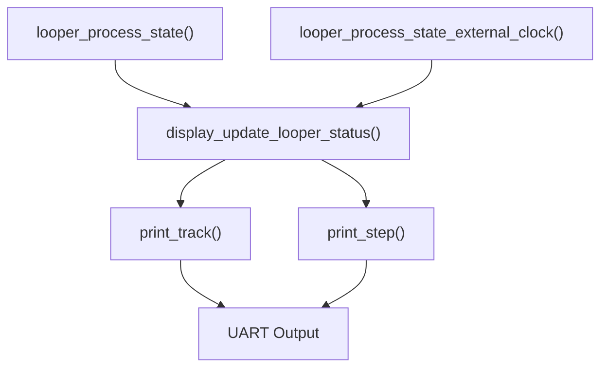
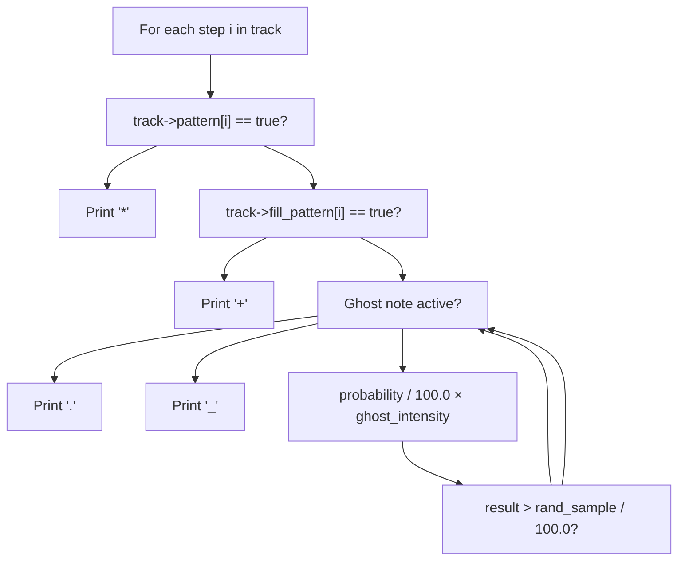
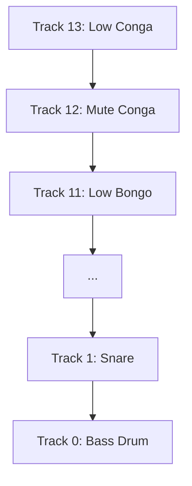

# Status Display

> **Relevant source files**
> * [display.c](https://github.com/Jus-Be/orinayo-pico/blob/6dde5a75/display.c)
> * [display.h](https://github.com/Jus-Be/orinayo-pico/blob/6dde5a75/display.h)
> * [ghost_note.c](https://github.com/Jus-Be/orinayo-pico/blob/6dde5a75/ghost_note.c)
> * [ghost_note.h](https://github.com/Jus-Be/orinayo-pico/blob/6dde5a75/ghost_note.h)
> * [looper.h](https://github.com/Jus-Be/orinayo-pico/blob/6dde5a75/looper.h)
> * [note_scheduler.c](https://github.com/Jus-Be/orinayo-pico/blob/6dde5a75/note_scheduler.c)
> * [note_scheduler.h](https://github.com/Jus-Be/orinayo-pico/blob/6dde5a75/note_scheduler.h)

The Status Display system provides a real-time text-based user interface over UART that visualizes the looper's state, track patterns, and playback position. This console output enables users to monitor the step sequencer without external hardware displays.

For information about button input that controls these patterns, see [Button Input](https://github.com/Jus-Be/orinayo-pico/blob/6dde5a75/Button Input)

(). For the underlying looper state machine and pattern management, see [Step Sequencer](https://github.com/Jus-Be/orinayo-pico/blob/6dde5a75/Step Sequencer)

().

---

## Purpose and Architecture

The status display system renders the looper's current state to a UART serial console at 115200 baud, refreshing on every step tick. The implementation resides in [display.c L1-L111](https://github.com/Jus-Be/orinayo-pico/blob/6dde5a75/display.c#L1-L111)

 and is invoked by the looper's main state machine.

### System Entry Point

The looper calls `display_update_looper_status()` on every step to refresh the display:


```mermaid
flowchart TD

A["looper_process_state()"]
B["display_update_looper_status()"]
C["looper_process_state_external_clock()"]
D["print_track()"]
E["print_step()"]
F["UART Output"]

A --> B
C --> B
B --> D
B --> E
D --> F
E --> F
```

**Sources:** [display.c L10-L11](https://github.com/Jus-Be/orinayo-pico/blob/6dde5a75/display.c#L10-L11)

 [display.c L76-L110](https://github.com/Jus-Be/orinayo-pico/blob/6dde5a75/display.c#L76-L110)

 [looper.h L85](https://github.com/Jus-Be/orinayo-pico/blob/6dde5a75/looper.h#L85-L85)

---

## Display Format

The display renders a grid showing 14 drum tracks across 32 sixteenth-note steps (2 bars). Each refresh cycle outputs the complete status in a standardized format.

### Status Header

```
#state PLAYING
#bpm 120
#grid                  1   2   3   4   5   6   7   8
```

The header shows:

* **State**: Current looper state (WAITING, PLAYING, RECORDING, TAP TEMPO, MUTE) [display.c L78-L98](https://github.com/Jus-Be/orinayo-pico/blob/6dde5a75/display.c#L78-L98)
* **BPM**: Current tempo [display.c L101](https://github.com/Jus-Be/orinayo-pico/blob/6dde5a75/display.c#L101-L101)
* **Grid**: Bar numbers (8 bars = 32 steps) [display.c L103](https://github.com/Jus-Be/orinayo-pico/blob/6dde5a75/display.c#L103-L103)

**Sources:** [display.c L78-L103](https://github.com/Jus-Be/orinayo-pico/blob/6dde5a75/display.c#L78-L103)

### Track Representation

Each track is rendered as a row with the following format:

```
#track N > Track_Name  ________________________________
#track N _ Track_Name  *___.*__.+_______________________
```

| Element | Symbol | Meaning |
| --- | --- | --- |
| Track selector | `>` | Currently selected track for recording [display.c L41](https://github.com/Jus-Be/orinayo-pico/blob/6dde5a75/display.c#L41-L41) |
| Track selector | `_` | Not selected [display.c L43](https://github.com/Jus-Be/orinayo-pico/blob/6dde5a75/display.c#L43-L43) |
| User note | `*` | Pattern step set by user input [display.c L53](https://github.com/Jus-Be/orinayo-pico/blob/6dde5a75/display.c#L53-L53) |
| Ghost note | `.` | Algorithmically generated ghost note [display.c L57](https://github.com/Jus-Be/orinayo-pico/blob/6dde5a75/display.c#L57-L57) |
| Fill note | `+` | Fill-in pattern note [display.c L55](https://github.com/Jus-Be/orinayo-pico/blob/6dde5a75/display.c#L55-L55) |
| Empty step | `_` | No note scheduled [display.c L59](https://github.com/Jus-Be/orinayo-pico/blob/6dde5a75/display.c#L59-L59) |

**Sources:** [display.c L39-L62](https://github.com/Jus-Be/orinayo-pico/blob/6dde5a75/display.c#L39-L62)

### Step Position Indicator

```
#step                  ^_______________________________
```

The `^` character marks the current playback position (0-31 steps).

**Sources:** [display.c L64-L73](https://github.com/Jus-Be/orinayo-pico/blob/6dde5a75/display.c#L64-L73)

---

## Pattern Symbol Logic

The display distinguishes between three types of notes using conditional logic that evaluates pattern data and ghost note parameters.


```mermaid
flowchart TD

A["For each step i in track"]
B["track->pattern[i] == true?"]
C["Print '*'"]
D["track->fill_pattern[i] == true?"]
E["Print '+'"]
F["Ghost note active?"]
G["Print '.'"]
H["Print '_'"]
I["probability / 100.0 × ghost_intensity"]
J["result > rand_sample / 100.0?"]

A --> B
B --> C
B --> D
D --> E
D --> F
F --> G
F --> H
F --> I
I --> J
J --> F
J --> F
```

**Sources:** [display.c L46-L59](https://github.com/Jus-Be/orinayo-pico/blob/6dde5a75/display.c#L46-L59)

 [ghost_note.c L21-L27](https://github.com/Jus-Be/orinayo-pico/blob/6dde5a75/ghost_note.c#L21-L27)

### Ghost Note Calculation

Ghost notes are displayed when the following condition is met:

```
bool ghost_on =     ((float)track->ghost_notes[i].probability / 100.0f) * params->ghost_intensity >    (float)track->ghost_notes[i].rand_sample / 100.0f;
```

This compares the ghost note's probability (scaled by `ghost_intensity`) against a stored random sample to determine if the ghost note is active for the current step.

**Sources:** [display.c L48-L50](https://github.com/Jus-Be/orinayo-pico/blob/6dde5a75/display.c#L48-L50)

---

## State Display Mapping

The `display_update_looper_status()` function maps looper state machine values to human-readable labels:

| Looper State | Display Label | Meaning |
| --- | --- | --- |
| `LOOPER_STATE_WAITING` | WAITING | Waiting for MIDI output to become ready [display.c L78](https://github.com/Jus-Be/orinayo-pico/blob/6dde5a75/display.c#L78-L78) |
| `LOOPER_STATE_PLAYING` | PLAYING | Active playback [display.c L81-L85](https://github.com/Jus-Be/orinayo-pico/blob/6dde5a75/display.c#L81-L85) |
| `LOOPER_STATE_RECORDING` | RECORDING | Recording user input [display.c L86-L88](https://github.com/Jus-Be/orinayo-pico/blob/6dde5a75/display.c#L86-L88) |
| `LOOPER_STATE_TAP_TEMPO` | TAP TEMPO | Tap tempo detection mode [display.c L89-L91](https://github.com/Jus-Be/orinayo-pico/blob/6dde5a75/display.c#L89-L91) |
| `LOOPER_STATE_SYNC_PLAYING` | PLAYING | External MIDI clock playback [display.c L83-L85](https://github.com/Jus-Be/orinayo-pico/blob/6dde5a75/display.c#L83-L85) |
| `LOOPER_STATE_SYNC_MUTE` | MUTE | External clock active but muted [display.c L92-L94](https://github.com/Jus-Be/orinayo-pico/blob/6dde5a75/display.c#L92-L94) |
| `LOOPER_STATE_TRACK_SWITCH` | PLAYING | Track switching (transient) [display.c L82-L85](https://github.com/Jus-Be/orinayo-pico/blob/6dde5a75/display.c#L82-L85) |

**Sources:** [display.c L78-L98](https://github.com/Jus-Be/orinayo-pico/blob/6dde5a75/display.c#L78-L98)

---

## Track Display Order

Tracks are rendered in reverse order (highest index first) to match the visual layout of typical drum machines, with cymbals at the top and kick/snare at the bottom:


```mermaid
flowchart TD

A["Track 13: Low Conga"]
B["Track 12: Mute Conga"]
C["Track 11: Low Bongo"]
D["..."]
E["Track 1: Snare"]
F["Track 0: Bass Drum"]

A --> B
B --> C
C --> D
D --> E
E --> F
```

**Sources:** [display.c L106-L107](https://github.com/Jus-Be/orinayo-pico/blob/6dde5a75/display.c#L106-L107)

The loop structure:

```
for (int8_t i = num_tracks - 1; i >= 0; i--)    print_track(&tracks[i], i, i == looper->current_track);
```

**Sources:** [display.c L106-L107](https://github.com/Jus-Be/orinayo-pico/blob/6dde5a75/display.c#L106-L107)

---

## ANSI Escape Codes

The display module defines ANSI escape sequences for terminal control, though most are currently unused in the active code paths:

| Macro | Escape Sequence | Purpose |
| --- | --- | --- |
| `ANSI_CLEAR_SCREEN` | `\x1b<FileRef file-url="https://github.com/Jus-Be/orinayo-pico/blob/6dde5a75/2J` | Clear entire screen [display.c#L28-L28" min=28  file-path="2J` |
| `ANSI_CURSOR_HOME` | `\x1b<FileRef file-url="https://github.com/Jus-Be/orinayo-pico/blob/6dde5a75/H` | Move cursor to top-left [display.c#L29-L29" min=29  file-path="H` |
| `ANSI_HIDE_CURSOR` | `\x1b<FileRef file-url="https://github.com/Jus-Be/orinayo-pico/blob/6dde5a75/?25l` | Hide cursor [display.c#L31-L31" min=31  file-path="?25l` |
| `ANSI_CLEAR_EOL` | `\x1b<FileRef file-url="https://github.com/Jus-Be/orinayo-pico/blob/6dde5a75/K` | Clear to end of line [display.c#L33-L33" min=33  file-path="K` |
| `ANSI_ENABLE_ALTSCREEN` | `\x1b<FileRef file-url="https://github.com/Jus-Be/orinayo-pico/blob/6dde5a75/?1049h` | Enable alternate screen buffer [display.c#L35-L35" min=35  file-path="?1049h` |
| `ANSI_DISABLE_ALTSCREEN` | `\x1b<FileRef file-url="https://github.com/Jus-Be/orinayo-pico/blob/6dde5a75/?1049l` | Disable alternate screen buffer [display.c#L36-L36" min=36  file-path="?1049l` |

These definitions suggest potential future enhancements for full-screen terminal UI with cursor positioning.

**Sources:** [display.c L18-L36](https://github.com/Jus-Be/orinayo-pico/blob/6dde5a75/display.c#L18-L36)

---

## Data Flow

The display system operates in a read-only, polling-based model where it queries the looper state on every refresh:

```mermaid
sequenceDiagram
  participant Step Timer
  participant looper_process_state()
  participant display_update_looper_status()
  participant ghost_note_parameters()
  participant UART/stdio

  Step Timer->>looper_process_state(): "Tick event"
  looper_process_state()->>display_update_looper_status(): "display_update_looper_status(ready, status, tracks, 14)"
  display_update_looper_status()->>display_update_looper_status(): "Determine state label"
  display_update_looper_status()->>UART/stdio: "Print state, BPM, grid header"
  loop ["For each track (13 down to 0)"]
    display_update_looper_status()->>ghost_note_parameters(): "ghost_note_parameters()"
    ghost_note_parameters()-->>display_update_looper_status(): "params struct"
    display_update_looper_status()->>display_update_looper_status(): "Evaluate note symbols"
    display_update_looper_status()->>UART/stdio: "Print track row"
  end
  display_update_looper_status()->>UART/stdio: "Print step indicator"
  display_update_looper_status()->>UART/stdio: "fflush(stdout)"
```

**Sources:** [display.c L76-L110](https://github.com/Jus-Be/orinayo-pico/blob/6dde5a75/display.c#L76-L110)

 [looper.h L85](https://github.com/Jus-Be/orinayo-pico/blob/6dde5a75/looper.h#L85-L85)

---

## Integration Points

### Looper Integration

The display is called from the looper's state processing function:

1. **Internal/External Clock Mode**: `display_update_looper_status()` is called within `looper_process_state()` [looper.h L85](https://github.com/Jus-Be/orinayo-pico/blob/6dde5a75/looper.h#L85-L85)

The function receives the following parameters:

* `bool output_connected`: MIDI output connection status
* `const looper_status_t *looper`: Current looper state, including `bpm`, `state`, `current_track`, and `current_step` [looper.h L49-L61](https://github.com/Jus-Be/orinayo-pico/blob/6dde5a75/looper.h#L49-L61)
* `const track_t *tracks`: Array of track structures, each containing `name`, `pattern`, `ghost_notes`, and `fill_pattern` [looper.h L70-L77](https://github.com/Jus-Be/orinayo-pico/blob/6dde5a75/looper.h#L70-L77)
* `size_t num_tracks`: The total number of tracks [looper.h L82](https://github.com/Jus-Be/orinayo-pico/blob/6dde5a75/looper.h#L82-L82)

**Sources:** [display.h L10-L11](https://github.com/Jus-Be/orinayo-pico/blob/6dde5a75/display.h#L10-L11)

 [looper.h L85](https://github.com/Jus-Be/orinayo-pico/blob/6dde5a75/looper.h#L85-L85)

### Ghost Note Integration

The display queries ghost note parameters to determine which notes should be visualized:

```
ghost_parameters_t *params = ghost_note_parameters();bool ghost_on =     ((float)track->ghost_notes[i].probability / 100.0f) * params->ghost_intensity >    (float)track->ghost_notes[i].rand_sample / 100.0f;
```

The `ghost_intensity` parameter acts as a global multiplier for all ghost note probabilities.

**Sources:** [display.c L45-L50](https://github.com/Jus-Be/orinayo-pico/blob/6dde5a75/display.c#L45-L50)

 [ghost_note.h L48](https://github.com/Jus-Be/orinayo-pico/blob/6dde5a75/ghost_note.h#L48-L48)

---

## Output Mechanism

### UART Configuration

The display uses standard `printf()` calls that output to UART. The UART configuration is handled by the Pico SDK initialization, typically configured for 115200 baud.

**Sources:** [display.c L99-L110](https://github.com/Jus-Be/orinayo-pico/blob/6dde5a75/display.c#L99-L110)

### Flush Behavior

After printing all track data, the display explicitly flushes stdout to ensure immediate transmission:

```
fflush(stdout);
```

This guarantees that the complete display update is transmitted before the next step tick occurs.

**Sources:** [display.c L109](https://github.com/Jus-Be/orinayo-pico/blob/6dde5a75/display.c#L109-L109)

---

## Performance Considerations

### Update Frequency

The display refreshes on every sequencer step. At the default 96 BPM [looper.h L12](https://github.com/Jus-Be/orinayo-pico/blob/6dde5a75/looper.h#L12-L12)

:

* Step period: 156.25ms (for 16th notes, `60000 / 96 / 4 = 156.25`)
* Update rate: ~6.4 Hz
* Characters per update: ~1000 (14 tracks × ~60 chars + headers)

**Sources:** [looper.h L12](https://github.com/Jus-Be/orinayo-pico/blob/6dde5a75/looper.h#L12-L12)

---

## Data Structures

### Function Signature

```javascript
void display_update_looper_status(bool output_connected,                                   const looper_status_t *looper,                                  const track_t *tracks,                                   size_t num_tracks);
```

**Sources:** [display.h L10-L11](https://github.com/Jus-Be/orinayo-pico/blob/6dde5a75/display.h#L10-L11)

### Input Dependencies

The display reads from:

* `looper_status_t`: Current step, state, BPM [looper.h L49-L61](https://github.com/Jus-Be/orinayo-pico/blob/6dde5a75/looper.h#L49-L61)
* `track_t[]`: Pattern data, ghost notes, fill patterns, track names [looper.h L70-L77](https://github.com/Jus-Be/orinayo-pico/blob/6dde5a75/looper.h#L70-L77)
* `ghost_parameters_t`: Ghost intensity for calculation [ghost_note.h L30-L36](https://github.com/Jus-Be/orinayo-pico/blob/6dde5a75/ghost_note.h#L30-L36)

**Sources:** [display.c L76-L110](https://github.com/Jus-Be/orinayo-pico/blob/6dde5a75/display.c#L76-L110)