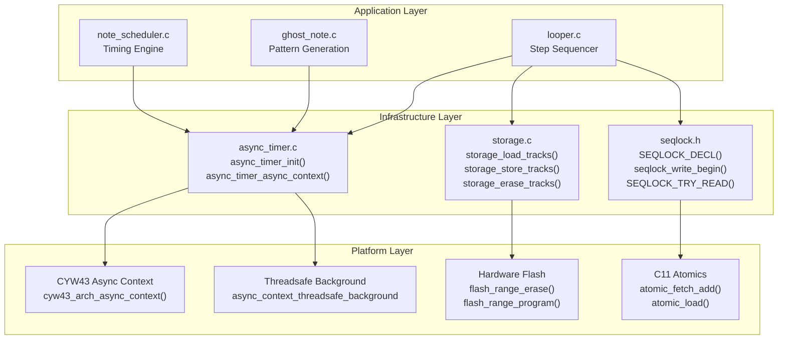
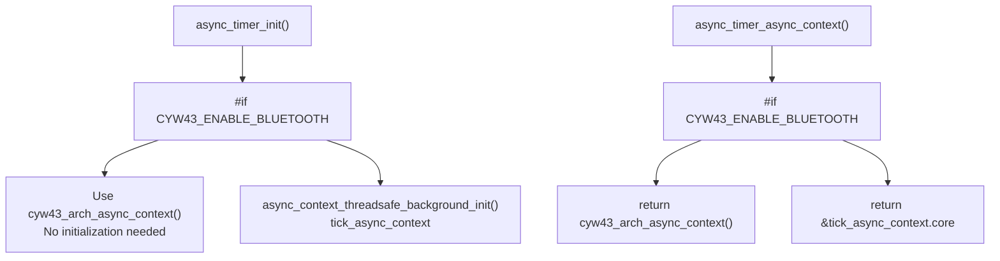
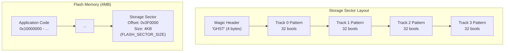
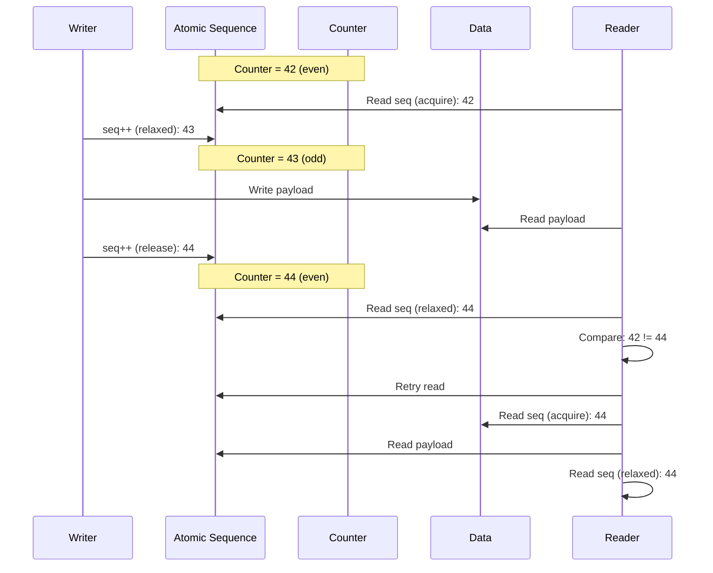
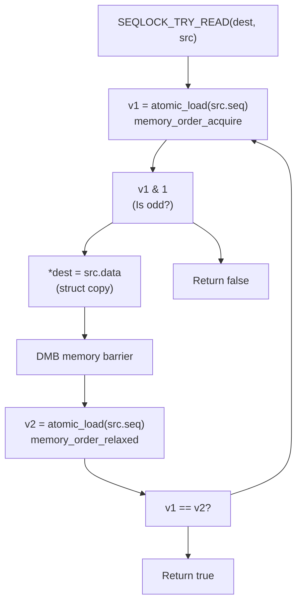
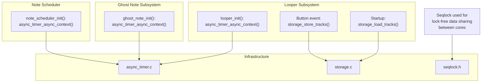

# Infrastructure

> **Relevant source files**
> * [async_timer.c](https://github.com/Jus-Be/orinayo-pico/blob/122fa496/async_timer.c)
> * [async_timer.h](https://github.com/Jus-Be/orinayo-pico/blob/122fa496/async_timer.h)
> * [pico_bluetooth.h](https://github.com/Jus-Be/orinayo-pico/blob/122fa496/pico_bluetooth.h)
> * [sdkconfig.h](https://github.com/Jus-Be/orinayo-pico/blob/122fa496/sdkconfig.h)
> * [seqlock.h](https://github.com/Jus-Be/orinayo-pico/blob/122fa496/seqlock.h)
> * [storage.c](https://github.com/Jus-Be/orinayo-pico/blob/122fa496/storage.c)
> * [storage.h](https://github.com/Jus-Be/orinayo-pico/blob/122fa496/storage.h)

This page documents the supporting infrastructure systems that provide timing, storage, and synchronization services to the rest of the Orinayo codebase. These low-level components are used throughout the application but do not directly implement musical or MIDI functionality.

The infrastructure layer consists of three main subsystems:

* **Asynchronous Timer**: Provides a unified async context abstraction for scheduling periodic and delayed work ([async_timer.c L1-L34](https://github.com/Jus-Be/orinayo-pico/blob/122fa496/async_timer.c#L1-L34) )
* **Pattern Storage**: Implements flash-based persistent storage for looper patterns ([storage.c L1-L81](https://github.com/Jus-Be/orinayo-pico/blob/122fa496/storage.c#L1-L81) )
* **Synchronization Primitives**: Provides lock-free data sharing via sequence locks ([seqlock.h L1-L105](https://github.com/Jus-Be/orinayo-pico/blob/122fa496/seqlock.h#L1-L105) )

For information about how these infrastructure components are used in musical processing, see [Musical Processing](./5-musical-processing.md). For build system infrastructure, see [Build System](./9-build-system.md).

## System Overview

The infrastructure components form the foundation layer of the Orinayo architecture, providing services that higher-level subsystems depend on without needing to understand platform-specific details.



**Infrastructure Component Dependencies**

Sources: [async_timer.c L1-L34](https://github.com/Jus-Be/orinayo-pico/blob/122fa496/async_timer.c#L1-L34)

 [storage.c L1-L81](https://github.com/Jus-Be/orinayo-pico/blob/122fa496/storage.c#L1-L81)

 [seqlock.h L1-L105](https://github.com/Jus-Be/orinayo-pico/blob/122fa496/seqlock.h#L1-L105)

## Asynchronous Timer System

The async timer subsystem provides a platform-independent abstraction for scheduling asynchronous work. On Pico W (with CYW43 Bluetooth enabled), it uses the CYW43 driver's built-in async context. On other Pico boards, it creates a threadsafe background context.

### Conditional Context Selection

The implementation uses conditional compilation to select the appropriate async context:



**Async Context Selection Logic**

Sources: [async_timer.c L8-L33](https://github.com/Jus-Be/orinayo-pico/blob/122fa496/async_timer.c#L8-L33)

### API Functions

| Function | Purpose | Implementation |
| --- | --- | --- |
| `async_timer_init()` | Initialize the async context | On non-CYW43 platforms, creates `tick_async_context` with default config ([async_timer.c L17-L25](https://github.com/Jus-Be/orinayo-pico/blob/122fa496/async_timer.c#L17-L25) <br> ) |
| `async_timer_async_context()` | Get the async context pointer | Returns `cyw43_arch_async_context()` on Pico W, otherwise returns `&tick_async_context.core` ([async_timer.c L27-L33](https://github.com/Jus-Be/orinayo-pico/blob/122fa496/async_timer.c#L27-L33) <br> ) |

Sources: [async_timer.h L1-L13](https://github.com/Jus-Be/orinayo-pico/blob/122fa496/async_timer.h#L1-L13)

 [async_timer.c L1-L34](https://github.com/Jus-Be/orinayo-pico/blob/122fa496/async_timer.c#L1-L34)

### Usage Pattern

Other subsystems use the async context to schedule callbacks without needing platform-specific code:

```
async_context_t *ctx = async_timer_async_context();
// Schedule periodic work, delayed callbacks, etc.
```

This abstraction allows the same scheduling code to work on both Pico W (where CYW43 provides the context) and regular Pico boards (where a background thread provides it).

Sources: [async_timer.c L27-L33](https://github.com/Jus-Be/orinayo-pico/blob/122fa496/async_timer.c#L27-L33)

## Pattern Storage System

The storage subsystem provides persistent flash-based storage for looper patterns. It uses a dedicated flash sector at the top of the 4MB flash memory space and implements safe flash operations that coordinate with interrupts.

### Flash Memory Layout

The storage system uses a single flash sector (4KB) located at a fixed offset near the end of flash memory:



**Flash Storage Organization**

Sources: [storage.c L12-L22](https://github.com/Jus-Be/orinayo-pico/blob/122fa496/storage.c#L12-L22)

The flash offset is defined by `GHOST_FLASH_BANK_STORAGE_OFFSET`:

```
#define GHOST_FLASH_BANK_STORAGE_OFFSET ((4 * 1024 * 1024) - FLASH_SECTOR_SIZE * 16)
```

This places the storage at offset `0x3F0000` (4MB - 64KB), 16 sectors from the end of flash.

Sources: [storage.c L12-L14](https://github.com/Jus-Be/orinayo-pico/blob/122fa496/storage.c#L12-L14)

### Storage Data Structure

The `storage_pattern_t` structure defines the in-flash layout:

| Field | Type | Purpose |
| --- | --- | --- |
| `magic` | `uint32_t` | Magic header "GHST" for validation |
| `pattern[NUM_TRACKS][LOOPER_TOTAL_STEPS]` | `bool[4][32]` | Pattern data for 4 tracks |

The magic header (`MAGIC_HEADER` = "GHST") is checked during load to verify valid data exists in flash.

Sources: [storage.c L16-L22](https://github.com/Jus-Be/orinayo-pico/blob/122fa496/storage.c#L16-L22)

### Flash Operation Safety

All flash mutations use `flash_safe_execute()`, which ensures safe operation by:

1. Disabling interrupts during flash operations
2. Coordinating with other system components
3. Preventing flash access during erase/program operations

The system uses a `mutation_operation_t` structure to pass operation parameters:

```mermaid
sequenceDiagram
  participant Caller
  participant storage.c
  participant flash_safe_execute()
  participant Hardware Flash

  Caller->>storage.c: storage_store_tracks()
  storage.c->>storage.c: Prepare mutation_operation_t
  storage.c->>flash_safe_execute(): op_is_erase=false
  flash_safe_execute()->>flash_safe_execute(): flash_safe_execute(
  flash_safe_execute()->>storage.c: flash_bank_perform_operation,
  storage.c->>Hardware Flash: &program, UINT32_MAX)
  Hardware Flash-->>storage.c: Disable interrupts
  storage.c-->>flash_safe_execute(): flash_bank_perform_operation()
  flash_safe_execute()->>flash_safe_execute(): flash_range_program()
  flash_safe_execute()-->>storage.c: Complete
  storage.c-->>Caller: Return
```

**Safe Flash Programming Sequence**

Sources: [storage.c L24-L37](https://github.com/Jus-Be/orinayo-pico/blob/122fa496/storage.c#L24-L37)

 [storage.c L64-L80](https://github.com/Jus-Be/orinayo-pico/blob/122fa496/storage.c#L64-L80)

### Storage API Functions

#### storage_load_tracks()

Loads stored patterns from flash into the looper's track array:

1. Gets pointer to flash storage at `XIP_BASE + GHOST_FLASH_BANK_STORAGE_OFFSET` ([storage.c L43](https://github.com/Jus-Be/orinayo-pico/blob/122fa496/storage.c#L43-L43) )
2. Validates magic header matches "GHST" ([storage.c L45-L46](https://github.com/Jus-Be/orinayo-pico/blob/122fa496/storage.c#L45-L46) )
3. Copies pattern data for each track ([storage.c L48-L54](https://github.com/Jus-Be/orinayo-pico/blob/122fa496/storage.c#L48-L54) )
4. Returns `true` if successful, `false` if invalid magic header

Sources: [storage.c L39-L56](https://github.com/Jus-Be/orinayo-pico/blob/122fa496/storage.c#L39-L56)

#### storage_store_tracks()

Saves current looper patterns to flash:

1. Allocates `FLASH_PAGE_SIZE` (256 bytes) buffer on stack ([storage.c L65](https://github.com/Jus-Be/orinayo-pico/blob/122fa496/storage.c#L65-L65) )
2. Prepares `storage_pattern_t` with magic header and pattern data ([storage.c L70-L74](https://github.com/Jus-Be/orinayo-pico/blob/122fa496/storage.c#L70-L74) )
3. Uses `flash_safe_execute()` to program flash page ([storage.c L76-L77](https://github.com/Jus-Be/orinayo-pico/blob/122fa496/storage.c#L76-L77) )
4. Returns `true` on completion

**Note**: This function programs but does not erase. The sector must be erased separately before programming.

Sources: [storage.c L64-L80](https://github.com/Jus-Be/orinayo-pico/blob/122fa496/storage.c#L64-L80)

#### storage_erase_tracks()

Erases the storage sector:

1. Prepares `mutation_operation_t` with `op_is_erase = true` ([storage.c L59](https://github.com/Jus-Be/orinayo-pico/blob/122fa496/storage.c#L59-L59) )
2. Calls `flash_safe_execute()` to erase `FLASH_SECTOR_SIZE` (4KB) ([storage.c L60](https://github.com/Jus-Be/orinayo-pico/blob/122fa496/storage.c#L60-L60) )
3. Returns `true` on completion

Sources: [storage.c L58-L62](https://github.com/Jus-Be/orinayo-pico/blob/122fa496/storage.c#L58-L62)

### Flash Operation Implementation

The `flash_bank_perform_operation()` callback executes within the safe context:

```javascript
static void flash_bank_perform_operation(void *param) {
    const mutation_operation_t *mop = (const mutation_operation_t *)param;
    if (mop->op_is_erase) {
        flash_range_erase(mop->p0, FLASH_SECTOR_SIZE);
    } else {
        flash_range_program(mop->p0, (const uint8_t *)mop->p1, FLASH_PAGE_SIZE);
    }
}
```

This single callback handles both erase and program operations based on the `op_is_erase` flag.

Sources: [storage.c L30-L37](https://github.com/Jus-Be/orinayo-pico/blob/122fa496/storage.c#L30-L37)

## Synchronization Primitives

The `seqlock.h` header provides a lightweight single-writer/multiple-reader synchronization mechanism using sequence locks. This allows lock-free data sharing without disabling interrupts, which is critical for maintaining Bluetooth HCI responsiveness.

### Seqlock Mechanism

The seqlock uses an atomic sequence counter to detect concurrent modifications:



**Seqlock Read/Write Sequence**

Sources: [seqlock.h L4-L17](https://github.com/Jus-Be/orinayo-pico/blob/122fa496/seqlock.h#L4-L17)

 [seqlock.h L40-L47](https://github.com/Jus-Be/orinayo-pico/blob/122fa496/seqlock.h#L40-L47)

### Key Design Properties

| Property | Implementation | Benefit |
| --- | --- | --- |
| **Single Writer** | No write-side locking required | Simple, fast writes |
| **Multiple Readers** | Retry on sequence mismatch | Lock-free reads |
| **Odd/Even Protocol** | Writer increments to odd, then even | Readers detect in-progress writes |
| **No IRQ Disable** | Uses C11 atomics only | Bluetooth interrupts stay responsive |
| **Memory Ordering** | Acquire/release semantics + DMB | Ensures consistency across cores |

Sources: [seqlock.h L4-L17](https://github.com/Jus-Be/orinayo-pico/blob/122fa496/seqlock.h#L4-L17)

### API Macros and Functions

#### SEQLOCK_DECL(name, type)

Declares a seqlock-protected structure type:

```
SEQLOCK_DECL(shared_ctrl_t, uni_gamepad_t);
```

Expands to:

```python
typedef struct {
    _Atomic uint32_t seq;
    uni_gamepad_t data;
} shared_ctrl_t;
```

Sources: [seqlock.h L27-L37](https://github.com/Jus-Be/orinayo-pico/blob/122fa496/seqlock.h#L27-L37)

#### seqlock_write_begin(seq)

Increments sequence counter to an odd value (relaxed ordering):

```
static inline void seqlock_write_begin(_Atomic uint32_t* seq) {
    atomic_fetch_add_explicit(seq, 1u, memory_order_relaxed);
}
```

After this call, readers will see an odd sequence and skip the data.

Sources: [seqlock.h L40-L42](https://github.com/Jus-Be/orinayo-pico/blob/122fa496/seqlock.h#L40-L42)

#### seqlock_write_end(seq)

Increments sequence counter to an even value (release ordering):

```
static inline void seqlock_write_end(_Atomic uint32_t* seq) {
    atomic_fetch_add_explicit(seq, 1u, memory_order_release);
}
```

The `memory_order_release` ensures all previous writes are visible to readers.

Sources: [seqlock.h L44-L47](https://github.com/Jus-Be/orinayo-pico/blob/122fa496/seqlock.h#L44-L47)

#### SEQLOCK_TRY_READ(dest_ptr, src_obj)

Attempts to read a consistent snapshot of the data:



**SEQLOCK_TRY_READ Execution Flow**

The macro returns `true` if a consistent snapshot was obtained, `false` otherwise. The read loop retries if the sequence changed during the read.

Sources: [seqlock.h L49-L75](https://github.com/Jus-Be/orinayo-pico/blob/122fa496/seqlock.h#L49-L75)

### Memory Ordering Guarantees

The seqlock uses specific C11 atomic memory orderings to ensure correctness:

| Operation | Ordering | Purpose |
| --- | --- | --- |
| Write begin | `memory_order_relaxed` | No synchronization needed yet |
| Write end | `memory_order_release` | Publish all writes to readers |
| Read begin | `memory_order_acquire` | Synchronize with writer's release |
| Read check | `memory_order_relaxed` | Simple counter read |
| DMB barrier | `"dmb sy"` | Ensure data copy completes before re-check |

The explicit DMB (Data Memory Barrier) instruction at [seqlock.h L70](https://github.com/Jus-Be/orinayo-pico/blob/122fa496/seqlock.h#L70-L70)

 ensures the data copy completes before the second sequence read, preventing subtle reordering issues on ARM architectures.

Sources: [seqlock.h L40-L75](https://github.com/Jus-Be/orinayo-pico/blob/122fa496/seqlock.h#L40-L75)

### Usage Example

The header includes a complete usage example showing both writer and reader patterns:

```javascript
// Declaration
SEQLOCK_DECL(shared_ctrl_t, uni_gamepad_t);
shared_ctrl_t g_ctrl __attribute__((aligned(32)));

// Writer (Bluetooth core)
void bt_new_packet(const uni_gamepad_t *src) {
    seqlock_write_begin(&g_ctrl.seq);
    g_ctrl.data = *src;  // struct copy
    seqlock_write_end(&g_ctrl.seq);
}

// Reader (USB core)
bool usb_get_snapshot(uni_gamepad_t *dst) {
    return SEQLOCK_TRY_READ(dst, g_ctrl);
}
```

The 32-byte alignment ensures the structure doesn't cross cache line boundaries on RP2040/RP2350.

Sources: [seqlock.h L77-L102](https://github.com/Jus-Be/orinayo-pico/blob/122fa496/seqlock.h#L77-L102)

## Integration with Other Subsystems

The infrastructure components are used throughout the codebase:



**Infrastructure Component Usage Across Subsystems**

Sources: [async_timer.c L1-L34](https://github.com/Jus-Be/orinayo-pico/blob/122fa496/async_timer.c#L1-L34)

 [storage.c L1-L81](https://github.com/Jus-Be/orinayo-pico/blob/122fa496/storage.c#L1-L81)

 [seqlock.h L1-L105](https://github.com/Jus-Be/orinayo-pico/blob/122fa496/seqlock.h#L1-L105)

The infrastructure layer successfully abstracts platform differences and provides efficient, safe mechanisms for timing, persistence, and synchronization—all critical for the real-time requirements of a MIDI controller system.