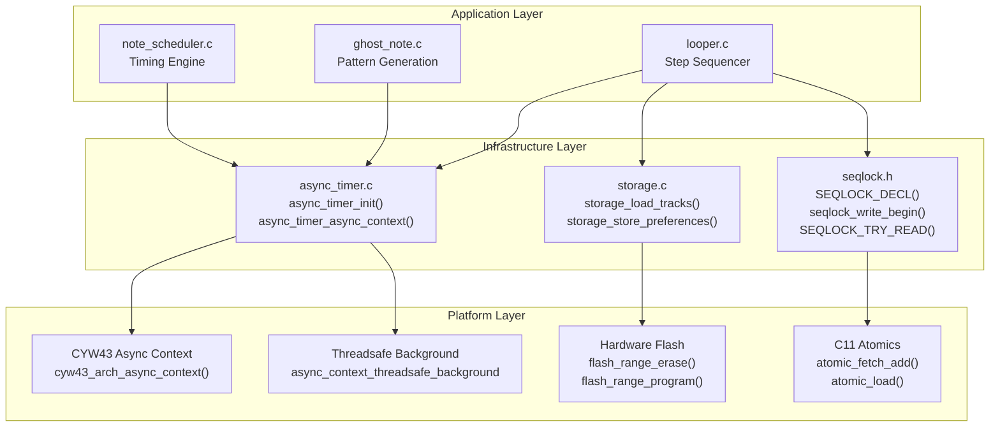
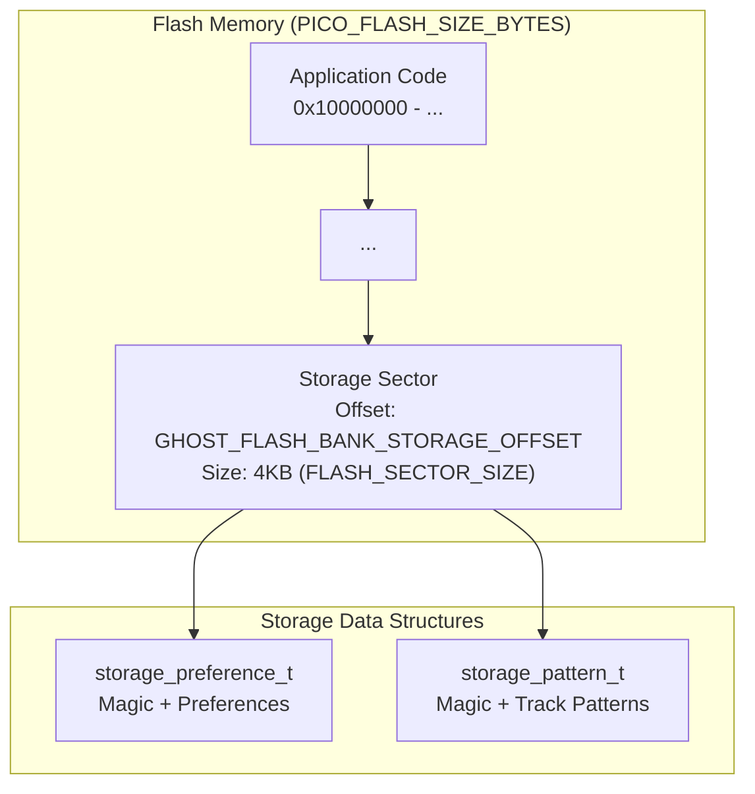
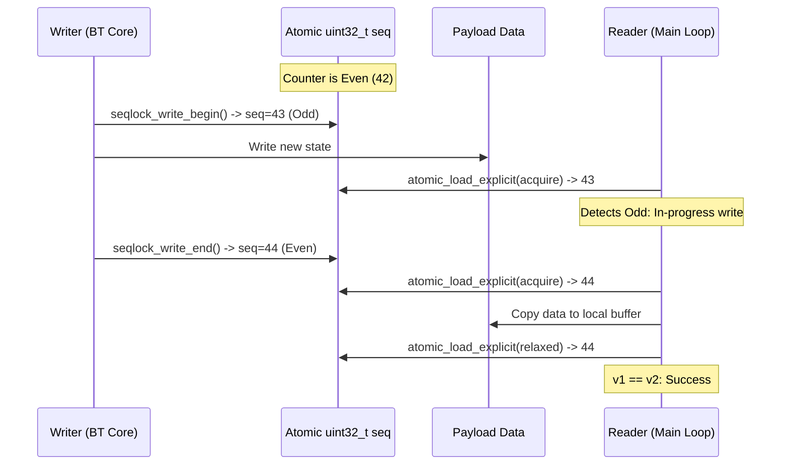

# Infrastructure

> **Relevant source files**
> * [async_timer.c](https://github.com/Jus-Be/orinayo-pico/blob/6dde5a75/async_timer.c)
> * [async_timer.h](https://github.com/Jus-Be/orinayo-pico/blob/6dde5a75/async_timer.h)
> * [btstack_config.h](https://github.com/Jus-Be/orinayo-pico/blob/6dde5a75/btstack_config.h)
> * [debug.h](https://github.com/Jus-Be/orinayo-pico/blob/6dde5a75/debug.h)
> * [pico_bluetooth.h](https://github.com/Jus-Be/orinayo-pico/blob/6dde5a75/pico_bluetooth.h)
> * [sdkconfig.h](https://github.com/Jus-Be/orinayo-pico/blob/6dde5a75/sdkconfig.h)
> * [seqlock.h](https://github.com/Jus-Be/orinayo-pico/blob/6dde5a75/seqlock.h)
> * [storage.c](https://github.com/Jus-Be/orinayo-pico/blob/6dde5a75/storage.c)
> * [storage.h](https://github.com/Jus-Be/orinayo-pico/blob/6dde5a75/storage.h)

This page documents the supporting infrastructure systems that provide timing, storage, and synchronization services to the rest of the Orinayo codebase. These low-level components are used throughout the application but do not directly implement musical or MIDI functionality.

The infrastructure layer consists of three main subsystems:

* **Asynchronous Timer**: Provides a unified async context abstraction for scheduling periodic and delayed work ([async_timer.c L1-L34](https://github.com/Jus-Be/orinayo-pico/blob/6dde5a75/async_timer.c#L1-L34) )
* **Pattern Storage**: Implements flash-based persistent storage for looper patterns and system preferences ([storage.c L1-L165](https://github.com/Jus-Be/orinayo-pico/blob/6dde5a75/storage.c#L1-L165) )
* **Synchronization Primitives**: Provides lock-free data sharing via sequence locks ([seqlock.h L1-L105](https://github.com/Jus-Be/orinayo-pico/blob/6dde5a75/seqlock.h#L1-L105) )

For information about how these infrastructure components are used in musical processing, see [Musical Processing](./5-musical-processing.md). For build system infrastructure, see [Build System](./9-build-system.md).

## System Overview

The infrastructure components form the foundation layer of the Orinayo architecture, providing services that higher-level subsystems depend on without needing to understand platform-specific details.


```mermaid
flowchart TD

Looper["looper.c<br>Step Sequencer"]
GhostNote["ghost_note.c<br>Pattern Generation"]
NoteScheduler["note_scheduler.c<br>Timing Engine"]
AsyncTimer["async_timer.c<br>async_timer_init()<br>async_timer_async_context()"]
Storage["storage.c<br>storage_load_tracks()<br>storage_store_preferences()"]
Seqlock["seqlock.h<br>SEQLOCK_DECL()<br>seqlock_write_begin()<br>SEQLOCK_TRY_READ()"]
CYW43["CYW43 Async Context<br>cyw43_arch_async_context()"]
ThreadsafeBG["Threadsafe Background<br>async_context_threadsafe_background"]
Flash["Hardware Flash<br>flash_range_erase()<br>flash_range_program()"]
Atomics["C11 Atomics<br>atomic_fetch_add()<br>atomic_load()"]

Looper --> AsyncTimer
GhostNote --> AsyncTimer
NoteScheduler --> AsyncTimer
Looper --> Storage
Looper --> Seqlock
AsyncTimer --> CYW43
AsyncTimer --> ThreadsafeBG
Storage --> Flash
Seqlock --> Atomics

subgraph subGraph2 ["Platform Layer"]
    CYW43
    ThreadsafeBG
    Flash
    Atomics
end

subgraph subGraph1 ["Infrastructure Layer"]
    AsyncTimer
    Storage
    Seqlock
end

subgraph subGraph0 ["Application Layer"]
    Looper
    GhostNote
    NoteScheduler
end
```

**Infrastructure Component Dependencies**

Sources: [async_timer.c L1-L34](https://github.com/Jus-Be/orinayo-pico/blob/6dde5a75/async_timer.c#L1-L34)

 [storage.c L1-L165](https://github.com/Jus-Be/orinayo-pico/blob/6dde5a75/storage.c#L1-L165)

 [seqlock.h L1-L105](https://github.com/Jus-Be/orinayo-pico/blob/6dde5a75/seqlock.h#L1-L105)

## Asynchronous Timer System

The async timer subsystem provides a platform-independent abstraction for scheduling asynchronous work. On Pico W (with CYW43 Bluetooth enabled), it uses the CYW43 driver's built-in async context. On other Pico boards, it creates a threadsafe background context. For details, see [Asynchronous Timer](./8.1-asynchronous-timer.md).

### API Functions

| Function | Purpose | Implementation |
| --- | --- | --- |
| `async_timer_init()` | Initialize the async context | On non-CYW43 platforms, creates `tick_async_context` ([async_timer.c L17-L25](https://github.com/Jus-Be/orinayo-pico/blob/6dde5a75/async_timer.c#L17-L25) <br> ) |
| `async_timer_async_context()` | Get the async context pointer | Returns `cyw43_arch_async_context()` or `&tick_async_context.core` ([async_timer.c L27-L33](https://github.com/Jus-Be/orinayo-pico/blob/6dde5a75/async_timer.c#L27-L33) <br> ) |

Sources: [async_timer.h L1-L13](https://github.com/Jus-Be/orinayo-pico/blob/6dde5a75/async_timer.h#L1-L13)

 [async_timer.c L1-L34](https://github.com/Jus-Be/orinayo-pico/blob/6dde5a75/async_timer.c#L1-L34)

## Pattern and Preference Storage

The storage subsystem provides persistent flash-based storage for looper patterns and system-wide configuration preferences. It uses a dedicated flash sector and implements safe flash operations that coordinate with interrupts. For details, see [Pattern Storage](./8.2-pattern-storage.md).

### Flash Memory Layout

The storage system uses a single flash sector (4KB) located at the end of the flash memory space:


```mermaid
flowchart TD

Application["Application Code<br>0x10000000 - ..."]
Reserved["..."]
StorageSector["Storage Sector<br>Offset: GHOST_FLASH_BANK_STORAGE_OFFSET<br>Size: 4KB (FLASH_SECTOR_SIZE)"]
Pref["storage_preference_t<br>Magic + Preferences"]
Pattern["storage_pattern_t<br>Magic + Track Patterns"]

StorageSector --> Pref
StorageSector --> Pattern

subgraph subGraph1 ["Storage Data Structures"]
    Pref
    Pattern
end

subgraph subGraph0 ["Flash Memory (PICO_FLASH_SIZE_BYTES)"]
    Application
    Reserved
    StorageSector
    Application --> Reserved
    Reserved --> StorageSector
end
```

**Flash Storage Organization**

Sources: [storage.c L13-L28](https://github.com/Jus-Be/orinayo-pico/blob/6dde5a75/storage.c#L13-L28)

The flash offset is defined by `GHOST_FLASH_BANK_STORAGE_OFFSET`:

```
#define GHOST_FLASH_BANK_STORAGE_OFFSET (PICO_FLASH_SIZE_BYTES - (FLASH_SECTOR_SIZE * 8))
```

Sources: [storage.c L13-L15](https://github.com/Jus-Be/orinayo-pico/blob/6dde5a75/storage.c#L13-L15)

### Storage API Functions

| Function | Purpose | Implementation |
| --- | --- | --- |
| `storage_load_preferences()` | Loads mode flags and PC codes | Reads from `XIP_BASE` offset and validates `MAGIC_HEADER` ([storage.c L100-L125](https://github.com/Jus-Be/orinayo-pico/blob/6dde5a75/storage.c#L100-L125) <br> ) |
| `storage_store_preferences()` | Saves current mode flags | De-inits CYW43, programs flash, then re-inits CYW43 ([storage.c L75-L102](https://github.com/Jus-Be/orinayo-pico/blob/6dde5a75/storage.c#L75-L102) <br> ) |
| `storage_load_tracks()` | Loads looper patterns | Populates `track_t` array from flash ([storage.c L130-L146](https://github.com/Jus-Be/orinayo-pico/blob/6dde5a75/storage.c#L130-L146) <br> ) |
| `storage_store_tracks()` | Saves looper patterns | Uses `flash_safe_execute` to program track data ([storage.c L149-L164](https://github.com/Jus-Be/orinayo-pico/blob/6dde5a75/storage.c#L149-L164) <br> ) |
| `storage_erase_tracks()` | Erases the storage sector | Uses `flash_safe_execute` to erase the flash sector ([storage.c L67-L71](https://github.com/Jus-Be/orinayo-pico/blob/6dde5a75/storage.c#L67-L71) <br> ) |

Sources: [storage.c L67-L164](https://github.com/Jus-Be/orinayo-pico/blob/6dde5a75/storage.c#L67-L164)

 [storage.h L1-L15](https://github.com/Jus-Be/orinayo-pico/blob/6dde5a75/storage.h#L1-L15)

## Synchronization Primitives

The `seqlock.h` header provides a lightweight single-writer/multiple-reader synchronization mechanism using sequence locks. This allows lock-free data sharing without disabling interrupts, which is critical for maintaining Bluetooth HCI responsiveness. For details, see [Synchronization Primitives](./8.3-synchronization-primitives.md).

### Seqlock Mechanism

The seqlock uses an atomic sequence counter to detect concurrent modifications:


```mermaid
sequenceDiagram
  participant Writer (BT Core)
  participant Atomic uint32_t seq
  participant Payload Data
  participant Reader (Main Loop)

  note over Atomic uint32_t seq: Counter is Even (42)
  Writer (BT Core)->>Atomic uint32_t seq: seqlock_write_begin() -> seq=43 (Odd)
  Writer (BT Core)->>Payload Data: Write new state
  Reader (Main Loop)->>Atomic uint32_t seq: atomic_load_explicit(acquire) -> 43
  note over Reader (Main Loop): Detects Odd: In-progress write
  Writer (BT Core)->>Atomic uint32_t seq: seqlock_write_end() -> seq=44 (Even)
  Reader (Main Loop)->>Atomic uint32_t seq: atomic_load_explicit(acquire) -> 44
  Reader (Main Loop)->>Payload Data: Copy data to local buffer
  Reader (Main Loop)->>Atomic uint32_t seq: atomic_load_explicit(relaxed) -> 44
  note over Reader (Main Loop): v1 == v2: Success
```

**Seqlock Read/Write Sequence**

Sources: [seqlock.h L4-L17](https://github.com/Jus-Be/orinayo-pico/blob/6dde5a75/seqlock.h#L4-L17)

 [seqlock.h L40-L75](https://github.com/Jus-Be/orinayo-pico/blob/6dde5a75/seqlock.h#L40-L75)

### API Macros

* `SEQLOCK_DECL(name, type)`: Declares a struct with an atomic sequence and payload ([seqlock.h L33-L37](https://github.com/Jus-Be/orinayo-pico/blob/6dde5a75/seqlock.h#L33-L37) ).
* `seqlock_write_begin(_Atomic uint32_t* seq)`: Increments counter to odd ([seqlock.h L40-L42](https://github.com/Jus-Be/orinayo-pico/blob/6dde5a75/seqlock.h#L40-L42) ).
* `seqlock_write_end(_Atomic uint32_t* seq)`: Increments counter to even with release ordering ([seqlock.h L44-L47](https://github.com/Jus-Be/orinayo-pico/blob/6dde5a75/seqlock.h#L44-L47) ).
* `SEQLOCK_TRY_READ(dest_ptr, src_obj)`: Macro for consistent snapshot reading ([seqlock.h L59-L75](https://github.com/Jus-Be/orinayo-pico/blob/6dde5a75/seqlock.h#L59-L75) ).

Sources: [seqlock.h L27-L75](https://github.com/Jus-Be/orinayo-pico/blob/6dde5a75/seqlock.h#L27-L75)