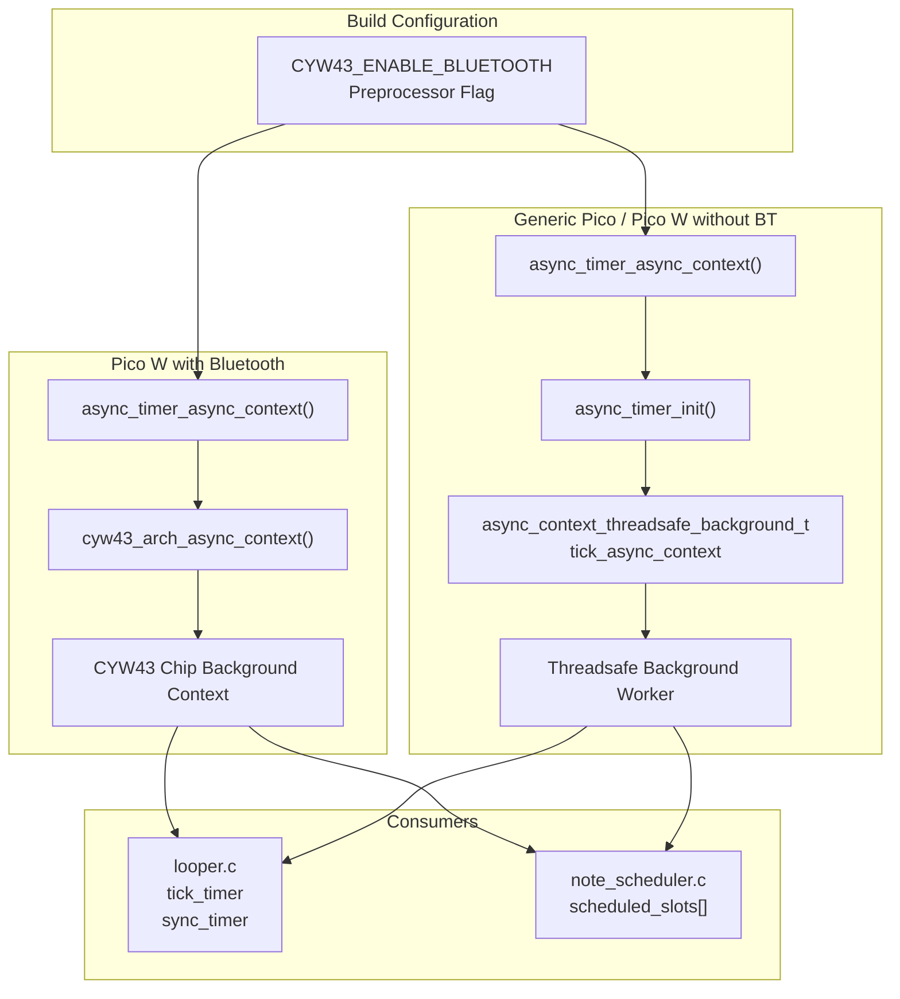
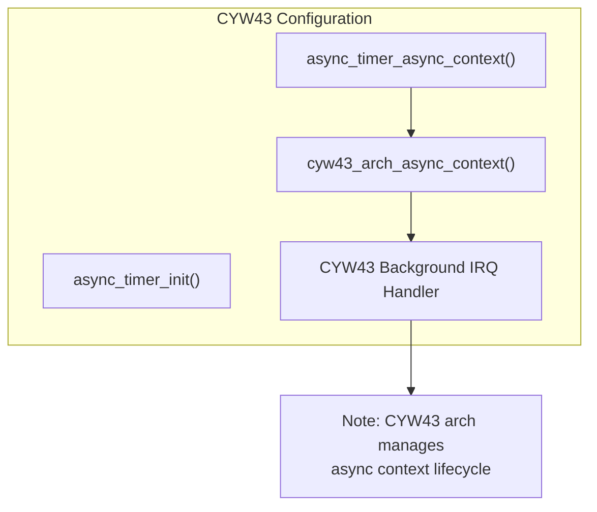
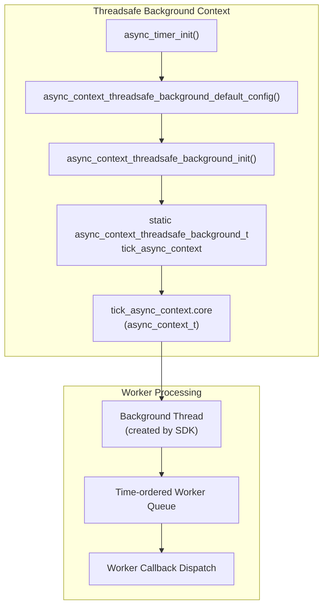
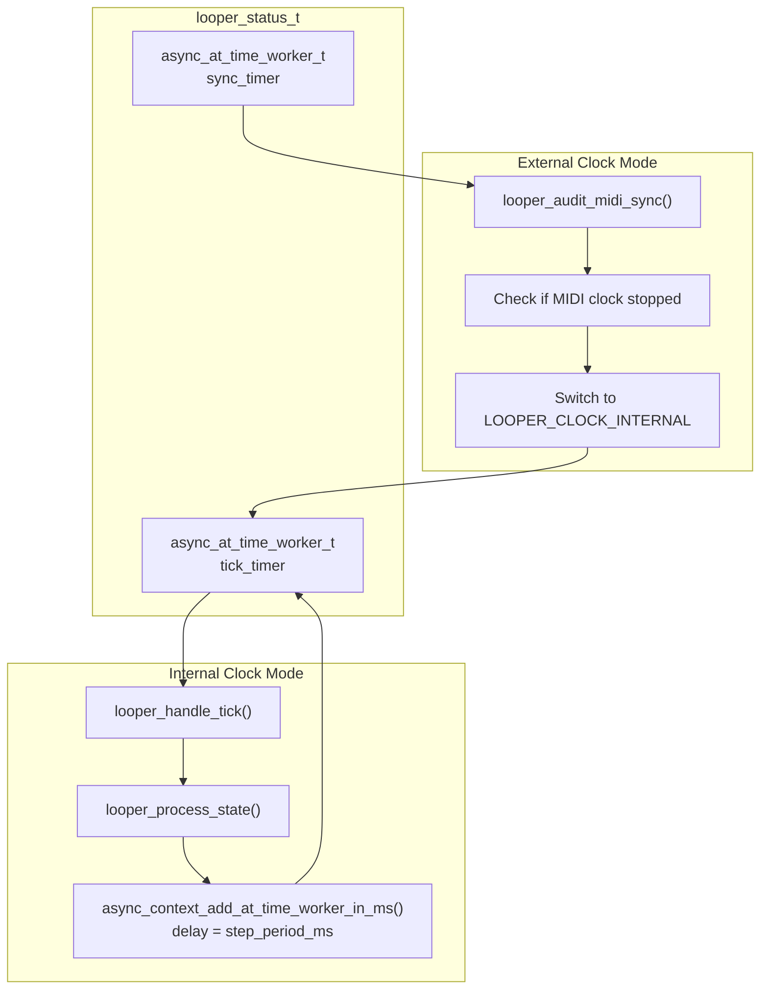
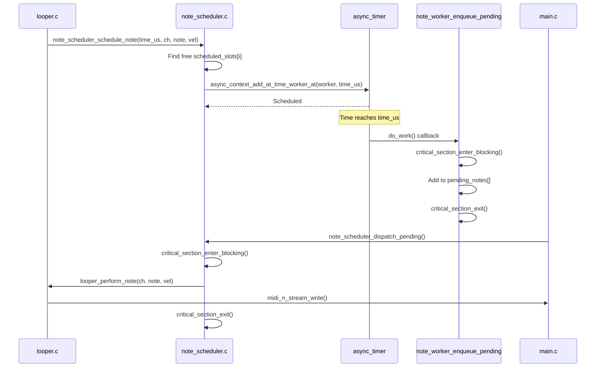

# Asynchronous Timer

> **Relevant source files**
> * [async_timer.c](https://github.com/Jus-Be/orinayo-pico/blob/122fa496/async_timer.c)
> * [async_timer.h](https://github.com/Jus-Be/orinayo-pico/blob/122fa496/async_timer.h)
> * [ghost_note.c](https://github.com/Jus-Be/orinayo-pico/blob/122fa496/ghost_note.c)
> * [ghost_note.h](https://github.com/Jus-Be/orinayo-pico/blob/122fa496/ghost_note.h)
> * [looper.c](https://github.com/Jus-Be/orinayo-pico/blob/122fa496/looper.c)
> * [note_scheduler.c](https://github.com/Jus-Be/orinayo-pico/blob/122fa496/note_scheduler.c)
> * [note_scheduler.h](https://github.com/Jus-Be/orinayo-pico/blob/122fa496/note_scheduler.h)

## Purpose and Scope

The Asynchronous Timer subsystem provides a unified abstraction for scheduling time-based work in the Orinayo system. It encapsulates platform-specific asynchronous execution contexts and exposes a single interface for scheduling periodic tasks, delayed callbacks, and precisely-timed operations.

This document covers the `async_timer` module's architecture, conditional compilation strategy, and integration patterns. For information about the musical timing system that consumes this infrastructure, see [Clock Synchronization](./5.3-clock-synchronization.md). For details on microsecond-precision note scheduling built on top of this system, see [Note Scheduler](./5.5-note-scheduler.md).

**Sources:** [async_timer.h L1-L13](https://github.com/Jus-Be/orinayo-pico/blob/122fa496/async_timer.h#L1-L13)

 [async_timer.c L1-L34](https://github.com/Jus-Be/orinayo-pico/blob/122fa496/async_timer.c#L1-L34)

---

## Architecture Overview

The async timer module implements a conditional compilation strategy that selects the appropriate asynchronous context based on hardware capabilities:

**Conditional Compilation Strategy**



The system uses the CYW43 wireless chip's built-in asynchronous context when Bluetooth is enabled, eliminating the need for a separate background worker. On non-Bluetooth configurations, it creates a dedicated threadsafe background context.

**Sources:** [async_timer.c L8-L33](https://github.com/Jus-Be/orinayo-pico/blob/122fa496/async_timer.c#L8-L33)

---

## Implementation Details

### Header Interface

The module exposes a minimal two-function API:

| Function | Purpose |
| --- | --- |
| `async_timer_init()` | Initializes the asynchronous context (no-op on CYW43 configurations) |
| `async_timer_async_context()` | Returns pointer to the active `async_context_t` |

**Sources:** [async_timer.h L10-L12](https://github.com/Jus-Be/orinayo-pico/blob/122fa496/async_timer.h#L10-L12)

### CYW43-Based Implementation

When `CYW43_ENABLE_BLUETOOTH` is defined (typical for Pico W with Bluetooth stack), the implementation forwards to the CYW43 architecture:



**Key characteristics:**

* No initialization required in `async_timer_init()` ([async_timer.c L17-L25](https://github.com/Jus-Be/orinayo-pico/blob/122fa496/async_timer.c#L17-L25) )
* Returns context managed by `pico/cyw43_arch.h` ([async_timer.c L28-L29](https://github.com/Jus-Be/orinayo-pico/blob/122fa496/async_timer.c#L28-L29) )
* Leverages CYW43's existing background processing for Bluetooth and WiFi
* Single unified context shared with wireless operations

**Sources:** [async_timer.c L8-L32](https://github.com/Jus-Be/orinayo-pico/blob/122fa496/async_timer.c#L8-L32)

### Threadsafe Background Implementation

On non-CYW43 configurations, the module creates a dedicated `async_context_threadsafe_background_t`:



**Key characteristics:**

* Static lifetime `tick_async_context` variable ([async_timer.c L14](https://github.com/Jus-Be/orinayo-pico/blob/122fa496/async_timer.c#L14-L14) )
* Initialized with default configuration ([async_timer.c L19-L23](https://github.com/Jus-Be/orinayo-pico/blob/122fa496/async_timer.c#L19-L23) )
* Returns pointer to embedded `core` member ([async_timer.c L31](https://github.com/Jus-Be/orinayo-pico/blob/122fa496/async_timer.c#L31-L31) )
* Thread-safe worker dispatch without hardware IRQ dependency

**Sources:** [async_timer.c L10-L32](https://github.com/Jus-Be/orinayo-pico/blob/122fa496/async_timer.c#L10-L32)

---

## Worker Callback Pattern

The async context system processes time-based work through the `async_at_time_worker_t` structure:

**Worker Structure and Lifecycle**

```css
#mermaid-tt590c1jwsd{font-family:ui-sans-serif,-apple-system,system-ui,Segoe UI,Helvetica;font-size:16px;fill:#333;}@keyframes edge-animation-frame{from{stroke-dashoffset:0;}}@keyframes dash{to{stroke-dashoffset:0;}}#mermaid-tt590c1jwsd .edge-animation-slow{stroke-dasharray:9,5!important;stroke-dashoffset:900;animation:dash 50s linear infinite;stroke-linecap:round;}#mermaid-tt590c1jwsd .edge-animation-fast{stroke-dasharray:9,5!important;stroke-dashoffset:900;animation:dash 20s linear infinite;stroke-linecap:round;}#mermaid-tt590c1jwsd .error-icon{fill:#dddddd;}#mermaid-tt590c1jwsd .error-text{fill:#222222;stroke:#222222;}#mermaid-tt590c1jwsd .edge-thickness-normal{stroke-width:1px;}#mermaid-tt590c1jwsd .edge-thickness-thick{stroke-width:3.5px;}#mermaid-tt590c1jwsd .edge-pattern-solid{stroke-dasharray:0;}#mermaid-tt590c1jwsd .edge-thickness-invisible{stroke-width:0;fill:none;}#mermaid-tt590c1jwsd .edge-pattern-dashed{stroke-dasharray:3;}#mermaid-tt590c1jwsd .edge-pattern-dotted{stroke-dasharray:2;}#mermaid-tt590c1jwsd .marker{fill:#999;stroke:#999;}#mermaid-tt590c1jwsd .marker.cross{stroke:#999;}#mermaid-tt590c1jwsd svg{font-family:ui-sans-serif,-apple-system,system-ui,Segoe UI,Helvetica;font-size:16px;}#mermaid-tt590c1jwsd p{margin:0;}#mermaid-tt590c1jwsd defs #statediagram-barbEnd{fill:#999;stroke:#999;}#mermaid-tt590c1jwsd g.stateGroup text{fill:#dddddd;stroke:none;font-size:10px;}#mermaid-tt590c1jwsd g.stateGroup text{fill:#333;stroke:none;font-size:10px;}#mermaid-tt590c1jwsd g.stateGroup .state-title{font-weight:bolder;fill:#333;}#mermaid-tt590c1jwsd g.stateGroup rect{fill:#ffffff;stroke:#dddddd;}#mermaid-tt590c1jwsd g.stateGroup line{stroke:#999;stroke-width:1;}#mermaid-tt590c1jwsd .transition{stroke:#999;stroke-width:1;fill:none;}#mermaid-tt590c1jwsd .stateGroup .composit{fill:#f4f4f4;border-bottom:1px;}#mermaid-tt590c1jwsd .stateGroup .alt-composit{fill:#e0e0e0;border-bottom:1px;}#mermaid-tt590c1jwsd .state-note{stroke:#e6d280;fill:#fff5ad;}#mermaid-tt590c1jwsd .state-note text{fill:#333;stroke:none;font-size:10px;}#mermaid-tt590c1jwsd .stateLabel .box{stroke:none;stroke-width:0;fill:#ffffff;opacity:0.5;}#mermaid-tt590c1jwsd .edgeLabel .label rect{fill:#ffffff;opacity:0.5;}#mermaid-tt590c1jwsd .edgeLabel{background-color:#ffffff;text-align:center;}#mermaid-tt590c1jwsd .edgeLabel p{background-color:#ffffff;}#mermaid-tt590c1jwsd .edgeLabel rect{opacity:0.5;background-color:#ffffff;fill:#ffffff;}#mermaid-tt590c1jwsd .edgeLabel .label text{fill:#333;}#mermaid-tt590c1jwsd .label div .edgeLabel{color:#333;}#mermaid-tt590c1jwsd .stateLabel text{fill:#333;font-size:10px;font-weight:bold;}#mermaid-tt590c1jwsd .node circle.state-start{fill:#999;stroke:#999;}#mermaid-tt590c1jwsd .node .fork-join{fill:#999;stroke:#999;}#mermaid-tt590c1jwsd .node circle.state-end{fill:#dddddd;stroke:#f4f4f4;stroke-width:1.5;}#mermaid-tt590c1jwsd .end-state-inner{fill:#f4f4f4;stroke-width:1.5;}#mermaid-tt590c1jwsd .node rect{fill:#ffffff;stroke:#dddddd;stroke-width:1px;}#mermaid-tt590c1jwsd .node polygon{fill:#ffffff;stroke:#dddddd;stroke-width:1px;}#mermaid-tt590c1jwsd #statediagram-barbEnd{fill:#999;}#mermaid-tt590c1jwsd .statediagram-cluster rect{fill:#ffffff;stroke:#dddddd;stroke-width:1px;}#mermaid-tt590c1jwsd .cluster-label,#mermaid-tt590c1jwsd .nodeLabel{color:#333;}#mermaid-tt590c1jwsd .statediagram-cluster rect.outer{rx:5px;ry:5px;}#mermaid-tt590c1jwsd .statediagram-state .divider{stroke:#dddddd;}#mermaid-tt590c1jwsd .statediagram-state .title-state{rx:5px;ry:5px;}#mermaid-tt590c1jwsd .statediagram-cluster.statediagram-cluster .inner{fill:#f4f4f4;}#mermaid-tt590c1jwsd .statediagram-cluster.statediagram-cluster-alt .inner{fill:#f8f8f8;}#mermaid-tt590c1jwsd .statediagram-cluster .inner{rx:0;ry:0;}#mermaid-tt590c1jwsd .statediagram-state rect.basic{rx:5px;ry:5px;}#mermaid-tt590c1jwsd .statediagram-state rect.divider{stroke-dasharray:10,10;fill:#f8f8f8;}#mermaid-tt590c1jwsd .note-edge{stroke-dasharray:5;}#mermaid-tt590c1jwsd .statediagram-note rect{fill:#fff5ad;stroke:#e6d280;stroke-width:1px;rx:0;ry:0;}#mermaid-tt590c1jwsd .statediagram-note rect{fill:#fff5ad;stroke:#e6d280;stroke-width:1px;rx:0;ry:0;}#mermaid-tt590c1jwsd .statediagram-note text{fill:#333;}#mermaid-tt590c1jwsd .statediagram-note .nodeLabel{color:#333;}#mermaid-tt590c1jwsd .statediagram .edgeLabel{color:red;}#mermaid-tt590c1jwsd #dependencyStart,#mermaid-tt590c1jwsd #dependencyEnd{fill:#999;stroke:#999;stroke-width:1;}#mermaid-tt590c1jwsd .statediagramTitleText{text-anchor:middle;font-size:18px;fill:#333;}#mermaid-tt590c1jwsd :root{--mermaid-font-family:"trebuchet ms",verdana,arial,sans-serif;}Worker createdasync_context_add_at_time_worker_*()Time reacheddo_work() invokedCallback completesasync_context_remove_at_time_worker()UnscheduledScheduledExecutingCallbackCallback context:- May be IRQ handler- Must be fast- Can reschedule itself
```

All time-based operations follow this pattern:

1. **Define worker:** Allocate `async_at_time_worker_t` with `.do_work` function pointer
2. **Schedule:** Call `async_context_add_at_time_worker_at()` or `async_context_add_at_time_worker_in_ms()`
3. **Execute:** System invokes callback at specified time
4. **Reschedule (optional):** Callback can re-add itself for periodic execution

**Sources:** [looper.c L423-L435](https://github.com/Jus-Be/orinayo-pico/blob/122fa496/looper.c#L423-L435)

 [note_scheduler.c L48-L63](https://github.com/Jus-Be/orinayo-pico/blob/122fa496/note_scheduler.c#L48-L63)

---

## Integration with Major Subsystems

### Looper Step Timer

The looper uses two `async_at_time_worker_t` instances for timing control:

**Looper Timer Architecture**



**Internal Clock Operation:**

* `tick_timer.do_work` = `looper_handle_tick` ([looper.c L519](https://github.com/Jus-Be/orinayo-pico/blob/122fa496/looper.c#L519-L519) )
* Initial scheduling at `step_period_ms` interval ([looper.c L520-L522](https://github.com/Jus-Be/orinayo-pico/blob/122fa496/looper.c#L520-L522) )
* Each callback processes sequencer state and reschedules itself ([looper.c L423-L435](https://github.com/Jus-Be/orinayo-pico/blob/122fa496/looper.c#L423-L435) )
* Handles adaptive delay to compensate for processing time ([looper.c L429-L432](https://github.com/Jus-Be/orinayo-pico/blob/122fa496/looper.c#L429-L432) )

**External Clock Supervision:**

* `sync_timer.do_work` = `looper_audit_midi_sync` ([looper.c L524](https://github.com/Jus-Be/orinayo-pico/blob/122fa496/looper.c#L524-L524) )
* Runs every 1000ms to detect MIDI clock timeout ([looper.c L453](https://github.com/Jus-Be/orinayo-pico/blob/122fa496/looper.c#L453-L453) )
* Falls back to internal clock if no MIDI clock tick received within 250ms ([looper.c L441-L448](https://github.com/Jus-Be/orinayo-pico/blob/122fa496/looper.c#L441-L448) )

**Sources:** [looper.c L423-L526](https://github.com/Jus-Be/orinayo-pico/blob/122fa496/looper.c#L423-L526)

### Note Scheduler Integration

The note scheduler uses the async context for microsecond-precision timing:

**Note Scheduling Flow**



**Key design decisions:**

* Scheduling from `looper_perform_step()` occurs in async context ([looper.c L172-L189](https://github.com/Jus-Be/orinayo-pico/blob/122fa496/looper.c#L172-L189) )
* Worker callback `note_worker_enqueue_pending()` runs at scheduled time ([note_scheduler.c L48-L63](https://github.com/Jus-Be/orinayo-pico/blob/122fa496/note_scheduler.c#L48-L63) )
* Actual MIDI transmission deferred to `note_scheduler_dispatch_pending()` in main loop ([note_scheduler.c L87-L99](https://github.com/Jus-Be/orinayo-pico/blob/122fa496/note_scheduler.c#L87-L99) )
* Two-stage design avoids USB mutex contention from async/IRQ context ([note_scheduler.c L8-L9](https://github.com/Jus-Be/orinayo-pico/blob/122fa496/note_scheduler.c#L8-L9) )

**Sources:** [note_scheduler.c L16-L99](https://github.com/Jus-Be/orinayo-pico/blob/122fa496/note_scheduler.c#L16-L99)

 [looper.c L131-L192](https://github.com/Jus-Be/orinayo-pico/blob/122fa496/looper.c#L131-L192)

---

## API Usage Examples

### Scheduling One-Time Callback

```python
// Define worker and callback
static void my_callback(async_context_t *ctx, async_at_time_worker_t *worker) {
    // Perform time-sensitive operation
}

async_at_time_worker_t my_worker = {.do_work = my_callback};

// Schedule 100ms from now
async_context_t *ctx = async_timer_async_context();
async_context_add_at_time_worker_in_ms(ctx, &my_worker, 100);
```

### Scheduling Periodic Task

```
static void periodic_task(async_context_t *ctx, async_at_time_worker_t *worker) {
    // Perform periodic work
    
    // Reschedule for next period
    async_context_add_at_time_worker_in_ms(ctx, worker, 50);
}

// Initial scheduling
async_at_time_worker_t periodic_worker = {.do_work = periodic_task};
async_context_t *ctx = async_timer_async_context();
async_context_add_at_time_worker_in_ms(ctx, &periodic_worker, 50);
```

### Canceling Scheduled Work

```python
// Remove worker from queue before it executes
async_context_t *ctx = async_timer_async_context();
async_context_remove_at_time_worker(ctx, &my_worker);
```

**Sources:** [looper.c L423-L466](https://github.com/Jus-Be/orinayo-pico/blob/122fa496/looper.c#L423-L466)

---

## Timing Precision and Constraints

### Resolution and Accuracy

| Metric | Value | Notes |
| --- | --- | --- |
| Time unit | Microseconds (µs) | Absolute timestamps use `time_us_64()` |
| Scheduling resolution | ~1µs | Limited by RP2350 timer hardware |
| Typical jitter | <100µs | Depends on callback processing time |
| Maximum scheduled workers | 24 (note scheduler) | Application-specific limit |

### Performance Considerations

**Callback Execution Context:**

* Workers may execute in IRQ context (CYW43 background IRQ)
* Must complete quickly to avoid blocking other callbacks
* Long operations should defer to main loop (note scheduler pattern)

**Adaptive Timing:**
The looper implements compensation for callback processing time:

```
delay = (handler_delay_ms >= step_period_ms) 
        ? 1 
        : step_period_ms - handler_delay_ms
```

This ensures the next step occurs at the correct absolute time even if the current callback runs long ([looper.c L429-L432](https://github.com/Jus-Be/orinayo-pico/blob/122fa496/looper.c#L429-L432)

).

**Sources:** [looper.c L423-L435](https://github.com/Jus-Be/orinayo-pico/blob/122fa496/looper.c#L423-L435)

 [note_scheduler.c L48-L99](https://github.com/Jus-Be/orinayo-pico/blob/122fa496/note_scheduler.c#L48-L99)

---

## Thread Safety

### CYW43 Configuration

The CYW43 async context provides built-in thread safety:

* Worker additions/removals are atomic from any thread
* Callback execution serialized through CYW43 IRQ handler
* Safe to call from Core 0 or Core 1

### Threadsafe Background Configuration

The `async_context_threadsafe_background_t` implementation:

* Creates dedicated background thread for worker processing
* Uses mutex protection for worker queue operations
* Safe for multi-core scheduling

### Critical Sections in Note Scheduler

Note scheduler adds application-level critical sections to protect the pending notes queue:

```
static critical_section_t pending_notes_cs;

critical_section_enter_blocking(&pending_notes_cs);
// Access pending_notes[]
critical_section_exit(&pending_notes_cs);
```

This prevents race conditions between async worker callbacks and main loop dispatch ([note_scheduler.c L39-L98](https://github.com/Jus-Be/orinayo-pico/blob/122fa496/note_scheduler.c#L39-L98)

).

**Sources:** [note_scheduler.c L39-L99](https://github.com/Jus-Be/orinayo-pico/blob/122fa496/note_scheduler.c#L39-L99)

---

## Conditional Compilation Summary

| Build Configuration | Context Source | Initialization Required | Background Thread |
| --- | --- | --- | --- |
| `CYW43_ENABLE_BLUETOOTH` defined | `cyw43_arch_async_context()` | No (managed by CYW43 arch) | No (uses CYW43 IRQ) |
| Generic Pico | `tick_async_context.core` | Yes (`async_timer_init()`) | Yes (SDK-managed) |

**Sources:** [async_timer.c L8-L33](https://github.com/Jus-Be/orinayo-pico/blob/122fa496/async_timer.c#L8-L33)