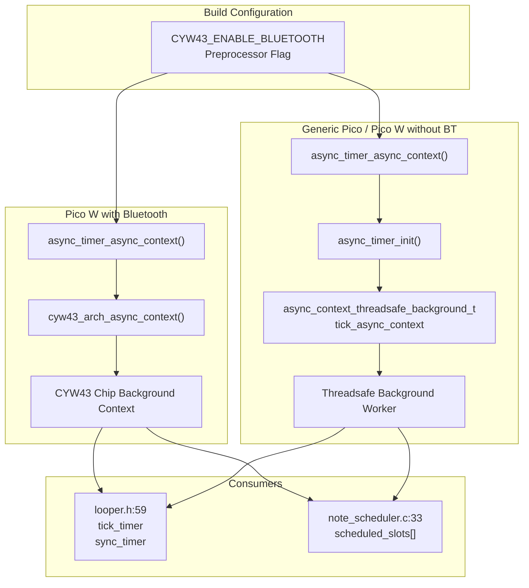
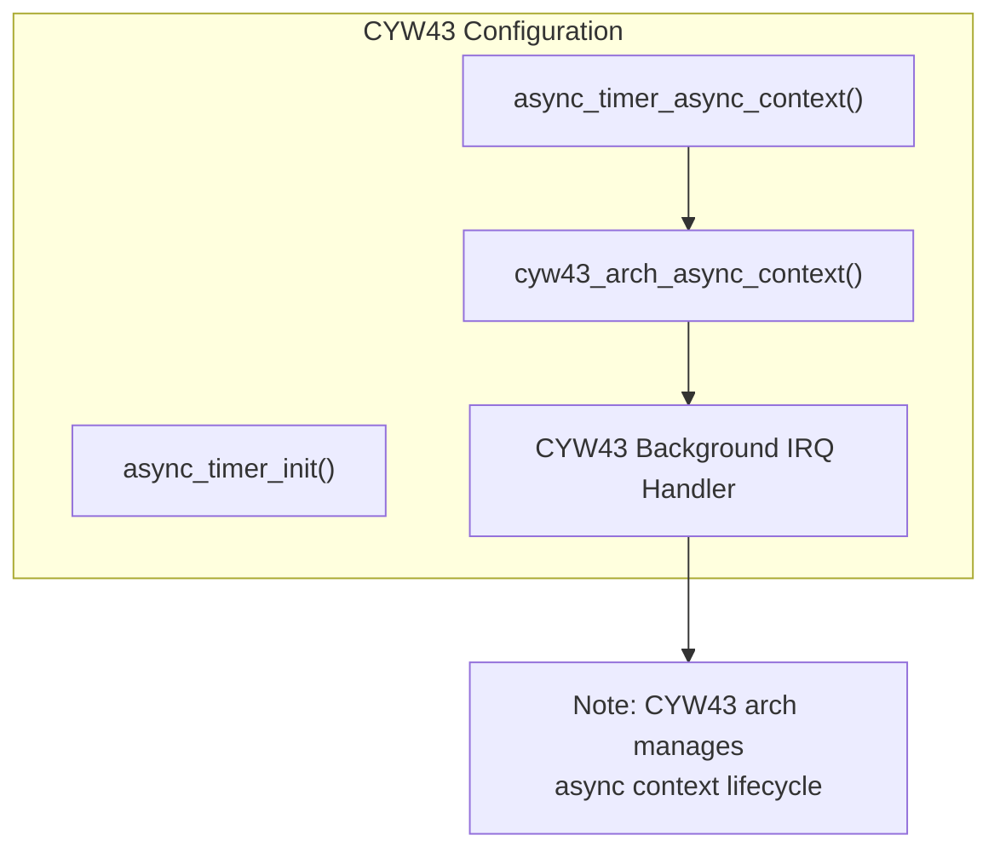
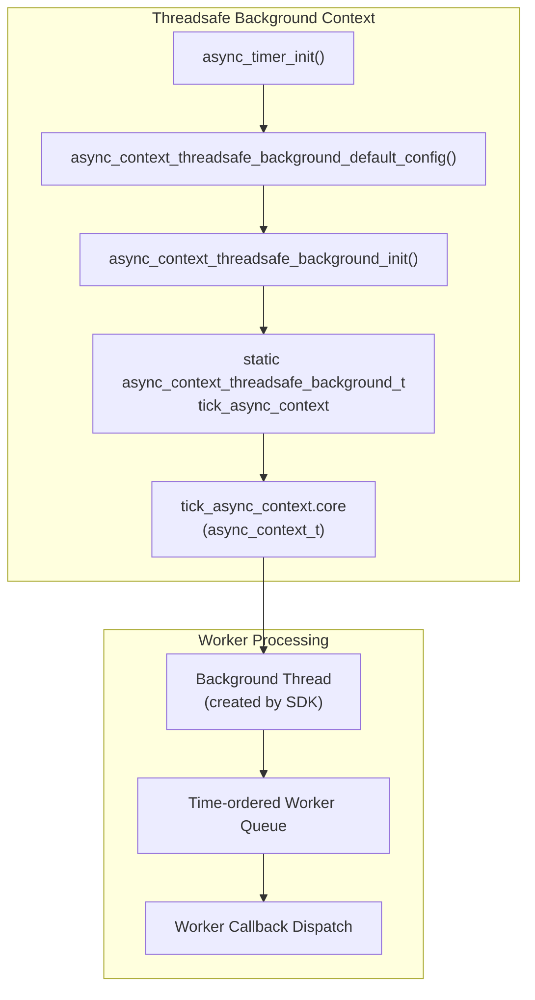
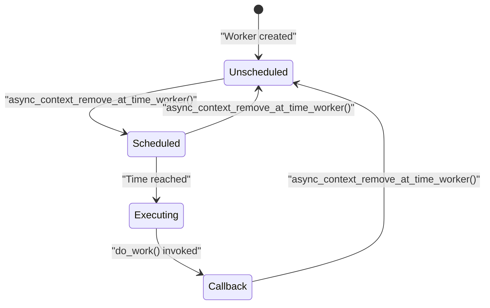
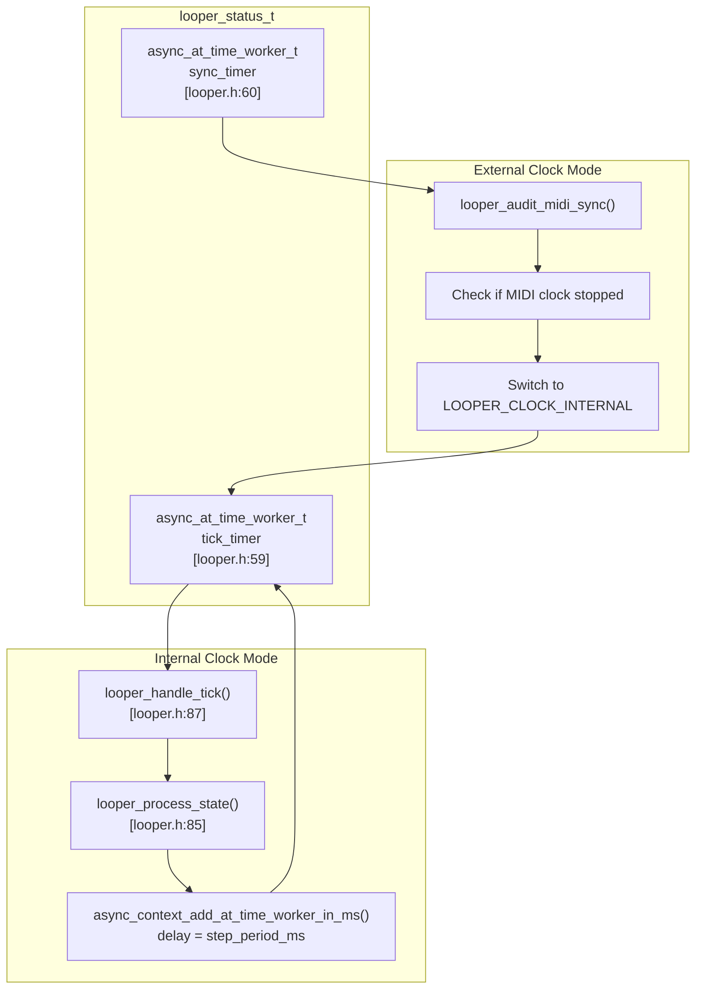
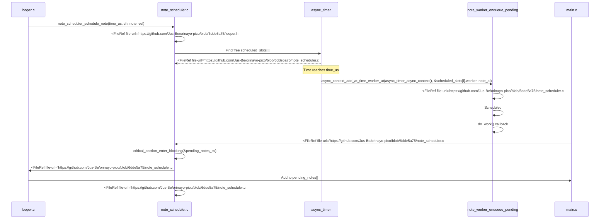

# Asynchronous Timer

> **Relevant source files**
> * [async_timer.c](https://github.com/Jus-Be/orinayo-pico/blob/6dde5a75/async_timer.c)
> * [async_timer.h](https://github.com/Jus-Be/orinayo-pico/blob/6dde5a75/async_timer.h)
> * [ghost_note.c](https://github.com/Jus-Be/orinayo-pico/blob/6dde5a75/ghost_note.c)
> * [ghost_note.h](https://github.com/Jus-Be/orinayo-pico/blob/6dde5a75/ghost_note.h)
> * [looper.h](https://github.com/Jus-Be/orinayo-pico/blob/6dde5a75/looper.h)
> * [note_scheduler.c](https://github.com/Jus-Be/orinayo-pico/blob/6dde5a75/note_scheduler.c)
> * [note_scheduler.h](https://github.com/Jus-Be/orinayo-pico/blob/6dde5a75/note_scheduler.h)

## Purpose and Scope

The Asynchronous Timer subsystem provides a unified abstraction for scheduling time-based work in the Orinayo system. It encapsulates platform-specific asynchronous execution contexts and exposes a single interface for scheduling periodic tasks, delayed callbacks, and precisely-timed operations.

This document covers the `async_timer` module's architecture, conditional compilation strategy, and integration patterns. For information about the musical timing system that consumes this infrastructure, see [Clock Synchronization](https://github.com/Jus-Be/orinayo-pico/blob/6dde5a75/Clock Synchronization)

 For details on microsecond-precision note scheduling built on top of this system, see [Note Scheduler](https://github.com/Jus-Be/orinayo-pico/blob/6dde5a75/Note Scheduler)

**Sources:** [async_timer.h L1-L13](https://github.com/Jus-Be/orinayo-pico/blob/6dde5a75/async_timer.h#L1-L13)

 [async_timer.c L1-L34](https://github.com/Jus-Be/orinayo-pico/blob/6dde5a75/async_timer.c#L1-L34)

---

## Architecture Overview

The async timer module implements a conditional compilation strategy that selects the appropriate asynchronous context based on hardware capabilities:

**Conditional Compilation Strategy**


```mermaid
flowchart TD

BuildFlag["CYW43_ENABLE_BLUETOOTH<br>Preprocessor Flag"]
CYW43Path["async_timer_async_context()"]
CYW43Impl["cyw43_arch_async_context()"]
CYW43Context["CYW43 Chip Background Context"]
GenericPath["async_timer_async_context()"]
GenericInit["async_timer_init()"]
GenericImpl["async_context_threadsafe_background_t<br>tick_async_context"]
GenericContext["Threadsafe Background Worker"]
Looper["looper.h:59<br>tick_timer<br>sync_timer"]
NoteScheduler["note_scheduler.c:33<br>scheduled_slots[]"]

BuildFlag --> CYW43Path
BuildFlag --> GenericPath
CYW43Context --> Looper
GenericContext --> Looper
CYW43Context --> NoteScheduler
GenericContext --> NoteScheduler

subgraph Consumers ["Consumers"]
    Looper
    NoteScheduler
end

subgraph subGraph2 ["Generic Pico / Pico W without BT"]
    GenericPath
    GenericInit
    GenericImpl
    GenericContext
    GenericPath --> GenericInit
    GenericInit --> GenericImpl
    GenericImpl --> GenericContext
end

subgraph subGraph1 ["Pico W with Bluetooth"]
    CYW43Path
    CYW43Impl
    CYW43Context
    CYW43Path --> CYW43Impl
    CYW43Impl --> CYW43Context
end

subgraph subGraph0 ["Build Configuration"]
    BuildFlag
end
```

The system uses the CYW43 wireless chip's built-in asynchronous context when Bluetooth is enabled, eliminating the need for a separate background worker. On non-Bluetooth configurations, it creates a dedicated threadsafe background context.

**Sources:** [async_timer.c L8-L33](https://github.com/Jus-Be/orinayo-pico/blob/6dde5a75/async_timer.c#L8-L33)

---

## Implementation Details

### Header Interface

The module exposes a minimal two-function API:

| Function | Purpose |
| --- | --- |
| `async_timer_init()` | Initializes the asynchronous context (no-op on CYW43 configurations) |
| `async_timer_async_context()` | Returns pointer to the active `async_context_t` |

**Sources:** [async_timer.h L10-L12](https://github.com/Jus-Be/orinayo-pico/blob/6dde5a75/async_timer.h#L10-L12)

### CYW43-Based Implementation

When `CYW43_ENABLE_BLUETOOTH` is defined (typical for Pico W with Bluetooth stack), the implementation forwards to the CYW43 architecture:


```mermaid
flowchart TD

Init["async_timer_init()"]
GetCtx["async_timer_async_context()"]
CYW43["cyw43_arch_async_context()"]
CYW43Chip["CYW43 Background IRQ Handler"]
Note["Note: CYW43 arch manages<br>async context lifecycle"]

CYW43Chip --> Note

subgraph subGraph0 ["CYW43 Configuration"]
    Init
    GetCtx
    CYW43
    CYW43Chip
    GetCtx --> CYW43
    CYW43 --> CYW43Chip
end
```

**Key characteristics:**

* No initialization required in `async_timer_init()` [async_timer.c L17-L25](https://github.com/Jus-Be/orinayo-pico/blob/6dde5a75/async_timer.c#L17-L25)
* Returns context managed by `pico/cyw43_arch.h` [async_timer.c L28-L29](https://github.com/Jus-Be/orinayo-pico/blob/6dde5a75/async_timer.c#L28-L29)
* Leverages CYW43's existing background processing for Bluetooth and WiFi
* Single unified context shared with wireless operations

**Sources:** [async_timer.c L8-L32](https://github.com/Jus-Be/orinayo-pico/blob/6dde5a75/async_timer.c#L8-L32)

### Threadsafe Background Implementation

On non-CYW43 configurations, the module creates a dedicated `async_context_threadsafe_background_t`:


```mermaid
flowchart TD

StaticVar["static async_context_threadsafe_background_t<br>tick_async_context"]
Init["async_timer_init()"]
DefaultCfg["async_context_threadsafe_background_default_config()"]
InitCall["async_context_threadsafe_background_init()"]
Core["tick_async_context.core<br>(async_context_t)"]
BGThread["Background Thread<br>(created by SDK)"]
WorkerQueue["Time-ordered Worker Queue"]
Dispatch["Worker Callback Dispatch"]

Core --> BGThread

subgraph subGraph1 ["Worker Processing"]
    BGThread
    WorkerQueue
    Dispatch
    BGThread --> WorkerQueue
    WorkerQueue --> Dispatch
end

subgraph subGraph0 ["Threadsafe Background Context"]
    StaticVar
    Init
    DefaultCfg
    InitCall
    Core
    Init --> DefaultCfg
    DefaultCfg --> InitCall
    InitCall --> StaticVar
    StaticVar --> Core
end
```

**Key characteristics:**

* Static lifetime `tick_async_context` variable [async_timer.c L14](https://github.com/Jus-Be/orinayo-pico/blob/6dde5a75/async_timer.c#L14-L14)
* Initialized with default configuration [async_timer.c L19-L23](https://github.com/Jus-Be/orinayo-pico/blob/6dde5a75/async_timer.c#L19-L23)
* Returns pointer to embedded `core` member [async_timer.c L31](https://github.com/Jus-Be/orinayo-pico/blob/6dde5a75/async_timer.c#L31-L31)
* Thread-safe worker dispatch without hardware IRQ dependency

**Sources:** [async_timer.c L10-L32](https://github.com/Jus-Be/orinayo-pico/blob/6dde5a75/async_timer.c#L10-L32)

---

## Worker Callback Pattern

The async context system processes time-based work through the `async_at_time_worker_t` structure:

**Worker Structure and Lifecycle**


```mermaid
stateDiagram-v2
    [*] --> Unscheduled : "Worker created"
    Unscheduled --> Scheduled : "async_context_remove_at_time_worker()"
    Scheduled --> Executing : "Time reached"
    Executing --> Callback : "do_work() invoked"
    Callback --> Unscheduled : "async_context_remove_at_time_worker()"
    Scheduled --> Unscheduled : "async_context_remove_at_time_worker()"
```

All time-based operations follow this pattern:

1. **Define worker:** Allocate `async_at_time_worker_t` with `.do_work` function pointer.
2. **Schedule:** Call `async_context_add_at_time_worker_at()` or `async_context_add_at_time_worker_in_ms()`.
3. **Execute:** System invokes callback at specified time.
4. **Reschedule (optional):** Callback can re-add itself for periodic execution.

**Sources:** [pico/async_context.h](https://github.com/Jus-Be/orinayo-pico/blob/6dde5a75/pico/async_context.h)

 [async_timer.c L1-L34](https://github.com/Jus-Be/orinayo-pico/blob/6dde5a75/async_timer.c#L1-L34)

 [async_timer.h L1-L13](https://github.com/Jus-Be/orinayo-pico/blob/6dde5a75/async_timer.h#L1-L13)

---

## Integration with Major Subsystems

### Looper Step Timer

The looper uses two `async_at_time_worker_t` instances for timing control:

**Looper Timer Architecture**


```mermaid
flowchart TD

TickTimer["async_at_time_worker_t<br>tick_timer<br>[looper.h:59]"]
SyncTimer["async_at_time_worker_t<br>sync_timer<br>[looper.h:60]"]
TickHandler["looper_handle_tick()<br>[looper.h:87]"]
ProcessState["looper_process_state()<br>[looper.h:85]"]
Reschedule["async_context_add_at_time_worker_in_ms()<br>delay = step_period_ms"]
AuditHandler["looper_audit_midi_sync()"]
CheckTimeout["Check if MIDI clock stopped"]
FallbackInternal["Switch to LOOPER_CLOCK_INTERNAL"]

TickTimer --> TickHandler
Reschedule --> TickTimer
SyncTimer --> AuditHandler
FallbackInternal --> TickTimer

subgraph subGraph2 ["External Clock Mode"]
    AuditHandler
    CheckTimeout
    FallbackInternal
    AuditHandler --> CheckTimeout
    CheckTimeout --> FallbackInternal
end

subgraph subGraph1 ["Internal Clock Mode"]
    TickHandler
    ProcessState
    Reschedule
    TickHandler --> ProcessState
    ProcessState --> Reschedule
end

subgraph looper_status_t ["looper_status_t"]
    TickTimer
    SyncTimer
end
```

**Internal Clock Operation:**

* Initial scheduling occurs at `step_period_ms` interval.
* Each callback processes sequencer state and reschedules itself.
* Handles adaptive delay to compensate for processing time.

**External Clock Supervision:**

* Runs periodically to detect MIDI clock timeout.
* Falls back to internal clock if no MIDI clock tick is received within the timeout threshold.

**Sources:** [looper.h L59-L87](https://github.com/Jus-Be/orinayo-pico/blob/6dde5a75/looper.h#L59-L87)

### Note Scheduler Integration

The note scheduler uses the async context for microsecond-precision timing:

**Note Scheduling Flow**


```mermaid
sequenceDiagram
  participant looper.c
  participant note_scheduler.c
  participant async_timer
  participant note_worker_enqueue_pending
  participant main.c

  looper.c->>note_scheduler.c: note_scheduler_schedule_note(time_us, ch, note, vel)
  note_scheduler.c->>note_scheduler.c: <FileRef file-url='https://github.com/Jus-Be/orinayo-pico/blob/6dde5a75/looper.h
  note_scheduler.c->>async_timer: Find free scheduled_slots[i]
  async_timer-->>note_scheduler.c: <FileRef file-url='https://github.com/Jus-Be/orinayo-pico/blob/6dde5a75/note_scheduler.c
  note over async_timer: Time reaches time_us
  async_timer->>note_worker_enqueue_pending: async_context_add_at_time_worker_at(async_timer_async_context(), &scheduled_slots[i].worker, note_at)
  note_worker_enqueue_pending->>note_worker_enqueue_pending: <FileRef file-url='https://github.com/Jus-Be/orinayo-pico/blob/6dde5a75/note_scheduler.c
  note_worker_enqueue_pending->>note_worker_enqueue_pending: Scheduled
  note_worker_enqueue_pending->>note_worker_enqueue_pending: do_work() callback
  main.c->>note_scheduler.c: <FileRef file-url='https://github.com/Jus-Be/orinayo-pico/blob/6dde5a75/note_scheduler.c
  note_scheduler.c->>note_scheduler.c: critical_section_enter_blocking(&pending_notes_cs)
  note_scheduler.c->>looper.c: <FileRef file-url='https://github.com/Jus-Be/orinayo-pico/blob/6dde5a75/note_scheduler.c
  looper.c->>main.c: Add to pending_notes[]
  note_scheduler.c->>note_scheduler.c: <FileRef file-url='https://github.com/Jus-Be/orinayo-pico/blob/6dde5a75/note_scheduler.c
```

**Key design decisions:**

* Scheduling occurs in the async context.
* Worker callback `note_worker_enqueue_pending()` [note_scheduler.c L48](https://github.com/Jus-Be/orinayo-pico/blob/6dde5a75/note_scheduler.c#L48-L48)  runs at the scheduled time.
* Actual MIDI transmission is deferred to `note_scheduler_dispatch_pending()` [note_scheduler.c L87](https://github.com/Jus-Be/orinayo-pico/blob/6dde5a75/note_scheduler.c#L87-L87)  in the main loop.
* This two-stage design avoids USB mutex contention from async/IRQ context.

**Sources:** [note_scheduler.c L1-L99](https://github.com/Jus-Be/orinayo-pico/blob/6dde5a75/note_scheduler.c#L1-L99)

 [note_scheduler.h L1-L14](https://github.com/Jus-Be/orinayo-pico/blob/6dde5a75/note_scheduler.h#L1-L14)

 [looper.h L91](https://github.com/Jus-Be/orinayo-pico/blob/6dde5a75/looper.h#L91-L91)

---

## API Usage Examples

### Scheduling One-Time Callback

```python
// Define worker and callbackstatic void my_callback(async_context_t *ctx, async_at_time_worker_t *worker) {    // Perform time-sensitive operation} async_at_time_worker_t my_worker = {.do_work = my_callback}; // Schedule 100ms from nowasync_context_t *ctx = async_timer_async_context();async_context_add_at_time_worker_in_ms(ctx, &my_worker, 100);
```

### Scheduling Periodic Task

```
static void periodic_task(async_context_t *ctx, async_at_time_worker_t *worker) {    // Perform periodic work        // Reschedule for next period    async_context_add_at_time_worker_in_ms(ctx, worker, 50);} // Initial schedulingasync_at_time_worker_t periodic_worker = {.do_work = periodic_task};async_context_t *ctx = async_timer_async_context();async_context_add_at_time_worker_in_ms(ctx, &periodic_worker, 50);
```

**Sources:** [pico/async_context.h](https://github.com/Jus-Be/orinayo-pico/blob/6dde5a75/pico/async_context.h)

---

## Timing Precision and Constraints

### Resolution and Accuracy

| Metric | Value | Notes |
| --- | --- | --- |
| Time unit | Microseconds (µs) | Absolute timestamps use `time_us_64()` |
| Scheduling resolution | ~1µs | Limited by RP2350 timer hardware |
| Typical jitter | <100µs | Depends on callback processing time |

### Performance Considerations

**Callback Execution Context:**

* Workers may execute in IRQ context (CYW43 background IRQ).
* Must complete quickly to avoid blocking other callbacks.
* Long operations should defer to the main loop (e.g., using the note scheduler pattern).

**Sources:** [note_scheduler.c L1-L9](https://github.com/Jus-Be/orinayo-pico/blob/6dde5a75/note_scheduler.c#L1-L9)

---

## Thread Safety

### CYW43 Configuration

The CYW43 async context provides built-in thread safety:

* Worker additions/removals are atomic from any thread.
* Callback execution is serialized through the CYW43 IRQ handler.
* Safe to call from Core 0 or Core 1.

### Threadsafe Background Configuration

The `async_context_threadsafe_background_t` implementation:

* Creates a dedicated background thread for worker processing.
* Uses mutex protection for worker queue operations.
* Safe for multi-core scheduling.

**Sources:** [async_timer.c L10-L33](https://github.com/Jus-Be/orinayo-pico/blob/6dde5a75/async_timer.c#L10-L33)

---

## Conditional Compilation Summary

| Build Configuration | Context Source | Initialization Required | Background Thread |
| --- | --- | --- | --- |
| `CYW43_ENABLE_BLUETOOTH` defined | `cyw43_arch_async_context()` | No (managed by CYW43 arch) | No (uses CYW43 IRQ) |
| Generic Pico | `tick_async_context.core` | Yes (`async_timer_init()`) | Yes (SDK-managed) |

**Sources:** [async_timer.c L8-L33](https://github.com/Jus-Be/orinayo-pico/blob/6dde5a75/async_timer.c#L8-L33)