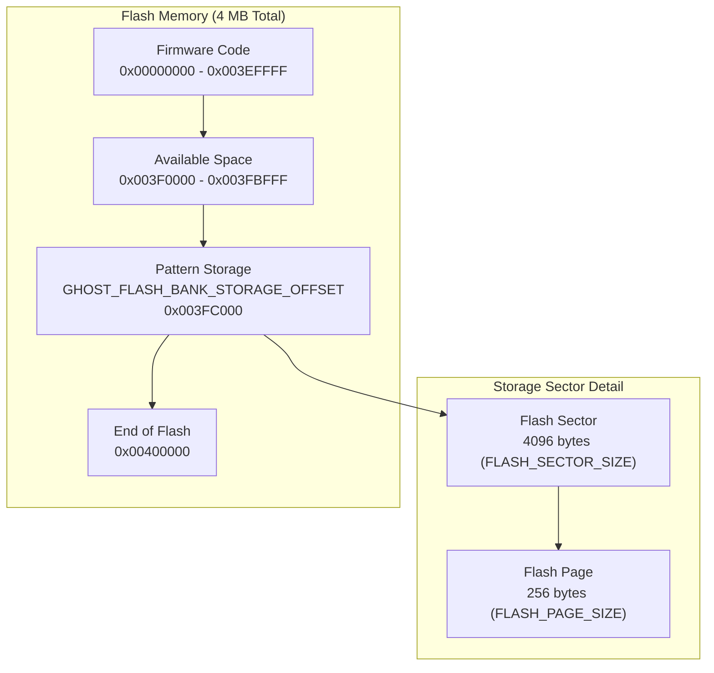
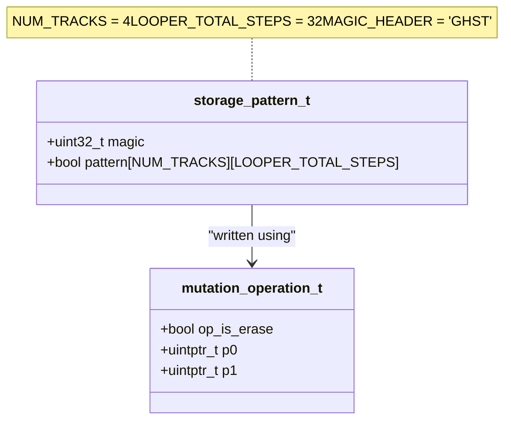
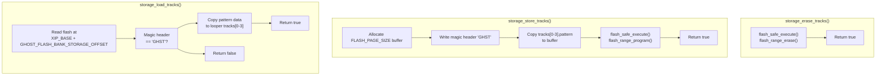
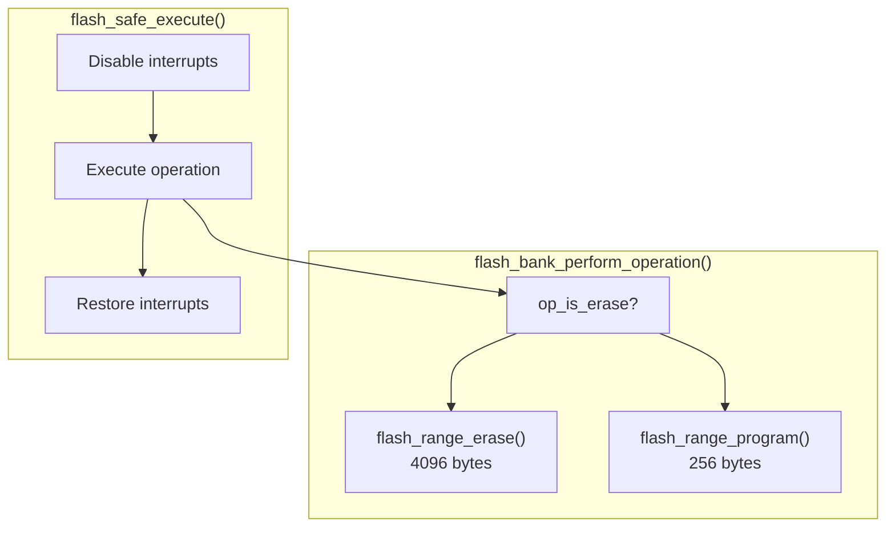

# Pattern Storage

> **Relevant source files**
> * [looper.c](https://github.com/Jus-Be/orinayo-pico/blob/122fa496/looper.c)
> * [storage.c](https://github.com/Jus-Be/orinayo-pico/blob/122fa496/storage.c)
> * [storage.h](https://github.com/Jus-Be/orinayo-pico/blob/122fa496/storage.h)

## Purpose and Scope

This document describes the flash-based persistent storage system for looper drum patterns. The storage module ([storage.c](https://github.com/Jus-Be/orinayo-pico/blob/122fa496/storage.c)

) provides functions to save, load, and erase looper track patterns across power cycles using the Raspberry Pi Pico W's onboard flash memory.

For information about the looper track structure and pattern playback, see [Step Sequencer](./5.2-step-sequencer.md). For details on the looper's state management and recording modes, see [Step Sequencer](./5.2-step-sequencer.md).

**Sources:** [storage.c L1-L81](https://github.com/Jus-Be/orinayo-pico/blob/122fa496/storage.c#L1-L81)

 [storage.h L1-L13](https://github.com/Jus-Be/orinayo-pico/blob/122fa496/storage.h#L1-L13)

---

## Flash Memory Architecture

The storage system reserves a dedicated region in the Pico W's flash memory for pattern persistence. The flash is organized into sectors and pages, with specific alignment requirements for erase and write operations.

### Memory Layout



**Sources:** [storage.c L12-L14](https://github.com/Jus-Be/orinayo-pico/blob/122fa496/storage.c#L12-L14)

### Flash Offset Calculation

| Constant | Value | Description |
| --- | --- | --- |
| `GHOST_FLASH_BANK_STORAGE_OFFSET` | `(4 * 1024 * 1024) - FLASH_SECTOR_SIZE * 16` | Storage location at 0x003FC000 |
| `FLASH_SECTOR_SIZE` | 4096 bytes | Minimum erase unit |
| `FLASH_PAGE_SIZE` | 256 bytes | Minimum write unit |
| `XIP_BASE` | 0x10000000 | Flash memory mapped address |

The storage region is located at the end of flash memory, 16 sectors (64 KB) before the 4 MB boundary. This placement ensures it is far from the firmware code region, minimizing the risk of accidental overwrites during firmware updates.

**Sources:** [storage.c L12-L14](https://github.com/Jus-Be/orinayo-pico/blob/122fa496/storage.c#L12-L14)

 [storage.c L43](https://github.com/Jus-Be/orinayo-pico/blob/122fa496/storage.c#L43-L43)

---

## Storage Format

The storage system uses a simple binary format with a magic header for validation. Only a subset of tracks (4 out of 14) are persisted to conserve flash space.

### Data Structure



**Sources:** [storage.c L16-L28](https://github.com/Jus-Be/orinayo-pico/blob/122fa496/storage.c#L16-L28)

### Storage Layout in Flash

| Offset | Size | Field | Description |
| --- | --- | --- | --- |
| 0x00 | 4 bytes | `magic` | Magic header "GHST" (0x54534847) |
| 0x04 | 128 bytes | `pattern[0]` | Track 0 pattern (32 × 1 byte bools) |
| 0x84 | 128 bytes | `pattern[1]` | Track 1 pattern |
| 0x104 | 128 bytes | `pattern[2]` | Track 2 pattern |
| 0x184 | 128 bytes | `pattern[3]` | Track 3 pattern |
| **Total** | **132 bytes** |  | Fits within one 256-byte page |

The magic header `"GHST"` is used to validate that the flash region contains valid pattern data. If the magic header does not match, `storage_load_tracks()` returns `false`, indicating uninitialized or corrupted storage.

**Sources:** [storage.c L16-L22](https://github.com/Jus-Be/orinayo-pico/blob/122fa496/storage.c#L16-L22)

 [storage.c L45-L46](https://github.com/Jus-Be/orinayo-pico/blob/122fa496/storage.c#L45-L46)

---

## Storage Operations

The storage module exposes three primary operations through its public API ([storage.h](https://github.com/Jus-Be/orinayo-pico/blob/122fa496/storage.h)

): loading patterns from flash, storing patterns to flash, and erasing the storage region.

### Operation Flow



**Sources:** [storage.c L39-L80](https://github.com/Jus-Be/orinayo-pico/blob/122fa496/storage.c#L39-L80)

### Load Operation

The `storage_load_tracks()` function reads pattern data from flash and restores it to the looper's track structures.

**Implementation:** [storage.c L39-L56](https://github.com/Jus-Be/orinayo-pico/blob/122fa496/storage.c#L39-L56)

**Process:**

1. Retrieves the track array from the looper via `looper_tracks_get()`
2. Calculates flash memory pointer: `XIP_BASE + GHOST_FLASH_BANK_STORAGE_OFFSET`
3. Validates the magic header using `memcmp()`
4. Copies pattern data from flash to `tracks[t].pattern[i]` for each track and step
5. Returns `true` if successful, `false` if magic header is invalid

**Note:** Only 4 tracks are loaded, even though the looper supports 14 tracks. Tracks 4-13 are not persisted.

### Store Operation

The `storage_store_tracks()` function writes the current looper patterns to flash memory.

**Implementation:** [storage.c L64-L80](https://github.com/Jus-Be/orinayo-pico/blob/122fa496/storage.c#L64-L80)

**Process:**

1. Allocates a `FLASH_PAGE_SIZE` (256-byte) buffer on the stack
2. Writes the magic header "GHST" to the buffer
3. Copies pattern data from `tracks[0-3].pattern` to the buffer
4. Calls `flash_safe_execute()` with `flash_bank_perform_operation()` to write the buffer to flash
5. Uses `flash_range_program()` internally to perform the write operation

**Safety:** The `flash_safe_execute()` function ensures interrupts are properly disabled during flash writes, preventing corruption.

### Erase Operation

The `storage_erase_tracks()` function clears the storage sector, invalidating any stored patterns.

**Implementation:** [storage.c L58-L62](https://github.com/Jus-Be/orinayo-pico/blob/122fa496/storage.c#L58-L62)

**Process:**

1. Constructs a `mutation_operation_t` with `op_is_erase = true`
2. Calls `flash_safe_execute()` with `flash_bank_perform_operation()`
3. Uses `flash_range_erase()` internally to erase the entire sector (4096 bytes)

**Note:** Erasing sets all bytes to 0xFF, which invalidates the magic header.

**Sources:** [storage.c L30-L37](https://github.com/Jus-Be/orinayo-pico/blob/122fa496/storage.c#L30-L37)

 [storage.c L39-L80](https://github.com/Jus-Be/orinayo-pico/blob/122fa496/storage.c#L39-L80)

---

## Integration with Looper

The storage module integrates with the looper system through calls in [looper.c](https://github.com/Jus-Be/orinayo-pico/blob/122fa496/looper.c)

 However, in the current implementation, these calls are commented out.

### Commented-Out Storage Calls

```

```

**Sources:** [looper.c L253](https://github.com/Jus-Be/orinayo-pico/blob/122fa496/looper.c#L253-L253)

 [looper.c L397](https://github.com/Jus-Be/orinayo-pico/blob/122fa496/looper.c#L397-L397)

### Storage Call Locations

| Location | Function | Line | Status | Purpose |
| --- | --- | --- | --- | --- |
| `looper_clear_all_tracks()` | `storage_store_tracks()` | 253 | Commented | Would save empty patterns after clearing |
| `looper_handle_button_event()` | `storage_erase_tracks()` | 397 | Commented | Would erase storage when starting new recording |

### Potential Usage Pattern

If the storage functions were enabled, the typical usage pattern would be:

1. **On Startup:** Call `storage_load_tracks()` during initialization to restore saved patterns
2. **During Recording:** Call `storage_erase_tracks()` when starting a new recording session
3. **On Pattern Change:** Call `storage_store_tracks()` after significant pattern modifications
4. **On Clear:** Call `storage_store_tracks()` after clearing all tracks to save the empty state

**Sources:** [looper.c L245-L254](https://github.com/Jus-Be/orinayo-pico/blob/122fa496/looper.c#L245-L254)

 [looper.c L377-L420](https://github.com/Jus-Be/orinayo-pico/blob/122fa496/looper.c#L377-L420)

---

## Safety Mechanisms

The storage implementation uses several safety mechanisms to prevent flash corruption and ensure data integrity.

### Flash Safe Execution



**Sources:** [storage.c L30-L37](https://github.com/Jus-Be/orinayo-pico/blob/122fa496/storage.c#L30-L37)

### Safety Features

| Feature | Implementation | Purpose |
| --- | --- | --- |
| **Atomic Execution** | `flash_safe_execute()` with `UINT32_MAX` timeout | Ensures flash operations complete without interruption |
| **Magic Header** | "GHST" (4-byte validation) | Detects uninitialized or corrupted storage |
| **Sector Isolation** | 16 sectors from end of flash | Prevents firmware-storage conflicts |
| **Page Alignment** | 256-byte buffer for writes | Meets flash controller requirements |
| **Erase-Before-Write** | Explicit `storage_erase_tracks()` | Prevents write errors on non-erased pages |

### Flash Write Constraints

The Pico W's flash memory imposes specific constraints that the storage module must respect:

* **Erase Granularity:** Flash can only be erased in 4096-byte sectors
* **Write Granularity:** Flash can only be written in 256-byte pages
* **Write Once:** Once written, bits can only be changed from 1→0, not 0→1 (requires erase)
* **Interrupt Safety:** Flash operations must run with interrupts disabled to prevent XIP cache corruption

The `flash_bank_perform_operation()` function at [storage.c L30-L37](https://github.com/Jus-Be/orinayo-pico/blob/122fa496/storage.c#L30-L37)

 encapsulates these low-level operations, while `flash_safe_execute()` ensures proper interrupt handling.

**Sources:** [storage.c L30-L37](https://github.com/Jus-Be/orinayo-pico/blob/122fa496/storage.c#L30-L37)

 [storage.c L59-L61](https://github.com/Jus-Be/orinayo-pico/blob/122fa496/storage.c#L59-L61)

 [storage.c L76-L77](https://github.com/Jus-Be/orinayo-pico/blob/122fa496/storage.c#L76-L77)

---

## API Reference

### Public Functions

#### storage_load_tracks()

```
bool storage_load_tracks(void);
```

Loads stored patterns from flash into the looper's track structures.

**Returns:** `true` if patterns were successfully loaded, `false` if storage is uninitialized or corrupted

**Side Effects:** Modifies `tracks[0-3].pattern[]` arrays in the looper module

**Implementation:** [storage.c L39-L56](https://github.com/Jus-Be/orinayo-pico/blob/122fa496/storage.c#L39-L56)

---

#### storage_store_tracks()

```
bool storage_store_tracks(void);
```

Stores the current looper patterns to flash memory.

**Returns:** `true` (always successful if flash operations complete)

**Side Effects:** Writes to flash at `GHOST_FLASH_BANK_STORAGE_OFFSET`

**Implementation:** [storage.c L64-L80](https://github.com/Jus-Be/orinayo-pico/blob/122fa496/storage.c#L64-L80)

---

#### storage_erase_tracks()

```
bool storage_erase_tracks(void);
```

Erases the pattern storage sector, invalidating any stored data.

**Returns:** `true` (always successful if flash operations complete)

**Side Effects:** Erases 4096 bytes at `GHOST_FLASH_BANK_STORAGE_OFFSET`

**Implementation:** [storage.c L58-L62](https://github.com/Jus-Be/orinayo-pico/blob/122fa496/storage.c#L58-L62)

---

### Internal Data Structures

#### storage_pattern_t

Represents the on-disk format of stored patterns.

**Definition:** [storage.c L19-L22](https://github.com/Jus-Be/orinayo-pico/blob/122fa496/storage.c#L19-L22)

| Field | Type | Description |
| --- | --- | --- |
| `magic` | `uint32_t` | Magic header for validation ("GHST") |
| `pattern` | `bool[4][32]` | 4 tracks × 32 steps of pattern data |

---

#### mutation_operation_t

Encapsulates a flash erase or write operation for safe execution.

**Definition:** [storage.c L24-L28](https://github.com/Jus-Be/orinayo-pico/blob/122fa496/storage.c#L24-L28)

| Field | Type | Description |
| --- | --- | --- |
| `op_is_erase` | `bool` | `true` for erase, `false` for program |
| `p0` | `uintptr_t` | Flash offset (for both operations) |
| `p1` | `uintptr_t` | Source buffer pointer (for program only) |

**Sources:** [storage.h L1-L13](https://github.com/Jus-Be/orinayo-pico/blob/122fa496/storage.h#L1-L13)

 [storage.c L19-L28](https://github.com/Jus-Be/orinayo-pico/blob/122fa496/storage.c#L19-L28)