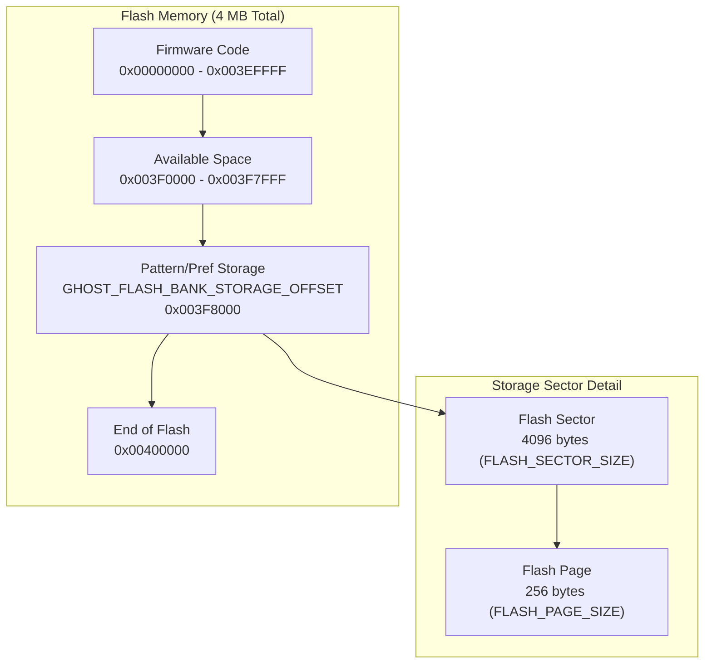
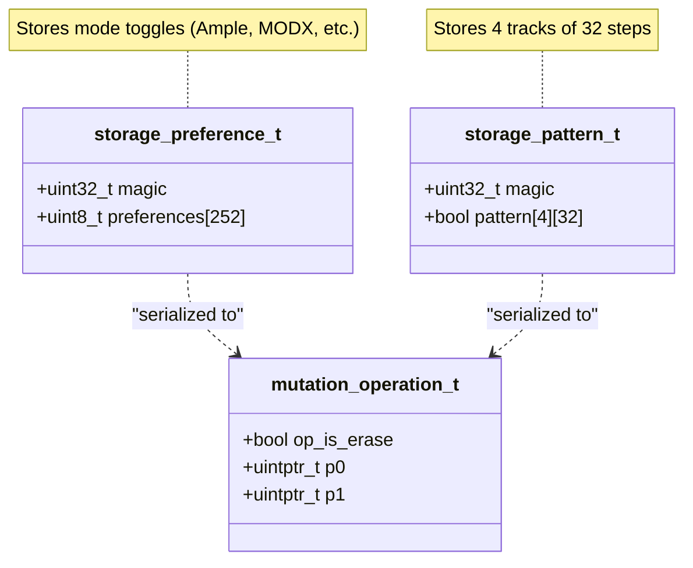
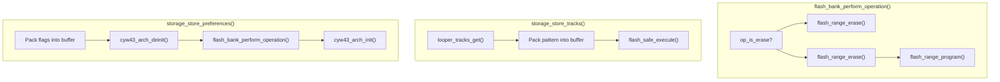

# Pattern Storage

> **Relevant source files**
> * [storage.c](https://github.com/Jus-Be/orinayo-pico/blob/6dde5a75/storage.c)
> * [storage.h](https://github.com/Jus-Be/orinayo-pico/blob/6dde5a75/storage.h)

## Purpose and Scope

This document describes the flash-based persistent storage system for looper drum patterns and system preferences. The storage module ([storage.c](https://github.com/Jus-Be/orinayo-pico/blob/6dde5a75/storage.c)

) provides functions to save, load, and erase data across power cycles using the Raspberry Pi Pico W's onboard flash memory. It handles both musical pattern data (32-step sequences) and operational configuration flags (e.g., Arranger mode, MIDI device enables).

**Sources:** [storage.c L1-L165](https://github.com/Jus-Be/orinayo-pico/blob/6dde5a75/storage.c#L1-L165)

 [storage.h L1-L15](https://github.com/Jus-Be/orinayo-pico/blob/6dde5a75/storage.h#L1-L15)

---

## Flash Memory Architecture

The storage system reserves a dedicated region at the end of the Pico W's flash memory. Flash operations on the RP2040 require specific alignment and the suspension of XIP (Execute In Place) access to prevent CPU stalls or crashes.

### Memory Layout

```mermaid
flowchart TD

FW["Firmware Code<br>0x00000000 - 0x003EFFFF"]
RESERVED["Available Space<br>0x003F0000 - 0x003F7FFF"]
STORAGE["Pattern/Pref Storage<br>GHOST_FLASH_BANK_STORAGE_OFFSET<br>0x003F8000"]
END["End of Flash<br>0x00400000"]
SECTOR["Flash Sector<br>4096 bytes (FLASH_SECTOR_SIZE)"]
PAGE["Flash Page<br>256 bytes (FLASH_PAGE_SIZE)"]

STORAGE --> SECTOR

subgraph StorageDetail ["Storage Sector Detail"]
    SECTOR
    PAGE
    SECTOR --> PAGE
end

subgraph Flash ["Flash Memory (4 MB Total)"]
    FW
    RESERVED
    STORAGE
    END
    FW --> RESERVED
    RESERVED --> STORAGE
    STORAGE --> END
end
```

**Sources:** [storage.c L13-L15](https://github.com/Jus-Be/orinayo-pico/blob/6dde5a75/storage.c#L13-L15)

### Flash Offset Calculation

| Constant | Value | Description |
| --- | --- | --- |
| `GHOST_FLASH_BANK_STORAGE_OFFSET` | `PICO_FLASH_SIZE_BYTES - (FLASH_SECTOR_SIZE * 8)` | Storage location (32KB from end) |
| `FLASH_SECTOR_SIZE` | 4096 bytes | Minimum erase unit |
| `FLASH_PAGE_SIZE` | 256 bytes | Minimum write unit |
| `XIP_BASE` | 0x10000000 | Flash memory mapped address for reads |

**Sources:** [storage.c L13-L15](https://github.com/Jus-Be/orinayo-pico/blob/6dde5a75/storage.c#L13-L15)

 [storage.c L107](https://github.com/Jus-Be/orinayo-pico/blob/6dde5a75/storage.c#L107-L107)

---

## Storage Format

The system utilizes two distinct structures for persistence: one for looper patterns and one for system-wide preferences. Both use a "GHST" magic header for validation.

### Data Structures

```mermaid
classDiagram
    note for storage_preference_t "Stores mode toggles (Ample, MODX, etc.)"
    note for storage_pattern_t "Stores 4 tracks of 32 steps"
    class storage_preference_t {
        +uint32_t magic
        +uint8_t preferences[252]
    }
    class storage_pattern_t {
        +uint32_t magic
        +bool pattern[4][32]
    }
    class mutation_operation_t {
        +bool op_is_erase
        +uintptr_t p0
        +uintptr_t p1
    }
    storage_preference_t ..> mutation_operation_t : "serialized to"
    storage_pattern_t ..> mutation_operation_t : "serialized to"
```

**Sources:** [storage.c L17-L34](https://github.com/Jus-Be/orinayo-pico/blob/6dde5a75/storage.c#L17-L34)

### Preferences Mapping

The `preferences` array in `storage_preference_t` maps specific indices to global boolean flags:

| Index | Global Variable | Description |
| --- | --- | --- |
| 0 | `enable_ample_guitar` | Ample Guitar mode toggle |
| 1 | `enable_midi_drums` | MIDI Drums mode toggle |
| 2 | `enable_seqtrak` | Yamaha SeqTrak mode toggle |
| 3 | `enable_modx` | Yamaha MODX mode toggle |
| 4 | `enable_sp404mk2` | Roland SP-404MK2 mode toggle |
| 5 | `enable_arranger_mode` | Arranger mode toggle |
| 6 | `guitar_pc_code` | Program Change code for guitar |
| 7 | `enable_mpc_sample` | MPC Sample mode toggle |
| 8 | `enable_mpx_looper` | MPX Looper mode toggle |
| 9 | `enable_nanobox_tangerine` | Nanobox Tangerine mode toggle |
| 10 | `enable_synth` | Synth mode toggle |

**Sources:** [storage.c L81-L91](https://github.com/Jus-Be/orinayo-pico/blob/6dde5a75/storage.c#L81-L91)

 [storage.c L114-L124](https://github.com/Jus-Be/orinayo-pico/blob/6dde5a75/storage.c#L114-L124)

---

## Storage Operations

The storage module handles the lifecycle of persistent data, including complex synchronization with the Bluetooth stack during preference updates.

### Operation Flow

```mermaid
flowchart TD

F1["op_is_erase?"]
F2["flash_range_erase()"]
F3["flash_range_erase()"]
F4["flash_range_program()"]
T1["looper_tracks_get()"]
T2["Pack pattern into buffer"]
T3["flash_safe_execute()"]
P1["Pack flags into buffer"]
P2["cyw43_arch_deinit()"]
P3["flash_bank_perform_operation()"]
P4["cyw43_arch_init()"]

subgraph FlashOp ["flash_bank_perform_operation()"]
    F1
    F2
    F3
    F4
    F1 --> F2
    F1 --> F3
    F3 --> F4
end

subgraph TrackSave ["storage_store_tracks()"]
    T1
    T2
    T3
    T1 --> T2
    T2 --> T3
end

subgraph PrefSave ["storage_store_preferences()"]
    P1
    P2
    P3
    P4
    P1 --> P2
    P2 --> P3
    P3 --> P4
end
```

**Sources:** [storage.c L50-L61](https://github.com/Jus-Be/orinayo-pico/blob/6dde5a75/storage.c#L50-L61)

 [storage.c L75-L104](https://github.com/Jus-Be/orinayo-pico/blob/6dde5a75/storage.c#L75-L104)

 [storage.c L150-L162](https://github.com/Jus-Be/orinayo-pico/blob/6dde5a75/storage.c#L150-L162)

### Preference Persistence

The `storage_store_preferences` function is unique because it manually manages the CYW43 (Bluetooth/Wi-Fi) architecture. To ensure flash writing safety without using the standard `flash_safe_execute` wrapper in some contexts, it calls `cyw43_arch_deinit()` before writing and `cyw43_arch_init()` after.

**Implementation:** [storage.c L75-L104](https://github.com/Jus-Be/orinayo-pico/blob/6dde5a75/storage.c#L75-L104)

### Pattern Persistence

Patterns are stored using the `storage_store_tracks` function. It retrieves the active track data from the looper and writes the first 4 tracks to flash.

**Process:**

1. Calls `looper_tracks_get()` to access memory-resident patterns. [storage.c L144](https://github.com/Jus-Be/orinayo-pico/blob/6dde5a75/storage.c#L144-L144)
2. Copies `tracks[t].pattern` to a local `storage_pattern_t` buffer. [storage.c L158](https://github.com/Jus-Be/orinayo-pico/blob/6dde5a75/storage.c#L158-L158)
3. Uses `flash_safe_execute` to perform the write, ensuring interrupts are disabled. [storage.c L162](https://github.com/Jus-Be/orinayo-pico/blob/6dde5a75/storage.c#L162-L162)

---

## Safety Mechanisms

The storage implementation uses several layers of protection to ensure the integrity of both the flash hardware and the stored data.

### Flash Operation Wrapper

The `flash_bank_perform_operation` function is marked with `__no_inline_not_in_flash_func`. This attribute ensures the code is executed from RAM, which is mandatory when the flash chip is busy with erase or program cycles and cannot provide instructions to the CPU.

**Sources:** [storage.c L50](https://github.com/Jus-Be/orinayo-pico/blob/6dde5a75/storage.c#L50-L50)

### Validation and Integrity

| Feature | Implementation | Purpose |
| --- | --- | --- |
| **Magic Header** | `MAGIC_HEADER` ("GHST") | Validates that data exists and is formatted correctly. [storage.c L17](https://github.com/Jus-Be/orinayo-pico/blob/6dde5a75/storage.c#L17-L17) |
| **RAM Execution** | `not_in_flash_func` | Prevents CPU crashes during flash access. [storage.c L50](https://github.com/Jus-Be/orinayo-pico/blob/6dde5a75/storage.c#L50-L50) |
| **Interrupt Safety** | `flash_safe_execute()` | Disables interrupts to prevent XIP access during writes. [storage.c L69](https://github.com/Jus-Be/orinayo-pico/blob/6dde5a75/storage.c#L69-L69) |
| **Bluetooth Sync** | `cyw43_arch_deinit()` | Prevents Bluetooth radio activity from interfering with flash power/timing. [storage.c L98](https://github.com/Jus-Be/orinayo-pico/blob/6dde5a75/storage.c#L98-L98) |

---

## API Reference

### Public Functions

#### storage_load_preferences()

Reads system flags from flash and updates global variables.

* **Returns:** `true` if magic header matches, `false` otherwise.
* **Implementation:** [storage.c L106-L128](https://github.com/Jus-Be/orinayo-pico/blob/6dde5a75/storage.c#L106-L128)

#### storage_store_preferences()

Writes current system flags to flash.

* **Note:** Restarts the CYW43 architecture.
* **Implementation:** [storage.c L75-L104](https://github.com/Jus-Be/orinayo-pico/blob/6dde5a75/storage.c#L75-L104)

#### storage_load_tracks()

Restores looper patterns from flash into the active `track_t` structures.

* **Implementation:** [storage.c L130-L147](https://github.com/Jus-Be/orinayo-pico/blob/6dde5a75/storage.c#L130-L147)

#### storage_store_tracks()

Saves the first 4 looper tracks to persistent storage.

* **Implementation:** [storage.c L149-L165](https://github.com/Jus-Be/orinayo-pico/blob/6dde5a75/storage.c#L149-L165)

#### storage_erase_tracks()

Wipes the storage sector by performing a flash erase operation.

* **Implementation:** [storage.c L67-L73](https://github.com/Jus-Be/orinayo-pico/blob/6dde5a75/storage.c#L67-L73)

**Sources:** [storage.h L1-L15](https://github.com/Jus-Be/orinayo-pico/blob/6dde5a75/storage.h#L1-L15)

 [storage.c L50-L165](https://github.com/Jus-Be/orinayo-pico/blob/6dde5a75/storage.c#L50-L165)