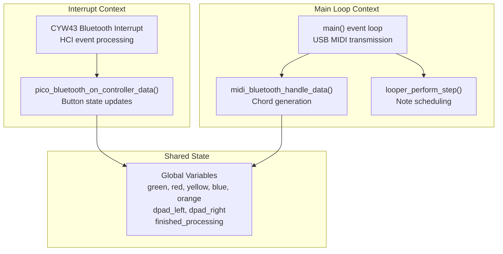
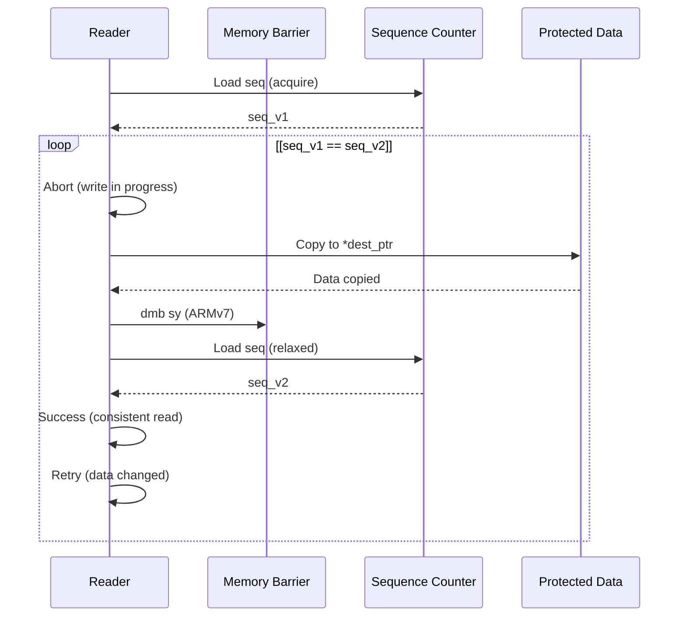
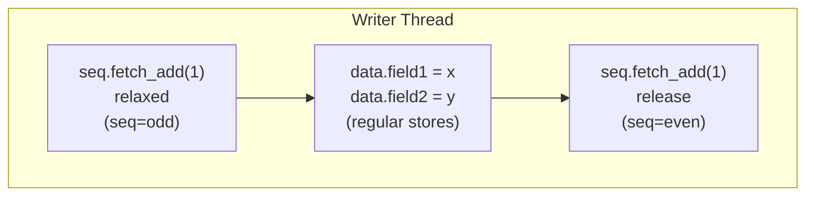
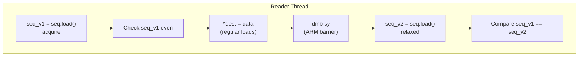
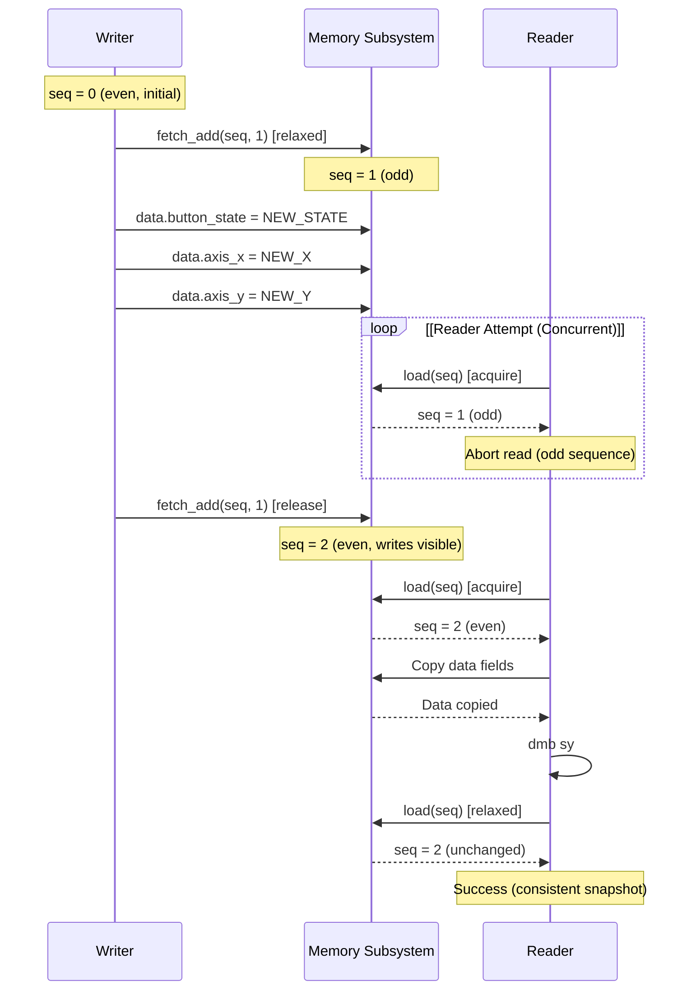
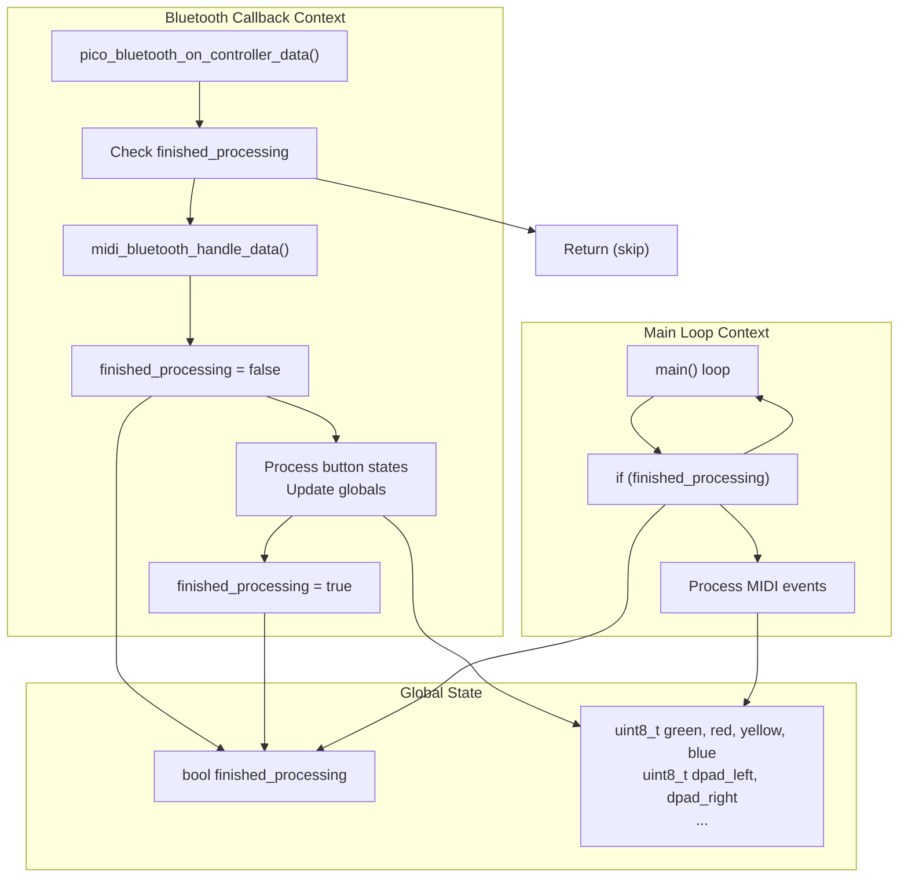

# Synchronization Primitives

> **Relevant source files**
> * [pico_bluetooth.c](https://github.com/Jus-Be/orinayo-pico/blob/122fa496/pico_bluetooth.c)
> * [pico_bluetooth.h](https://github.com/Jus-Be/orinayo-pico/blob/122fa496/pico_bluetooth.h)
> * [sdkconfig.h](https://github.com/Jus-Be/orinayo-pico/blob/122fa496/sdkconfig.h)
> * [seqlock.h](https://github.com/Jus-Be/orinayo-pico/blob/122fa496/seqlock.h)

This document describes the synchronization mechanisms used in the Orinayo system to coordinate data access between concurrent execution contexts. The primary mechanism is a lightweight sequence lock (seqlock) implementation designed for single-writer/multiple-reader scenarios on the RP2040 dual-core processor.

For information about asynchronous timer scheduling, see [Asynchronous Timer](./8.1-asynchronous-timer.md). For pattern storage mechanisms, see [Pattern Storage](./8.2-pattern-storage.md).

## Purpose and Scope

The Orinayo system processes Bluetooth input events in interrupt contexts while simultaneously generating MIDI output in the main application loop. These concurrent operations require careful synchronization to ensure data consistency without compromising real-time responsiveness. This page documents:

* The seqlock synchronization primitive implementation
* Memory ordering semantics and atomic operations
* Usage patterns for concurrent data access
* Design rationale for avoiding traditional mutex locks

Sources: [seqlock.h L1-L104](https://github.com/Jus-Be/orinayo-pico/blob/122fa496/seqlock.h#L1-L104)

## Concurrency Challenges

The system faces specific concurrency challenges due to its architecture:



**Key Constraints:**

| Constraint | Impact | Solution |
| --- | --- | --- |
| Bluetooth HCI interrupts must not be blocked | Loss of Bluetooth packets if IRQs disabled | Use lock-free synchronization |
| USB MIDI transmission holds mutex | Cannot call USB functions from callbacks | Schedule notes, dispatch in main loop |
| Single writer (Bluetooth callback) | Simplified synchronization requirements | Seqlock optimized for this pattern |
| Multiple potential readers (main loop subsystems) | Need consistent snapshots | Retry-based read mechanism |

Sources: [seqlock.h L1-L16](https://github.com/Jus-Be/orinayo-pico/blob/122fa496/seqlock.h#L1-L16)

 [pico_bluetooth.c L26-L108](https://github.com/Jus-Be/orinayo-pico/blob/122fa496/pico_bluetooth.c#L26-L108)

## Seqlock Mechanism

The seqlock implementation provides lock-free synchronization for scenarios with one writer and potentially multiple readers. The mechanism uses a sequence counter to detect concurrent modifications.

### State Machine

```

```

**Protocol:**

1. **Writer enters**: Increments sequence to odd value (indicates write in progress)
2. **Writer updates**: Modifies protected data structure
3. **Writer exits**: Increments sequence to even value (write complete, data consistent)
4. **Reader attempts**: Loads sequence counter with acquire semantics
5. **Reader validates**: If odd, abort immediately (write in progress)
6. **Reader copies**: If even, copy data to local storage
7. **Reader verifies**: Re-load sequence counter; if changed, data may be inconsistent, retry

Sources: [seqlock.h L4-L16](https://github.com/Jus-Be/orinayo-pico/blob/122fa496/seqlock.h#L4-L16)

 [seqlock.h L39-L75](https://github.com/Jus-Be/orinayo-pico/blob/122fa496/seqlock.h#L39-L75)

## API Reference

### Declaration Macro

The `SEQLOCK_DECL` macro creates a structure type combining a sequence counter with a payload:

```
SEQLOCK_DECL(name, payload_type)
```

**Expansion:**

```python
typedef struct {
    _Atomic uint32_t seq;  // Sequence counter
    payload_type data;     // Protected data
} name
```

**Parameters:**

* `name`: Type name for the seqlock-protected structure
* `payload_type`: Type of data to protect (e.g., `uni_gamepad_t`, `looper_status_t`)

Sources: [seqlock.h L27-L37](https://github.com/Jus-Be/orinayo-pico/blob/122fa496/seqlock.h#L27-L37)

### Writer Functions

#### seqlock_write_begin()

```
static inline void seqlock_write_begin(_Atomic uint32_t* seq)
```

Marks the beginning of a write operation by incrementing the sequence counter to an odd value using relaxed memory ordering (no synchronization required yet).

**Memory Ordering:** `memory_order_relaxed` - No ordering constraints; subsequent writes can be reordered before this.

Sources: [seqlock.h L39-L42](https://github.com/Jus-Be/orinayo-pico/blob/122fa496/seqlock.h#L39-L42)

#### seqlock_write_end()

```
static inline void seqlock_write_end(_Atomic uint32_t* seq)
```

Marks the end of a write operation by incrementing the sequence counter to an even value using release semantics. This ensures all writes to the protected data become visible to other threads before the sequence update.

**Memory Ordering:** `memory_order_release` - All prior writes complete before this operation; readers using acquire semantics will see them.

Sources: [seqlock.h L44-L47](https://github.com/Jus-Be/orinayo-pico/blob/122fa496/seqlock.h#L44-L47)

### Reader Macro

#### SEQLOCK_TRY_READ()

```
SEQLOCK_TRY_READ(dest_ptr, src_obj)
```

Attempts to read a consistent snapshot of the protected data into a destination buffer.

**Parameters:**

* `dest_ptr`: Pointer to destination (e.g., `&local_gamepad`)
* `src_obj`: Seqlock instance (not pointer, the object itself)

**Returns:** `true` if read succeeded and `dest_ptr` contains consistent data, `false` if write was in progress

**Implementation Flow:**



**Memory Barrier:** The inline assembly `dmb sy` (data memory barrier, full system) ensures the data copy completes before re-reading the sequence counter. On ARM architectures, this prevents reordering of the data read past the second sequence load.

Sources: [seqlock.h L49-L75](https://github.com/Jus-Be/orinayo-pico/blob/122fa496/seqlock.h#L49-L75)

## Memory Ordering Semantics

The seqlock implementation relies on C11 atomic operations with specific memory ordering constraints:

### Write Path Memory Model



**Key Points:**

| Operation | Memory Order | Purpose |
| --- | --- | --- |
| First `fetch_add` | `memory_order_relaxed` | No synchronization needed; just marks entry |
| Data writes | Regular stores | Compiler won't reorder past release fence |
| Second `fetch_add` | `memory_order_release` | Establishes synchronizes-with relationship |

The **release** operation at write end ensures all prior stores (the data writes) are visible before the sequence counter becomes even.

Sources: [seqlock.h L40-L46](https://github.com/Jus-Be/orinayo-pico/blob/122fa496/seqlock.h#L40-L46)

### Read Path Memory Model



**Key Points:**

| Operation | Memory Order | Purpose |
| --- | --- | --- |
| First `load` | `memory_order_acquire` | Synchronizes-with writer's release; see writes |
| Data reads | Regular loads | Copy protected structure fields |
| Memory barrier | `dmb sy` (ARM) | Prevent reordering of data reads past seq check |
| Second `load` | `memory_order_relaxed` | Just checking counter value |

The **acquire** operation at read start pairs with the writer's **release** to establish a happens-before relationship: if the reader sees an even sequence number, it will also see all writes the writer made before incrementing to that even number.

Sources: [seqlock.h L59-L75](https://github.com/Jus-Be/orinayo-pico/blob/122fa496/seqlock.h#L59-L75)

### Synchronization Timeline



Sources: [seqlock.h L4-L16](https://github.com/Jus-Be/orinayo-pico/blob/122fa496/seqlock.h#L4-L16)

 [seqlock.h L59-L75](https://github.com/Jus-Be/orinayo-pico/blob/122fa496/seqlock.h#L59-L75)

## Usage Pattern in Orinayo

While the seqlock header is present in the codebase, the current implementation primarily uses simple atomic flags rather than full seqlock protection. The `finished_processing` flag demonstrates a simplified synchronization approach:

### Current Synchronization Approach



**Implementation:**

[pico_bluetooth.c L327-L331](https://github.com/Jus-Be/orinayo-pico/blob/122fa496/pico_bluetooth.c#L327-L331)

 - Entry guard in `midi_bluetooth_handle_data()`:

```
if (!finished_processing) return;
finished_processing = false;
```

[pico_bluetooth.c L540](https://github.com/Jus-Be/orinayo-pico/blob/122fa496/pico_bluetooth.c#L540-L540)

 [pico_bluetooth.c L558](https://github.com/Jus-Be/orinayo-pico/blob/122fa496/pico_bluetooth.c#L558-L558)

 etc. - Exit points set flag:

```
finished_processing = true;
return;
```

**Limitation:** The current approach uses regular boolean variable without atomic operations or memory barriers. This works on single-core execution where the Bluetooth callback and main loop run on the same core, but would require proper atomic operations for true multi-core safety.

Sources: [pico_bluetooth.c L40](https://github.com/Jus-Be/orinayo-pico/blob/122fa496/pico_bluetooth.c#L40-L40)

 [pico_bluetooth.c L327-L331](https://github.com/Jus-Be/orinayo-pico/blob/122fa496/pico_bluetooth.c#L327-L331)

 [pico_bluetooth.c L540](https://github.com/Jus-Be/orinayo-pico/blob/122fa496/pico_bluetooth.c#L540-L540)

### Potential Seqlock Application

The seqlock mechanism would be appropriate for protecting gamepad state shared between cores:

```c
// Hypothetical application (not currently implemented)
#include "seqlock.h"
#include <controller/uni_gamepad.h>

// Declare protected type
SEQLOCK_DECL(shared_gamepad_t, uni_gamepad_t);

// Global instance (32-byte aligned for cache line)
shared_gamepad_t g_shared_gamepad __attribute__((aligned(32)));

// Writer (Bluetooth callback, Core 0)
void on_controller_data(uni_controller_t* ctl) {
    seqlock_write_begin(&g_shared_gamepad.seq);
    g_shared_gamepad.data = ctl->gamepad;  // Struct copy
    seqlock_write_end(&g_shared_gamepad.seq);
}

// Reader (Main loop, Core 0 or Core 1)
bool get_gamepad_state(uni_gamepad_t* out) {
    return SEQLOCK_TRY_READ(out, g_shared_gamepad);
}
```

**Alignment Requirement:** The `__attribute__((aligned(32)))` ensures the structure doesn't span cache lines on RP2040, which has 32-byte cache lines. This prevents false sharing and ensures atomic access to the sequence counter.

Sources: [seqlock.h L78-L102](https://github.com/Jus-Be/orinayo-pico/blob/122fa496/seqlock.h#L78-L102)

## Comparison with Alternatives

### Synchronization Mechanism Trade-offs

| Mechanism | IRQ Blocking | Wait-Free | Overhead | Use Case |
| --- | --- | --- | --- | --- |
| **Seqlock** | No | Reader only | Very low | Single writer, multiple readers |
| **Mutex** | Yes (disable IRQs) | No | Moderate | Multiple writers, blocking acceptable |
| **Spinlock** | Yes | No | Low-High | Short critical sections, multi-core |
| **Atomic flags** | No | Yes | Minimal | Simple boolean state |
| **Message queue** | No | No | High | Decoupled event passing |

**Why Seqlock for Orinayo:**

1. **Bluetooth responsiveness**: HCI interrupts must not be blocked; seqlock never disables interrupts
2. **Single writer pattern**: Bluetooth callbacks are the sole updater of controller state
3. **Read-heavy workload**: Main loop reads state frequently; seqlock optimizes for readers
4. **Lock-free guarantee**: Readers never block the writer, ensuring bounded latency
5. **Small data structures**: Copying `uni_gamepad_t` is cheap (few dozen bytes)

**Alternative Considered - USB Mutex Avoidance:**

The note scheduler (see [Note Scheduler](./5.5-note-scheduler.md)) uses a different pattern: schedule notes from async context, dispatch from main loop. This avoids USB mutex contention entirely rather than using synchronization primitives.

Sources: [seqlock.h L11-L13](https://github.com/Jus-Be/orinayo-pico/blob/122fa496/seqlock.h#L11-L13)

## Implementation Details

### Atomic Operation Assembly

On ARM Cortex-M33 (RP2350), the atomic operations compile to specific instructions:

**`atomic_fetch_add_explicit(seq, 1, memory_order_relaxed)`:**

```
ldr    r0, [seq_addr]      ; Load current value
add    r1, r0, #1          ; Increment
str    r1, [seq_addr]      ; Store back (no barrier)
```

**`atomic_fetch_add_explicit(seq, 1, memory_order_release)`:**

```
ldr    r0, [seq_addr]      ; Load current value
add    r1, r0, #1          ; Increment
dmb    sy                  ; Data memory barrier (full system)
str    r1, [seq_addr]      ; Store with release semantics
```

**`atomic_load_explicit(seq, memory_order_acquire)`:**

```
ldr    r0, [seq_addr]      ; Load value
dmb    sy                  ; Data memory barrier (full system)
```

The `dmb sy` (Data Memory Barrier, full System) instruction ensures:

* All memory operations before the barrier complete before operations after
* Provides ordering guarantees across both cores on RP2040/RP2350
* Essential for visibility of data writes to readers on different cores

Sources: [seqlock.h L41](https://github.com/Jus-Be/orinayo-pico/blob/122fa496/seqlock.h#L41-L41)

 [seqlock.h L46](https://github.com/Jus-Be/orinayo-pico/blob/122fa496/seqlock.h#L46-L46)

 [seqlock.h L64](https://github.com/Jus-Be/orinayo-pico/blob/122fa496/seqlock.h#L64-L64)

 [seqlock.h L70](https://github.com/Jus-Be/orinayo-pico/blob/122fa496/seqlock.h#L70-L70)

### Cache Coherency Considerations

The RP2350 has separate instruction and data caches per core, but they maintain coherency through the bus fabric. The seqlock implementation assumes:

1. **Cache line size**: 32 bytes on RP2350
2. **Atomic access**: `uint32_t` loads/stores are naturally atomic on 32-bit ARM
3. **Alignment**: Proper alignment prevents partial cache line updates
4. **Barriers**: Memory barriers ensure cache flushes/invalidations occur

**Best Practice:**

```python
// Ensure seqlock doesn't span cache lines
typedef struct {
    uint32_t padding_before[6];  // Pad to cache line boundary
    shared_gamepad_t gamepad __attribute__((aligned(32)));
    uint32_t padding_after[6];
} cache_aligned_data_t;
```

Sources: [seqlock.h L78-L102](https://github.com/Jus-Be/orinayo-pico/blob/122fa496/seqlock.h#L78-L102)

## Future Enhancements

The seqlock infrastructure is in place but not actively used in the current codebase. Potential applications:

### Multi-Core Data Sharing

If Core 1 were utilized for musical processing (looper, ghost notes), seqlock could protect:

```python
// Protect looper state for cross-core access
SEQLOCK_DECL(shared_looper_t, looper_status_t);
shared_looper_t g_shared_looper __attribute__((aligned(32)));

// Core 0: Updates from button events
void button_callback(button_event_t event) {
    seqlock_write_begin(&g_shared_looper.seq);
    // Update looper state
    seqlock_write_end(&g_shared_looper.seq);
}

// Core 1: Reads for note generation
void looper_process_on_core1(void) {
    looper_status_t local_status;
    if (SEQLOCK_TRY_READ(&local_status, g_shared_looper)) {
        // Process with consistent snapshot
    }
}
```

### Ghost Note Parameter Protection

The ghost note intensity is currently accessed without synchronization (see [Ghost Note Generation](./5.4-ghost-note-generation.md)):

```python
// Current implementation (no protection)
ghost_parameters_t *params = ghost_note_parameters();
params->ghost_intensity = 0.843;  // Direct write from callback

// With seqlock
SEQLOCK_DECL(shared_ghost_params_t, ghost_parameters_t);
// ... protected updates
```

### Tap Tempo History Buffer

The tap tempo system (see [Tap Tempo](./5.6-tap-tempo.md)) maintains timing history that could benefit from seqlock protection if accessed across cores.

Sources: [pico_bluetooth.c L1109-L1110](https://github.com/Jus-Be/orinayo-pico/blob/122fa496/pico_bluetooth.c#L1109-L1110)

 [pico_bluetooth.c L1139-L1146](https://github.com/Jus-Be/orinayo-pico/blob/122fa496/pico_bluetooth.c#L1139-L1146)

---

**Summary:** The seqlock primitive provides efficient, lock-free synchronization for the single-writer/multiple-reader pattern. While the infrastructure exists in `seqlock.h`, the current single-core implementation uses simpler flag-based synchronization. The seqlock design allows future multi-core enhancements without blocking critical Bluetooth interrupt processing.