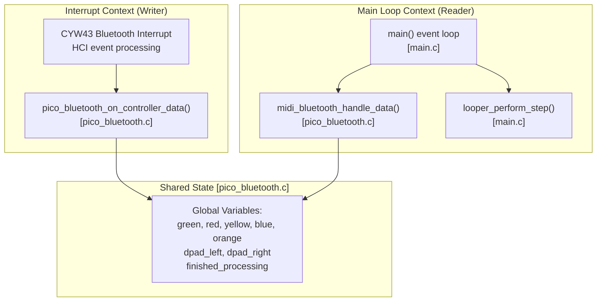
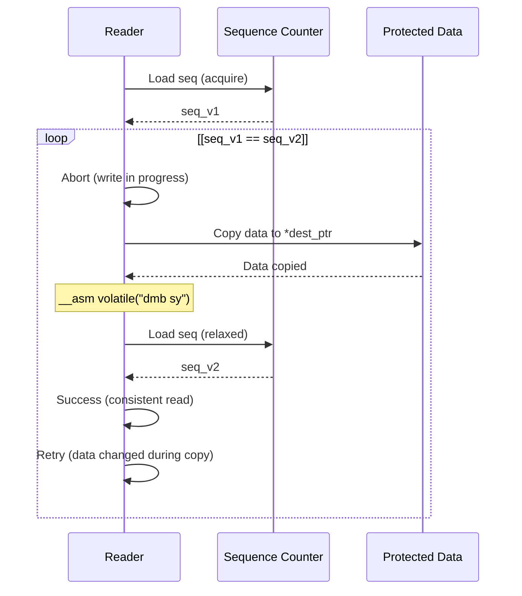
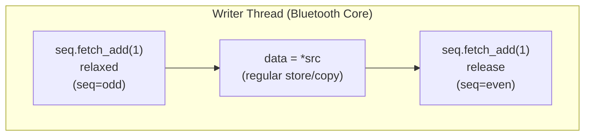
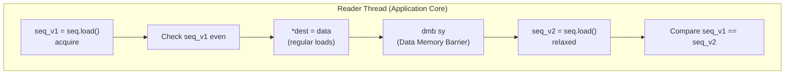

# Synchronization Primitives

> **Relevant source files**
> * [btstack_config.h](https://github.com/Jus-Be/orinayo-pico/blob/6dde5a75/btstack_config.h)
> * [debug.h](https://github.com/Jus-Be/orinayo-pico/blob/6dde5a75/debug.h)
> * [pico_bluetooth.h](https://github.com/Jus-Be/orinayo-pico/blob/6dde5a75/pico_bluetooth.h)
> * [ring_buffer_lib/CMakeLists.txt](https://github.com/Jus-Be/orinayo-pico/blob/6dde5a75/ring_buffer_lib/CMakeLists.txt)
> * [ring_buffer_lib/ring_buffer_lib.c](https://github.com/Jus-Be/orinayo-pico/blob/6dde5a75/ring_buffer_lib/ring_buffer_lib.c)
> * [ring_buffer_lib/ring_buffer_lib.h](https://github.com/Jus-Be/orinayo-pico/blob/6dde5a75/ring_buffer_lib/ring_buffer_lib.h)
> * [sdkconfig.h](https://github.com/Jus-Be/orinayo-pico/blob/6dde5a75/sdkconfig.h)
> * [seqlock.h](https://github.com/Jus-Be/orinayo-pico/blob/6dde5a75/seqlock.h)

This document describes the synchronization mechanisms used in the Orinayo system to coordinate data access between concurrent execution contexts. The primary mechanism is a lightweight sequence lock (seqlock) implementation designed for single-writer/multiple-reader scenarios on the RP2040/RP2350 dual-core processor.

For information about asynchronous timer scheduling, see [8.1 Asynchronous Timer](https://github.com/Jus-Be/orinayo-pico/blob/6dde5a75/8.1 Asynchronous Timer)

 For pattern storage mechanisms, see [8.2 Pattern Storage](https://github.com/Jus-Be/orinayo-pico/blob/6dde5a75/8.2 Pattern Storage)

## Purpose and Scope

The Orinayo system processes Bluetooth input events in interrupt contexts while simultaneously generating MIDI output in the main application loop. These concurrent operations require careful synchronization to ensure data consistency without compromising real-time responsiveness. This page documents:

* The seqlock synchronization primitive implementation.
* Memory ordering semantics and atomic operations using C11 atomics.
* Usage patterns for concurrent data access between the Bluetooth stack and application logic.
* Design rationale for avoiding traditional mutex locks in interrupt-driven environments.

Sources: [seqlock.h L1-L17](https://github.com/Jus-Be/orinayo-pico/blob/6dde5a75/seqlock.h#L1-L17)

## Concurrency Challenges

The system faces specific concurrency challenges due to its architecture, where high-priority Bluetooth interrupts must not be stalled by lower-priority application processing.

### Data Flow and Contexts

The following diagram maps the relationship between execution contexts and the shared state variables defined in the Bluetooth handling logic.

**Context to Entity Mapping**


```mermaid
flowchart TD

BTInterrupt["CYW43 Bluetooth Interrupt<br>HCI event processing"]
HIDCallback["pico_bluetooth_on_controller_data()<br>[pico_bluetooth.c]"]
MainLoop["main() event loop<br>[main.c]"]
MIDIProcess["midi_bluetooth_handle_data()<br>[pico_bluetooth.c]"]
Looper["looper_perform_step()<br>[main.c]"]
GlobalVars["Global Variables:<br>green, red, yellow, blue, orange<br>dpad_left, dpad_right<br>finished_processing"]

HIDCallback --> GlobalVars
MIDIProcess --> GlobalVars

subgraph subGraph2 ["Shared State [pico_bluetooth.c]"]
    GlobalVars
end

subgraph subGraph1 ["Main Loop Context (Reader)"]
    MainLoop
    MIDIProcess
    Looper
    MainLoop --> MIDIProcess
    MainLoop --> Looper
end

subgraph subGraph0 ["Interrupt Context (Writer)"]
    BTInterrupt
    HIDCallback
    BTInterrupt --> HIDCallback
end
```

**Key Constraints:**

| Constraint | Impact | Solution |
| --- | --- | --- |
| Bluetooth HCI interrupts must not be blocked | Loss of Bluetooth packets if IRQs disabled | Use lock-free synchronization (Seqlock) |
| USB MIDI transmission holds mutex | Cannot call USB functions from callbacks | Schedule notes, dispatch in main loop |
| Single writer (Bluetooth callback) | Simplified synchronization requirements | Seqlock optimized for this pattern |
| Multiple potential readers (main loop subsystems) | Need consistent snapshots | Retry-based read mechanism |

Sources: [seqlock.h L4-L13](https://github.com/Jus-Be/orinayo-pico/blob/6dde5a75/seqlock.h#L4-L13)

## Seqlock Mechanism

The seqlock implementation provides lock-free synchronization for scenarios with one writer and potentially multiple readers. The mechanism uses a sequence counter to detect concurrent modifications.

### State Machine

```

```

**Protocol:**

1. **Writer enters**: Increments sequence to odd value via `seqlock_write_begin` [seqlock.h L40-L42](https://github.com/Jus-Be/orinayo-pico/blob/6dde5a75/seqlock.h#L40-L42)
2. **Writer updates**: Modifies the protected `data` payload [seqlock.h L36](https://github.com/Jus-Be/orinayo-pico/blob/6dde5a75/seqlock.h#L36-L36)
3. **Writer exits**: Increments sequence to even value via `seqlock_write_end` [seqlock.h L45-L47](https://github.com/Jus-Be/orinayo-pico/blob/6dde5a75/seqlock.h#L45-L47)
4. **Reader attempts**: Loads sequence counter with `memory_order_acquire` [seqlock.h L64](https://github.com/Jus-Be/orinayo-pico/blob/6dde5a75/seqlock.h#L64-L64)
5. **Reader validates**: If odd, it indicates a write is in progress; the reader aborts or retries [seqlock.h L65-L68](https://github.com/Jus-Be/orinayo-pico/blob/6dde5a75/seqlock.h#L65-L68)
6. **Reader copies**: If even, it copies the payload to a local destination [seqlock.h L69](https://github.com/Jus-Be/orinayo-pico/blob/6dde5a75/seqlock.h#L69-L69)
7. **Reader verifies**: Re-loads the sequence counter; if it matches the first load, the snapshot is consistent [seqlock.h L71-L74](https://github.com/Jus-Be/orinayo-pico/blob/6dde5a75/seqlock.h#L71-L74)

Sources: [seqlock.h L4-L10](https://github.com/Jus-Be/orinayo-pico/blob/6dde5a75/seqlock.h#L4-L10)

## API Reference

### Declaration Macro

The `SEQLOCK_DECL` macro creates a structure type combining a sequence counter with a payload:

```
SEQLOCK_DECL(name, type);
```

**Expansion:**
[seqlock.h L33-L37](https://github.com/Jus-Be/orinayo-pico/blob/6dde5a75/seqlock.h#L33-L37)

```python
typedef struct {    _Atomic uint32_t seq;  // internal sequence counter    type data;             // user payload} name;
```

**Parameters:**

* `name`: Type name for the seqlock-protected structure.
* `type`: Type of data to protect (e.g., `uni_gamepad_t`).

Sources: [seqlock.h L33-L37](https://github.com/Jus-Be/orinayo-pico/blob/6dde5a75/seqlock.h#L33-L37)

### Writer Functions

#### seqlock_write_begin()

```
static inline void seqlock_write_begin(_Atomic uint32_t* seq)
```

Marks the beginning of a write operation by incrementing the sequence counter to an odd value using relaxed memory ordering.

**Memory Ordering:** `memory_order_relaxed` [seqlock.h L41](https://github.com/Jus-Be/orinayo-pico/blob/6dde5a75/seqlock.h#L41-L41)

Sources: [seqlock.h L40-L42](https://github.com/Jus-Be/orinayo-pico/blob/6dde5a75/seqlock.h#L40-L42)

#### seqlock_write_end()

```
static inline void seqlock_write_end(_Atomic uint32_t* seq)
```

Marks the end of a write operation by incrementing the sequence counter to an even value using release semantics. This ensures all writes to the protected data become visible to other threads before the sequence update is perceived.

**Memory Ordering:** `memory_order_release` [seqlock.h L46](https://github.com/Jus-Be/orinayo-pico/blob/6dde5a75/seqlock.h#L46-L46)

Sources: [seqlock.h L45-L47](https://github.com/Jus-Be/orinayo-pico/blob/6dde5a75/seqlock.h#L45-L47)

### Reader Macro

#### SEQLOCK_TRY_READ()

```
SEQLOCK_TRY_READ(dest_ptr, src_obj)
```

Attempts to read a consistent snapshot of the protected data into a destination buffer.

**Parameters:**

* `dest_ptr`: Pointer to destination (e.g., `&local_gamepad`).
* `src_obj`: Seqlock instance (the object itself, not a pointer).

**Returns:** `true` if read succeeded and `dest_ptr` contains consistent data, `false` if a write was in progress.

**Implementation Flow:**
[seqlock.h L59-L75](https://github.com/Jus-Be/orinayo-pico/blob/6dde5a75/seqlock.h#L59-L75)


```mermaid
sequenceDiagram
  participant Reader
  participant Sequence Counter
  participant Protected Data

  Reader->>Sequence Counter: Load seq (acquire)
  Sequence Counter-->>Reader: seq_v1
  loop [seq_v1 == seq_v2]
    Reader->>Reader: Abort (write in progress)
    Reader->>Protected Data: Copy data to *dest_ptr
    Protected Data-->>Reader: Data copied
    note over Reader: __asm volatile("dmb sy")
    Reader->>Sequence Counter: Load seq (relaxed)
    Sequence Counter-->>Reader: seq_v2
    Reader->>Reader: Success (consistent read)
    Reader->>Reader: Retry (data changed during copy)
  end
```

**Memory Barrier:** The macro includes `__asm volatile("dmb sy" ::: "memory")` [seqlock.h L70](https://github.com/Jus-Be/orinayo-pico/blob/6dde5a75/seqlock.h#L70-L70)

 to ensure the data copy completes before the final sequence check on ARM architectures.

Sources: [seqlock.h L59-L75](https://github.com/Jus-Be/orinayo-pico/blob/6dde5a75/seqlock.h#L59-L75)

## Memory Ordering Semantics

The seqlock implementation relies on C11 atomic operations (`stdatomic.h`) to ensure correct visibility across cores.

### Write Path Memory Model


```mermaid
flowchart TD

W1["seq.fetch_add(1)<br>relaxed<br>(seq=odd)"]
W2["data = *src<br>(regular store/copy)"]
W3["seq.fetch_add(1)<br>release<br>(seq=even)"]

subgraph subGraph0 ["Writer Thread (Bluetooth Core)"]
    W1
    W2
    W3
    W1 --> W2
    W2 --> W3
end
```

**Key Points:**

* The **release** operation at write end [seqlock.h L46](https://github.com/Jus-Be/orinayo-pico/blob/6dde5a75/seqlock.h#L46-L46)  ensures all prior stores (the data update) are visible before the sequence counter becomes even.

### Read Path Memory Model


```mermaid
flowchart TD

R1["seq_v1 = seq.load()<br>acquire"]
R2["Check seq_v1 even"]
R3["*dest = data<br>(regular loads)"]
R4["dmb sy<br>(Data Memory Barrier)"]
R5["seq_v2 = seq.load()<br>relaxed"]
R6["Compare seq_v1 == seq_v2"]

subgraph subGraph0 ["Reader Thread (Application Core)"]
    R1
    R2
    R3
    R4
    R5
    R6
    R1 --> R2
    R2 --> R3
    R3 --> R4
    R4 --> R5
    R5 --> R6
end
```

**Key Points:**

* The **acquire** operation at read start [seqlock.h L64](https://github.com/Jus-Be/orinayo-pico/blob/6dde5a75/seqlock.h#L64-L64)  pairs with the writer's **release** to establish a happens-before relationship.
* The `dmb sy` barrier [seqlock.h L70](https://github.com/Jus-Be/orinayo-pico/blob/6dde5a75/seqlock.h#L70-L70)  prevents the CPU from reordering the data read past the second sequence load.

Sources: [seqlock.h L40-L75](https://github.com/Jus-Be/orinayo-pico/blob/6dde5a75/seqlock.h#L40-L75)

## Implementation Example

The header provides a template for protecting controller state shared between the Bluetooth stack and the MIDI processing loop.

[seqlock.h L81-L102](https://github.com/Jus-Be/orinayo-pico/blob/6dde5a75/seqlock.h#L81-L102)

```javascript
// Define the shared structureSEQLOCK_DECL(shared_ctrl_t, uni_gamepad_t); // Shared instance (aligned to 32 bytes for RP2040/RP2350 cache lines)shared_ctrl_t g_ctrl __attribute__((aligned(32))); // Writer (Bluetooth core)void bt_new_packet(const uni_gamepad_t *src) {    seqlock_write_begin(&g_ctrl.seq);    g_ctrl.data = *src;                    // struct copy    seqlock_write_end(&g_ctrl.seq);} // Reader (Application core)bool get_snapshot(uni_gamepad_t *dst) {    return SEQLOCK_TRY_READ(dst, g_ctrl);}
```

**Alignment:** The use of `__attribute__((aligned(32)))` [seqlock.h L87](https://github.com/Jus-Be/orinayo-pico/blob/6dde5a75/seqlock.h#L87-L87)

 is critical on the RP2040 to ensure the shared structure does not span multiple cache lines, reducing false sharing and ensuring efficient atomic access.

Sources: [seqlock.h L81-L102](https://github.com/Jus-Be/orinayo-pico/blob/6dde5a75/seqlock.h#L81-L102)