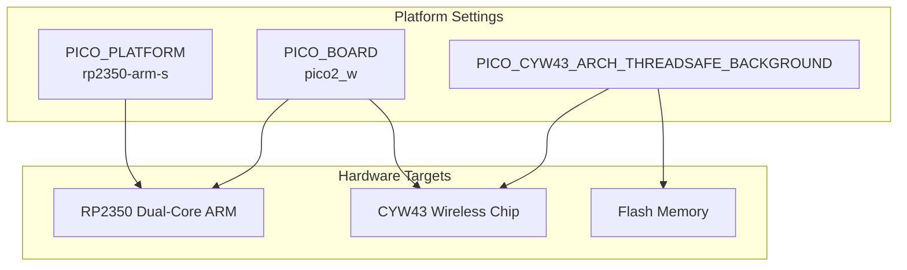
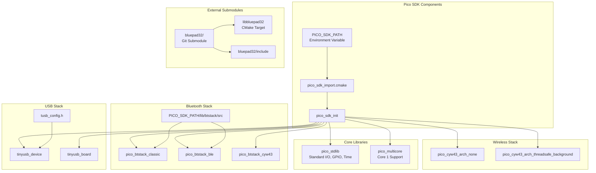
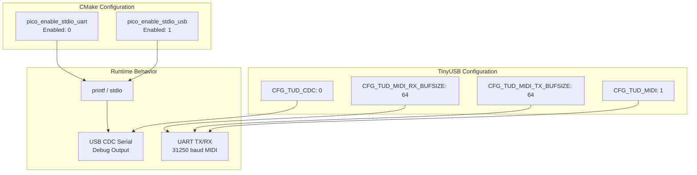
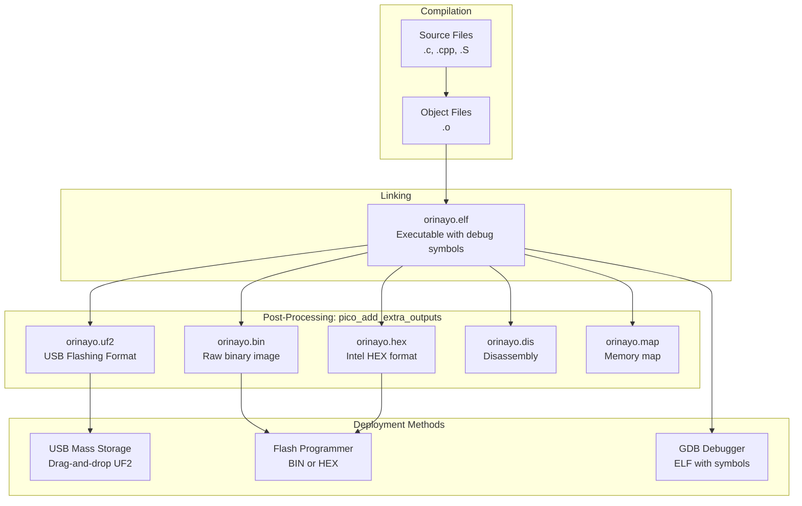
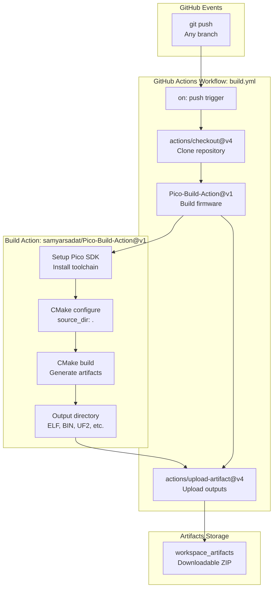

# Build System

> **Relevant source files**
> * [.github/workflows/build.yml](https://github.com/Jus-Be/orinayo-pico/blob/122fa496/.github/workflows/build.yml)
> * [CMakeLists.txt](https://github.com/Jus-Be/orinayo-pico/blob/122fa496/CMakeLists.txt)
> * [tusb_config.h](https://github.com/Jus-Be/orinayo-pico/blob/122fa496/tusb_config.h)

This document describes the CMake-based build system that compiles the Orinayo firmware for the Raspberry Pi Pico 2 W platform. It covers the two-tier library architecture, dependency management, compiler configuration, output artifact generation, and the automated CI/CD pipeline.

For step-by-step instructions on building and flashing the firmware, see [Building and Flashing](./2.2-building-and-flashing.md). For details on the CMake configuration structure, see [CMake Configuration](./9.1-cmake-configuration.md). For dependency integration specifics, see [Dependencies](./9.2-dependencies.md). For the automated build pipeline, see [CI/CD Pipeline](./9.3-cicd-pipeline.md).

## Build Architecture

The build system implements a two-tier architecture that separates Bluetooth infrastructure from application logic. The `orinayobt` static library encapsulates all Bluetooth-related functionality and supporting infrastructure, while the main executable contains the application entry point and musical processing logic.

```mermaid
flowchart TD

BT["pico_bluetooth.c<br>Bluetooth HID/MIDI Translation"]
AT["async_timer.c<br>Async Context Wrapper"]
DISP["display.c<br>UART Display"]
STOR["storage.c<br>Flash Storage"]
MAIN["main.c<br>Application Entry"]
USB["usb_descriptors.c<br>USB Configuration"]
TAP["tap_tempo.c<br>BPM Detection"]
LOOP["looper.c<br>Step Sequencer"]
SCHED["note_scheduler.c<br>Note Timing"]
GHOST["ghost_note.c<br>Pattern Generation"]
ORINAYOBT["liborinayobt.a"]
ORINAYO["orinayo.elf"]
STDLIB["pico_stdlib"]
CYW43NONE["pico_cyw43_arch_none"]
CYW43BG["pico_cyw43_arch_threadsafe_background"]
TINYUSB["tinyusb_device<br>tinyusb_board"]
BTSTACKC["pico_btstack_classic"]
BTSTACKBLE["pico_btstack_ble"]
BTSTACKCYW["pico_btstack_cyw43"]
BP32["libbluepad32<br>bluepad32 subdirectory"]

BT --> ORINAYOBT
AT --> ORINAYOBT
DISP --> ORINAYOBT
STOR --> ORINAYOBT
MAIN --> ORINAYO
USB --> ORINAYO
TAP --> ORINAYO
LOOP --> ORINAYO
SCHED --> ORINAYO
GHOST --> ORINAYO
ORINAYOBT --> ORINAYO
STDLIB --> ORINAYOBT
CYW43NONE --> ORINAYOBT
CYW43BG --> ORINAYOBT
TINYUSB --> ORINAYOBT
BTSTACKC --> ORINAYOBT
BTSTACKBLE --> ORINAYOBT
BTSTACKCYW --> ORINAYOBT
BP32 --> ORINAYOBT
STDLIB --> ORINAYO
CYW43NONE --> ORINAYO
CYW43BG --> ORINAYO
TINYUSB --> ORINAYO
BTSTACKC --> ORINAYO
BTSTACKBLE --> ORINAYO
BTSTACKCYW --> ORINAYO

subgraph subGraph4 ["External Dependencies"]
    BP32
end

subgraph subGraph3 ["Pico SDK Libraries"]
    STDLIB
    CYW43NONE
    CYW43BG
    TINYUSB
    BTSTACKC
    BTSTACKBLE
    BTSTACKCYW
end

subgraph subGraph2 ["Main Executable"]
    ORINAYO
end

subgraph subGraph1 ["Static Library"]
    ORINAYOBT
end

subgraph subGraph0 ["Source Files"]
    BT
    AT
    DISP
    STOR
    MAIN
    USB
    TAP
    LOOP
    SCHED
    GHOST
end
```



**Two-Tier Library Structure**

This architecture is defined in [CMakeLists.txt L39](https://github.com/Jus-Be/orinayo-pico/blob/122fa496/CMakeLists.txt#L39-L39)

 and [CMakeLists.txt L44](https://github.com/Jus-Be/orinayo-pico/blob/122fa496/CMakeLists.txt#L44-L44)

:

| Component | Target Name | Source Files | Purpose |
| --- | --- | --- | --- |
| Static Library | `orinayobt` | `pico_bluetooth.c`, `async_timer.c`, `display.c`, `storage.c` | Bluetooth stack integration and infrastructure |
| Main Executable | `${PROJECT_NAME}` | `main.c`, `usb_descriptors.c`, `tap_tempo.c`, `looper.c`, `note_scheduler.c`, `ghost_note.c` | Application logic and musical processing |

Sources: [CMakeLists.txt L39-L44](https://github.com/Jus-Be/orinayo-pico/blob/122fa496/CMakeLists.txt#L39-L44)

## Platform Configuration

The build system targets the Raspberry Pi Pico 2 W hardware with specific platform settings required for dual-core operation and CYW43 wireless chip support.



**Platform Configuration Details**

| Setting | Value | Configured In | Purpose |
| --- | --- | --- | --- |
| `PICO_PLATFORM` | `rp2350-arm-s` | [CMakeLists.txt L23](https://github.com/Jus-Be/orinayo-pico/blob/122fa496/CMakeLists.txt#L23-L23) | Specifies RP2350 ARM Cortex-M33 secure core variant |
| `PICO_BOARD` | `pico2_w` | [CMakeLists.txt L24](https://github.com/Jus-Be/orinayo-pico/blob/122fa496/CMakeLists.txt#L24-L24) | Selects Pico 2 W board with wireless capabilities |
| `PICO_CYW43_ARCH_THREADSAFE_BACKGROUND` | Defined | [CMakeLists.txt L42](https://github.com/Jus-Be/orinayo-pico/blob/122fa496/CMakeLists.txt#L42-L42) | Enables thread-safe background polling of CYW43 chip |

The `PICO_CYW43_ARCH_THREADSAFE_BACKGROUND` define is critical for maintaining Bluetooth responsiveness while the main core executes application logic. It enables the CYW43 driver to perform background operations in a thread-safe manner.

Sources: [CMakeLists.txt L22-L24](https://github.com/Jus-Be/orinayo-pico/blob/122fa496/CMakeLists.txt#L22-L24)

 [CMakeLists.txt L42](https://github.com/Jus-Be/orinayo-pico/blob/122fa496/CMakeLists.txt#L42-L42)

## Dependency Management

The build system integrates multiple external libraries through CMake's target link mechanism. Dependencies are linked to both the `orinayobt` library and the main executable.



**Library Dependencies**

The following libraries are linked to targets as specified in [CMakeLists.txt L41](https://github.com/Jus-Be/orinayo-pico/blob/122fa496/CMakeLists.txt#L41-L41)

 and [CMakeLists.txt L56](https://github.com/Jus-Be/orinayo-pico/blob/122fa496/CMakeLists.txt#L56-L56)

:

| Library | Linked To | Purpose |
| --- | --- | --- |
| `pico_stdlib` | Both | Standard library, GPIO, time functions |
| `pico_multicore` | Main executable only | Core 1 support (unused but available) |
| `pico_cyw43_arch_none` | Both | CYW43 chip base driver |
| `pico_cyw43_arch_threadsafe_background` | Both | Thread-safe CYW43 polling |
| `tinyusb_device` | Both | TinyUSB device stack |
| `tinyusb_board` | Both | Board-specific USB configuration |
| `pico_btstack_classic` | Both | Bluetooth Classic support |
| `pico_btstack_ble` | Both | Bluetooth Low Energy support |
| `pico_btstack_cyw43` | Both | BTstack integration with CYW43 |
| `bluepad32` | `orinayobt` only | Gamepad controller support |
| `orinayobt` | Main executable only | Static library from first build tier |

**Include Directories**

Include paths are configured in [CMakeLists.txt L40](https://github.com/Jus-Be/orinayo-pico/blob/122fa496/CMakeLists.txt#L40-L40)

 and [CMakeLists.txt L50](https://github.com/Jus-Be/orinayo-pico/blob/122fa496/CMakeLists.txt#L50-L50)

:

| Include Path | Purpose |
| --- | --- |
| `${CMAKE_CURRENT_LIST_DIR}` | Project header files |
| `${CMAKE_CURRENT_LIST_DIR}/bluepad32/include` | Bluepad32 public headers |
| `${PICO_SDK_PATH}/lib/btstack/src` | BTstack internal headers |

**External Submodule Integration**

The Bluepad32 library is integrated as a Git submodule and added to the build in [CMakeLists.txt L67](https://github.com/Jus-Be/orinayo-pico/blob/122fa496/CMakeLists.txt#L67-L67)

:

```
add_subdirectory(${CMAKE_CURRENT_LIST_DIR}/bluepad32 libbluepad32)
```

This creates the `bluepad32` CMake target, which is linked into `orinayobt`.

Sources: [CMakeLists.txt L27](https://github.com/Jus-Be/orinayo-pico/blob/122fa496/CMakeLists.txt#L27-L27)

 [CMakeLists.txt L40-L41](https://github.com/Jus-Be/orinayo-pico/blob/122fa496/CMakeLists.txt#L40-L41)

 [CMakeLists.txt L50](https://github.com/Jus-Be/orinayo-pico/blob/122fa496/CMakeLists.txt#L50-L50)

 [CMakeLists.txt L56](https://github.com/Jus-Be/orinayo-pico/blob/122fa496/CMakeLists.txt#L56-L56)

 [CMakeLists.txt L67](https://github.com/Jus-Be/orinayo-pico/blob/122fa496/CMakeLists.txt#L67-L67)

## USB and UART Configuration

The build system configures standard I/O streams for both USB and UART interfaces, with USB used for debugging and UART reserved for MIDI output at hardware level.



**Standard I/O Configuration**

Configured in [CMakeLists.txt L46-L48](https://github.com/Jus-Be/orinayo-pico/blob/122fa496/CMakeLists.txt#L46-L48)

:

| Setting | Value | Purpose |
| --- | --- | --- |
| `pico_enable_stdio_usb()` | 1 (enabled) | Routes `printf()` and stdio to USB CDC serial |
| `pico_enable_stdio_uart()` | 0 (disabled) | Prevents stdio from using UART, reserving it for MIDI |

**TinyUSB Device Classes**

Configured in [tusb_config.h L80-L84](https://github.com/Jus-Be/orinayo-pico/blob/122fa496/tusb_config.h#L80-L84)

:

| Class | Enabled | Purpose |
| --- | --- | --- |
| `CFG_TUD_CDC` | 0 | CDC serial disabled (stdio uses separate mechanism) |
| `CFG_TUD_MSC` | 0 | Mass storage disabled |
| `CFG_TUD_HID` | 0 | HID disabled (Bluetooth provides input) |
| `CFG_TUD_MIDI` | 1 | MIDI class enabled for USB MIDI output |
| `CFG_TUD_VENDOR` | 0 | Vendor class disabled |

**MIDI Buffer Sizes**

Configured in [tusb_config.h L87-L88](https://github.com/Jus-Be/orinayo-pico/blob/122fa496/tusb_config.h#L87-L88)

:

| Buffer | Size | Configured Value |
| --- | --- | --- |
| `CFG_TUD_MIDI_RX_BUFSIZE` | 64 bytes | Full-speed USB (high-speed would be 512) |
| `CFG_TUD_MIDI_TX_BUFSIZE` | 64 bytes | Full-speed USB (high-speed would be 512) |

Sources: [CMakeLists.txt L46-L48](https://github.com/Jus-Be/orinayo-pico/blob/122fa496/CMakeLists.txt#L46-L48)

 [tusb_config.h L80-L88](https://github.com/Jus-Be/orinayo-pico/blob/122fa496/tusb_config.h#L80-L88)

## Compiler Configuration

The build system applies optimization flags to reduce code size by eliminating unused functions and data.

**Compiler Flags**

Configured in [CMakeLists.txt L64-L65](https://github.com/Jus-Be/orinayo-pico/blob/122fa496/CMakeLists.txt#L64-L65)

:

| Flag | Applied To | Purpose |
| --- | --- | --- |
| `-ffunction-sections` | C and C++ | Places each function in its own section |
| `-fdata-sections` | C and C++ | Places each data item in its own section |

These flags enable the linker to perform dead code elimination, removing unreferenced functions and data from the final binary. This is particularly important for embedded systems with limited flash memory (2MB on Pico 2 W).

**Language Standards**

Configured in [CMakeLists.txt L32-L33](https://github.com/Jus-Be/orinayo-pico/blob/122fa496/CMakeLists.txt#L32-L33)

:

| Language | Standard | Purpose |
| --- | --- | --- |
| C | C11 | Modern C features while maintaining compatibility |
| C++ | C++17 | Modern C++ for Bluepad32 and SDK components |

Sources: [CMakeLists.txt L32-L33](https://github.com/Jus-Be/orinayo-pico/blob/122fa496/CMakeLists.txt#L32-L33)

 [CMakeLists.txt L64-L65](https://github.com/Jus-Be/orinayo-pico/blob/122fa496/CMakeLists.txt#L64-L65)

## Build Artifacts

The build system generates multiple output formats for different deployment and debugging scenarios.



**Artifact Generation**

The `pico_add_extra_outputs()` function is called in [CMakeLists.txt L47](https://github.com/Jus-Be/orinayo-pico/blob/122fa496/CMakeLists.txt#L47-L47)

 and [CMakeLists.txt L53](https://github.com/Jus-Be/orinayo-pico/blob/122fa496/CMakeLists.txt#L53-L53)

 to generate additional output formats:

| Artifact | Format | Use Case |
| --- | --- | --- |
| `orinayo.elf` | ELF executable | Debugging with GDB, contains symbols |
| `orinayo.bin` | Raw binary | Flash programming with external tools |
| `orinayo.hex` | Intel HEX | Flash programming, some bootloaders |
| `orinayo.uf2` | UF2 format | Drag-and-drop to BOOTSEL mass storage device |
| `orinayo.map` | Memory map | Analyzing memory usage and symbol addresses |
| `orinayo.dis` | Disassembly | Low-level code inspection |

The UF2 format is the recommended deployment method for Pico boards. The user holds the BOOTSEL button while connecting USB, causing the Pico to enumerate as a mass storage device. Dragging `orinayo.uf2` to this drive automatically flashes the firmware.

**Binary Metadata**

PicoTool metadata is embedded in [CMakeLists.txt L59-L61](https://github.com/Jus-Be/orinayo-pico/blob/122fa496/CMakeLists.txt#L59-L61)

:

| Field | Value | Purpose |
| --- | --- | --- |
| Program Name | `${PROJECT_NAME}` | "Orinayo" |
| Program Version | `${PROJECT_VERSION}` | Date-based version (YYYY.MM.DD) |
| Program Description | "Pico Build Action - Orinayo" | Human-readable description |

The version is generated from the build timestamp in [CMakeLists.txt L30-L31](https://github.com/Jus-Be/orinayo-pico/blob/122fa496/CMakeLists.txt#L30-L31)

:

```
string(TIMESTAMP DATEVER "%Y.%m.%d" UTC)
project(Orinayo VERSION ${DATEVER} LANGUAGES C CXX ASM)
```

Sources: [CMakeLists.txt L30-L31](https://github.com/Jus-Be/orinayo-pico/blob/122fa496/CMakeLists.txt#L30-L31)

 [CMakeLists.txt L47](https://github.com/Jus-Be/orinayo-pico/blob/122fa496/CMakeLists.txt#L47-L47)

 [CMakeLists.txt L53](https://github.com/Jus-Be/orinayo-pico/blob/122fa496/CMakeLists.txt#L53-L53)

 [CMakeLists.txt L59-L61](https://github.com/Jus-Be/orinayo-pico/blob/122fa496/CMakeLists.txt#L59-L61)

## CI/CD Pipeline

The project uses GitHub Actions to automatically build firmware on every push to the repository.



**Workflow Configuration**

The workflow is defined in [.github/workflows/build.yml L1-L25](https://github.com/Jus-Be/orinayo-pico/blob/122fa496/.github/workflows/build.yml#L1-L25)

:

| Step | Action | Configuration |
| --- | --- | --- |
| Checkout | `actions/checkout@v4` | Clones repository with submodules |
| Build | `samyarsadat/Pico-Build-Action@v1` | `source_dir: "."` |
| Upload | `actions/upload-artifact@v4` | `name: workspace_artifacts` |

**Build Action Parameters**

The Pico-Build-Action is invoked in [.github/workflows/build.yml L14-L18](https://github.com/Jus-Be/orinayo-pico/blob/122fa496/.github/workflows/build.yml#L14-L18)

:

| Parameter | Value | Purpose |
| --- | --- | --- |
| `source_dir` | `"."` | Build from repository root (where CMakeLists.txt is located) |

The action automatically:

1. Installs the Pico SDK and ARM toolchain
2. Runs `cmake` to configure the build
3. Runs `make` to compile and link
4. Outputs the build directory path via `outputs.output_dir`

**Artifact Upload**

Build outputs are uploaded in [.github/workflows/build.yml L20-L24](https://github.com/Jus-Be/orinayo-pico/blob/122fa496/.github/workflows/build.yml#L20-L24)

:

| Setting | Value | Purpose |
| --- | --- | --- |
| `name` | `workspace_artifacts` | Name of the downloadable artifact ZIP |
| `path` | `${{steps.build.outputs.output_dir}}` | Directory containing all build outputs |

The uploaded ZIP contains all artifacts generated by `pico_add_extra_outputs()`, including the UF2 file for direct deployment.

Sources: [.github/workflows/build.yml L1-L25](https://github.com/Jus-Be/orinayo-pico/blob/122fa496/.github/workflows/build.yml#L1-L25)

## Build Process Summary

The complete build process follows this sequence:

1. **CMake Configuration**: CMake reads [CMakeLists.txt](https://github.com/Jus-Be/orinayo-pico/blob/122fa496/CMakeLists.txt)  and configures the build based on `PICO_PLATFORM` and `PICO_BOARD` settings
2. **Dependency Resolution**: CMake locates Pico SDK via `PICO_SDK_PATH` environment variable and adds Bluepad32 submodule
3. **Library Compilation**: Compiles `orinayobt` static library from Bluetooth and infrastructure sources
4. **Executable Compilation**: Compiles main executable from application sources
5. **Linking**: Links main executable against `orinayobt` and all Pico SDK libraries
6. **Post-Processing**: Generates BIN, HEX, UF2, MAP, and DIS files from ELF
7. **Artifact Collection**: CI/CD uploads all outputs for download

**Build Command Sequence**

For local builds (see [Building and Flashing](./2.2-building-and-flashing.md) for detailed instructions):

```
mkdir build
cd build
cmake ..
make -j4
```

This produces all artifacts in the `build/` directory, with the primary deployment file being `build/orinayo.uf2`.

Sources: [CMakeLists.txt L19-L67](https://github.com/Jus-Be/orinayo-pico/blob/122fa496/CMakeLists.txt#L19-L67)

 [.github/workflows/build.yml L1-L25](https://github.com/Jus-Be/orinayo-pico/blob/122fa496/.github/workflows/build.yml#L1-L25)