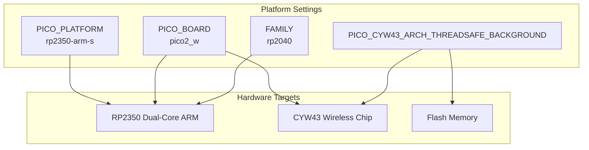
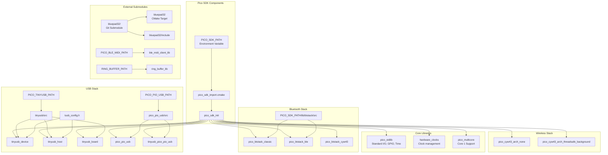
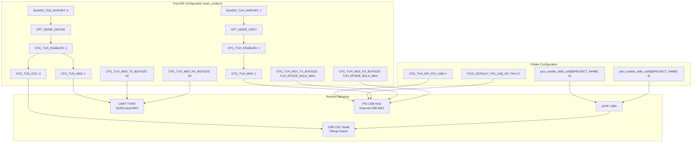
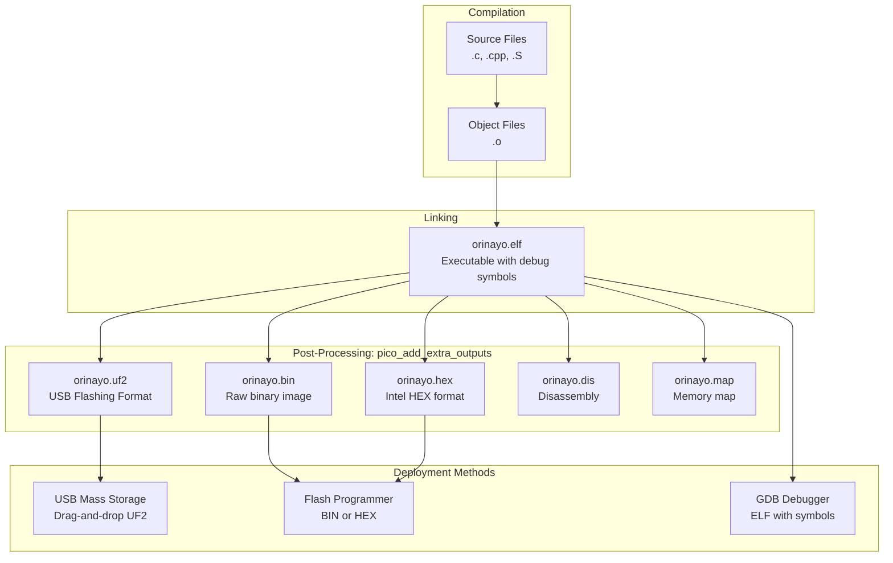
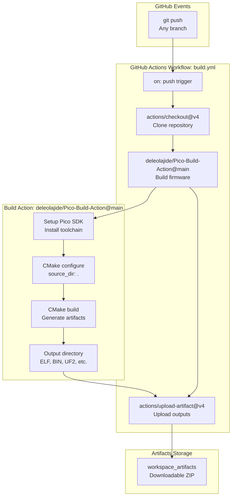

# Build System

> **Relevant source files**
> * [.github/workflows/build.yml](https://github.com/Jus-Be/orinayo-pico/blob/6dde5a75/.github/workflows/build.yml)
> * [.github/workflows/build.yml.experiment](https://github.com/Jus-Be/orinayo-pico/blob/6dde5a75/.github/workflows/build.yml.experiment)
> * [.gitignore](https://github.com/Jus-Be/orinayo-pico/blob/6dde5a75/.gitignore)
> * [CMakeLists.txt](https://github.com/Jus-Be/orinayo-pico/blob/6dde5a75/CMakeLists.txt)
> * [Dockerfile](https://github.com/Jus-Be/orinayo-pico/blob/6dde5a75/Dockerfile)
> * [tusb_config.h](https://github.com/Jus-Be/orinayo-pico/blob/6dde5a75/tusb_config.h)
> * [usb_descriptors.c](https://github.com/Jus-Be/orinayo-pico/blob/6dde5a75/usb_descriptors.c)

This document describes the CMake-based build system that compiles the Orinayo firmware for the Raspberry Pi Pico 2 W platform. It covers the two-tier library architecture, dependency management, compiler configuration, output artifact generation, and the automated CI/CD pipeline.

For step-by-step instructions on building and flashing the firmware, see [Building and Flashing](./2.2-building-and-flashing.md). For details on the CMake configuration structure, see [CMake Configuration](./9.1-cmake-configuration.md). For dependency integration specifics, see [Dependencies](./9.2-dependencies.md). For the automated build pipeline, see [CI/CD Pipeline](./9.3-cicd-pipeline.md).

## Build Architecture

The build system implements a two-tier architecture that separates Bluetooth infrastructure from application logic. The `orinayobt` static library encapsulates all Bluetooth-related functionality and supporting infrastructure, while the main executable contains the application entry point and musical processing logic.


```mermaid
flowchart TD

BT["pico_bluetooth.c<br>Bluetooth HID/MIDI Translation"]
AT["async_timer.c<br>Async Context Wrapper"]
DISP["display.c<br>UART Display"]
STOR["storage.c<br>Flash Storage"]
BLEMIDICTRL["ble_midi_controller.c<br>BLE MIDI Handling"]
MAIN["main.c<br>Application Entry"]
USB["usb_descriptors.c<br>USB Configuration"]
TAP["tap_tempo.c<br>BPM Detection"]
LOOP["looper.c<br>Step Sequencer"]
SCHED["note_scheduler.c<br>Note Timing"]
GHOST["ghost_note.c<br>Pattern Generation"]
ORINAYOBT["liborinayobt.a"]
ORINAYO["orinayo.elf"]
STDLIB["pico_stdlib"]
CLOCKS["hardware_clocks"]
CYW43NONE["pico_cyw43_arch_none"]
CYW43BG["pico_cyw43_arch_threadsafe_background"]
TINYUSBDEV["tinyusb_device"]
TINYUSBHOST["tinyusb_host"]
TINYUSBBOARD["tinyusb_board"]
BTSTACKC["pico_btstack_classic"]
BTSTACKBLE["pico_btstack_ble"]
BTSTACKCYW["pico_btstack_cyw43"]
PIOUSB["pico_pio_usb"]
TINYUSBPIOUSB["tinyusb_pico_pio_usb"]
BP32["bluepad32<br>(subdirectory)"]
BLEMIDILIB["ble_midi_client_lib<br>(subdirectory)"]
RINGBUFFER["ring_buffer_lib<br>(subdirectory)"]

BT --> ORINAYOBT
AT --> ORINAYOBT
DISP --> ORINAYOBT
STOR --> ORINAYOBT
BLEMIDICTRL --> ORINAYOBT
MAIN --> ORINAYO
USB --> ORINAYO
TAP --> ORINAYO
LOOP --> ORINAYO
SCHED --> ORINAYO
GHOST --> ORINAYO
ORINAYOBT --> ORINAYO
STDLIB --> ORINAYOBT
CLOCKS --> ORINAYOBT
CYW43NONE --> ORINAYOBT
CYW43BG --> ORINAYOBT
TINYUSBDEV --> ORINAYOBT
TINYUSBHOST --> ORINAYOBT
TINYUSBBOARD --> ORINAYOBT
BTSTACKC --> ORINAYOBT
BTSTACKBLE --> ORINAYOBT
BTSTACKCYW --> ORINAYOBT
PIOUSB --> ORINAYOBT
TINYUSBPIOUSB --> ORINAYOBT
BP32 --> ORINAYOBT
BLEMIDILIB --> ORINAYOBT
RINGBUFFER --> ORINAYOBT
STDLIB --> ORINAYO
CLOCKS --> ORINAYO
CYW43NONE --> ORINAYO
CYW43BG --> ORINAYO
TINYUSBDEV --> ORINAYO
TINYUSBHOST --> ORINAYO
TINYUSBBOARD --> ORINAYO
BTSTACKC --> ORINAYO
BTSTACKBLE --> ORINAYO
BTSTACKCYW --> ORINAYO
PIOUSB --> ORINAYO
TINYUSBPIOUSB --> ORINAYO

subgraph subGraph4 ["External Dependencies"]
    BP32
    BLEMIDILIB
    RINGBUFFER
end

subgraph subGraph3 ["Pico SDK Libraries"]
    STDLIB
    CLOCKS
    CYW43NONE
    CYW43BG
    TINYUSBDEV
    TINYUSBHOST
    TINYUSBBOARD
    BTSTACKC
    BTSTACKBLE
    BTSTACKCYW
    PIOUSB
    TINYUSBPIOUSB
end

subgraph subGraph2 ["Main Executable"]
    ORINAYO
end

subgraph subGraph1 ["Static Library"]
    ORINAYOBT
end

subgraph subGraph0 ["Source Files"]
    BT
    AT
    DISP
    STOR
    BLEMIDICTRL
    MAIN
    USB
    TAP
    LOOP
    SCHED
    GHOST
end
```

**Two-Tier Library Structure**

This architecture is defined in [CMakeLists.txt L68-L70](https://github.com/Jus-Be/orinayo-pico/blob/6dde5a75/CMakeLists.txt#L68-L70)

 and [CMakeLists.txt L73-L74](https://github.com/Jus-Be/orinayo-pico/blob/6dde5a75/CMakeLists.txt#L73-L74)

:

| Component | Target Name | Source Files | Purpose |
| --- | --- | --- | --- |
| Static Library | `orinayobt` | `pico_bluetooth.c`, `async_timer.c`, `display.c`, `storage.c`, `ble_midi_controller.c` | Bluetooth stack integration and infrastructure |
| Main Executable | `${PROJECT_NAME}` | `main.c`, `usb_descriptors.c`, `tap_tempo.c`, `looper.c`, `note_scheduler.c`, `ghost_note.c` | Application logic and musical processing |

Sources: [CMakeLists.txt L68-L70](https://github.com/Jus-Be/orinayo-pico/blob/6dde5a75/CMakeLists.txt#L68-L70)

 [CMakeLists.txt L73-L74](https://github.com/Jus-Be/orinayo-pico/blob/6dde5a75/CMakeLists.txt#L73-L74)

## Platform Configuration

The build system targets the Raspberry Pi Pico 2 W hardware with specific platform settings required for dual-core operation and CYW43 wireless chip support.


```mermaid
flowchart TD

PLATFORM["PICO_PLATFORM<br>rp2350-arm-s"]
BOARD["PICO_BOARD<br>pico2_w"]
ARCH["PICO_CYW43_ARCH_THREADSAFE_BACKGROUND"]
FAMILY["FAMILY<br>rp2040"]
RP2350["RP2350 Dual-Core ARM"]
CYW43["CYW43 Wireless Chip"]
FLASH["Flash Memory"]

PLATFORM --> RP2350
BOARD --> RP2350
BOARD --> CYW43
ARCH --> CYW43
ARCH --> FLASH
FAMILY --> RP2350

subgraph subGraph1 ["Hardware Targets"]
    RP2350
    CYW43
    FLASH
end

subgraph subGraph0 ["Platform Settings"]
    PLATFORM
    BOARD
    ARCH
    FAMILY
end
```

**Platform Configuration Details**

| Setting | Value | Configured In | Purpose |
| --- | --- | --- | --- |
| `PICO_PLATFORM` | `rp2350-arm-s` | [CMakeLists.txt L23](https://github.com/Jus-Be/orinayo-pico/blob/6dde5a75/CMakeLists.txt#L23-L23) | Specifies RP2350 ARM Cortex-M33 secure core variant |
| `PICO_BOARD` | `pico2_w` | [CMakeLists.txt L24](https://github.com/Jus-Be/orinayo-pico/blob/6dde5a75/CMakeLists.txt#L24-L24) | Selects Pico 2 W board with wireless capabilities |
| `FAMILY` | `rp2040` | [CMakeLists.txt L29](https://github.com/Jus-Be/orinayo-pico/blob/6dde5a75/CMakeLists.txt#L29-L29) | Specifies the RP2040 family for TinyUSB BSP |
| `PICO_CYW43_ARCH_THREADSAFE_BACKGROUND` | Defined | [CMakeLists.txt L71](https://github.com/Jus-Be/orinayo-pico/blob/6dde5a75/CMakeLists.txt#L71-L71) | Enables thread-safe background polling of CYW43 chip |

The `PICO_CYW43_ARCH_THREADSAFE_BACKGROUND` define is critical for maintaining Bluetooth responsiveness while the main core executes application logic. It enables the CYW43 driver to perform background operations in a thread-safe manner.

Sources: [CMakeLists.txt L23-L24](https://github.com/Jus-Be/orinayo-pico/blob/6dde5a75/CMakeLists.txt#L23-L24)

 [CMakeLists.txt L29](https://github.com/Jus-Be/orinayo-pico/blob/6dde5a75/CMakeLists.txt#L29-L29)

 [CMakeLists.txt L71](https://github.com/Jus-Be/orinayo-pico/blob/6dde5a75/CMakeLists.txt#L71-L71)

## Dependency Management

The build system integrates multiple external libraries through CMake's target link mechanism. Dependencies are linked to both the `orinayobt` library and the main executable.


```mermaid
flowchart TD

BP32DIR["bluepad32/<br>Git Submodule"]
BP32LIB["bluepad32<br>CMake Target"]
BP32INC["bluepad32/include"]
BLEMIDIPATH["PICO_BLE_MIDI_PATH"]
BLEMIDILIB["ble_midi_client_lib"]
RINGBUFFERPATH["RING_BUFFER_PATH"]
RINGBUFFERLIB["ring_buffer_lib"]
SDK["PICO_SDK_PATH<br>Environment Variable"]
SDKIMPORT["pico_sdk_import.cmake"]
SDKINIT["pico_sdk_init"]
STDLIB["pico_stdlib<br>Standard I/O, GPIO, Time"]
CLOCKS["hardware_clocks<br>Clock management"]
MULTICORE["pico_multicore<br>Core 1 Support"]
CYW43NONE["pico_cyw43_arch_none"]
CYW43BG["pico_cyw43_arch_threadsafe_background"]
TINYUSBPATH["PICO_TINYUSB_PATH"]
TINYUSBSRC["tinyusb/src"]
TINYUSBDEV["tinyusb_device"]
TINYUSBHOST["tinyusb_host"]
TINYUSBBOARD["tinyusb_board"]
TUSBCFG["tusb_config.h"]
PIOUSBPATH["PICO_PIO_USB_PATH"]
PIOUSBSRC["pico_pio_usb/src"]
PIOUSB["pico_pio_usb"]
TINYUSBPIOUSB["tinyusb_pico_pio_usb"]
BTSTACKC["pico_btstack_classic"]
BTBLE["pico_btstack_ble"]
BTCYW["pico_btstack_cyw43"]
BTSRC["PICO_SDK_PATH/lib/btstack/src"]

SDKINIT --> STDLIB
SDKINIT --> CLOCKS
SDKINIT --> MULTICORE
SDKINIT --> CYW43NONE
SDKINIT --> CYW43BG
SDKINIT --> TINYUSBDEV
SDKINIT --> TINYUSBHOST
SDKINIT --> TINYUSBBOARD
SDKINIT --> BTSTACKC
SDKINIT --> BTBLE
SDKINIT --> BTCYW
SDKINIT --> PIOUSB
SDKINIT --> TINYUSBPIOUSB

subgraph subGraph4 ["Bluetooth Stack"]
    BTSTACKC
    BTBLE
    BTCYW
    BTSRC
    BTSRC --> BTSTACKC
    BTSRC --> BTBLE
end

subgraph subGraph3 ["USB Stack"]
    TINYUSBPATH
    TINYUSBSRC
    TINYUSBDEV
    TINYUSBHOST
    TINYUSBBOARD
    TUSBCFG
    PIOUSBPATH
    PIOUSBSRC
    PIOUSB
    TINYUSBPIOUSB
    TINYUSBPATH --> TINYUSBSRC
    TINYUSBSRC --> TINYUSBDEV
    TINYUSBSRC --> TINYUSBHOST
    TINYUSBSRC --> TINYUSBBOARD
    TUSBCFG --> TINYUSBDEV
    TUSBCFG --> TINYUSBHOST
    PIOUSBPATH --> PIOUSBSRC
    PIOUSBSRC --> PIOUSB
    PIOUSBSRC --> TINYUSBPIOUSB
end

subgraph subGraph2 ["Wireless Stack"]
    CYW43NONE
    CYW43BG
end

subgraph subGraph1 ["Core Libraries"]
    STDLIB
    CLOCKS
    MULTICORE
end

subgraph subGraph0 ["Pico SDK Components"]
    SDK
    SDKIMPORT
    SDKINIT
    SDK --> SDKIMPORT
    SDKIMPORT --> SDKINIT
end

subgraph subGraph5 ["External Submodules"]
    BP32DIR
    BP32LIB
    BP32INC
    BLEMIDIPATH
    BLEMIDILIB
    RINGBUFFERPATH
    RINGBUFFERLIB
    BP32DIR --> BP32LIB
    BP32DIR --> BP32INC
    BLEMIDIPATH --> BLEMIDILIB
    RINGBUFFERPATH --> RINGBUFFERLIB
end
```

**Library Dependencies**

The following libraries are linked to targets as specified in [CMakeLists.txt L70](https://github.com/Jus-Be/orinayo-pico/blob/6dde5a75/CMakeLists.txt#L70-L70)

 and [CMakeLists.txt L85](https://github.com/Jus-Be/orinayo-pico/blob/6dde5a75/CMakeLists.txt#L85-L85)

:

| Library | Linked To | Purpose |
| --- | --- | --- |
| `pico_stdlib` | Both | Standard library, GPIO, time functions |
| `hardware_clocks` | Both | Hardware clock management |
| `pico_multicore` | Main executable only | Core 1 support |
| `pico_cyw43_arch_none` | Both | CYW43 chip base driver |
| `pico_cyw43_arch_threadsafe_background` | Both | Thread-safe CYW43 polling |
| `tinyusb_device` | Both | TinyUSB device stack |
| `tinyusb_host` | Both | TinyUSB host stack |
| `tinyusb_board` | Both | Board-specific USB configuration |
| `pico_btstack_classic` | Both | Bluetooth Classic support |
| `pico_btstack_ble` | Both | Bluetooth Low Energy support |
| `pico_btstack_cyw43` | Both | BTstack integration with CYW43 |
| `pico_pio_usb` | Both | PIO-based USB implementation |
| `tinyusb_pico_pio_usb` | Both | TinyUSB integration with PIO-USB |
| `bluepad32` | `orinayobt` only | Gamepad controller support |
| `ble_midi_client_lib` | `orinayobt` only | BLE MIDI client library |
| `ring_buffer_lib` | `orinayobt` only | Generic ring buffer utility |
| `orinayobt` | Main executable only | Static library from first build tier |

**Include Directories**

Include paths are configured in [CMakeLists.txt L69](https://github.com/Jus-Be/orinayo-pico/blob/6dde5a75/CMakeLists.txt#L69-L69)

 and [CMakeLists.txt L79](https://github.com/Jus-Be/orinayo-pico/blob/6dde5a75/CMakeLists.txt#L79-L79)

:

| Include Path | Purpose |
| --- | --- |
| `${CMAKE_CURRENT_LIST_DIR}` | Project header files |
| `${PICO_TINYUSB_PATH}/src` | TinyUSB source headers |
| `${PICO_TINYUSB_PATH}/src/class/audio` | TinyUSB audio class headers |
| `${PICO_TINYUSB_PATH}/src/class/midi` | TinyUSB MIDI class headers |
| `${CMAKE_CURRENT_LIST_DIR}/bluepad32/include` | Bluepad32 public headers |
| `${PICO_BLE_MIDI_PATH}` | BLE MIDI client library headers |
| `${RING_BUFFER_PATH}` | Ring buffer library headers |
| `${PICO_SDK_PATH}/lib/btstack/src` | BTstack internal headers |
| `${CMAKE_CURRENT_LIST_DIR}/pico_pio_usb/src` | PIO-USB headers |

**External Submodule Integration**

Several external libraries are integrated as Git submodules and added to the build via `add_subdirectory` calls:

* `tinyusb` [CMakeLists.txt L45](https://github.com/Jus-Be/orinayo-pico/blob/6dde5a75/CMakeLists.txt#L45-L45)
* `ring_buffer_lib` [CMakeLists.txt L46](https://github.com/Jus-Be/orinayo-pico/blob/6dde5a75/CMakeLists.txt#L46-L46)
* `pico-w-ble-midi-lib` [CMakeLists.txt L47](https://github.com/Jus-Be/orinayo-pico/blob/6dde5a75/CMakeLists.txt#L47-L47)
* `pico_pio_usb` [CMakeLists.txt L48](https://github.com/Jus-Be/orinayo-pico/blob/6dde5a75/CMakeLists.txt#L48-L48)
* `bluepad32` [CMakeLists.txt L49](https://github.com/Jus-Be/orinayo-pico/blob/6dde5a75/CMakeLists.txt#L49-L49)

These calls create respective CMake targets that are then linked into `orinayobt` or the main executable.

Sources: [CMakeLists.txt L25-L28](https://github.com/Jus-Be/orinayo-pico/blob/6dde5a75/CMakeLists.txt#L25-L28)

 [CMakeLists.txt L45-L49](https://github.com/Jus-Be/orinayo-pico/blob/6dde5a75/CMakeLists.txt#L45-L49)

 [CMakeLists.txt L69-L70](https://github.com/Jus-Be/orinayo-pico/blob/6dde5a75/CMakeLists.txt#L69-L70)

 [CMakeLists.txt L79](https://github.com/Jus-Be/orinayo-pico/blob/6dde5a75/CMakeLists.txt#L79-L79)

 [CMakeLists.txt L85](https://github.com/Jus-Be/orinayo-pico/blob/6dde5a75/CMakeLists.txt#L85-L85)

## USB and UART Configuration

The build system configures standard I/O streams for both USB and UART interfaces, with USB used for debugging and UART reserved for MIDI output at hardware level.


```mermaid
flowchart TD

USBSTDIO["pico_enable_stdio_usb(${PROJECT_NAME} 0)"]
UARTSTDIO["pico_enable_stdio_uart(${PROJECT_NAME} 0)"]
PIOUSBDP["PICO_DEFAULT_PIO_USB_DP_PIN=17"]
CFGTUHRPIPIOUSB["CFG_TUH_RPI_PIO_USB=1"]
PRINTF["printf / stdio"]
USBCDC["USB CDC Serial<br>Debug Output"]
UARTMIDI["UART TX/RX<br>31250 baud MIDI"]
PIOUSBHOST["PIO USB Host<br>External USB MIDI"]
TUD_RHPORT["BOARD_TUD_RHPORT: 0"]
TUH_RHPORT["BOARD_TUH_RHPORT: 1"]
CFG_TUSB_RHPORT0_MODE["OPT_MODE_DEVICE"]
CFG_TUSB_RHPORT1_MODE["OPT_MODE_HOST"]
CFG_TUD_ENABLED["CFG_TUD_ENABLED: 1"]
CFG_TUH_ENABLED["CFG_TUH_ENABLED: 1"]
CFG_TUD_MIDI["CFG_TUD_MIDI: 1"]
CFG_TUD_CDC["CFG_TUD_CDC: 0"]
CFG_TUH_MIDI["CFG_TUH_MIDI: 1"]
MIDITX["CFG_TUD_MIDI_TX_BUFSIZE: 64"]
MIDIRX["CFG_TUD_MIDI_RX_BUFSIZE: 64"]
TUH_MIDITX["CFG_TUH_MIDI_TX_BUFSIZE: TUH_EPSIZE_BULK_MAX"]
TUH_MIDIRX["CFG_TUH_MIDI_RX_BUFSIZE: TUH_EPSIZE_BULK_MAX"]

USBSTDIO --> PRINTF
UARTSTDIO --> PRINTF
CFGTUHRPIPIOUSB --> PIOUSBHOST
PIOUSBDP --> PIOUSBHOST
CFG_TUD_MIDI --> UARTMIDI
CFG_TUD_CDC --> USBCDC
MIDITX --> UARTMIDI
MIDIRX --> UARTMIDI
CFG_TUH_MIDI --> PIOUSBHOST
TUH_MIDITX --> PIOUSBHOST
TUH_MIDIRX --> PIOUSBHOST

subgraph subGraph2 ["TinyUSB Configuration (tusb_config.h)"]
    TUD_RHPORT
    TUH_RHPORT
    CFG_TUSB_RHPORT0_MODE
    CFG_TUSB_RHPORT1_MODE
    CFG_TUD_ENABLED
    CFG_TUH_ENABLED
    CFG_TUD_MIDI
    CFG_TUD_CDC
    CFG_TUH_MIDI
    MIDITX
    MIDIRX
    TUH_MIDITX
    TUH_MIDIRX
    TUD_RHPORT --> CFG_TUSB_RHPORT0_MODE
    TUH_RHPORT --> CFG_TUSB_RHPORT1_MODE
    CFG_TUSB_RHPORT0_MODE --> CFG_TUD_ENABLED
    CFG_TUSB_RHPORT1_MODE --> CFG_TUH_ENABLED
    CFG_TUD_ENABLED --> CFG_TUD_MIDI
    CFG_TUD_ENABLED --> CFG_TUD_CDC
    CFG_TUH_ENABLED --> CFG_TUH_MIDI
end

subgraph subGraph1 ["Runtime Behavior"]
    PRINTF
    USBCDC
    UARTMIDI
    PIOUSBHOST
    PRINTF --> USBCDC
end

subgraph subGraph0 ["CMake Configuration"]
    USBSTDIO
    UARTSTDIO
    PIOUSBDP
    CFGTUHRPIPIOUSB
end
```

**Standard I/O Configuration**

Configured in [CMakeLists.txt L76-L77](https://github.com/Jus-Be/orinayo-pico/blob/6dde5a75/CMakeLists.txt#L76-L77)

:

| Setting | Value | Purpose |
| --- | --- | --- |
| `pico_enable_stdio_usb()` | 0 (disabled) | Disables `printf()` and stdio to USB CDC serial. This is likely a misconfiguration as `usb_descriptors.c` defines a CDC interface. |
| `pico_enable_stdio_uart()` | 0 (disabled) | Prevents stdio from using UART, reserving it for MIDI |

**TinyUSB Device Classes**

Configured in [tusb_config.h L41-L48](https://github.com/Jus-Be/orinayo-pico/blob/6dde5a75/tusb_config.h#L41-L48)

 and [tusb_config.h L89-L93](https://github.com/Jus-Be/orinayo-pico/blob/6dde5a75/tusb_config.h#L89-L93)

:

| Class | Enabled | Configured Value | Purpose |
| --- | --- | --- | --- |
| `CFG_TUD_ENABLED` | 1 | [tusb_config.h L50](https://github.com/Jus-Be/orinayo-pico/blob/6dde5a75/tusb_config.h#L50-L50) | Enables TinyUSB device stack |
| `CFG_TUH_ENABLED` | 1 | [tusb_config.h L51](https://github.com/Jus-Be/orinayo-pico/blob/6dde5a75/tusb_config.h#L51-L51) | Enables TinyUSB host stack |
| `BOARD_TUD_RHPORT` | 0 | [tusb_config.h L41](https://github.com/Jus-Be/orinayo-pico/blob/6dde5a75/tusb_config.h#L41-L41) | Native USB connector as device port |
| `BOARD_TUH_RHPORT` | 1 | [tusb_config.h L42](https://github.com/Jus-Be/orinayo-pico/blob/6dde5a75/tusb_config.h#L42-L42) | PIO USB as host port |
| `CFG_TUSB_RHPORT0_MODE` | `OPT_MODE_DEVICE` | [tusb_config.h L43](https://github.com/Jus-Be/orinayo-pico/blob/6dde5a75/tusb_config.h#L43-L43) | Configures port 0 as device |
| `CFG_TUSB_RHPORT1_MODE` | `OPT_MODE_HOST` | [tusb_config.h L44](https://github.com/Jus-Be/orinayo-pico/blob/6dde5a75/tusb_config.h#L44-L44) | Configures port 1 as host |
| `CFG_TUD_CDC` | 0 | [tusb_config.h L89](https://github.com/Jus-Be/orinayo-pico/blob/6dde5a75/tusb_config.h#L89-L89) | CDC serial disabled |
| `CFG_TUD_MSC` | 0 | [tusb_config.h L90](https://github.com/Jus-Be/orinayo-pico/blob/6dde5a75/tusb_config.h#L90-L90) | Mass storage disabled |
| `CFG_TUD_HID` | 0 | [tusb_config.h L91](https://github.com/Jus-Be/orinayo-pico/blob/6dde5a75/tusb_config.h#L91-L91) | HID disabled |
| `CFG_TUD_MIDI` | 1 | [tusb_config.h L92](https://github.com/Jus-Be/orinayo-pico/blob/6dde5a75/tusb_config.h#L92-L92) | MIDI class enabled for USB MIDI output |
| `CFG_TUD_VENDOR` | 0 | [tusb_config.h L93](https://github.com/Jus-Be/orinayo-pico/blob/6dde5a75/tusb_config.h#L93-L93) | Vendor class disabled |
| `CFG_TUH_RPI_PIO_USB` | 1 | [tusb_config.h L103](https://github.com/Jus-Be/orinayo-pico/blob/6dde5a75/tusb_config.h#L103-L103) | Enables PIO-USB as host controller |
| `CFG_TUH_MIDI` | 1 | [tusb_config.h L110](https://github.com/Jus-Be/orinayo-pico/blob/6dde5a75/tusb_config.h#L110-L110) | Enables MIDI host class |

**MIDI Buffer Sizes**

Configured in [tusb_config.h L96-L97](https://github.com/Jus-Be/orinayo-pico/blob/6dde5a75/tusb_config.h#L96-L97)

 and [tusb_config.h L116-L117](https://github.com/Jus-Be/orinayo-pico/blob/6dde5a75/tusb_config.h#L116-L117)

:

| Buffer | Size | Configured Value |
| --- | --- | --- |
| `CFG_TUD_MIDI_RX_BUFSIZE` | 64 bytes | `(TUD_OPT_HIGH_SPEED ? 512 : 64)` |
| `CFG_TUD_MIDI_TX_BUFSIZE` | 64 bytes | `(TUD_OPT_HIGH_SPEED ? 512 : 64)` |
| `CFG_TUH_MIDI_RX_BUFSIZE` | `TUH_EPSIZE_BULK_MAX` | [tusb_config.h L116](https://github.com/Jus-Be/orinayo-pico/blob/6dde5a75/tusb_config.h#L116-L116) |
| `CFG_TUH_MIDI_TX_BUFSIZE` | `TUH_EPSIZE_BULK_MAX` | [tusb_config.h L117](https://github.com/Jus-Be/orinayo-pico/blob/6dde5a75/tusb_config.h#L117-L117) |

**PIO USB Configuration**

The PIO USB D+/D- pins are defined in [CMakeLists.txt L52](https://github.com/Jus-Be/orinayo-pico/blob/6dde5a75/CMakeLists.txt#L52-L52)

:

| Setting | Value | Purpose |
| --- | --- | --- |
| `PICO_DEFAULT_PIO_USB_DP_PIN` | 17 | Specifies GPIO pin 17 as the D+ pin for PIO USB |

Sources: [CMakeLists.txt L52](https://github.com/Jus-Be/orinayo-pico/blob/6dde5a75/CMakeLists.txt#L52-L52)

 [CMakeLists.txt L76-L77](https://github.com/Jus-Be/orinayo-pico/blob/6dde5a75/CMakeLists.txt#L76-L77)

 [tusb_config.h L41-L48](https://github.com/Jus-Be/orinayo-pico/blob/6dde5a75/tusb_config.h#L41-L48)

 [tusb_config.h L89-L93](https://github.com/Jus-Be/orinayo-pico/blob/6dde5a75/tusb_config.h#L89-L93)

 [tusb_config.h L96-L97](https://github.com/Jus-Be/orinayo-pico/blob/6dde5a75/tusb_config.h#L96-L97)

 [tusb_config.h L103](https://github.com/Jus-Be/orinayo-pico/blob/6dde5a75/tusb_config.h#L103-L103)

 [tusb_config.h L110](https://github.com/Jus-Be/orinayo-pico/blob/6dde5a75/tusb_config.h#L110-L110)

 [tusb_config.h L116-L117](https://github.com/Jus-Be/orinayo-pico/blob/6dde5a75/tusb_config.h#L116-L117)

## Compiler Configuration

The build system applies optimization flags to reduce code size by eliminating unused functions and data.

**Compiler Flags**

Configured in [CMakeLists.txt L93-L94](https://github.com/Jus-Be/orinayo-pico/blob/6dde5a75/CMakeLists.txt#L93-L94)

:

| Flag | Applied To | Purpose |
| --- | --- | --- |
| `-ffunction-sections` | C and C++ | Places each function in its own section |
| `-fdata-sections` | C and C++ | Places each data item in its own section |

These flags enable the linker to perform dead code elimination, removing unreferenced functions and data from the final binary. This is particularly important for embedded systems with limited flash memory (4MB on Pico 2 W).

**Language Standards**

Configured in [CMakeLists.txt L39-L40](https://github.com/Jus-Be/orinayo-pico/blob/6dde5a75/CMakeLists.txt#L39-L40)

:

| Language | Standard | Purpose |
| --- | --- | --- |
| C | C11 | Modern C features while maintaining compatibility |
| C++ | C++17 | Modern C++ for Bluepad32 and SDK components |

Sources: [CMakeLists.txt L39-L40](https://github.com/Jus-Be/orinayo-pico/blob/6dde5a75/CMakeLists.txt#L39-L40)

 [CMakeLists.txt L93-L94](https://github.com/Jus-Be/orinayo-pico/blob/6dde5a75/CMakeLists.txt#L93-L94)

## Build Artifacts

The build system generates multiple output formats for different deployment and debugging scenarios.


```mermaid
flowchart TD

SRC["Source Files<br>.c, .cpp, .S"]
OBJ["Object Files<br>.o"]
ELF["orinayo.elf<br>Executable with debug symbols"]
BIN["orinayo.bin<br>Raw binary image"]
HEX["orinayo.hex<br>Intel HEX format"]
UF2["orinayo.uf2<br>USB Flashing Format"]
DIS["orinayo.dis<br>Disassembly"]
MAP["orinayo.map<br>Memory map"]
USB["USB Mass Storage<br>Drag-and-drop UF2"]
PROG["Flash Programmer<br>BIN or HEX"]
DEBUG["GDB Debugger<br>ELF with symbols"]

OBJ --> ELF
ELF --> BIN
ELF --> HEX
ELF --> UF2
ELF --> DIS
ELF --> MAP
UF2 --> USB
BIN --> PROG
HEX --> PROG
ELF --> DEBUG

subgraph subGraph3 ["Deployment Methods"]
    USB
    PROG
    DEBUG
end

subgraph subGraph2 ["Post-Processing: pico_add_extra_outputs"]
    BIN
    HEX
    UF2
    DIS
    MAP
end

subgraph Linking ["Linking"]
    ELF
end

subgraph Compilation ["Compilation"]
    SRC
    OBJ
    SRC --> OBJ
end
```

**Artifact Generation**

The `pico_add_extra_outputs()` function is called in [CMakeLists.txt L78](https://github.com/Jus-Be/orinayo-pico/blob/6dde5a75/CMakeLists.txt#L78-L78)

 and [CMakeLists.txt L82](https://github.com/Jus-Be/orinayo-pico/blob/6dde5a75/CMakeLists.txt#L82-L82)

 to generate additional output formats:

| Artifact | Format | Use Case |
| --- | --- | --- |
| `orinayo.elf` | ELF executable | Debugging with GDB, contains symbols |
| `orinayo.bin` | Raw binary | Flash programming with external tools |
| `orinayo.hex` | Intel HEX | Flash programming, some bootloaders |
| `orinayo.uf2` | UF2 format | Drag-and-drop to BOOTSEL mass storage device |
| `orinayo.map` | Memory map | Analyzing memory usage and symbol addresses |

The UF2 format is the recommended deployment method for Pico boards. The user holds the BOOTSEL button while connecting USB, causing the Pico to enumerate as a mass storage device. Dragging `orinayo.uf2` to this drive automatically flashes the firmware.

**Binary Metadata**

PicoTool metadata is embedded in [CMakeLists.txt L88-L90](https://github.com/Jus-Be/orinayo-pico/blob/6dde5a75/CMakeLists.txt#L88-L90)

:

| Field | Value | Purpose |
| --- | --- | --- |
| Program Name | `${PROJECT_NAME}` | "Orinayo" |
| Program Version | `${PROJECT_VERSION}` | Date-based version (YYYY.MM.DD) |
| Program Description | "Pico Build Action - Orinayo" | Human-readable description |

The version is generated from the build timestamp in [CMakeLists.txt L37-L38](https://github.com/Jus-Be/orinayo-pico/blob/6dde5a75/CMakeLists.txt#L37-L38)

:

```
string(TIMESTAMP DATEVER "%Y.%m.%d" UTC)project(Orinayo VERSION ${DATEVER} LANGUAGES C CXX ASM)
```

Sources: [CMakeLists.txt L37-L38](https://github.com/Jus-Be/orinayo-pico/blob/6dde5a75/CMakeLists.txt#L37-L38)

 [CMakeLists.txt L78](https://github.com/Jus-Be/orinayo-pico/blob/6dde5a75/CMakeLists.txt#L78-L78)

 [CMakeLists.txt L82](https://github.com/Jus-Be/orinayo-pico/blob/6dde5a75/CMakeLists.txt#L82-L82)

 [CMakeLists.txt L88-L90](https://github.com/Jus-Be/orinayo-pico/blob/6dde5a75/CMakeLists.txt#L88-L90)

## CI/CD Pipeline

The project uses GitHub Actions to automatically build firmware on every push to the repository.


```mermaid
flowchart TD

PUSH["git push<br>Any branch"]
TRIGGER["on: push trigger"]
CHECKOUT["actions/checkout@v4<br>Clone repository"]
BUILD["deleolajide/Pico-Build-Action@main<br>Build firmware"]
UPLOAD["actions/upload-artifact@v4<br>Upload outputs"]
SETUP["Setup Pico SDK<br>Install toolchain"]
CMAKE["CMake configure<br>source_dir: ."]
MAKE["CMake build<br>Generate artifacts"]
OUTDIR["Output directory<br>ELF, BIN, UF2, etc."]
ARTIFACT["workspace_artifacts<br>Downloadable ZIP"]

PUSH --> TRIGGER
UPLOAD --> ARTIFACT
BUILD --> SETUP
OUTDIR --> UPLOAD

subgraph subGraph3 ["Artifacts Storage"]
    ARTIFACT
end

subgraph subGraph2 ["Build Action: deleolajide/Pico-Build-Action@main"]
    SETUP
    CMAKE
    MAKE
    OUTDIR
    SETUP --> CMAKE
    CMAKE --> MAKE
    MAKE --> OUTDIR
end

subgraph subGraph1 ["GitHub Actions Workflow: build.yml"]
    TRIGGER
    CHECKOUT
    BUILD
    UPLOAD
    TRIGGER --> CHECKOUT
    CHECKOUT --> BUILD
    BUILD --> UPLOAD
end

subgraph subGraph0 ["GitHub Events"]
    PUSH
end
```

**Workflow Configuration**

The workflow is defined in [.github/workflows/build.yml L1-L25](https://github.com/Jus-Be/orinayo-pico/blob/6dde5a75/.github/workflows/build.yml#L1-L25)

:

| Step | Action | Configuration |
| --- | --- | --- |
| Checkout | `actions/checkout@v4` | Clones repository |
| Build | `deleolajide/Pico-Build-Action@main` | `source_dir: "."` |
| Upload | `actions/upload-artifact@v4` | `name: workspace_artifacts` |

**Build Action Parameters**

The Pico-Build-Action is invoked in [.github/workflows/build.yml L14-L18](https://github.com/Jus-Be/orinayo-pico/blob/6dde5a75/.github/workflows/build.yml#L14-L18)

:

| Parameter | Value | Purpose |
| --- | --- | --- |
| `source_dir` | `"."` | Build from repository root (where CMakeLists.txt is located) |

The action automatically installs the Pico SDK and ARM toolchain, runs `cmake`, and produces all artifacts in a designated output directory.

**Artifact Upload**

Build outputs are uploaded in [.github/workflows/build.yml L20-L24](https://github.com/Jus-Be/orinayo-pico/blob/6dde5a75/.github/workflows/build.yml#L20-L24)

:

| Setting | Value | Purpose |
| --- | --- | --- |
| `name` | `workspace_artifacts` | Name of the downloadable artifact ZIP |
| `path` | `${{steps.build.outputs.output_dir}}` | Directory containing all build outputs |

The uploaded ZIP contains all artifacts generated by `pico_add_extra_outputs()`, including the UF2 file for direct deployment.

Sources: [.github/workflows/build.yml L1-L25](https://github.com/Jus-Be/orinayo-pico/blob/6dde5a75/.github/workflows/build.yml#L1-L25)

## Build Process Summary

The complete build process follows this sequence:

1. **CMake Configuration**: CMake reads [CMakeLists.txt](https://github.com/Jus-Be/orinayo-pico/blob/6dde5a75/CMakeLists.txt)  and configures the build based on `PICO_PLATFORM` and `PICO_BOARD` settings.
2. **Dependency Resolution**: CMake locates Pico SDK via environment variables and adds the Bluepad32, BLE MIDI, and Ring Buffer libraries.
3. **Library Compilation**: Compiles `orinayobt` static library from Bluetooth and infrastructure sources.
4. **Executable Compilation**: Compiles main executable from application sources.
5. **Linking**: Links main executable against `orinayobt` and all Pico SDK libraries.
6. **Post-Processing**: Generates BIN, HEX, UF2, and other files from ELF.
7. **Artifact Collection**: CI/CD uploads all outputs for download.

Sources: [CMakeLists.txt L19-L94](https://github.com/Jus-Be/orinayo-pico/blob/6dde5a75/CMakeLists.txt#L19-L94)

 [.github/workflows/build.yml L1-L25](https://github.com/Jus-Be/orinayo-pico/blob/6dde5a75/.github/workflows/build.yml#L1-L25)