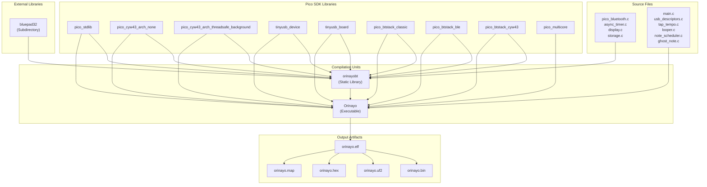
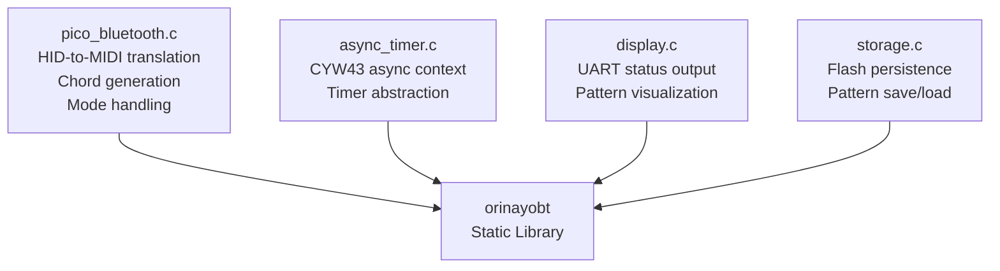
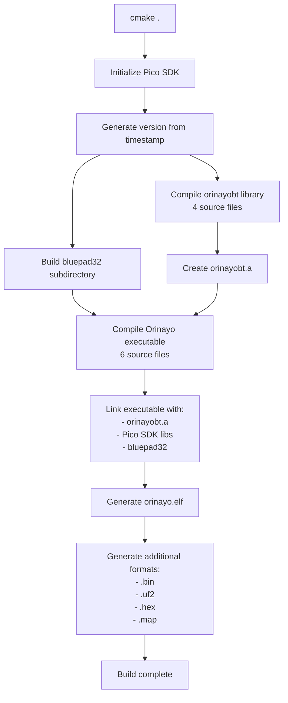

# CMake Configuration

> **Relevant source files**
> * [CMakeLists.txt](https://github.com/Jus-Be/orinayo-pico/blob/122fa496/CMakeLists.txt)
> * [bluepad32/include/btstack_config.h](https://github.com/Jus-Be/orinayo-pico/blob/122fa496/bluepad32/include/btstack_config.h)

This document describes the CMake-based build system for the Orinayo project, including the two-tier build architecture (static library plus executable), source file organization, compilation targets, and platform configuration. For information about external dependencies and their integration, see [Dependencies](./9.2-dependencies.md). For CI/CD automation, see [CI/CD Pipeline](./9.3-cicd-pipeline.md).

## Build Architecture Overview

The Orinayo build system implements a two-tier compilation strategy defined in [CMakeLists.txt L1-L67](https://github.com/Jus-Be/orinayo-pico/blob/122fa496/CMakeLists.txt#L1-L67)

 This approach separates Bluetooth infrastructure code into a reusable static library (`orinayobt`) while keeping application-specific logic in the main executable.



**Build Architecture Diagram**

Sources: [CMakeLists.txt L39-L56](https://github.com/Jus-Be/orinayo-pico/blob/122fa496/CMakeLists.txt#L39-L56)

The two-tier structure provides several benefits:

* **Encapsulation**: Bluetooth infrastructure is isolated from application logic
* **Reusability**: The `orinayobt` library could be used by other projects
* **Build efficiency**: Changes to application files don't require recompiling Bluetooth code
* **Clear separation**: Infrastructure vs. application concerns are architecturally distinct

## Platform Configuration

The build system targets the Raspberry Pi Pico 2 W platform with specific hardware configuration set at [CMakeLists.txt L22-L24](https://github.com/Jus-Be/orinayo-pico/blob/122fa496/CMakeLists.txt#L22-L24)

:

| Configuration Variable | Value | Description |
| --- | --- | --- |
| `PICO_PLATFORM` | `rp2350-arm-s` | RP2350 ARM Secure processor mode |
| `PICO_BOARD` | `pico2_w` | Pico 2 W board with CYW43 wireless chip |
| `CMAKE_C_STANDARD` | `11` | C11 standard compliance |
| `CMAKE_CXX_STANDARD` | `17` | C++17 standard compliance |
| `PROJECT_VERSION` | `${DATEVER}` | UTC timestamp (YYYY.MM.DD format) |

Sources: [CMakeLists.txt L19-L33](https://github.com/Jus-Be/orinayo-pico/blob/122fa496/CMakeLists.txt#L19-L33)

The platform selection enables the CYW43 wireless chip capabilities required for Bluetooth operation. The `rp2350-arm-s` platform indicates use of the RP2350's ARM Secure mode rather than RISC-V mode.

## Static Library: orinayobt

The `orinayobt` static library is defined at [CMakeLists.txt L39](https://github.com/Jus-Be/orinayo-pico/blob/122fa496/CMakeLists.txt#L39-L39)

 and contains the Bluetooth infrastructure components:

### Source Files



**orinayobt Library Source Components**

Sources: [CMakeLists.txt L39](https://github.com/Jus-Be/orinayo-pico/blob/122fa496/CMakeLists.txt#L39-L39)

### Include Directories

The library exposes three include paths configured at [CMakeLists.txt L40](https://github.com/Jus-Be/orinayo-pico/blob/122fa496/CMakeLists.txt#L40-L40)

:

1. `${CMAKE_CURRENT_LIST_DIR}` - Project root for local headers
2. `${CMAKE_CURRENT_LIST_DIR}/bluepad32/include` - Bluepad32 controller API
3. `${PICO_SDK_PATH}/lib/btstack/src` - BTstack internal headers

### Compilation Definitions

The library is compiled with `PICO_CYW43_ARCH_THREADSAFE_BACKGROUND` defined at [CMakeLists.txt L42](https://github.com/Jus-Be/orinayo-pico/blob/122fa496/CMakeLists.txt#L42-L42)

 enabling thread-safe background processing for the CYW43 wireless chip. This is critical for Bluetooth operation that doesn't block the main application loop.

### Library Dependencies

The `orinayobt` library links against the following Pico SDK and external libraries [CMakeLists.txt L41](https://github.com/Jus-Be/orinayo-pico/blob/122fa496/CMakeLists.txt#L41-L41)

:

| Library | Purpose |
| --- | --- |
| `pico_stdlib` | Standard Pico SDK functions (GPIO, timers, etc.) |
| `pico_cyw43_arch_none` | Base CYW43 architecture support |
| `pico_cyw43_arch_threadsafe_background` | Thread-safe CYW43 background operation |
| `tinyusb_device` | TinyUSB device stack |
| `tinyusb_board` | Board-specific TinyUSB configuration |
| `pico_btstack_classic` | BTstack Bluetooth Classic support |
| `pico_btstack_ble` | BTstack Bluetooth Low Energy support |
| `pico_btstack_cyw43` | BTstack CYW43 transport integration |
| `bluepad32` | Controller support library (subdirectory) |

Sources: [CMakeLists.txt L39-L42](https://github.com/Jus-Be/orinayo-pico/blob/122fa496/CMakeLists.txt#L39-L42)

## Main Executable: Orinayo

The main executable is defined at [CMakeLists.txt L44](https://github.com/Jus-Be/orinayo-pico/blob/122fa496/CMakeLists.txt#L44-L44)

 using the project name (set to "Orinayo" at line 31).

### Source Files

The executable contains application logic and musical processing components:

| Source File | Purpose |
| --- | --- |
| `main.c` | Application entry point, MIDI output coordination |
| `usb_descriptors.c` | USB device descriptors and configuration |
| `tap_tempo.c` | BPM detection from button taps |
| `looper.c` | 32-step drum sequencer with 14 tracks |
| `note_scheduler.c` | Microsecond-precision note scheduling |
| `ghost_note.c` | Algorithmic note generation (Euclidean, boundary, fill) |

Sources: [CMakeLists.txt L44](https://github.com/Jus-Be/orinayo-pico/blob/122fa496/CMakeLists.txt#L44-L44)

### Include Directories and Dependencies

The executable uses the same include directories as the library [CMakeLists.txt L50](https://github.com/Jus-Be/orinayo-pico/blob/122fa496/CMakeLists.txt#L50-L50)

 and links against all the Pico SDK libraries plus the `orinayobt` static library and `pico_multicore` for dual-core support [CMakeLists.txt L56](https://github.com/Jus-Be/orinayo-pico/blob/122fa496/CMakeLists.txt#L56-L56)

```mermaid
flowchart TD

MAIN["Orinayo Executable"]
MAIN_C["main.c"]
USB_DESC["usb_descriptors.c"]
TAP["tap_tempo.c"]
LOOPER["looper.c"]
SCHED["note_scheduler.c"]
GHOST["ghost_note.c"]
ORINAYOBT_LIB["orinayobt.a"]
STDLIB["pico_stdlib"]
MULTICORE["pico_multicore"]
CYW43_NONE["pico_cyw43_arch_none"]
CYW43_BG["pico_cyw43_arch_threadsafe_background"]
BT_CLASSIC["pico_btstack_classic"]
BT_BLE["pico_btstack_ble"]
BT_CYW43["pico_btstack_cyw43"]
USB_DEV["tinyusb_device"]
USB_BRD["tinyusb_board"]

MAIN_C --> MAIN
USB_DESC --> MAIN
TAP --> MAIN
LOOPER --> MAIN
SCHED --> MAIN
GHOST --> MAIN
ORINAYOBT_LIB --> MAIN
STDLIB --> MAIN
MULTICORE --> MAIN
CYW43_NONE --> MAIN
CYW43_BG --> MAIN
BT_CLASSIC --> MAIN
BT_BLE --> MAIN
BT_CYW43 --> MAIN
USB_DEV --> MAIN
USB_BRD --> MAIN

subgraph subGraph4 ["USB Stack"]
    USB_DEV
    USB_BRD
end

subgraph subGraph3 ["Wireless & BT Stack"]
    CYW43_NONE
    CYW43_BG
    BT_CLASSIC
    BT_BLE
    BT_CYW43
end

subgraph subGraph2 ["Pico SDK Core"]
    STDLIB
    MULTICORE
end

subgraph subGraph1 ["Infrastructure Library"]
    ORINAYOBT_LIB
end

subgraph subGraph0 ["Application Sources"]
    MAIN_C
    USB_DESC
    TAP
    LOOPER
    SCHED
    GHOST
end
```



**Executable Dependency Graph**

Sources: [CMakeLists.txt L44-L56](https://github.com/Jus-Be/orinayo-pico/blob/122fa496/CMakeLists.txt#L44-L56)

## Standard I/O Configuration

The build configures standard I/O streams at [CMakeLists.txt L46-L48](https://github.com/Jus-Be/orinayo-pico/blob/122fa496/CMakeLists.txt#L46-L48)

:

| Configuration | Value | Effect |
| --- | --- | --- |
| `pico_enable_stdio_usb` | 1 | Enable `printf()` output over USB CDC |
| `pico_enable_stdio_uart` | 0 | Disable `printf()` over UART (UART used for MIDI) |

This configuration reserves UART for MIDI transmission at 31,250 baud while routing debug output through USB CDC.

Sources: [CMakeLists.txt L46-L48](https://github.com/Jus-Be/orinayo-pico/blob/122fa496/CMakeLists.txt#L46-L48)

## Output Artifacts

The `pico_add_extra_outputs()` function is called at [CMakeLists.txt L47](https://github.com/Jus-Be/orinayo-pico/blob/122fa496/CMakeLists.txt#L47-L47)

 and [CMakeLists.txt L53](https://github.com/Jus-Be/orinayo-pico/blob/122fa496/CMakeLists.txt#L53-L53)

 to generate multiple output formats from the compiled ELF:

| Artifact | Format | Use Case |
| --- | --- | --- |
| `orinayo.elf` | ELF executable | Debugging with GDB |
| `orinayo.bin` | Raw binary | Flash programming tools |
| `orinayo.uf2` | UF2 bootloader format | Drag-and-drop to BOOTSEL drive |
| `orinayo.hex` | Intel HEX | Alternative flash tools |
| `orinayo.map` | Linker map file | Memory usage analysis |

The UF2 format is the primary deployment method for Pico 2 W, allowing firmware installation by copying the file to the USB mass storage device that appears when the board is booted in BOOTSEL mode.

Sources: [CMakeLists.txt L47-L53](https://github.com/Jus-Be/orinayo-pico/blob/122fa496/CMakeLists.txt#L47-L53)

## Compiler Optimization Flags

The build system applies optimization flags at [CMakeLists.txt L64-L65](https://github.com/Jus-Be/orinayo-pico/blob/122fa496/CMakeLists.txt#L64-L65)

:

```
set(CMAKE_C_FLAGS  "${CMAKE_C_FLAGS} -ffunction-sections -fdata-sections")
set(CMAKE_CXX_FLAGS  "${CMAKE_CXX_FLAGS} -ffunction-sections -fdata-sections")
```

These flags enable:

* **`-ffunction-sections`**: Place each function in its own section in the object file
* **`-fdata-sections`**: Place each data item in its own section in the object file

These flags work with the linker's garbage collection (`--gc-sections`) to eliminate unused code and data, reducing the final firmware size. This is important for the Pico 2 W's limited flash space.

Sources: [CMakeLists.txt L64-L65](https://github.com/Jus-Be/orinayo-pico/blob/122fa496/CMakeLists.txt#L64-L65)

## PicoTool Metadata

Binary metadata is embedded for the `picotool` utility at [CMakeLists.txt L58-L61](https://github.com/Jus-Be/orinayo-pico/blob/122fa496/CMakeLists.txt#L58-L61)

:

| Field | Value | Source |
| --- | --- | --- |
| Program Name | "Orinayo" | Project name variable |
| Program Version | UTC timestamp (YYYY.MM.DD) | Generated at configuration time |
| Program Description | "Pico Build Action - Orinayo" | Static string |

The `picotool` utility can query this metadata from the UF2 file or from a running device without needing source code access.

Sources: [CMakeLists.txt L30-L31](https://github.com/Jus-Be/orinayo-pico/blob/122fa496/CMakeLists.txt#L30-L31)

 [CMakeLists.txt L58-L61](https://github.com/Jus-Be/orinayo-pico/blob/122fa496/CMakeLists.txt#L58-L61)

## External Library Integration

The Bluepad32 controller library is integrated as a subdirectory at [CMakeLists.txt L67](https://github.com/Jus-Be/orinayo-pico/blob/122fa496/CMakeLists.txt#L67-L67)

:

```
add_subdirectory(${CMAKE_CURRENT_LIST_DIR}/bluepad32 libbluepad32)
```

This adds the `bluepad32` target (built from its own CMakeLists.txt in the subdirectory) and makes it available for linking. The library is linked into `orinayobt` at [CMakeLists.txt L41](https://github.com/Jus-Be/orinayo-pico/blob/122fa496/CMakeLists.txt#L41-L41)

 making controller support functionality available throughout the Bluetooth infrastructure layer.

Sources: [CMakeLists.txt L67](https://github.com/Jus-Be/orinayo-pico/blob/122fa496/CMakeLists.txt#L67-L67)

## BTstack Configuration

While the main CMakeLists.txt handles build orchestration, BTstack's runtime behavior is configured in [bluepad32/include/btstack_config.h L1-L96](https://github.com/Jus-Be/orinayo-pico/blob/122fa496/bluepad32/include/btstack_config.h#L1-L96)

 This header sets buffer sizes, connection limits, and feature flags referenced during BTstack library compilation:

| Configuration | Value | Purpose |
| --- | --- | --- |
| `MAX_NR_HCI_CONNECTIONS` | 4 | Maximum simultaneous Bluetooth connections |
| `MAX_NR_GATT_CLIENTS` | 4 | Maximum GATT client connections (BLE) |
| `MAX_NR_HID_HOST_CONNECTIONS` | 4 | Maximum HID device connections |
| `HCI_ACL_PAYLOAD_SIZE` | 1695 bytes | ACL packet buffer size |
| `MAX_NR_CONTROLLER_ACL_BUFFERS` | 3 | Limit ACL buffers to prevent CYW43 overrun |
| `ENABLE_HCI_CONTROLLER_TO_HOST_FLOW_CONTROL` | Enabled | Prevent buffer overrun on shared CYW43 bus |

The configuration file also enforces that both `ENABLE_BLE` and `ENABLE_CLASSIC` are defined [bluepad32/include/btstack_config.h L22-L30](https://github.com/Jus-Be/orinayo-pico/blob/122fa496/bluepad32/include/btstack_config.h#L22-L30)

 ensuring dual-mode Bluetooth support is available for both HID controllers (Classic) and specialized MIDI devices (BLE).

Sources: [bluepad32/include/btstack_config.h L1-L96](https://github.com/Jus-Be/orinayo-pico/blob/122fa496/bluepad32/include/btstack_config.h#L1-L96)

## Build Process Flow

The complete build process follows this sequence:



**CMake Build Process Sequence**

Sources: [CMakeLists.txt L1-L67](https://github.com/Jus-Be/orinayo-pico/blob/122fa496/CMakeLists.txt#L1-L67)

The build system is invoked with:

```
cmake -B build
cmake --build build
```

The first command configures the build (generating Makefiles or Ninja files), and the second performs the actual compilation and linking. The resulting artifacts are placed in the `build/` directory.

## Configuration Summary

The CMake configuration establishes a well-structured build that:

1. **Separates concerns** via the two-tier library+executable architecture
2. **Targets specific hardware** (Pico 2 W with RP2350 in ARM secure mode)
3. **Enables dual-mode Bluetooth** through BTstack Classic and BLE libraries
4. **Provides multiple output formats** for flexible deployment options
5. **Optimizes binary size** through section-based compilation and linker GC
6. **Integrates external libraries** (Bluepad32, BTstack) seamlessly
7. **Configures I/O appropriately** (USB for debug, UART for MIDI)

This configuration supports the system's role as a Bluetooth-to-MIDI gateway requiring real-time musical processing with minimal latency.

Sources: [CMakeLists.txt L1-L67](https://github.com/Jus-Be/orinayo-pico/blob/122fa496/CMakeLists.txt#L1-L67)

 [bluepad32/include/btstack_config.h L1-L96](https://github.com/Jus-Be/orinayo-pico/blob/122fa496/bluepad32/include/btstack_config.h#L1-L96)