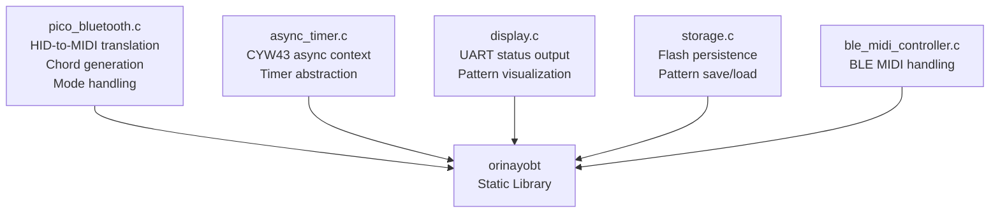
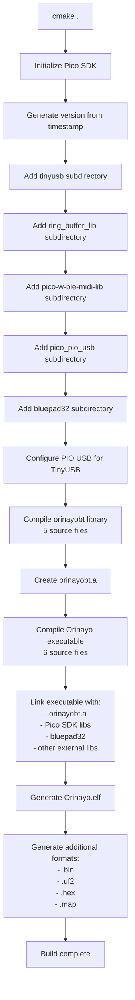

# CMake Configuration

> **Relevant source files**
> * [CMakeLists.txt](https://github.com/Jus-Be/orinayo-pico/blob/6dde5a75/CMakeLists.txt)
> * [bluepad32/CMakeLists.txt](https://github.com/Jus-Be/orinayo-pico/blob/6dde5a75/bluepad32/CMakeLists.txt)
> * [tusb_config.h](https://github.com/Jus-Be/orinayo-pico/blob/6dde5a75/tusb_config.h)
> * [usb_descriptors.c](https://github.com/Jus-Be/orinayo-pico/blob/6dde5a75/usb_descriptors.c)

This document describes the CMake-based build system for the Orinayo project, including the two-tier build architecture (static library plus executable), source file organization, compilation targets, and platform configuration. For information about external dependencies and their integration, see [9.2 Dependencies](https://github.com/Jus-Be/orinayo-pico/blob/6dde5a75/9.2 Dependencies)

 For CI/CD automation, see [9.3 CI/CD Pipeline](https://github.com/Jus-Be/orinayo-pico/blob/6dde5a75/9.3 CI/CD Pipeline)

## Build Architecture Overview

The Orinayo build system implements a two-tier compilation strategy defined in [CMakeLists.txt L1-L67](https://github.com/Jus-Be/orinayo-pico/blob/6dde5a75/CMakeLists.txt#L1-L67)

 This approach separates Bluetooth infrastructure code into a reusable static library (`orinayobt`) while keeping application-specific logic in the main executable.


```mermaid
flowchart TD

LIB_SRC["pico_bluetooth.c<br>async_timer.c<br>display.c<br>storage.c<br>ble_midi_controller.c"]
EXE_SRC["main.c<br>usb_descriptors.c<br>tap_tempo.c<br>looper.c<br>note_scheduler.c<br>ghost_note.c"]
ORINAYOBT["orinayobt<br>(Static Library)"]
ORINAYO_EXE["Orinayo<br>(Executable)"]
STDLIB["pico_stdlib"]
CLOCKS["hardware_clocks"]
CYW43_NONE["pico_cyw43_arch_none"]
CYW43_BG["pico_cyw43_arch_threadsafe_background"]
TINYUSB_DEV["tinyusb_device"]
TINYUSB_HOST["tinyusb_host"]
TINYUSB_BRD["tinyusb_board"]
PIO_USB["pico_pio_usb"]
TINYUSB_PIO_USB["tinyusb_pico_pio_usb"]
BTSTACK_CLASSIC["pico_btstack_classic"]
BTSTACK_BLE["pico_btstack_ble"]
BTSTACK_CYW43["pico_btstack_cyw43"]
MULTICORE["pico_multicore"]
BLUEPAD32["bluepad32<br>(Subdirectory)"]
BLE_MIDI_CLIENT_LIB["ble_midi_client_lib<br>(Subdirectory)"]
RING_BUFFER_LIB["ring_buffer_lib<br>(Subdirectory)"]
ELF["Orinayo.elf"]
BIN["Orinayo.bin"]
UF2["Orinayo.uf2"]
HEX["Orinayo.hex"]
MAP["Orinayo.map"]

LIB_SRC --> ORINAYOBT
EXE_SRC --> ORINAYO_EXE
STDLIB --> ORINAYOBT
CLOCKS --> ORINAYOBT
CYW43_NONE --> ORINAYOBT
CYW43_BG --> ORINAYOBT
TINYUSB_DEV --> ORINAYOBT
TINYUSB_HOST --> ORINAYOBT
TINYUSB_BRD --> ORINAYOBT
PIO_USB --> ORINAYOBT
TINYUSB_PIO_USB --> ORINAYOBT
BTSTACK_CLASSIC --> ORINAYOBT
BTSTACK_BLE --> ORINAYOBT
BTSTACK_CYW43 --> ORINAYOBT
BLUEPAD32 --> ORINAYOBT
BLE_MIDI_CLIENT_LIB --> ORINAYOBT
RING_BUFFER_LIB --> ORINAYOBT
STDLIB --> ORINAYO_EXE
CLOCKS --> ORINAYO_EXE
MULTICORE --> ORINAYO_EXE
CYW43_NONE --> ORINAYO_EXE
CYW43_BG --> ORINAYO_EXE
TINYUSB_DEV --> ORINAYO_EXE
TINYUSB_HOST --> ORINAYO_EXE
TINYUSB_BRD --> ORINAYO_EXE
PIO_USB --> ORINAYO_EXE
TINYUSB_PIO_USB --> ORINAYO_EXE
BTSTACK_CLASSIC --> ORINAYO_EXE
BTSTACK_BLE --> ORINAYO_EXE
BTSTACK_CYW43 --> ORINAYO_EXE
ORINAYO_EXE --> ELF

subgraph subGraph4 ["Output Artifacts"]
    ELF
    BIN
    UF2
    HEX
    MAP
    ELF --> BIN
    ELF --> UF2
    ELF --> HEX
    ELF --> MAP
end

subgraph subGraph3 ["External Libraries"]
    BLUEPAD32
    BLE_MIDI_CLIENT_LIB
    RING_BUFFER_LIB
end

subgraph subGraph2 ["Pico SDK Libraries"]
    STDLIB
    CLOCKS
    CYW43_NONE
    CYW43_BG
    TINYUSB_DEV
    TINYUSB_HOST
    TINYUSB_BRD
    PIO_USB
    TINYUSB_PIO_USB
    BTSTACK_CLASSIC
    BTSTACK_BLE
    BTSTACK_CYW43
    MULTICORE
end

subgraph subGraph1 ["Compilation Units"]
    ORINAYOBT
    ORINAYO_EXE
    ORINAYOBT --> ORINAYO_EXE
end

subgraph subGraph0 ["Source Files"]
    LIB_SRC
    EXE_SRC
end
```

**Build Architecture Diagram**

Sources: [CMakeLists.txt L1-L96](https://github.com/Jus-Be/orinayo-pico/blob/6dde5a75/CMakeLists.txt#L1-L96)

The two-tier structure provides several benefits:

* **Encapsulation**: Bluetooth infrastructure is isolated from application logic.
* **Reusability**: The `orinayobt` library could be used by other projects.
* **Build efficiency**: Changes to application files don't require recompiling Bluetooth code.
* **Clear separation**: Infrastructure vs. application concerns are architecturally distinct.

## Platform Configuration

The build system targets the Raspberry Pi Pico 2 W platform with specific hardware configuration set at [CMakeLists.txt L23-L24](https://github.com/Jus-Be/orinayo-pico/blob/6dde5a75/CMakeLists.txt#L23-L24)

:

| Configuration Variable | Value | Description |
| --- | --- | --- |
| `PICO_PLATFORM` | `rp2350-arm-s` | RP2350 ARM Secure processor mode |
| `PICO_BOARD` | `pico2_w` | Pico 2 W board with CYW43 wireless chip |
| `CMAKE_C_STANDARD` | `11` | C11 standard compliance |
| `CMAKE_CXX_STANDARD` | `17` | C++17 standard compliance |
| `PROJECT_VERSION` | `${DATEVER}` | UTC timestamp (YYYY.MM.DD format) |

Sources: [CMakeLists.txt L23-L24](https://github.com/Jus-Be/orinayo-pico/blob/6dde5a75/CMakeLists.txt#L23-L24)

 [CMakeLists.txt L38-L40](https://github.com/Jus-Be/orinayo-pico/blob/6dde5a75/CMakeLists.txt#L38-L40)

The platform selection enables the CYW43 wireless chip capabilities required for Bluetooth operation. The `rp2350-arm-s` platform indicates use of the RP2350's ARM Secure mode rather than RISC-V mode.

The project also defines several paths for external libraries:

* `RING_BUFFER_PATH`: [CMakeLists.txt L25](https://github.com/Jus-Be/orinayo-pico/blob/6dde5a75/CMakeLists.txt#L25-L25)
* `PICO_BLE_MIDI_PATH`: [CMakeLists.txt L26](https://github.com/Jus-Be/orinayo-pico/blob/6dde5a75/CMakeLists.txt#L26-L26)
* `PICO_PIO_USB_PATH`: [CMakeLists.txt L27](https://github.com/Jus-Be/orinayo-pico/blob/6dde5a75/CMakeLists.txt#L27-L27)
* `PICO_TINYUSB_PATH`: [CMakeLists.txt L28](https://github.com/Jus-Be/orinayo-pico/blob/6dde5a75/CMakeLists.txt#L28-L28)

These paths are used to include subdirectories and source files from these external components.

Sources: [CMakeLists.txt L25-L28](https://github.com/Jus-Be/orinayo-pico/blob/6dde5a75/CMakeLists.txt#L25-L28)

## Static Library: orinayobt

The `orinayobt` static library is defined at [CMakeLists.txt L68](https://github.com/Jus-Be/orinayo-pico/blob/6dde5a75/CMakeLists.txt#L68-L68)

 and contains the Bluetooth infrastructure components:

### Source Files


```mermaid
flowchart TD

ORINAYOBT["orinayobt<br>Static Library"]
PICO_BT["pico_bluetooth.c<br>HID-to-MIDI translation<br>Chord generation<br>Mode handling"]
ASYNC["async_timer.c<br>CYW43 async context<br>Timer abstraction"]
DISPLAY["display.c<br>UART status output<br>Pattern visualization"]
STORAGE["storage.c<br>Flash persistence<br>Pattern save/load"]
BLE_MIDI_CONTROLLER["ble_midi_controller.c<br>BLE MIDI handling"]

PICO_BT --> ORINAYOBT
ASYNC --> ORINAYOBT
DISPLAY --> ORINAYOBT
STORAGE --> ORINAYOBT
BLE_MIDI_CONTROLLER --> ORINAYOBT
```

**orinayobt Library Source Components**

Sources: [CMakeLists.txt L68](https://github.com/Jus-Be/orinayo-pico/blob/6dde5a75/CMakeLists.txt#L68-L68)

### Include Directories

The library exposes several include paths configured at [CMakeLists.txt L69-L70](https://github.com/Jus-Be/orinayo-pico/blob/6dde5a75/CMakeLists.txt#L69-L70)

:

1. `${CMAKE_CURRENT_LIST_DIR}` - Project root for local headers.
2. `${PICO_TINYUSB_PATH}/src` - TinyUSB source directory.
3. `${PICO_TINYUSB_PATH}/src/class/audio` - TinyUSB audio class headers.
4. `${PICO_TINYUSB_PATH}/src/class/midi` - TinyUSB MIDI class headers.
5. `${CMAKE_CURRENT_LIST_DIR}/bluepad32/include` - Bluepad32 controller API.
6. `${PICO_BLE_MIDI_PATH}` - Pico BLE MIDI library headers.
7. `${RING_BUFFER_PATH}` - Ring buffer library headers.
8. `${PICO_SDK_PATH}/lib/btstack/src` - BTstack internal headers.
9. `${CMAKE_CURRENT_LIST_DIR}/pico_pio_usb/src` - Pico PIO USB headers.

Sources: [CMakeLists.txt L69-L70](https://github.com/Jus-Be/orinayo-pico/blob/6dde5a75/CMakeLists.txt#L69-L70)

### Compilation Definitions

The library is compiled with `PICO_CYW43_ARCH_THREADSAFE_BACKGROUND` defined at [CMakeLists.txt L71](https://github.com/Jus-Be/orinayo-pico/blob/6dde5a75/CMakeLists.txt#L71-L71)

 enabling thread-safe background processing for the CYW43 wireless chip. This is critical for Bluetooth operation that doesn't block the main application loop.

### Library Dependencies

The `orinayobt` library links against the following Pico SDK and external libraries [CMakeLists.txt L70](https://github.com/Jus-Be/orinayo-pico/blob/6dde5a75/CMakeLists.txt#L70-L70)

:

| Library | Purpose |
| --- | --- |
| `pico_stdlib` | Standard Pico SDK functions (GPIO, timers, etc.) |
| `hardware_clocks` | Hardware clock management |
| `pico_cyw43_arch_none` | Base CYW43 architecture support |
| `pico_cyw43_arch_threadsafe_background` | Thread-safe CYW43 background operation |
| `tinyusb_device` | TinyUSB device stack |
| `tinyusb_host` | TinyUSB host stack |
| `tinyusb_board` | Board-specific TinyUSB configuration |
| `pico_btstack_classic` | BTstack Bluetooth Classic support |
| `pico_pio_usb` | Pico PIO USB library |
| `tinyusb_pico_pio_usb` | TinyUSB PIO USB integration |
| `pico_btstack_ble` | BTstack Bluetooth Low Energy support |
| `pico_btstack_cyw43` | BTstack CYW43 transport integration |
| `bluepad32` | Controller support library (subdirectory) |
| `ble_midi_client_lib` | BLE MIDI client library |
| `ring_buffer_lib` | Ring buffer utility library |

Sources: [CMakeLists.txt L70](https://github.com/Jus-Be/orinayo-pico/blob/6dde5a75/CMakeLists.txt#L70-L70)

## Main Executable: Orinayo

The main executable is defined at [CMakeLists.txt L73](https://github.com/Jus-Be/orinayo-pico/blob/6dde5a75/CMakeLists.txt#L73-L73)

 using the project name (set to "Orinayo" at [CMakeLists.txt L38](https://github.com/Jus-Be/orinayo-pico/blob/6dde5a75/CMakeLists.txt#L38-L38)

).

### Source Files

The executable contains application logic and musical processing components:

| Source File | Purpose |
| --- | --- |
| `main.c` | Application entry point, MIDI output coordination |
| `usb_descriptors.c` | USB device descriptors and configuration |
| `tap_tempo.c` | BPM detection from button taps |
| `looper.c` | 32-step drum sequencer with 14 tracks |
| `note_scheduler.c` | Microsecond-precision note scheduling |
| `ghost_note.c` | Algorithmic note generation (Euclidean, boundary, fill) |

Sources: [CMakeLists.txt L73](https://github.com/Jus-Be/orinayo-pico/blob/6dde5a75/CMakeLists.txt#L73-L73)

### Include Directories and Dependencies

The executable uses the same include directories as the library [CMakeLists.txt L79-L80](https://github.com/Jus-Be/orinayo-pico/blob/6dde5a75/CMakeLists.txt#L79-L80)

 and links against all the Pico SDK libraries plus the `orinayobt` static library and `pico_multicore` for dual-core support [CMakeLists.txt L85](https://github.com/Jus-Be/orinayo-pico/blob/6dde5a75/CMakeLists.txt#L85-L85)


```mermaid
flowchart TD

MAIN["Orinayo Executable"]
MAIN_C["main.c"]
USB_DESC["usb_descriptors.c"]
TAP["tap_tempo.c"]
LOOPER["looper.c"]
SCHED["note_scheduler.c"]
GHOST["ghost_note.c"]
ORINAYOBT_LIB["orinayobt.a"]
STDLIB["pico_stdlib"]
CLOCKS["hardware_clocks"]
MULTICORE["pico_multicore"]
CYW43_NONE["pico_cyw43_arch_none"]
CYW43_BG["pico_cyw43_arch_threadsafe_background"]
BT_CLASSIC["pico_btstack_classic"]
BT_BLE["pico_btstack_ble"]
BT_CYW43["pico_btstack_cyw43"]
TINYUSB_DEV["tinyusb_device"]
TINYUSB_HOST["tinyusb_host"]
TINYUSB_BRD["tinyusb_board"]
PIO_USB["pico_pio_usb"]
TINYUSB_PIO_USB["tinyusb_pico_pio_usb"]

MAIN_C --> MAIN
USB_DESC --> MAIN
TAP --> MAIN
LOOPER --> MAIN
SCHED --> MAIN
GHOST --> MAIN
ORINAYOBT_LIB --> MAIN
STDLIB --> MAIN
CLOCKS --> MAIN
MULTICORE --> MAIN
CYW43_NONE --> MAIN
CYW43_BG --> MAIN
BT_CLASSIC --> MAIN
BT_BLE --> MAIN
BT_CYW43 --> MAIN
TINYUSB_DEV --> MAIN
TINYUSB_HOST --> MAIN
TINYUSB_BRD --> MAIN
PIO_USB --> MAIN
TINYUSB_PIO_USB --> MAIN

subgraph subGraph4 ["USB Stack"]
    TINYUSB_DEV
    TINYUSB_HOST
    TINYUSB_BRD
    PIO_USB
    TINYUSB_PIO_USB
end

subgraph subGraph3 ["Wireless & BT Stack"]
    CYW43_NONE
    CYW43_BG
    BT_CLASSIC
    BT_BLE
    BT_CYW43
end

subgraph subGraph2 ["Pico SDK Core"]
    STDLIB
    CLOCKS
    MULTICORE
end

subgraph subGraph1 ["Infrastructure Library"]
    ORINAYOBT_LIB
end

subgraph subGraph0 ["Application Sources"]
    MAIN_C
    USB_DESC
    TAP
    LOOPER
    SCHED
    GHOST
end
```

**Executable Dependency Graph**

Sources: [CMakeLists.txt L73-L85](https://github.com/Jus-Be/orinayo-pico/blob/6dde5a75/CMakeLists.txt#L73-L85)

## Standard I/O Configuration

The build configures standard I/O streams at [CMakeLists.txt L75-L77](https://github.com/Jus-Be/orinayo-pico/blob/6dde5a75/CMakeLists.txt#L75-L77)

:

| Configuration | Value | Effect |
| --- | --- | --- |
| `pico_enable_stdio_usb` | 0 | Disable `printf()` output over USB CDC |
| `pico_enable_stdio_uart` | 0 | Disable `printf()` over UART (UART used for MIDI) |

This configuration disables standard I/O over both USB and UART. This is likely to prevent interference with USB MIDI and UART MIDI functionality.

Sources: [CMakeLists.txt L75-L77](https://github.com/Jus-Be/orinayo-pico/blob/6dde5a75/CMakeLists.txt#L75-L77)

## Output Artifacts

The `pico_add_extra_outputs()` function is called at [CMakeLists.txt L76](https://github.com/Jus-Be/orinayo-pico/blob/6dde5a75/CMakeLists.txt#L76-L76)

 and [CMakeLists.txt L82](https://github.com/Jus-Be/orinayo-pico/blob/6dde5a75/CMakeLists.txt#L82-L82)

 to generate multiple output formats from the compiled ELF:

| Artifact | Format | Use Case |
| --- | --- | --- |
| `Orinayo.elf` | ELF executable | Debugging with GDB |
| `Orinayo.bin` | Raw binary | Flash programming tools |
| `Orinayo.uf2` | UF2 bootloader format | Drag-and-drop to BOOTSEL drive |
| `Orinayo.hex` | Intel HEX | Alternative flash tools |
| `Orinayo.map` | Linker map file | Memory usage analysis |

The UF2 format is the primary deployment method for Pico 2 W, allowing firmware installation by copying the file to the USB mass storage device that appears when the board is booted in BOOTSEL mode.

Sources: [CMakeLists.txt L76](https://github.com/Jus-Be/orinayo-pico/blob/6dde5a75/CMakeLists.txt#L76-L76)

 [CMakeLists.txt L82](https://github.com/Jus-Be/orinayo-pico/blob/6dde5a75/CMakeLists.txt#L82-L82)

## Compiler Optimization Flags

The build system applies optimization flags at [CMakeLists.txt L93-L94](https://github.com/Jus-Be/orinayo-pico/blob/6dde5a75/CMakeLists.txt#L93-L94)

:

```
set(CMAKE_C_FLAGS  "${CMAKE_C_FLAGS} -ffunction-sections -fdata-sections")set(CMAKE_CXX_FLAGS  "${CMAKE_CXX_FLAGS} -ffunction-sections -fdata-sections")
```

These flags enable:

* **`-ffunction-sections`**: Place each function in its own section in the object file.
* **`-fdata-sections`**: Place each data item in its own section in the object file.

These flags work with the linker's garbage collection (`--gc-sections`) to eliminate unused code and data, reducing the final firmware size.

Sources: [CMakeLists.txt L93-L94](https://github.com/Jus-Be/orinayo-pico/blob/6dde5a75/CMakeLists.txt#L93-L94)

## PicoTool Metadata

Binary metadata is embedded for the `picotool` utility at [CMakeLists.txt L88-L90](https://github.com/Jus-Be/orinayo-pico/blob/6dde5a75/CMakeLists.txt#L88-L90)

:

| Field | Value | Source |
| --- | --- | --- |
| Program Name | "Orinayo" | Project name variable |
| Program Version | UTC timestamp (YYYY.MM.DD) | Generated at configuration time |
| Program Description | "Pico Build Action - Orinayo" | Static string |

Sources: [CMakeLists.txt L38](https://github.com/Jus-Be/orinayo-pico/blob/6dde5a75/CMakeLists.txt#L38-L38)

 [CMakeLists.txt L88-L90](https://github.com/Jus-Be/orinayo-pico/blob/6dde5a75/CMakeLists.txt#L88-L90)

## External Library Integration

Several external libraries are integrated as subdirectories:

* `tinyusb`: [CMakeLists.txt L45](https://github.com/Jus-Be/orinayo-pico/blob/6dde5a75/CMakeLists.txt#L45-L45)
* `ring_buffer_lib`: [CMakeLists.txt L46](https://github.com/Jus-Be/orinayo-pico/blob/6dde5a75/CMakeLists.txt#L46-L46)
* `pico-w-ble-midi-lib`: [CMakeLists.txt L47](https://github.com/Jus-Be/orinayo-pico/blob/6dde5a75/CMakeLists.txt#L47-L47)
* `pico_pio_usb`: [CMakeLists.txt L48](https://github.com/Jus-Be/orinayo-pico/blob/6dde5a75/CMakeLists.txt#L48-L48)
* `bluepad32`: [CMakeLists.txt L49](https://github.com/Jus-Be/orinayo-pico/blob/6dde5a75/CMakeLists.txt#L49-L49)

The `bluepad32/CMakeLists.txt` defines its own source list and targets based on the platform [bluepad32/CMakeLists.txt L73-L78](https://github.com/Jus-Be/orinayo-pico/blob/6dde5a75/bluepad32/CMakeLists.txt#L73-L78)

 It links against `pico_stdlib` and the `pico_btstack_*` suite when building for the Pico SDK [bluepad32/CMakeLists.txt L171-L178](https://github.com/Jus-Be/orinayo-pico/blob/6dde5a75/bluepad32/CMakeLists.txt#L171-L178)

The `pico_pio_usb` library is specifically configured for TinyUSB integration. This includes adding compile definitions for `PICO_DEFAULT_PIO_USB_DP_PIN` and `CFG_TUH_RPI_PIO_USB` [CMakeLists.txt L51-L52](https://github.com/Jus-Be/orinayo-pico/blob/6dde5a75/CMakeLists.txt#L51-L52)

 It also defines an interface library `tinyusb_pico_pio_usb` and adds its sources and include directories [CMakeLists.txt L56-L60](https://github.com/Jus-Be/orinayo-pico/blob/6dde5a75/CMakeLists.txt#L56-L60)

 PIO headers for `usb_tx.pio` and `usb_rx.pio` are generated [CMakeLists.txt L64-L65](https://github.com/Jus-Be/orinayo-pico/blob/6dde5a75/CMakeLists.txt#L64-L65)

The `tusb_config.h` file plays a crucial role in configuring TinyUSB for dual-role operation (device and host). It defines `BOARD_TUD_RHPORT` as `0` and `BOARD_TUH_RHPORT` as `1`, indicating the native USB connector for device mode and PIO USB for host mode respectively [tusb_config.h L41-L42](https://github.com/Jus-Be/orinayo-pico/blob/6dde5a75/tusb_config.h#L41-L42)

 Both device and host stacks are enabled via `CFG_TUD_ENABLED` and `CFG_TUH_ENABLED` [tusb_config.h L50-L51](https://github.com/Jus-Be/orinayo-pico/blob/6dde5a75/tusb_config.h#L50-L51)

 Specifically for MIDI, `CFG_TUD_MIDI` and `CFG_TUH_MIDI` are enabled [tusb_config.h L91](https://github.com/Jus-Be/orinayo-pico/blob/6dde5a75/tusb_config.h#L91-L91)

 [tusb_config.h L112](https://github.com/Jus-Be/orinayo-pico/blob/6dde5a75/tusb_config.h#L112-L112)

The `usb_descriptors.c` file defines the USB device descriptors, including the product ID (`USB_PID`) which is dynamically generated based on enabled TinyUSB classes [usb_descriptors.c L35](https://github.com/Jus-Be/orinayo-pico/blob/6dde5a75/usb_descriptors.c#L35-L35)

 It also defines the configuration descriptors for the MIDI interface [usb_descriptors.c L97](https://github.com/Jus-Be/orinayo-pico/blob/6dde5a75/usb_descriptors.c#L97-L97)

Sources: [CMakeLists.txt L45-L49](https://github.com/Jus-Be/orinayo-pico/blob/6dde5a75/CMakeLists.txt#L45-L49)

 [CMakeLists.txt L51-L65](https://github.com/Jus-Be/orinayo-pico/blob/6dde5a75/CMakeLists.txt#L51-L65)

 [bluepad32/CMakeLists.txt L73-L178](https://github.com/Jus-Be/orinayo-pico/blob/6dde5a75/bluepad32/CMakeLists.txt#L73-L178)

 [tusb_config.h L41-L117](https://github.com/Jus-Be/orinayo-pico/blob/6dde5a75/tusb_config.h#L41-L117)

 [usb_descriptors.c L35](https://github.com/Jus-Be/orinayo-pico/blob/6dde5a75/usb_descriptors.c#L35-L35)

 [usb_descriptors.c L97](https://github.com/Jus-Be/orinayo-pico/blob/6dde5a75/usb_descriptors.c#L97-L97)

## Build Process Flow

The complete build process follows this sequence:


```mermaid
flowchart TD

START["cmake ."]
INIT["Initialize Pico SDK"]
VERSION["Generate version from timestamp"]
SUBDIR_TINYUSB["Add tinyusb subdirectory"]
SUBDIR_RING_BUFFER["Add ring_buffer_lib subdirectory"]
SUBDIR_BLE_MIDI["Add pico-w-ble-midi-lib subdirectory"]
SUBDIR_PIO_USB["Add pico_pio_usb subdirectory"]
SUBDIR_BLUEPAD32["Add bluepad32 subdirectory"]
PIO_USB_CONFIG["Configure PIO USB for TinyUSB"]
LIB_COMPILE["Compile orinayobt library<br>5 source files"]
LIB_ARCHIVE["Create orinayobt.a"]
EXE_COMPILE["Compile Orinayo executable<br>6 source files"]
EXE_LINK["Link executable with:<br>- orinayobt.a<br>- Pico SDK libs<br>- bluepad32<br>- other external libs"]
ELF_GEN["Generate Orinayo.elf"]
EXTRA_OUT["Generate additional formats:<br>- .bin<br>- .uf2<br>- .hex<br>- .map"]
DONE["Build complete"]

START --> INIT
INIT --> VERSION
VERSION --> SUBDIR_TINYUSB
SUBDIR_TINYUSB --> SUBDIR_RING_BUFFER
SUBDIR_RING_BUFFER --> SUBDIR_BLE_MIDI
SUBDIR_BLE_MIDI --> SUBDIR_PIO_USB
SUBDIR_PIO_USB --> SUBDIR_BLUEPAD32
SUBDIR_BLUEPAD32 --> PIO_USB_CONFIG
PIO_USB_CONFIG --> LIB_COMPILE
LIB_COMPILE --> LIB_ARCHIVE
LIB_ARCHIVE --> EXE_COMPILE
EXE_COMPILE --> EXE_LINK
EXE_LINK --> ELF_GEN
ELF_GEN --> EXTRA_OUT
EXTRA_OUT --> DONE
```

**CMake Build Process Sequence**

Sources: [CMakeLists.txt L1-L96](https://github.com/Jus-Be/orinayo-pico/blob/6dde5a75/CMakeLists.txt#L1-L96)