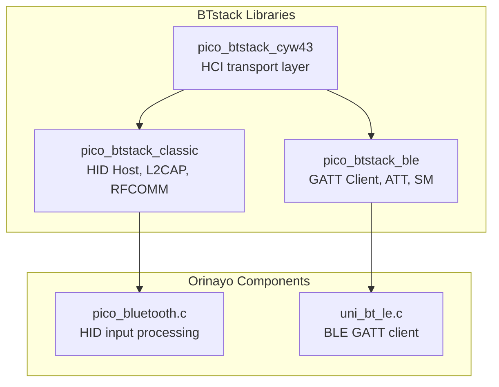
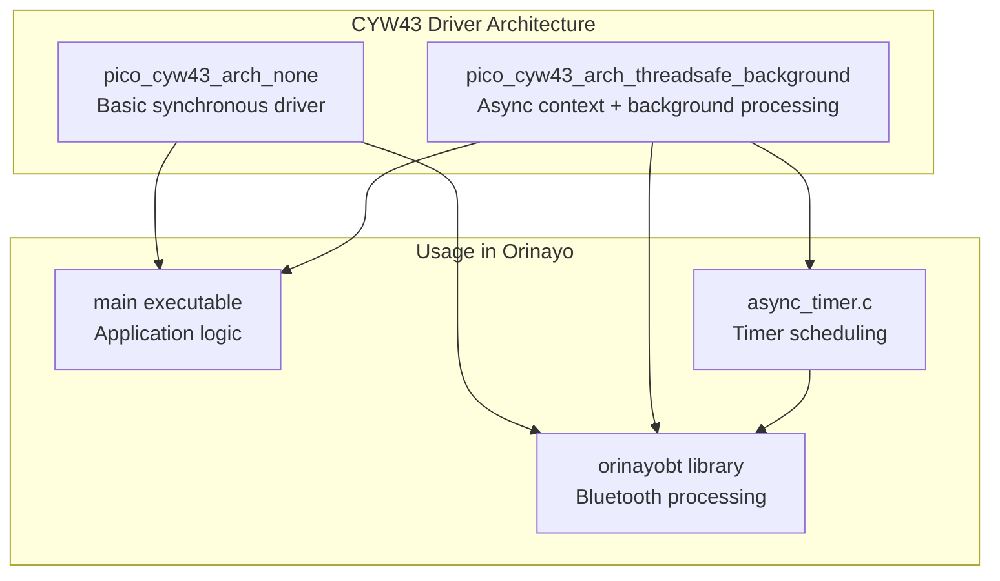

# Dependencies

> **Relevant source files**
> * [CMakeLists.txt](https://github.com/Jus-Be/orinayo-pico/blob/122fa496/CMakeLists.txt)
> * [bluepad32/include/btstack_config.h](https://github.com/Jus-Be/orinayo-pico/blob/122fa496/bluepad32/include/btstack_config.h)
> * [bluepad32/include/debug.h](https://github.com/Jus-Be/orinayo-pico/blob/122fa496/bluepad32/include/debug.h)
> * [bluepad32/include/pico_bluetooth.h](https://github.com/Jus-Be/orinayo-pico/blob/122fa496/bluepad32/include/pico_bluetooth.h)

This page documents the external libraries and dependencies integrated into the Orinayo system. It covers the Raspberry Pi Pico SDK, TinyUSB, BTstack, Bluepad32, and the CYW43 driver, explaining their roles and how they are configured in the build system.

For information about the CMake build configuration and compilation units, see [CMake Configuration](./9.1-cmake-configuration.md). For details on the CI/CD pipeline that builds these dependencies, see [CI/CD Pipeline](./9.3-cicd-pipeline.md).

---

## Overview

The Orinayo system depends on five major external libraries that provide hardware abstraction, USB functionality, Bluetooth protocol support, and controller integration. All dependencies are managed through CMake and linked to both the `orinayobt` static library and the main executable.

**Dependency Hierarchy**

```mermaid
flowchart TD

MAIN["main.c<br>Main Executable"]
ORINAYOBT["orinayobt<br>Static Library"]
STDLIB["pico_stdlib<br>Standard I/O, GPIO, Time"]
MULTICORE["pico_multicore<br>Dual-core support"]
CYW43_NONE["pico_cyw43_arch_none<br>Basic CYW43 driver"]
CYW43_BG["pico_cyw43_arch_threadsafe_background<br>Async context integration"]
BTSTACK_CLASSIC["pico_btstack_classic<br>Bluetooth Classic"]
BTSTACK_BLE["pico_btstack_ble<br>BLE GATT support"]
BTSTACK_CYW43["pico_btstack_cyw43<br>CYW43 integration"]
TINYUSB_DEV["tinyusb_device<br>USB device stack"]
TINYUSB_BOARD["tinyusb_board<br>Board support"]
BLUEPAD32["bluepad32<br>Gamepad HID abstraction"]

MAIN --> STDLIB
MAIN --> MULTICORE
MAIN --> CYW43_NONE
MAIN --> CYW43_BG
MAIN --> BTSTACK_CLASSIC
MAIN --> BTSTACK_BLE
MAIN --> BTSTACK_CYW43
MAIN --> TINYUSB_DEV
MAIN --> TINYUSB_BOARD
ORINAYOBT --> STDLIB
ORINAYOBT --> CYW43_NONE
ORINAYOBT --> CYW43_BG
ORINAYOBT --> BTSTACK_CLASSIC
ORINAYOBT --> BTSTACK_BLE
ORINAYOBT --> BTSTACK_CYW43
ORINAYOBT --> TINYUSB_DEV
ORINAYOBT --> TINYUSB_BOARD
ORINAYOBT --> BLUEPAD32

subgraph subGraph5 ["Controller Support"]
    BLUEPAD32
end

subgraph subGraph4 ["USB Functionality"]
    TINYUSB_DEV
    TINYUSB_BOARD
end

subgraph subGraph3 ["Bluetooth Stack"]
    BTSTACK_CLASSIC
    BTSTACK_BLE
    BTSTACK_CYW43
end

subgraph subGraph2 ["Wireless Communication"]
    CYW43_NONE
    CYW43_BG
end

subgraph subGraph1 ["Pico SDK - Core Platform"]
    STDLIB
    MULTICORE
end

subgraph subGraph0 ["Orinayo Codebase"]
    MAIN
    ORINAYOBT
    MAIN --> ORINAYOBT
end
```



**Sources:** [CMakeLists.txt L39-L56](https://github.com/Jus-Be/orinayo-pico/blob/122fa496/CMakeLists.txt#L39-L56)

---

## Pico SDK

The Raspberry Pi Pico SDK provides hardware abstraction and standard library functions for the RP2350 microcontroller. It is the foundational dependency for all Pico W projects.

### SDK Configuration

| Configuration | Value | Location |
| --- | --- | --- |
| **CMake Version** | 3.12+ | [CMakeLists.txt L20](https://github.com/Jus-Be/orinayo-pico/blob/122fa496/CMakeLists.txt#L20-L20) |
| **Platform** | `rp2350-arm-s` | [CMakeLists.txt L23](https://github.com/Jus-Be/orinayo-pico/blob/122fa496/CMakeLists.txt#L23-L23) |
| **Board** | `pico2_w` | [CMakeLists.txt L24](https://github.com/Jus-Be/orinayo-pico/blob/122fa496/CMakeLists.txt#L24-L24) |
| **SDK Import** | `$ENV{PICO_SDK_PATH}/external/pico_sdk_import.cmake` | [CMakeLists.txt L27](https://github.com/Jus-Be/orinayo-pico/blob/122fa496/CMakeLists.txt#L27-L27) |
| **C Standard** | C11 | [CMakeLists.txt L32](https://github.com/Jus-Be/orinayo-pico/blob/122fa496/CMakeLists.txt#L32-L32) |
| **C++ Standard** | C++17 | [CMakeLists.txt L33](https://github.com/Jus-Be/orinayo-pico/blob/122fa496/CMakeLists.txt#L33-L33) |

The SDK is imported via the `pico_sdk_import.cmake` script and initialized with `pico_sdk_init()` at [CMakeLists.txt L36](https://github.com/Jus-Be/orinayo-pico/blob/122fa496/CMakeLists.txt#L36-L36)

 This provides access to all Pico SDK libraries.

### Pico SDK Libraries Used

**Core Libraries:**

* `pico_stdlib` - Standard library functions, GPIO, timers, UART, I2C, SPI
* `pico_multicore` - Dual-core RP2350 support (currently unused, but linked)

**I/O Configuration:**

* `pico_enable_stdio_usb(${PROJECT_NAME} 1)` - Enables USB stdio at [CMakeLists.txt L46](https://github.com/Jus-Be/orinayo-pico/blob/122fa496/CMakeLists.txt#L46-L46)
* `pico_enable_stdio_uart(${PROJECT_NAME} 0)` - Disables UART stdio at [CMakeLists.txt L48](https://github.com/Jus-Be/orinayo-pico/blob/122fa496/CMakeLists.txt#L48-L48)

This configuration routes standard I/O (printf) to USB for debugging, while UART pins are reserved for MIDI output at 31,250 baud.

**Sources:** [CMakeLists.txt L19-L36](https://github.com/Jus-Be/orinayo-pico/blob/122fa496/CMakeLists.txt#L19-L36)

 [CMakeLists.txt L46-L48](https://github.com/Jus-Be/orinayo-pico/blob/122fa496/CMakeLists.txt#L46-L48)

---

## TinyUSB

TinyUSB is an open-source USB device stack that implements USB MIDI class support for the Orinayo system. It handles USB enumeration, descriptor parsing, and MIDI packet transmission.

### TinyUSB Libraries

The system links two TinyUSB components:

1. **`tinyusb_device`** - Core USB device stack
2. **`tinyusb_board`** - Board-specific USB configuration

Both are linked to the main executable and the `orinayobt` library at [CMakeLists.txt L41](https://github.com/Jus-Be/orinayo-pico/blob/122fa496/CMakeLists.txt#L41-L41)

 and [CMakeLists.txt L56](https://github.com/Jus-Be/orinayo-pico/blob/122fa496/CMakeLists.txt#L56-L56)

### USB MIDI Implementation

The system uses TinyUSB to implement a USB MIDI device with:

* **Vendor ID:** `0xCafe`
* **Product ID:** Dynamic (based on enabled features)
* **MIDI Endpoints:** 1 cable (16 MIDI channels)
* **Output Function:** `tud_midi_n_stream_write()` in `main.c`

For detailed USB descriptor configuration, see [USB MIDI Configuration](./6.2-usb-midi-configuration.md).

**Sources:** [CMakeLists.txt L41](https://github.com/Jus-Be/orinayo-pico/blob/122fa496/CMakeLists.txt#L41-L41)

 [CMakeLists.txt L56](https://github.com/Jus-Be/orinayo-pico/blob/122fa496/CMakeLists.txt#L56-L56)

---

## BTstack

BTstack is a portable Bluetooth stack that provides both Bluetooth Classic and BLE (Bluetooth Low Energy) protocol implementations. The Orinayo system uses BTstack for all Bluetooth communication with controllers and MIDI devices.

### BTstack Components

The system integrates three BTstack libraries:



**Sources:** [CMakeLists.txt L41](https://github.com/Jus-Be/orinayo-pico/blob/122fa496/CMakeLists.txt#L41-L41)

 [CMakeLists.txt L56](https://github.com/Jus-Be/orinayo-pico/blob/122fa496/CMakeLists.txt#L56-L56)

### BTstack Configuration

BTstack is configured via [bluepad32/include/btstack_config.h L1-L96](https://github.com/Jus-Be/orinayo-pico/blob/122fa496/bluepad32/include/btstack_config.h#L1-L96)

 with the following key settings:

| Configuration Parameter | Value | Description |
| --- | --- | --- |
| `MAX_NR_HCI_CONNECTIONS` | 4 | Maximum simultaneous Bluetooth connections |
| `MAX_NR_HID_HOST_CONNECTIONS` | 4 | HID device connections (gamepads) |
| `MAX_NR_GATT_CLIENTS` | 4 | BLE GATT client connections |
| `MAX_NR_L2CAP_CHANNELS` | 6 | L2CAP logical channels |
| `MAX_NR_LE_DEVICE_DB_ENTRIES` | 16 | Bonded BLE device database entries |
| `NVM_NUM_LINK_KEYS` | 16 | Stored link keys for pairing |
| `HCI_ACL_PAYLOAD_SIZE` | 1695 bytes | ACL packet buffer size |
| `MAX_ATT_DB_SIZE` | 512 bytes | Fixed ATT database size |

**Enabled Features:**

At [bluepad32/include/btstack_config.h L8-L34](https://github.com/Jus-Be/orinayo-pico/blob/122fa496/bluepad32/include/btstack_config.h#L8-L34)

 the configuration enables:

* `ENABLE_BLE` - BLE support (mandatory, checked at line 22)
* `ENABLE_CLASSIC` - Bluetooth Classic (mandatory, checked at line 29)
* `ENABLE_LE_CENTRAL` - BLE central role for initiating connections
* `ENABLE_LE_PERIPHERAL` - BLE peripheral role (unused)
* `ENABLE_GATT_CLIENT_PAIRING` - GATT client with pairing support
* `ENABLE_LE_SECURE_CONNECTIONS` - BLE Secure Connections
* `ENABLE_CROSS_TRANSPORT_KEY_DERIVATION` - Key sharing between Classic/BLE
* `ENABLE_L2CAP_ENHANCED_RETRANSMISSION_MODE` - Reliable L2CAP channels

**Flow Control:**

To prevent CYW43 bus overruns, BTstack enables host-side flow control at [bluepad32/include/btstack_config.h L61-L70](https://github.com/Jus-Be/orinayo-pico/blob/122fa496/bluepad32/include/btstack_config.h#L61-L70)

:

* `MAX_NR_CONTROLLER_ACL_BUFFERS`: 3
* `MAX_NR_CONTROLLER_SCO_PACKETS`: 3
* `ENABLE_HCI_CONTROLLER_TO_HOST_FLOW_CONTROL`
* `HCI_HOST_ACL_PACKET_NUM`: 6 buffers of 1024 bytes each

**Sources:** [bluepad32/include/btstack_config.h L1-L96](https://github.com/Jus-Be/orinayo-pico/blob/122fa496/bluepad32/include/btstack_config.h#L1-L96)

### BTstack Integration Points

**HID Host (Bluetooth Classic):**

* Used by `pico_bluetooth.c` to receive gamepad HID reports
* Handles Bluepad32 controller abstraction
* See [HID to MIDI Translation](./4.2-hid-to-midi-translation.md)

**GATT Client (BLE):**

* Used by `uni_bt_le.c` to communicate with Liberlive and Sonic Master MIDI devices
* Custom GATT UUIDs for MIDI data
* See [Specialized MIDI Devices](./4.5-specialized-midi-devices.md)

**Sources:** [CMakeLists.txt L41](https://github.com/Jus-Be/orinayo-pico/blob/122fa496/CMakeLists.txt#L41-L41)

 [CMakeLists.txt L56](https://github.com/Jus-Be/orinayo-pico/blob/122fa496/CMakeLists.txt#L56-L56)

---

## Bluepad32

Bluepad32 is a custom library that provides gamepad controller abstraction over Bluetooth. It translates various gamepad protocols (PlayStation, Xbox, Nintendo, etc.) into a unified input API.

### Bluepad32 Integration

**Library Location:** [CMakeLists.txt L67](https://github.com/Jus-Be/orinayo-pico/blob/122fa496/CMakeLists.txt#L67-L67)

```
add_subdirectory(${CMAKE_CURRENT_LIST_DIR}/bluepad32 libbluepad32)
```

The Bluepad32 library is built as a static library named `libbluepad32` and linked to the `orinayobt` library at [CMakeLists.txt L41](https://github.com/Jus-Be/orinayo-pico/blob/122fa496/CMakeLists.txt#L41-L41)

### Include Directories

Bluepad32 headers are made available to both `orinayobt` and the main executable:

* `orinayobt` includes: [CMakeLists.txt L40](https://github.com/Jus-Be/orinayo-pico/blob/122fa496/CMakeLists.txt#L40-L40)  - `${CMAKE_CURRENT_LIST_DIR}/bluepad32/include`
* Main executable includes: [CMakeLists.txt L50](https://github.com/Jus-Be/orinayo-pico/blob/122fa496/CMakeLists.txt#L50-L50)  - `${CMAKE_CURRENT_LIST_DIR}/bluepad32/include`

### Bluepad32 Headers

The codebase references Bluepad32 through two headers:

1. **`pico_bluetooth.h`** - Public API for Bluetooth initialization and main loop * `bluetooth_init()` - Initialize Bluetooth stack * `bluetooth_run()` - Process Bluetooth events
2. **`btstack_config.h`** - BTstack configuration (see BTstack section above)

**Custom Debug Utilities:**

The [bluepad32/include/debug.h L1-L24](https://github.com/Jus-Be/orinayo-pico/blob/122fa496/bluepad32/include/debug.h#L1-L24)

 file provides project-specific debug macros:

```c
#define PICO_DEBUG(fmt, ...) printf("[DEBUG] " fmt, ##__VA_ARGS__)
#define PICO_INFO(fmt, ...) printf("[INFO] " fmt, ##__VA_ARGS__)
#define PICO_ERROR(fmt, ...) printf("[ERROR] " fmt, ##__VA_ARGS__)
```

These macros are conditionally compiled based on `PICO_DEBUG_MODE` at [bluepad32/include/debug.h L7-L8](https://github.com/Jus-Be/orinayo-pico/blob/122fa496/bluepad32/include/debug.h#L7-L8)

### Controller Support

Bluepad32 enables the system to recognize and process input from:

* Guitar Hero/Rock Band controllers
* PlayStation DualShock/DualSense
* Xbox controllers
* Nintendo Switch Pro controllers
* Generic HID gamepads

The unified input is then translated to MIDI commands in `pico_bluetooth.c`. For details on button mapping and chord generation, see [HID to MIDI Translation](./4.2-hid-to-midi-translation.md).

**Sources:** [CMakeLists.txt L40-L41](https://github.com/Jus-Be/orinayo-pico/blob/122fa496/CMakeLists.txt#L40-L41)

 [CMakeLists.txt L50](https://github.com/Jus-Be/orinayo-pico/blob/122fa496/CMakeLists.txt#L50-L50)

 [CMakeLists.txt L67](https://github.com/Jus-Be/orinayo-pico/blob/122fa496/CMakeLists.txt#L67-L67)

 [bluepad32/include/pico_bluetooth.h L1-L8](https://github.com/Jus-Be/orinayo-pico/blob/122fa496/bluepad32/include/pico_bluetooth.h#L1-L8)

 [bluepad32/include/debug.h L1-L24](https://github.com/Jus-Be/orinayo-pico/blob/122fa496/bluepad32/include/debug.h#L1-L24)

---

## CYW43 Driver

The CYW43 driver provides low-level access to the Infineon CYW43439 wireless chip on the Pico 2 W. This chip handles both WiFi and Bluetooth communication via a shared SDIO bus.

### CYW43 Libraries

The system links two CYW43 driver variants:



**Sources:** [CMakeLists.txt L41](https://github.com/Jus-Be/orinayo-pico/blob/122fa496/CMakeLists.txt#L41-L41)

 [CMakeLists.txt L56](https://github.com/Jus-Be/orinayo-pico/blob/122fa496/CMakeLists.txt#L56-L56)

### Thread-Safe Background Processing

The system defines `PICO_CYW43_ARCH_THREADSAFE_BACKGROUND` at [CMakeLists.txt L42](https://github.com/Jus-Be/orinayo-pico/blob/122fa496/CMakeLists.txt#L42-L42)

:

```
add_compile_definitions(orinayobt PICO_CYW43_ARCH_THREADSAFE_BACKGROUND)
```

This enables the `pico_cyw43_arch_threadsafe_background` driver, which provides:

1. **Async Context Integration** - CYW43 operations run in a background async context
2. **SDIO Bus Arbitration** - Prevents conflicts when Bluetooth and GPIO share the bus
3. **Non-blocking Operations** - Bluetooth scanning and connections don't block main loop
4. **Thread-Safe API** - Multiple components can safely access CYW43 functions

### CYW43 and Async Timer

The `async_timer.c` module conditionally uses CYW43's async context when available. This integration allows the looper, note scheduler, and ghost note generator to schedule callbacks without interfering with Bluetooth communication.

For details on async context usage, see [Asynchronous Timer](./8.1-asynchronous-timer.md).

**Sources:** [CMakeLists.txt L41-L42](https://github.com/Jus-Be/orinayo-pico/blob/122fa496/CMakeLists.txt#L41-L42)

 [CMakeLists.txt L56](https://github.com/Jus-Be/orinayo-pico/blob/122fa496/CMakeLists.txt#L56-L56)

---

## BTstack SDK Path

BTstack headers are accessed via the Pico SDK path:

* `orinayobt` include path: [CMakeLists.txt L40](https://github.com/Jus-Be/orinayo-pico/blob/122fa496/CMakeLists.txt#L40-L40)  - `${PICO_SDK_PATH}/lib/btstack/src`
* Main executable include path: [CMakeLists.txt L50](https://github.com/Jus-Be/orinayo-pico/blob/122fa496/CMakeLists.txt#L50-L50)  - `${PICO_SDK_PATH}/lib/btstack/src`

This provides direct access to BTstack internal headers for advanced usage in `uni_bt_le.c` and `pico_bluetooth.c`, such as:

* HCI (Host Controller Interface) definitions
* GATT client API
* L2CAP channel management
* Security manager functions

**Sources:** [CMakeLists.txt L40](https://github.com/Jus-Be/orinayo-pico/blob/122fa496/CMakeLists.txt#L40-L40)

 [CMakeLists.txt L50](https://github.com/Jus-Be/orinayo-pico/blob/122fa496/CMakeLists.txt#L50-L50)

---

## Compiler Flags

The build system applies optimization flags to reduce binary size:

```
set(CMAKE_C_FLAGS  "${CMAKE_C_FLAGS} -ffunction-sections -fdata-sections")
set(CMAKE_CXX_FLAGS  "${CMAKE_CXX_FLAGS} -ffunction-sections -fdata-sections")
```

At [CMakeLists.txt L64-L65](https://github.com/Jus-Be/orinayo-pico/blob/122fa496/CMakeLists.txt#L64-L65)

 these flags enable:

* `-ffunction-sections` - Place each function in its own section
* `-fdata-sections` - Place each data item in its own section

This allows the linker to perform dead code elimination, removing unused functions from the final binary. This is particularly important given the large size of BTstack and TinyUSB libraries.

**Sources:** [CMakeLists.txt L64-L65](https://github.com/Jus-Be/orinayo-pico/blob/122fa496/CMakeLists.txt#L64-L65)

---

## Dependency Version Management

All dependencies are managed through the Pico SDK and CMake's FetchContent mechanism:

| Dependency | Version Source | Notes |
| --- | --- | --- |
| **Pico SDK** | `$ENV{PICO_SDK_PATH}` | Must be set in environment |
| **TinyUSB** | Pico SDK submodule | Automatically matched to SDK version |
| **BTstack** | Pico SDK submodule | Pico-specific port |
| **Bluepad32** | Git submodule | In `bluepad32/` directory |
| **CYW43 Driver** | Pico SDK component | Part of `pico_cyw43_arch` |

The build system does not pin specific versions; instead, it relies on the versions provided by the Pico SDK installation. This ensures compatibility between all SDK components.

**Sources:** [CMakeLists.txt L27](https://github.com/Jus-Be/orinayo-pico/blob/122fa496/CMakeLists.txt#L27-L27)

 [CMakeLists.txt L67](https://github.com/Jus-Be/orinayo-pico/blob/122fa496/CMakeLists.txt#L67-L67)

---

## Summary Table

| Library | Purpose | Linked To | Key Files |
| --- | --- | --- | --- |
| **Pico SDK** | Hardware abstraction, GPIO, timers | Both | `pico_sdk_import.cmake` |
| **TinyUSB** | USB MIDI device implementation | Both | `usb_descriptors.c` |
| **BTstack** | Bluetooth Classic and BLE protocols | Both | `btstack_config.h` |
| **Bluepad32** | Gamepad controller abstraction | `orinayobt` | `bluepad32/` subdirectory |
| **CYW43 Driver** | Wireless chip low-level driver | Both | N/A (SDK component) |

"Both" indicates the library is linked to both the `orinayobt` static library and the main executable.

**Sources:** [CMakeLists.txt L39-L67](https://github.com/Jus-Be/orinayo-pico/blob/122fa496/CMakeLists.txt#L39-L67)