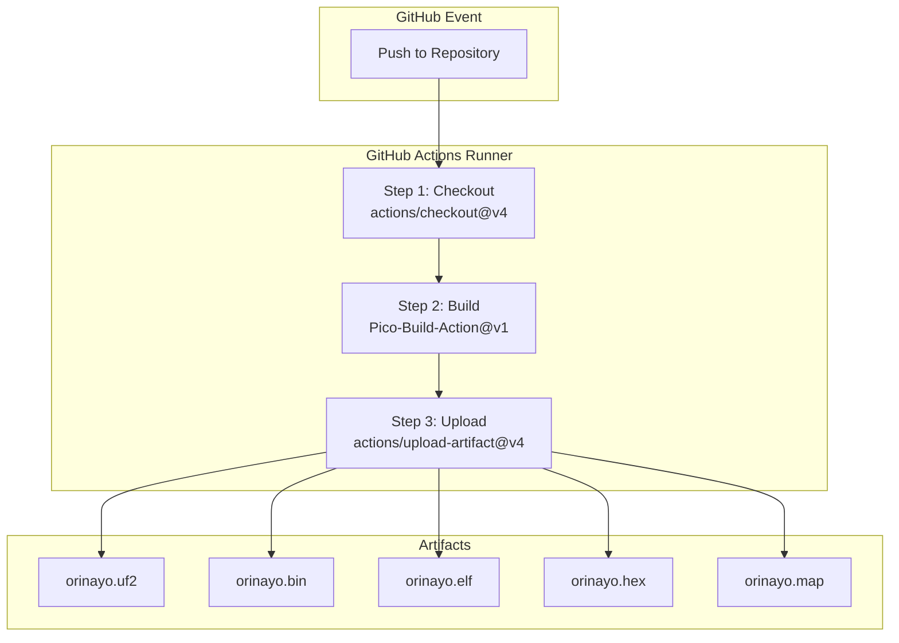
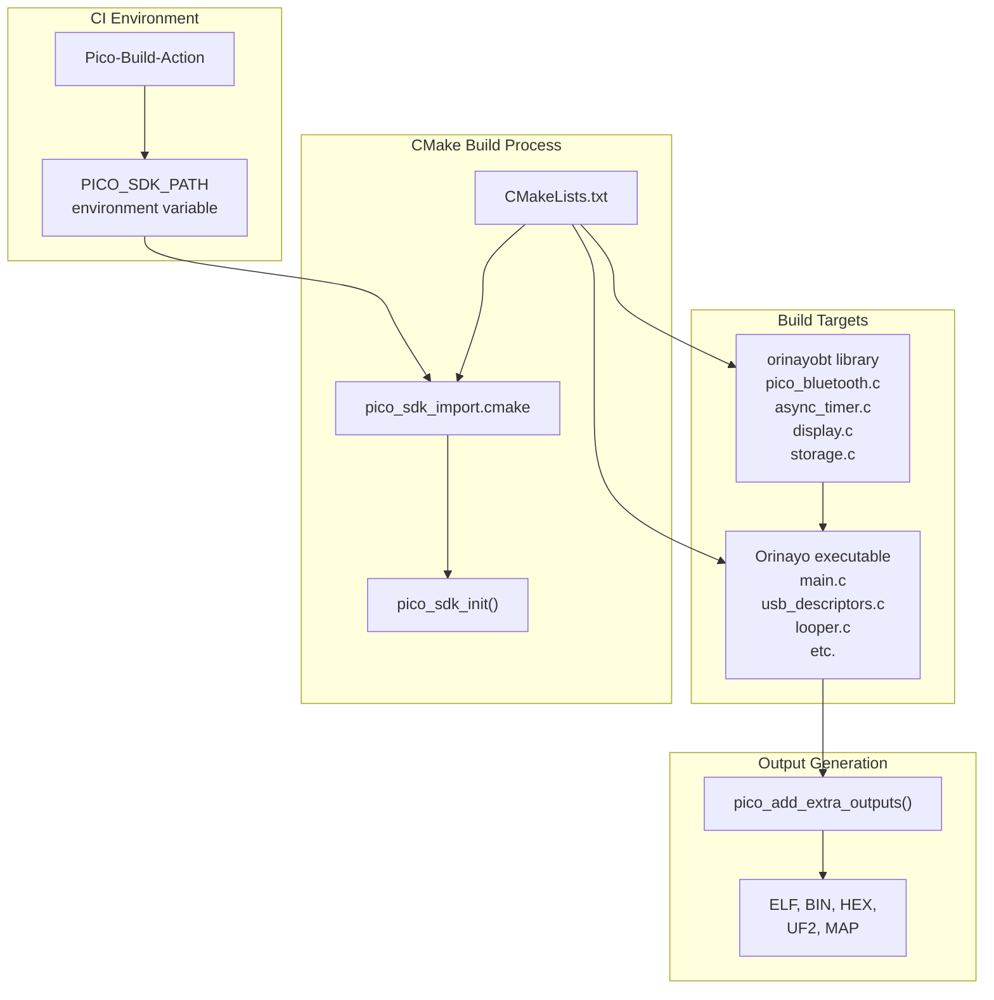
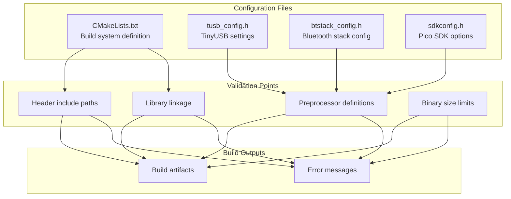

# CI/CD Pipeline

> **Relevant source files**
> * [.github/workflows/build.yml](https://github.com/Jus-Be/orinayo-pico/blob/122fa496/.github/workflows/build.yml)
> * [CMakeLists.txt](https://github.com/Jus-Be/orinayo-pico/blob/122fa496/CMakeLists.txt)
> * [tusb_config.h](https://github.com/Jus-Be/orinayo-pico/blob/122fa496/tusb_config.h)

This document describes the automated continuous integration and deployment (CI/CD) pipeline that builds the Orinayo firmware on every code push. The pipeline uses GitHub Actions to compile the project for the Raspberry Pi Pico 2 W platform and generates deployable binary artifacts.

For information about the CMake build system configuration, see [CMake Configuration](./9.1-cmake-configuration.md). For details about dependencies and library integration, see [Dependencies](./9.2-dependencies.md).

## Overview

The CI/CD system is implemented as a single GitHub Actions workflow defined in [.github/workflows/build.yml L1-L25](https://github.com/Jus-Be/orinayo-pico/blob/122fa496/.github/workflows/build.yml#L1-L25)

 This workflow executes on every `push` event to any branch in the repository, automatically building the firmware and making build artifacts available for download.

The workflow leverages the `samyarsadat/Pico-Build-Action@v1` action, which provides a pre-configured build environment with the Pico SDK and all necessary toolchains for RP2350 cross-compilation.

**Sources:** [.github/workflows/build.yml L1-L25](https://github.com/Jus-Be/orinayo-pico/blob/122fa496/.github/workflows/build.yml#L1-L25)

## Workflow Structure

### Workflow Definition

The GitHub Actions workflow consists of a single job named `test_build` that runs on Ubuntu Linux:



**Workflow Job Configuration**

The job configuration specifies minimal permissions for security:

| Property | Value | Purpose |
| --- | --- | --- |
| `name` | `Build Orinayo` | Human-readable job name |
| `runs-on` | `ubuntu-latest` | Execution environment |
| `permissions.contents` | `read` | Read-only access to repository |

**Sources:** [.github/workflows/build.yml L1-L9](https://github.com/Jus-Be/orinayo-pico/blob/122fa496/.github/workflows/build.yml#L1-L9)

### Workflow Steps

#### Step 1: Repository Checkout

The first step uses the official `actions/checkout@v4` action to clone the repository into the runner workspace:

[.github/workflows/build.yml L11-L12](https://github.com/Jus-Be/orinayo-pico/blob/122fa496/.github/workflows/build.yml#L11-L12)

This step checks out the entire repository including submodules, making the source code available to subsequent steps.

#### Step 2: Firmware Build

The core build step uses the `samyarsadat/Pico-Build-Action@v1` custom action:

[.github/workflows/build.yml L14-L18](https://github.com/Jus-Be/orinayo-pico/blob/122fa496/.github/workflows/build.yml#L14-L18)

The action is configured with a single parameter:

* `source_dir`: Set to `"."`, indicating the project root contains the `CMakeLists.txt`

The build action performs the following operations internally:

1. Sets up the Pico SDK environment
2. Configures the RP2350-ARM-S platform and Pico 2 W board
3. Invokes CMake to generate build files
4. Executes the build using the configured toolchain
5. Generates multiple output formats (ELF, BIN, HEX, UF2, MAP)

The step captures the build output directory in the `steps.build.outputs.output_dir` variable for use in the next step.

#### Step 3: Artifact Upload

The final step uploads all build artifacts to GitHub Actions storage:

[.github/workflows/build.yml L20-L24](https://github.com/Jus-Be/orinayo-pico/blob/122fa496/.github/workflows/build.yml#L20-L24)

The artifacts are packaged together under the name `workspace_artifacts` and remain available for download from the Actions tab in the GitHub repository interface.

**Sources:** [.github/workflows/build.yml L10-L25](https://github.com/Jus-Be/orinayo-pico/blob/122fa496/.github/workflows/build.yml#L10-L25)

## Build Environment

### Pico-Build-Action Configuration

The `Pico-Build-Action@v1` provides a containerized build environment that includes:

| Component | Purpose |
| --- | --- |
| Pico SDK | Core SDK for RP2040/RP2350 development |
| ARM GNU Toolchain | Cross-compiler for ARM Cortex-M33 |
| CMake 3.12+ | Build system generator |
| Ninja | Fast parallel build executor |
| Python 3 | Required for Pico SDK utilities |

The action automatically detects the platform configuration from [CMakeLists.txt L23-L24](https://github.com/Jus-Be/orinayo-pico/blob/122fa496/CMakeLists.txt#L23-L24)

:

* `PICO_PLATFORM`: `rp2350-arm-s`
* `PICO_BOARD`: `pico2_w`

### Integration with CMake

The CI pipeline executes the same CMake build process that developers use locally. The build process is described in detail in [CMake Configuration](./9.1-cmake-configuration.md), but the relevant CI integration points are:



The workflow leverages the project version string that CMake generates from the current UTC timestamp:

[CMakeLists.txt L30-L31](https://github.com/Jus-Be/orinayo-pico/blob/122fa496/CMakeLists.txt#L30-L31)

This ensures each build is uniquely versioned with a date-based identifier (e.g., `2024.12.15`).

**Sources:** [CMakeLists.txt L23-L31](https://github.com/Jus-Be/orinayo-pico/blob/122fa496/CMakeLists.txt#L23-L31)

 [CMakeLists.txt L39-L56](https://github.com/Jus-Be/orinayo-pico/blob/122fa496/CMakeLists.txt#L39-L56)

## Build Artifacts

### Generated Files

The CI pipeline produces five distinct file formats, each serving different deployment scenarios:

| File Format | Extension | Purpose | Target Use Case |
| --- | --- | --- | --- |
| Executable Linkable Format | `.elf` | Complete binary with debug symbols | Debugging with GDB/OpenOCD |
| Raw Binary | `.bin` | Stripped binary image | Flash programming tools |
| Intel HEX | `.hex` | Hexadecimal text format | JTAG programmers |
| USB Flashing Format | `.uf2` | User-friendly drag-and-drop format | **Primary deployment method** |
| Link Map | `.map` | Memory layout and symbol table | Analysis and optimization |

The UF2 (USB Flashing Format) file is the recommended deployment artifact. Users can flash the Pico 2 W by:

1. Connecting the device while holding the BOOTSEL button
2. Mounting the device as a USB mass storage device
3. Dragging `orinayo.uf2` onto the mounted drive

### Artifact Structure

The artifacts are generated by CMake's `pico_add_extra_outputs()` function:

[CMakeLists.txt L47](https://github.com/Jus-Be/orinayo-pico/blob/122fa496/CMakeLists.txt#L47-L47)

 [CMakeLists.txt L53](https://github.com/Jus-Be/orinayo-pico/blob/122fa496/CMakeLists.txt#L53-L53)

This function is invoked twice in the build configuration (once for the executable, once redundantly), ensuring all output formats are created.

### Artifact Access

After a successful workflow run, artifacts are available through:

* GitHub Actions UI: Navigate to the workflow run and download the `workspace_artifacts` package
* GitHub API: Access via REST API endpoints for automated retrieval
* GitHub CLI: Use `gh run download` command

Artifacts are retained according to the repository's retention policy (typically 90 days for public repositories).

**Sources:** [CMakeLists.txt L47](https://github.com/Jus-Be/orinayo-pico/blob/122fa496/CMakeLists.txt#L47-L47)

 [CMakeLists.txt L53](https://github.com/Jus-Be/orinayo-pico/blob/122fa496/CMakeLists.txt#L53-L53)

## Build Verification

### Success Criteria

The workflow succeeds when all three steps complete without error. Key success indicators include:

1. **Checkout Success**: Repository and submodules cloned successfully
2. **Build Success**: CMake configuration and compilation complete with zero errors
3. **Upload Success**: All five artifact files are uploaded

### Failure Scenarios

Common build failure scenarios and their indicators:

| Failure Type | Cause | Log Indicator |
| --- | --- | --- |
| Configuration Error | Invalid CMakeLists.txt syntax | CMake configuration phase error |
| Compilation Error | C/C++ syntax errors | Compiler error messages |
| Linker Error | Missing symbols or libraries | Undefined reference errors |
| Platform Mismatch | Incorrect SDK configuration | Pico SDK initialization failure |

The CI system provides full build logs in the Actions tab, including:

* CMake configuration output
* Compiler warnings and errors
* Link map information
* File size statistics

### Build Configuration Validation

The workflow implicitly validates several configuration files:



For example, the TinyUSB configuration [tusb_config.h L83](https://github.com/Jus-Be/orinayo-pico/blob/122fa496/tusb_config.h#L83-L83)

 enables the MIDI device class, which must be compatible with the USB descriptor definitions in `usb_descriptors.c`. The CI build will fail if these configurations are inconsistent.

**Sources:** [.github/workflows/build.yml L1-L25](https://github.com/Jus-Be/orinayo-pico/blob/122fa496/.github/workflows/build.yml#L1-L25)

 [CMakeLists.txt L1-L67](https://github.com/Jus-Be/orinayo-pico/blob/122fa496/CMakeLists.txt#L1-L67)

 [tusb_config.h L83](https://github.com/Jus-Be/orinayo-pico/blob/122fa496/tusb_config.h#L83-L83)

## Trigger Conditions

### Automatic Triggers

The workflow is configured with a single automatic trigger:

[.github/workflows/build.yml L2](https://github.com/Jus-Be/orinayo-pico/blob/122fa496/.github/workflows/build.yml#L2-L2)

This means the CI pipeline executes on:

* Direct pushes to any branch
* Pull request merges to any branch
* Tag creation

The workflow does **not** trigger on:

* Pull request creation (without merge)
* Issue events
* Manual workflow dispatch (not configured)

### Manual Execution

The workflow does not currently support manual triggering via `workflow_dispatch`. To add manual trigger support, the workflow definition would need modification:

```yaml
on: 
  push:
  workflow_dispatch:
```

**Sources:** [.github/workflows/build.yml L2](https://github.com/Jus-Be/orinayo-pico/blob/122fa496/.github/workflows/build.yml#L2-L2)

## Build Performance

### Typical Build Duration

On GitHub-hosted `ubuntu-latest` runners, a clean build typically completes in:

| Phase | Duration | Description |
| --- | --- | --- |
| Checkout | 5-10 seconds | Clone repository and submodules |
| Environment Setup | 30-60 seconds | Pico-Build-Action initialization |
| CMake Configuration | 10-20 seconds | Generate build files |
| Compilation | 2-4 minutes | Compile all source files |
| Artifact Upload | 5-10 seconds | Upload to Actions storage |
| **Total** | **3-5 minutes** | Complete workflow execution |

Build times may vary based on:

* GitHub Actions runner availability
* Number of source files modified
* Compiler cache effectiveness

### Build Optimization

The CMakeLists.txt includes optimization flags to reduce binary size:

[CMakeLists.txt L64-L65](https://github.com/Jus-Be/orinayo-pico/blob/122fa496/CMakeLists.txt#L64-L65)

These flags enable:

* `-ffunction-sections`: Place each function in its own section
* `-fdata-sections`: Place each data item in its own section

These settings allow the linker to perform dead code elimination, reducing the final binary size. The optimization is particularly important for the RP2350 platform, which has 2MB of flash storage.

**Sources:** [CMakeLists.txt L64-L65](https://github.com/Jus-Be/orinayo-pico/blob/122fa496/CMakeLists.txt#L64-L65)

## Integration with Development Workflow

### Continuous Integration Benefits

The CI pipeline provides automatic verification that:

1. **Code Compiles**: All source files compile without errors
2. **Dependencies Resolve**: External libraries link correctly
3. **Platform Compatibility**: Code targets the correct RP2350 platform
4. **Binary Size**: Executable fits within flash memory constraints

### Pre-Deployment Validation

Before deploying to physical hardware, developers can:

1. Review the CI build logs for warnings
2. Download the UF2 artifact from the successful build
3. Test the artifact on hardware without local compilation

This workflow is particularly useful when:

* Developing on non-Linux platforms
* Working without local Pico SDK installation
* Verifying builds across multiple branches

### Version Tracking

Each CI build is associated with:

* Git commit SHA (from checkout action)
* Build timestamp (from CMake project version)
* Workflow run number (from GitHub Actions)

This metadata enables precise tracking of which code version produced each artifact.

**Sources:** [.github/workflows/build.yml L1-L25](https://github.com/Jus-Be/orinayo-pico/blob/122fa496/.github/workflows/build.yml#L1-L25)

 [CMakeLists.txt L30-L31](https://github.com/Jus-Be/orinayo-pico/blob/122fa496/CMakeLists.txt#L30-L31)

## Maintenance and Updates

### Action Version Management

The workflow pins specific versions of GitHub Actions:

| Action | Version | Update Strategy |
| --- | --- | --- |
| `actions/checkout` | `v4` | Major version pin |
| `samyarsadat/Pico-Build-Action` | `v1` | Major version pin |
| `actions/upload-artifact` | `v4` | Major version pin |

Using major version tags (e.g., `@v4`) allows automatic minor and patch updates while preventing breaking changes from major version upgrades.

### SDK Updates

The Pico-Build-Action maintains its own version of the Pico SDK. To update the SDK version used by CI:

1. Update the Pico-Build-Action version
2. Test locally with the corresponding SDK version
3. Update the workflow file with the new action version

### Configuration Changes

Changes to build configuration files automatically affect the CI pipeline:

* **CMakeLists.txt changes**: Modify build targets, dependencies, compiler flags
* **tusb_config.h changes**: Alter USB configuration
* **btstack_config.h changes**: Modify Bluetooth stack settings

No workflow file changes are required when updating these configuration files, as the CI pipeline automatically uses the repository's current configuration.

**Sources:** [.github/workflows/build.yml L12](https://github.com/Jus-Be/orinayo-pico/blob/122fa496/.github/workflows/build.yml#L12-L12)

 [.github/workflows/build.yml L16](https://github.com/Jus-Be/orinayo-pico/blob/122fa496/.github/workflows/build.yml#L16-L16)

 [.github/workflows/build.yml L21](https://github.com/Jus-Be/orinayo-pico/blob/122fa496/.github/workflows/build.yml#L21-L21)