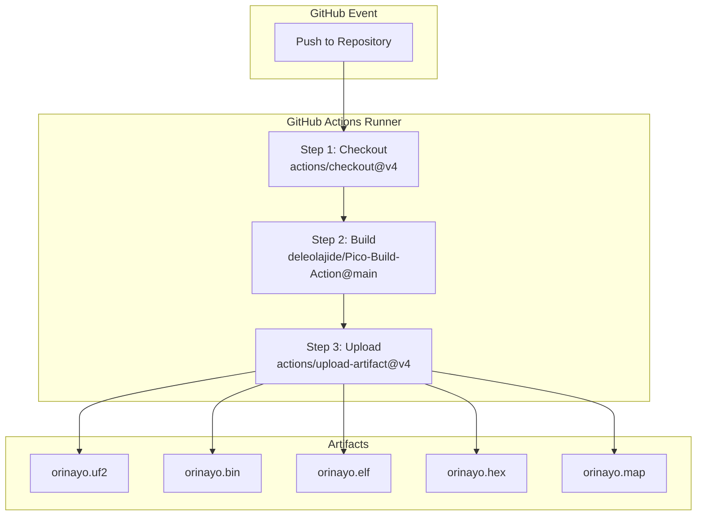
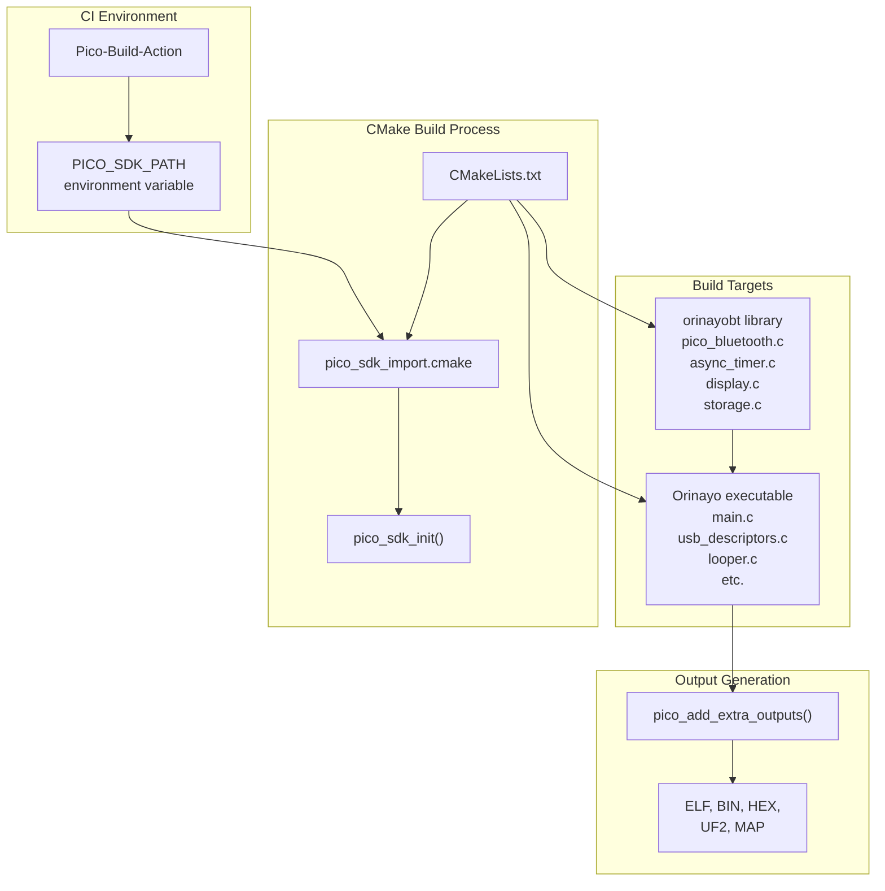
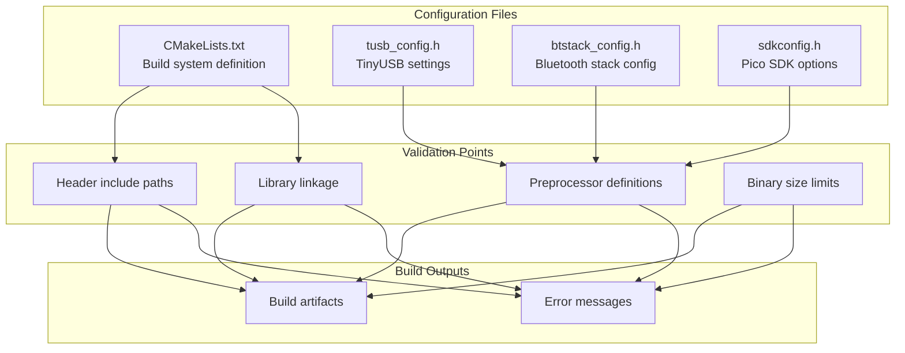

# CI/CD Pipeline

> **Relevant source files**
> * [.github/workflows/build.yml](https://github.com/Jus-Be/orinayo-pico/blob/6dde5a75/.github/workflows/build.yml)
> * [.github/workflows/build.yml.experiment](https://github.com/Jus-Be/orinayo-pico/blob/6dde5a75/.github/workflows/build.yml.experiment)
> * [.gitignore](https://github.com/Jus-Be/orinayo-pico/blob/6dde5a75/.gitignore)
> * [Dockerfile](https://github.com/Jus-Be/orinayo-pico/blob/6dde5a75/Dockerfile)

This document describes the automated continuous integration and deployment (CI/CD) pipeline that builds the Orinayo firmware on every code push. The pipeline uses GitHub Actions to compile the project for the Raspberry Pi Pico 2 W platform and generates deployable binary artifacts.

For information about the CMake build system configuration, see [9.1 CMake Configuration](https://github.com/Jus-Be/orinayo-pico/blob/6dde5a75/9.1 CMake Configuration)

 For details about dependencies and library integration, see [9.2 Dependencies](https://github.com/Jus-Be/orinayo-pico/blob/6dde5a75/9.2 Dependencies)

## Overview

The CI/CD system is implemented as a single GitHub Actions workflow defined in [.github/workflows/build.yml L1-L25](https://github.com/Jus-Be/orinayo-pico/blob/6dde5a75/.github/workflows/build.yml#L1-L25)

 This workflow executes on every `push` event to any branch in the repository, automatically building the firmware and making build artifacts available for download.

The workflow leverages the `deleolajide/Pico-Build-Action@main` action, which provides a pre-configured build environment with the Pico SDK and all necessary toolchains for RP2350 cross-compilation.

**Sources:** [.github/workflows/build.yml L1-L25](https://github.com/Jus-Be/orinayo-pico/blob/6dde5a75/.github/workflows/build.yml#L1-L25)

## Workflow Structure

### Workflow Definition

The GitHub Actions workflow consists of a single job named `test_build` that runs on Ubuntu Linux:

**Figure 1: GitHub Actions Data Flow**

```mermaid
flowchart TD

PUSH["Push to Repository"]
CHECKOUT["Step 1: Checkout<br>actions/checkout@v4"]
BUILD["Step 2: Build<br>deleolajide/Pico-Build-Action@main"]
UPLOAD["Step 3: Upload<br>actions/upload-artifact@v4"]
UF2["orinayo.uf2"]
BIN["orinayo.bin"]
ELF["orinayo.elf"]
HEX["orinayo.hex"]
MAP["orinayo.map"]

PUSH --> CHECKOUT
UPLOAD --> UF2
UPLOAD --> BIN
UPLOAD --> ELF
UPLOAD --> HEX
UPLOAD --> MAP

subgraph Artifacts ["Artifacts"]
    UF2
    BIN
    ELF
    HEX
    MAP
end

subgraph subGraph1 ["GitHub Actions Runner"]
    CHECKOUT
    BUILD
    UPLOAD
    CHECKOUT --> BUILD
    BUILD --> UPLOAD
end

subgraph subGraph0 ["GitHub Event"]
    PUSH
end
```

**Workflow Job Configuration**

The job configuration specifies minimal permissions for security:

| Property | Value | Purpose |
| --- | --- | --- |
| `name` | `Build Orinayo` | Human-readable job name |
| `runs-on` | `ubuntu-latest` | Execution environment |
| `permissions.contents` | `read` | Read-only access to repository |

**Sources:** [.github/workflows/build.yml L1-L9](https://github.com/Jus-Be/orinayo-pico/blob/6dde5a75/.github/workflows/build.yml#L1-L9)

### Workflow Steps

#### Step 1: Repository Checkout

The first step uses the official `actions/checkout@v4` action to clone the repository into the runner workspace:

[.github/workflows/build.yml L11-L12](https://github.com/Jus-Be/orinayo-pico/blob/6dde5a75/.github/workflows/build.yml#L11-L12)

This step checks out the entire repository including submodules, making the source code available to subsequent steps.

#### Step 2: Firmware Build

The core build step uses the `deleolajide/Pico-Build-Action@main` custom action:

[.github/workflows/build.yml L14-L18](https://github.com/Jus-Be/orinayo-pico/blob/6dde5a75/.github/workflows/build.yml#L14-L18)

The action is configured with a single parameter:

* `source_dir`: Set to `"."`, indicating the project root contains the `CMakeLists.txt`

The build action performs the following operations internally:

1. Sets up the Pico SDK environment
2. Configures the RP2350-ARM-S platform and Pico 2 W board
3. Invokes CMake to generate build files
4. Executes the build using the configured toolchain
5. Generates multiple output formats (ELF, BIN, HEX, UF2, MAP)

The step captures the build output directory in the `steps.build.outputs.output_dir` variable for use in the next step.

#### Step 3: Artifact Upload

The final step uploads all build artifacts to GitHub Actions storage:

[.github/workflows/build.yml L20-L24](https://github.com/Jus-Be/orinayo-pico/blob/6dde5a75/.github/workflows/build.yml#L20-L24)

The artifacts are packaged together under the name `workspace_artifacts` and remain available for download from the Actions tab in the GitHub repository interface.

**Sources:** [.github/workflows/build.yml L10-L25](https://github.com/Jus-Be/orinayo-pico/blob/6dde5a75/.github/workflows/build.yml#L10-L25)

## Build Environment

### Pico-Build-Action Configuration

The `deleolajide/Pico-Build-Action@main` provides a containerized build environment that includes:

| Component | Purpose |
| --- | --- |
| Pico SDK | Core SDK for RP2040/RP2350 development |
| ARM GNU Toolchain | Cross-compiler for ARM Cortex-M33 |
| CMake 3.12+ | Build system generator |
| Ninja | Fast parallel build executor |
| Python 3 | Required for Pico SDK utilities |

The action automatically detects the platform configuration from [CMakeLists.txt L23-L24](https://github.com/Jus-Be/orinayo-pico/blob/6dde5a75/CMakeLists.txt#L23-L24)

:

* `PICO_PLATFORM`: `rp2350-arm-s`
* `PICO_BOARD`: `pico2_w`

### Integration with CMake

The CI pipeline executes the same CMake build process that developers use locally.

**Figure 2: Build Process Integration**

```mermaid
flowchart TD

ACTION["Pico-Build-Action"]
SDK["PICO_SDK_PATH<br>environment variable"]
CMAKE["CMakeLists.txt"]
IMPORT["pico_sdk_import.cmake"]
INIT["pico_sdk_init()"]
LIB["orinayobt library<br>pico_bluetooth.c<br>async_timer.c<br>display.c<br>storage.c"]
EXE["Orinayo executable<br>main.c<br>usb_descriptors.c<br>looper.c<br>etc."]
OUTPUTS["pico_add_extra_outputs()"]
FORMATS["ELF, BIN, HEX,<br>UF2, MAP"]

SDK --> IMPORT
CMAKE --> LIB
CMAKE --> EXE
EXE --> OUTPUTS

subgraph subGraph3 ["Output Generation"]
    OUTPUTS
    FORMATS
    OUTPUTS --> FORMATS
end

subgraph subGraph2 ["Build Targets"]
    LIB
    EXE
    LIB --> EXE
end

subgraph subGraph1 ["CMake Build Process"]
    CMAKE
    IMPORT
    INIT
    CMAKE --> IMPORT
    IMPORT --> INIT
end

subgraph subGraph0 ["CI Environment"]
    ACTION
    SDK
    ACTION --> SDK
end
```

The workflow leverages the project version string that CMake generates from the current UTC timestamp:

[CMakeLists.txt L30-L31](https://github.com/Jus-Be/orinayo-pico/blob/6dde5a75/CMakeLists.txt#L30-L31)

This ensures each build is uniquely versioned with a date-based identifier (e.g., `2024.12.15`).

**Sources:** [CMakeLists.txt L23-L31](https://github.com/Jus-Be/orinayo-pico/blob/6dde5a75/CMakeLists.txt#L23-L31)

 [CMakeLists.txt L39-L56](https://github.com/Jus-Be/orinayo-pico/blob/6dde5a75/CMakeLists.txt#L39-L56)

## Build Artifacts

### Generated Files

The CI pipeline produces five distinct file formats:

| File Format | Extension | Purpose | Target Use Case |
| --- | --- | --- | --- |
| Executable Linkable Format | `.elf` | Complete binary with debug symbols | Debugging with GDB/OpenOCD |
| Raw Binary | `.bin` | Stripped binary image | Flash programming tools |
| Intel HEX | `.hex` | Hexadecimal text format | JTAG programmers |
| USB Flashing Format | `.uf2` | User-friendly drag-and-drop format | **Primary deployment method** |
| Link Map | `.map` | Memory layout and symbol table | Analysis and optimization |

The UF2 file is the recommended deployment artifact. Users can flash the Pico 2 W by connecting the device while holding the `BOOTSEL` button and dragging `orinayo.uf2` onto the mounted drive.

### Artifact Structure

The artifacts are generated by CMake's `pico_add_extra_outputs()` function:

[CMakeLists.txt L47](https://github.com/Jus-Be/orinayo-pico/blob/6dde5a75/CMakeLists.txt#L47-L47)

 [CMakeLists.txt L53](https://github.com/Jus-Be/orinayo-pico/blob/6dde5a75/CMakeLists.txt#L53-L53)

### Artifact Access

After a successful workflow run, artifacts are available through:

* GitHub Actions UI: Navigate to the workflow run and download the `workspace_artifacts` package.
* GitHub CLI: Use `gh run download` command.

**Sources:** [CMakeLists.txt L47](https://github.com/Jus-Be/orinayo-pico/blob/6dde5a75/CMakeLists.txt#L47-L47)

 [CMakeLists.txt L53](https://github.com/Jus-Be/orinayo-pico/blob/6dde5a75/CMakeLists.txt#L53-L53)

## Build Verification

### Success Criteria

The workflow succeeds when all three steps complete without error. Key success indicators include:

1. **Checkout Success**: Repository and submodules cloned successfully.
2. **Build Success**: CMake configuration and compilation complete with zero errors.
3. **Upload Success**: All five artifact files are uploaded.

### Build Configuration Validation

The workflow implicitly validates several configuration files:

**Figure 3: Configuration Validation Hierarchy**

```mermaid
flowchart TD

CMAKE["CMakeLists.txt<br>Build system definition"]
TUSB["tusb_config.h<br>TinyUSB settings"]
BTSTACK["btstack_config.h<br>Bluetooth stack config"]
SDK["sdkconfig.h<br>Pico SDK options"]
INCLUDES["Header include paths"]
DEFINES["Preprocessor definitions"]
LINKS["Library linkage"]
SIZE["Binary size limits"]
SUCCESS["Build artifacts"]
FAILURE["Error messages"]

CMAKE --> INCLUDES
CMAKE --> LINKS
TUSB --> DEFINES
BTSTACK --> DEFINES
SDK --> DEFINES
INCLUDES --> SUCCESS
INCLUDES --> FAILURE
DEFINES --> SUCCESS
DEFINES --> FAILURE
LINKS --> SUCCESS
LINKS --> FAILURE
SIZE --> SUCCESS
SIZE --> FAILURE

subgraph subGraph2 ["Build Outputs"]
    SUCCESS
    FAILURE
end

subgraph subGraph1 ["Validation Points"]
    INCLUDES
    DEFINES
    LINKS
    SIZE
end

subgraph subGraph0 ["Configuration Files"]
    CMAKE
    TUSB
    BTSTACK
    SDK
end
```

For example, the TinyUSB configuration [tusb_config.h L83](https://github.com/Jus-Be/orinayo-pico/blob/6dde5a75/tusb_config.h#L83-L83)

 enables the MIDI device class (`CFG_TUD_MIDI`), which must be compatible with the USB descriptor definitions in `usb_descriptors.c`. The CI build will fail if these configurations are inconsistent.

**Sources:** [.github/workflows/build.yml L1-L25](https://github.com/Jus-Be/orinayo-pico/blob/6dde5a75/.github/workflows/build.yml#L1-L25)

 [CMakeLists.txt L1-L67](https://github.com/Jus-Be/orinayo-pico/blob/6dde5a75/CMakeLists.txt#L1-L67)

 [tusb_config.h L83](https://github.com/Jus-Be/orinayo-pico/blob/6dde5a75/tusb_config.h#L83-L83)

## Trigger Conditions

### Automatic Triggers

The workflow is configured with a single automatic trigger:

[.github/workflows/build.yml L2](https://github.com/Jus-Be/orinayo-pico/blob/6dde5a75/.github/workflows/build.yml#L2-L2)

This means the CI pipeline executes on:

* Direct pushes to any branch.
* Pull request merges to any branch.
* Tag creation.

**Sources:** [.github/workflows/build.yml L2](https://github.com/Jus-Be/orinayo-pico/blob/6dde5a75/.github/workflows/build.yml#L2-L2)

## Build Performance

### Build Optimization

The `CMakeLists.txt` includes optimization flags to reduce binary size:

[CMakeLists.txt L64-L65](https://github.com/Jus-Be/orinayo-pico/blob/6dde5a75/CMakeLists.txt#L64-L65)

These flags enable:

* `-ffunction-sections`: Place each function in its own section.
* `-fdata-sections`: Place each data item in its own section.

These settings allow the linker to perform dead code elimination, reducing the final binary size for the RP2350 platform.

**Sources:** [CMakeLists.txt L64-L65](https://github.com/Jus-Be/orinayo-pico/blob/6dde5a75/CMakeLists.txt#L64-L65)

## Maintenance and Updates

### Action Version Management

The workflow pins specific versions of GitHub Actions:

| Action | Version | Update Strategy |
| --- | --- | --- |
| `actions/checkout` | `v4` | Major version pin |
| `deleolajide/Pico-Build-Action` | `main` | Branch pin |
| `actions/upload-artifact` | `v4` | Major version pin |

**Sources:** [.github/workflows/build.yml L12](https://github.com/Jus-Be/orinayo-pico/blob/6dde5a75/.github/workflows/build.yml#L12-L12)

 [.github/workflows/build.yml L16](https://github.com/Jus-Be/orinayo-pico/blob/6dde5a75/.github/workflows/build.yml#L16-L16)

 [.github/workflows/build.yml L21](https://github.com/Jus-Be/orinayo-pico/blob/6dde5a75/.github/workflows/build.yml#L21-L21)